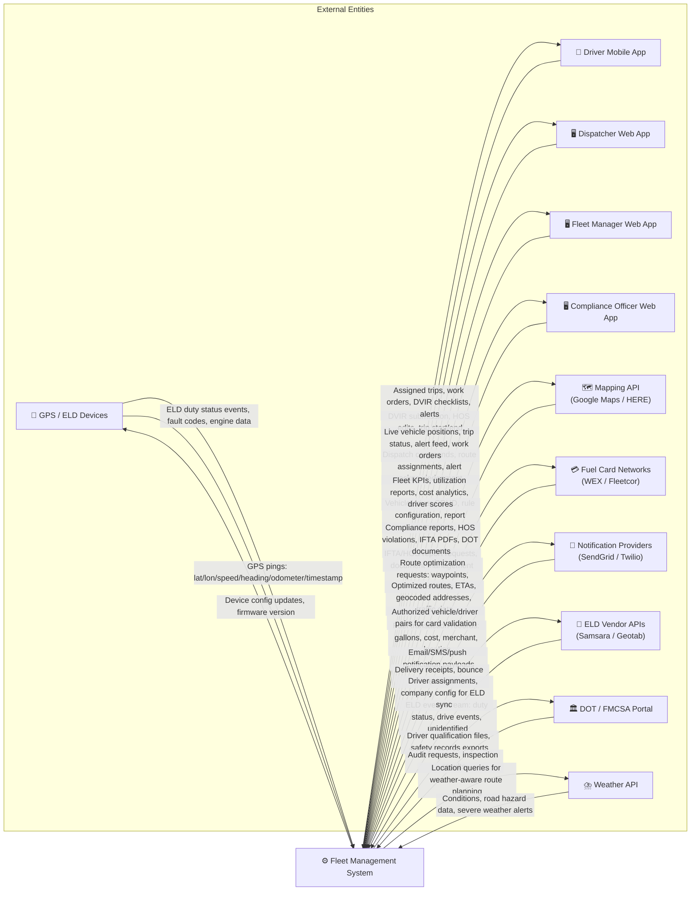
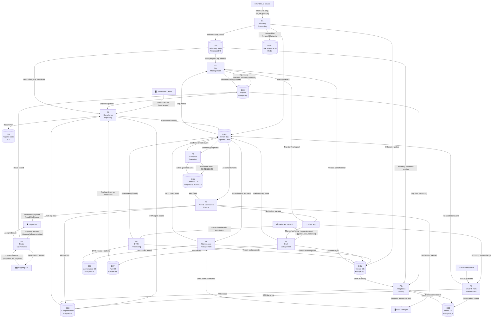
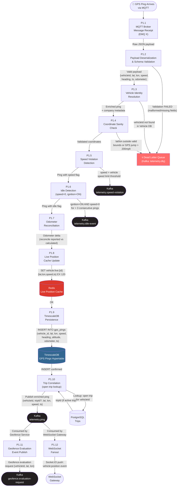

# Data Flow Diagram — Fleet Management System

## Overview

This document presents a structured, multi-level decomposition of how data flows through the Fleet Management System. Three levels of detail are provided: a high-level context view (Level 0), a functional decomposition (Level 1), and a deep-dive into the highest-throughput subsystem — telemetry processing (Level 2).

Data flow diagrams focus on **what** data moves between processes and stores, without prescribing implementation order or service boundaries (those are covered in `architecture-diagram.md`).

---

## Level 0 — Context Data Flow Diagram

Level 0 shows the FMS as a single process ("black box") and identifies all external entities that exchange data with the system.

---

## Level 1 — Functional Decomposition DFD

Level 1 decomposes the FMS into its major processing subsystems and shows the primary data flows between processes and persistent stores.

### Level 1 Data Stores Reference

| Store | Technology | Contents | Retention |
|---|---|---|---|
| DS1 Vehicle DB | PostgreSQL | Vehicles, registration, insurance | Indefinite |
| DS2 Driver DB | PostgreSQL | Drivers, scores, license data | Indefinite |
| DS3 Trip DB | PostgreSQL | Trips, routes, waypoints | 7 years (DOT) |
| DS4 Telemetry Store | TimescaleDB | GPS pings, OBD-II data | 2 years hot, S3 archive |
| DS5 Geofence DB | PostgreSQL + PostGIS | Geofences, events, rules | Indefinite |
| DS6 Maintenance DB | PostgreSQL | Work orders, DVIR, maintenance records | 7 years (DOT) |
| DS7 Fuel DB | PostgreSQL | Fuel records, card transactions | 5 years (IFTA) |
| DS8 Compliance DB | PostgreSQL | HOS logs, IFTA reports, alerts | 7 years (DOT) |
| DS9 Reports Store | AWS S3 | PDF reports, document files | 7 years |
| DS10 Live Cache | Redis | Vehicle live positions, online status | TTL 120s |
| DS11 Event Bus | Apache Kafka | All domain events | 7-day retention |

---

## Level 2 — Telemetry Processing Deep Dive

This diagram expands Process P1 (Telemetry Processing) into its internal sub-processes, showing the detailed step-by-step data transformation from raw GPS ping to stored record and downstream events.

### Level 2 Processing Notes

| Sub-process | Throughput Expectation | Error Handling |
|---|---|---|
| P1.1 MQTT Receipt | 1,000–50,000 msgs/sec (fleet scale) | QoS 1 ensures at-least-once delivery |
| P1.2 Schema Validation | < 1ms per message | Invalid messages to DLQ, logged with raw payload |
| P1.3 Identity Resolution | < 2ms (Redis vehicle lookup) | Unknown device IDs quarantined; ops team alerted |
| P1.4 Coordinate Check | < 0.5ms | GPS jumps filtered; previous position retained |
| P1.5 Speed Violation | < 0.5ms | Per-vehicle configurable threshold |
| P1.9 TimescaleDB Write | Batched inserts every 500ms | Retry with exponential backoff on DB errors |
| P1.10 Trip Correlation | < 3ms (Redis trip lookup) | Pings without active trip still stored; correlated post-hoc |

### Data Volumes at Scale

| Data Element | Rate | Daily Volume |
|---|---|---|
| GPS Pings (500 vehicles, 30s interval) | ~17 msgs/sec | ~1.44M rows |
| Speed violation events | ~0.5% of pings | ~7,200/day |
| Idle events | ~2% of pings | ~28,800/day |
| Geofence evaluations | ~1.44M/day | Depends on fence count |
| Live cache operations | ~34 ops/sec | — |
| WebSocket pushes | ~17 events/sec | — |

---

## Data Flow Summary

The following table maps key data elements to their sources, transformations, and sinks across the full system:

| Data Element | Source | Key Transformations | Primary Sink |
|---|---|---|---|
| GPS Ping | GPS/ELD Device | Validate → Enrich → Correlate to trip | TimescaleDB, Redis, Kafka |
| Fuel Transaction | Fuel Card Network / Driver App | Normalize → Reconcile with odometer | PostgreSQL Fuel DB |
| HOS Status Change | Driver App / ELD Vendor | Validate 30-min rounding → Detect violations | PostgreSQL Compliance DB |
| DVIR Submission | Driver Mobile App | Validate completeness → Determine vehicle status | PostgreSQL Maintenance DB |
| Geofence Event | Geofence Evaluation (PostGIS) | Classify ENTER/EXIT → Match alert rules | PostgreSQL Geofence DB, Kafka |
| Work Order | Maintenance Service / ML Model | Prioritize → Assign → Track to completion | PostgreSQL Maintenance DB |
| IFTA Report | Compliance Service | Aggregate mileage by jurisdiction → Calculate tax | PostgreSQL Compliance DB, S3 |
| Driver Score | Analytics Service | Aggregate events over period → Weight & normalize | PostgreSQL Driver DB |
| Alert | Alert Engine | Match event to rules → Deduplicate → Route | PostgreSQL Compliance DB, Notification |
