# Domain Model — Fleet Management System

## Overview

This document defines the core domain model for the Fleet Management System. It captures entities, their attributes, methods, relationships, and key enumerations that form the ubiquitous language of the platform. This model drives database schema design, API contract definitions, and service boundary decisions.

The domain is organized around the following aggregates:
- **Fleet Aggregate** — Vehicle, FuelRecord, MaintenanceRecord, DVIR
- **Driver Aggregate** — Driver, HosLog, DriverScore
- **Operations Aggregate** — Trip, GpsPing, Route
- **Safety Aggregate** — Geofence, GeofenceEvent, AlertRule, Alert
- **Compliance Aggregate** — IftaReport, HosLog

---

## Class Diagram

```mermaid
classDiagram

    %% ─── ENUMERATIONS ───────────────────────────────────────────

    class VehicleStatus {
        <<enumeration>>
        ACTIVE
        INACTIVE
        OUT_OF_SERVICE
        IN_MAINTENANCE
        DECOMMISSIONED
    }

    class FuelType {
        <<enumeration>>
        DIESEL
        GASOLINE
        LNG
        CNG
        PROPANE
        ELECTRIC
        HYBRID
    }

    class TripStatus {
        <<enumeration>>
        SCHEDULED
        IN_PROGRESS
        COMPLETED
        CANCELLED
    }

    class GeofenceType {
        <<enumeration>>
        POLYGON
        CIRCLE
        CORRIDOR
    }

    class GeofenceEventType {
        <<enumeration>>
        ENTER
        EXIT
        DWELL
    }

    class WorkOrderStatus {
        <<enumeration>>
        OPEN
        ASSIGNED
        IN_PROGRESS
        COMPLETED
        CANCELLED
        ON_HOLD
    }

    class MaintenanceType {
        <<enumeration>>
        PREVENTIVE
        CORRECTIVE
        PREDICTIVE
        EMERGENCY
        INSPECTION
    }

    class DvirInspectionType {
        <<enumeration>>
        PRE_TRIP
        POST_TRIP
        ANNUAL
        ROADSIDE
    }

    class DvirStatus {
        <<enumeration>>
        SATISFACTORY
        DEFECTS_NOTED
        UNSAFE
    }

    class HosDutyStatus {
        <<enumeration>>
        OFF_DUTY
        SLEEPER_BERTH
        DRIVING
        ON_DUTY_NOT_DRIVING
        PERSONAL_CONVEYANCE
        YARD_MOVES
    }

    class AlertSeverity {
        <<enumeration>>
        INFO
        WARNING
        CRITICAL
        EMERGENCY
    }

    class AlertStatus {
        <<enumeration>>
        OPEN
        ACKNOWLEDGED
        RESOLVED
        SUPPRESSED
    }

    class AlertTriggerType {
        <<enumeration>>
        SPEED_VIOLATION
        GEOFENCE_BREACH
        HARD_BRAKING
        RAPID_ACCELERATION
        IDLE_EXCESS
        MAINTENANCE_DUE
        HOS_VIOLATION
        FUEL_ANOMALY
        VEHICLE_OFFLINE
        DVIR_DEFECT
    }

    class IftaReportStatus {
        <<enumeration>>
        DRAFT
        PROCESSING
        COMPLETED
        SUBMITTED
        AMENDED
    }

    class EldSource {
        <<enumeration>>
        AUTOMATIC
        MANUAL
        ASSUMED_UNIDENTIFIED
    }

    %% ─── FLEET AGGREGATE ─────────────────────────────────────────

    class Vehicle {
        +UUID id
        +String vin
        +String make
        +String model
        +Int year
        +String licensePlate
        +String licensePlateState
        +VehicleStatus status
        +Float odometerMiles
        +FuelType fuelType
        +Float tankCapacityGallons
        +Float fuelEfficiencyMpg
        +UUID assignedDriverId
        +UUID companyId
        +String vehicleType
        +String color
        +Int grossVehicleWeightRating
        +String engineType
        +Int engineDisplacementL
        +String transmissionType
        +DateTime lastServiceDate
        +Float lastServiceMiles
        +DateTime nextServiceDue
        +Float nextServiceMiles
        +DateTime insuranceExpiryDate
        +DateTime registrationExpiryDate
        +String deviceSerialNumber
        +DateTime createdAt
        +DateTime updatedAt
        +activate() void
        +deactivate() void
        +placeOutOfService(reason: String) void
        +assignDriver(driverId: UUID) void
        +updateOdometer(miles: Float) void
        +isServiceDue() Boolean
        +isDocumentExpired() Boolean
    }

    class FuelRecord {
        +UUID id
        +UUID vehicleId
        +UUID driverId
        +Float gallons
        +Float pricePerGallon
        +Float costUsd
        +Float odometerMiles
        +String purchaseState
        +String purchaseCountry
        +DateTime purchasedAt
        +String fuelCardId
        +String merchantName
        +String merchantAddress
        +String receiptNumber
        +FuelType fuelType
        +UUID createdBy
        +DateTime createdAt
        +calculateCostPerMile(prevOdometer: Float) Float
    }

    class MaintenanceRecord {
        +UUID id
        +UUID vehicleId
        +UUID workOrderId
        +MaintenanceType type
        +String componentName
        +String description
        +DateTime scheduledDate
        +DateTime completedDate
        +Float costUsd
        +Float laborHours
        +Float mileageAtService
        +String[] partsReplaced
        +String shopName
        +UUID mechanicId
        +WorkOrderStatus workOrderStatus
        +Float confidenceScore
        +String[] telemetryEvidence
        +DateTime createdAt
        +DateTime updatedAt
        +complete(completionData: CompletionDto) void
        +calculateNextServiceMiles() Float
    }

    class DVIR {
        +UUID id
        +UUID vehicleId
        +UUID driverId
        +DvirInspectionType inspectionType
        +DateTime inspectedAt
        +Float odometerMiles
        +ChecklistItem[] checklistItems
        +Defect[] defects
        +Boolean previousDefectsRepaired
        +String previousDefectRepairedBy
        +String signature
        +String certificationText
        +DvirStatus status
        +String rejectionReason
        +UUID reviewedBy
        +DateTime reviewedAt
        +DateTime createdAt
        +submit(signature: String) void
        +addDefect(defect: Defect) void
        +markItemPass(itemId: UUID) void
        +hasSafetyCriticalDefects() Boolean
        +generatePdfReport() String
    }

    %% ─── DRIVER AGGREGATE ────────────────────────────────────────

    class Driver {
        +UUID id
        +UUID userId
        +UUID companyId
        +String licenseNumber
        +String licenseState
        +DateTime licenseExpiry
        +String[] licenseEndorsements
        +HosDutyStatus hosStatus
        +Float driverScore
        +Boolean isActive
        +String cdlClass
        +String phoneNumber
        +String emergencyContact
        +String emergencyPhone
        +DateTime hireDate
        +DateTime medCertExpiry
        +String homeTerminal
        +DateTime createdAt
        +DateTime updatedAt
        +updateHosStatus(status: HosDutyStatus, location: String) void
        +calculateScore(period: ScorePeriod) DriverScore
        +isLicenseValid() Boolean
        +isMedCertValid() Boolean
        +getAvailableHours() Float
    }

    class HosLog {
        +UUID id
        +UUID driverId
        +UUID vehicleId
        +Date logDate
        +HosDutyStatus dutyStatus
        +DateTime startTime
        +DateTime endTime
        +Float durationHours
        +String location
        +String remarks
        +EldSource eldSource
        +Boolean isEdited
        +String editReason
        +UUID editApprovedBy
        +DateTime createdAt
        +calculateDrivingHours() Float
        +validate() ValidationResult
        +detectViolations() HosViolation[]
    }

    class DriverScore {
        +UUID id
        +UUID driverId
        +String period
        +DateTime periodStart
        +DateTime periodEnd
        +Float speedingScore
        +Float hardBrakingScore
        +Float rapidAccelerationScore
        +Float idlingScore
        +Float seatbeltScore
        +Float phoneUseScore
        +Float overallScore
        +Int totalTrips
        +Float totalMiles
        +Int speedingEvents
        +Int hardBrakingEvents
        +Int idlingMinutes
        +DateTime calculatedAt
        +getGrade() String
        +compareWithPeer(otherScore: DriverScore) ScoreComparison
    }

    %% ─── OPERATIONS AGGREGATE ────────────────────────────────────

    class Trip {
        +UUID id
        +UUID vehicleId
        +UUID driverId
        +UUID routeId
        +TripStatus status
        +DateTime scheduledStartTime
        +DateTime actualStartTime
        +DateTime scheduledEndTime
        +DateTime actualEndTime
        +Float startOdometer
        +Float endOdometer
        +Float distanceMiles
        +Float fuelConsumedGallons
        +Float idlingMinutes
        +Int speedingEventCount
        +Int hardBrakingCount
        +String startAddress
        +String endAddress
        +Float startLatitude
        +Float startLongitude
        +Float endLatitude
        +Float endLongitude
        +String cargoDescription
        +Float cargoWeightLbs
        +DateTime createdAt
        +DateTime updatedAt
        +start(startOdometer: Float, lat: Float, lon: Float) void
        +complete(endOdometer: Float, lat: Float, lon: Float) void
        +cancel(reason: String) void
        +calculateFuelEfficiency() Float
        +getDurationHours() Float
    }

    class GpsPing {
        +UUID id
        +UUID vehicleId
        +UUID tripId
        +Float latitude
        +Float longitude
        +Float speedMph
        +Float heading
        +Float altitudeFt
        +Float odometerMiles
        +Float engineRpm
        +Float engineTempF
        +Float fuelLevelPercent
        +Boolean ignitionOn
        +Boolean seatbeltFastened
        +String diagnosticCodes
        +Int satelliteCount
        +Float hdop
        +DateTime timestamp
        +isWithinBounds() Boolean
        +toGeoJSON() GeoJSONPoint
    }

    class Route {
        +UUID id
        +UUID companyId
        +String name
        +String description
        +Waypoint[] waypoints
        +Float estimatedDistanceMiles
        +Float estimatedDurationMin
        +UUID assignedVehicleId
        +UUID assignedDriverId
        +DateTime scheduledDepartureTime
        +DateTime scheduledArrivalTime
        +Boolean isOptimized
        +String optimizationProvider
        +String encodedPolyline
        +Float totalWeightCapacityLbs
        +DateTime createdAt
        +DateTime updatedAt
        +optimize(params: OptimizationParams) OptimizedRoute
        +addWaypoint(waypoint: Waypoint) void
        +calculateEta(currentPosition: GpsPing) DateTime
    }

    %% ─── SAFETY AGGREGATE ────────────────────────────────────────

    class Geofence {
        +UUID id
        +UUID companyId
        +String name
        +String description
        +GeofenceType type
        +GeoJSON coordinates
        +Float radiusMeters
        +Boolean isActive
        +Boolean alertOnEnter
        +Boolean alertOnExit
        +Boolean alertOnDwell
        +Float dwellThresholdMinutes
        +String[] vehicleGroupIds
        +UUID[] vehicleIds
        +String timezone
        +TimeWindow[] activeWindows
        +DateTime createdAt
        +DateTime updatedAt
        +containsPoint(lat: Float, lon: Float) Boolean
        +activate() void
        +deactivate() void
        +toPostGISGeometry() String
    }

    class GeofenceEvent {
        +UUID id
        +UUID geofenceId
        +UUID vehicleId
        +UUID driverId
        +UUID tripId
        +GeofenceEventType eventType
        +Float latitude
        +Float longitude
        +Float speedMph
        +DateTime timestamp
        +Float dwellDurationMinutes
        +Boolean alertTriggered
        +UUID alertId
    }

    class AlertRule {
        +UUID id
        +UUID companyId
        +String name
        +String description
        +AlertTriggerType triggerType
        +Float threshold
        +String thresholdUnit
        +UUID[] vehicleIds
        +UUID[] driverIds
        +String[] vehicleGroupIds
        +String[] notificationChannels
        +UUID[] notifyUserIds
        +Boolean isActive
        +Int cooldownMinutes
        +AlertSeverity severity
        +DateTime createdAt
        +DateTime updatedAt
        +evaluate(event: TelemetryEvent) Boolean
        +activate() void
        +deactivate() void
    }

    class Alert {
        +UUID id
        +UUID alertRuleId
        +UUID vehicleId
        +UUID driverId
        +UUID geofenceId
        +AlertSeverity severity
        +AlertTriggerType triggerType
        +String message
        +String details
        +AlertStatus status
        +Float latitude
        +Float longitude
        +Float speedMph
        +UUID acknowledgedBy
        +DateTime acknowledgedAt
        +String acknowledgedNote
        +UUID resolvedBy
        +DateTime resolvedAt
        +String resolvedNote
        +DateTime createdAt
        +acknowledge(userId: UUID, note: String) void
        +resolve(userId: UUID, note: String) void
        +suppress(durationMinutes: Int) void
    }

    %% ─── COMPLIANCE AGGREGATE ────────────────────────────────────

    class IftaReport {
        +UUID id
        +UUID companyId
        +String quarter
        +Int year
        +IftaReportStatus status
        +JurisdictionEntry[] jurisdictions
        +Float totalMiles
        +Float totalGallons
        +Float fuelTaxOwed
        +Float creditsEarned
        +Float netTaxDue
        +String pdfS3Key
        +String pdfDownloadUrl
        +UUID requestedBy
        +DateTime requestedAt
        +DateTime completedAt
        +DateTime submittedAt
        +String submissionConfirmationId
        +DateTime createdAt
        +calculate() void
        +generatePdf() String
        +submit() void
        +amend(reason: String) IftaReport
    }

    %% ─── RELATIONSHIPS ────────────────────────────────────────────

    Vehicle "1" --> "0..*" FuelRecord : "has"
    Vehicle "1" --> "0..*" MaintenanceRecord : "has"
    Vehicle "1" --> "0..*" DVIR : "has"
    Vehicle "1" --> "0..*" Trip : "takes"
    Vehicle "1" --> "0..*" GpsPing : "emits"
    Vehicle "1" --> "0..1" Driver : "assigned to"
    Vehicle "1" --> "0..*" GeofenceEvent : "triggers"
    Vehicle "1" --> "0..*" Alert : "generates"

    Driver "1" --> "0..*" Trip : "drives"
    Driver "1" --> "0..*" HosLog : "logs"
    Driver "1" --> "0..*" DriverScore : "scored by"
    Driver "1" --> "0..*" FuelRecord : "records"
    Driver "1" --> "0..*" DVIR : "submits"

    Trip "1" --> "0..*" GpsPing : "composed of"
    Trip "0..1" --> "1" Route : "follows"

    Geofence "1" --> "0..*" GeofenceEvent : "generates"
    Geofence "1" --> "0..*" AlertRule : "triggers"

    AlertRule "1" --> "0..*" Alert : "creates"
    Alert "0..*" --> "1" AlertRule : "based on"
```

---

## Entity Descriptions

### Vehicle
The central entity of the FMS domain. Represents a physical vehicle in the fleet. Tracks both operational state (status, odometer, driver assignment) and compliance state (registration expiry, insurance). Vehicle status transitions follow a defined lifecycle: `ACTIVE ↔ IN_MAINTENANCE ↔ OUT_OF_SERVICE → DECOMMISSIONED`.

### Driver
Represents a licensed commercial driver. Maintains current HOS duty status, aggregated safety score, and license compliance data. The `hosStatus` field is updated in near-real-time via ELD integration. Driver score is recalculated nightly per period.

### Trip
A Trip is a bounded operational unit: a vehicle driven by a driver from point A to point B, associated with a route. All GpsPings within the trip's time window are linked to it. Distance, fuel consumption, and safety event counts are aggregated on trip completion.

### GpsPing
The raw telemetry record emitted by the GPS/ELD device. Stored in TimescaleDB as a time-series hypertable. Includes diagnostic OBD-II fields (RPM, engine temp, fault codes) when supported by the device. Not stored in PostgreSQL — the `GpsPing` in this model represents the logical entity.

### Geofence
A geographic boundary defined as a polygon, circle, or corridor. Supports time-windowed activation (e.g., "alert only during business hours"). Evaluated in real-time using PostGIS spatial queries on every incoming telemetry ping.

### MaintenanceRecord / Work Order
Represents both a service event record and its associated work order workflow. The `confidenceScore` and `telemetryEvidence` fields are populated for PREDICTIVE type records generated by the ML anomaly detection pipeline.

### DVIR
The digital Driver Vehicle Inspection Report. Contains a structured checklist with pass/fail/defect outcomes per item. Defects are typed (safety-critical vs. non-safety). The `signature` field stores a base64-encoded image of the driver's e-signature. DvirStatus determines vehicle operability.

### HosLog
An individual duty status change event as required by ELD mandate (49 CFR Part 395). The `eldSource` distinguishes automatic (system-generated) from manual (driver-entered) edits. HOS violation detection runs against the 7/8-day rolling window and property-carrying/passenger-carrying rulesets.

### IftaReport
Aggregates mileage-by-jurisdiction and fuel-purchase-by-jurisdiction for a calendar quarter. The `jurisdictions` JSON array contains one entry per state/province with miles, taxable gallons, rate, and tax owed/credited. The final PDF conforms to the IFTA Schedule 1 format accepted by member jurisdictions.

---

## Key Business Rules

| Rule | Description |
|---|---|
| Vehicle assignment | A vehicle can have at most one assigned driver at a time |
| DVIR pre-trip | Required before operating any CMV over 10,001 lbs GVW |
| HOS driving limit | Max 11 hours driving after 10 consecutive hours off duty (Property ruleset) |
| Maintenance window | Predictive work orders must be scheduled within the predicted failure horizon |
| Geofence evaluation | Evaluated on every ping; dwell alerts require sustained presence ≥ threshold |
| Driver score | Calculated weekly; weights: speeding 30%, hard braking 25%, idling 20%, acceleration 15%, seatbelt 10% |
| IFTA filing | Due 30 days after quarter end; late filing incurs penalties |
| Alert dedup | AlertRule has a cooldown window; duplicate triggers within cooldown are suppressed |
