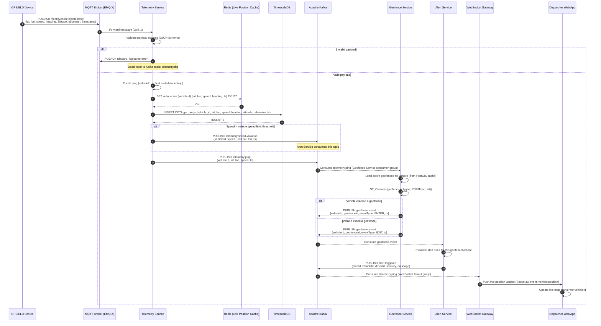
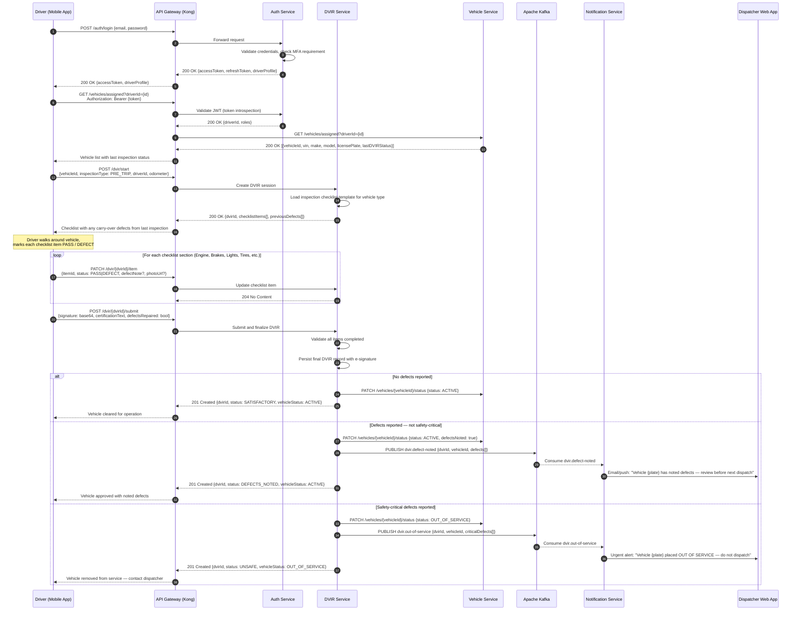
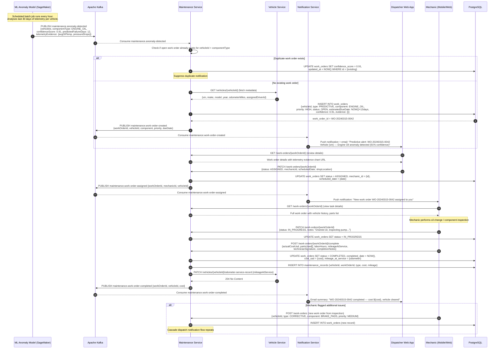
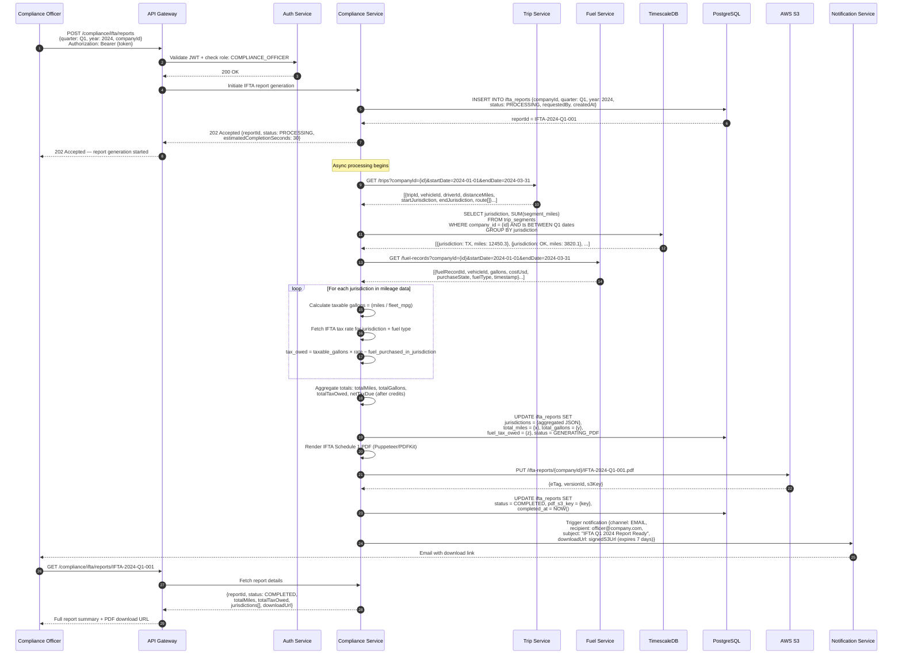

# System Sequence Diagrams — Fleet Management System

## Overview

This document captures the major end-to-end interaction flows within the Fleet Management System (FMS). Each sequence diagram illustrates how actors, services, and data stores collaborate to deliver core platform capabilities. These diagrams serve as the authoritative reference for service contract design, integration testing strategy, and onboarding new engineers.

---

## Flow 1: Vehicle Telemetry Ingestion

This flow describes how real-time GPS telemetry emitted by an in-vehicle device is ingested, validated, persisted, and evaluated against geofence rules. High-frequency pings (typically every 5–30 seconds per vehicle) are the data backbone of live tracking, trip reconstruction, HOS correlation, and driver scoring.

### Key Design Decisions

| Concern | Decision |
|---|---|
| Telemetry transport | MQTT (QoS 1) — lightweight, suitable for constrained cellular networks |
| Live position store | Redis with 120-second TTL — O(1) reads for live map queries |
| Historical store | TimescaleDB hypertable partitioned by time — efficient range scans |
| Fan-out to geofence | Kafka topic `telemetry.ping` — decouples ingestion from evaluation |
| Back-pressure | Kafka consumer lag monitoring via Prometheus; Telem Service auto-scales |

---

## Flow 2: Driver Pre-Trip DVIR Inspection

A Driver Vehicle Inspection Report (DVIR) is a federally mandated inspection that drivers must complete before operating a commercial vehicle. This flow covers the mobile-app-driven inspection workflow from authentication through vehicle status determination.

### DVIR Checklist Categories

| Category | Items Inspected |
|---|---|
| Engine Compartment | Oil level, coolant, belts, battery |
| Brakes | Air/hydraulic pressure, brake pads, emergency brake |
| Lights & Electrical | Headlights, turn signals, hazards, reflectors |
| Tires & Wheels | Tread depth, inflation, lug nuts, rims |
| Cab Interior | Seat belts, mirrors, wipers, horn, gauges |
| Cargo/Body | Doors, latches, coupling devices |

---

## Flow 3: Predictive Maintenance Work Order

The Maintenance Service integrates with an ML anomaly detection pipeline. When sensor telemetry patterns suggest an impending component failure, an automated work order is created, dispatched to a mechanic, and tracked through completion.

---

## Flow 4: IFTA Compliance Report Generation

The International Fuel Tax Agreement (IFTA) requires carriers to report miles driven and fuel purchased in each jurisdiction per quarter. This flow covers automated aggregation of GPS mileage data and fuel records to produce a submission-ready IFTA report.

### IFTA Calculation Notes

| Term | Description |
|---|---|
| Taxable gallons | Miles driven in jurisdiction ÷ fleet average MPG |
| Net tax | Tax owed in jurisdiction − fuel tax already paid at pump in that jurisdiction |
| Credit | If fuel purchased in jurisdiction exceeds taxable amount, carrier gets a credit |
| Filing frequency | Quarterly — due last day of month following quarter end |
| Supported fuel types | Diesel, Gasoline, LNG, CNG, Propane (different rate tables) |
