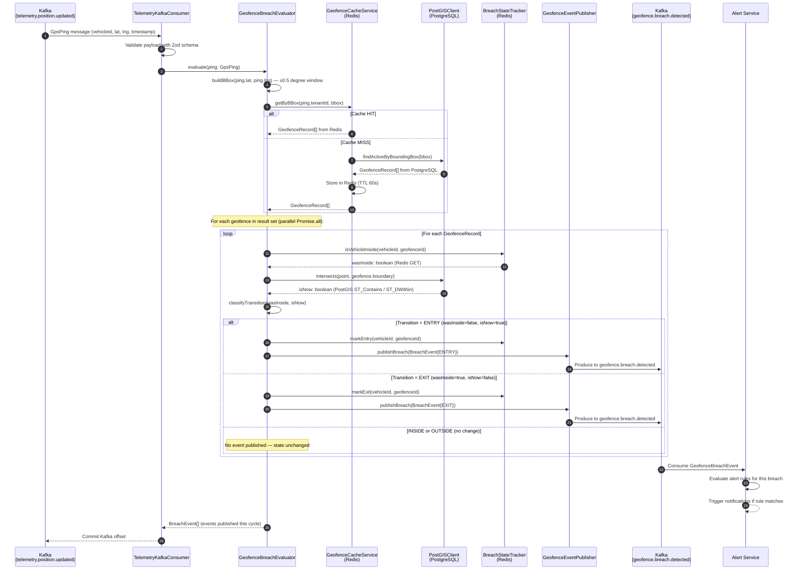

# C4 Code Diagram — Fleet Management System

## 1. Overview

This document presents the **C4 Level 4 (Code)** diagram for the Fleet Management System. It zooms into the **Geofence Service** and specifically the `GeofenceBreachEvaluator` component — the most algorithmically complex part of the system.

At this level we document:
- The concrete classes, interfaces, and their relationships within the component
- The sequence of method calls during a breach evaluation cycle
- The algorithm pseudocode
- Key TypeScript implementations

**Scope:** The `GeofenceBreachEvaluator` orchestrates the full pipeline from receiving a `GpsPing` event off Kafka, through PostGIS spatial intersection, Redis state management, to publishing a `GeofenceBreachEvent` back onto Kafka.

**Context:** In the C4 hierarchy:
- Level 1 (System Context): FMS ↔ GPS Devices, Drivers, Fleet Managers
- Level 2 (Container): Geofence Service is one of 14 NestJS microservices
- Level 3 (Component): GeofenceBreachEvaluator is one of 6 components inside the Geofence Service
- **Level 4 (Code): this document** — the class-level design of GeofenceBreachEvaluator

---

## 2. Class Structure

```mermaid
classDiagram
    class GeofenceBreachEvaluator {
        -cacheService: GeofenceCacheService
        -stateTracker: BreachStateTracker
        -postgis: PostGISClient
        -publisher: GeofenceEventPublisher
        +evaluate(ping: GpsPing) Promise~BreachEvent[]~
        -loadActiveGeofences(bbox: BBox) Promise~GeofenceRecord[]~
        -isInsideGeofence(point: Point, geofence: GeofenceRecord) Promise~boolean~
        -buildBBox(lat: number, lng: number) BBox
        -classifyTransition(wasInside: boolean, isNow: boolean) TransitionType
    }

    class GeofenceRepository {
        -prisma: PrismaService
        +findActiveByBoundingBox(bbox: BBox) Promise~GeofenceRecord[]~
        +findById(id: string) Promise~GeofenceRecord~
        +save(dto: CreateGeofenceDto) Promise~GeofenceRecord~
        +softDelete(id: string) Promise~void~
        +findByTenant(tenantId: string) Promise~GeofenceRecord[]~
    }

    class BreachStateTracker {
        -redis: Redis
        -TTL_SECONDS: number
        +isVehicleInside(vehicleId: string, geofenceId: string) Promise~boolean~
        +markEntry(vehicleId: string, geofenceId: string) Promise~void~
        +markExit(vehicleId: string, geofenceId: string) Promise~void~
        +getActiveGeofencesForVehicle(vehicleId: string) Promise~string[]~
        -buildKey(vehicleId: string, geofenceId: string) string
    }

    class GeofenceEventPublisher {
        -kafkaProducer: KafkaProducerService
        +publishBreach(event: GeofenceBreachEvent) Promise~void~
        +publishEntry(event: GeofenceEntryEvent) Promise~void~
        +publishExit(event: GeofenceExitEvent) Promise~void~
        -buildPartitionKey(vehicleId: string) string
    }

    class GeofenceCacheService {
        -redis: Redis
        -repo: GeofenceRepository
        -CACHE_TTL_SECONDS: number
        +getAll(tenantId: string) Promise~GeofenceRecord[]~
        +getByBBox(tenantId: string, bbox: BBox) Promise~GeofenceRecord[]~
        +invalidate(id: string) Promise~void~
        +invalidateTenant(tenantId: string) Promise~void~
        +warmUp(tenantId: string) Promise~void~
    }

    class PostGISClient {
        -prisma: PrismaService
        +intersects(point: Point, polygon: GeoJSON) Promise~boolean~
        +withinRadius(point: Point, center: Point, radiusM: number) Promise~boolean~
        +distanceBetween(a: Point, b: Point) Promise~number~
        +findGeofencesContaining(point: Point, tenantId: string) Promise~string[]~
    }

    class TelemetryKafkaConsumer {
        -evaluator: GeofenceBreachEvaluator
        +handlePositionUpdate(payload: unknown, ctx: KafkaContext) Promise~void~
    }

    class GeofenceController {
        -geofenceService: GeofenceService
        +create(dto: CreateGeofenceDto) Promise~GeofenceRecord~
        +findAll(tenantId: string) Promise~GeofenceRecord[]~
        +findById(id: string) Promise~GeofenceRecord~
        +update(id: string, dto: UpdateGeofenceDto) Promise~GeofenceRecord~
        +delete(id: string) Promise~void~
    }

    class GpsPing {
        <<interface>>
        +deviceId: string
        +vehicleId: string
        +tenantId: string
        +lat: number
        +lng: number
        +speed: number
        +heading: number
        +altitude?: number
        +accuracy?: number
        +timestamp: string
        +odometer?: number
        +ignition: boolean
    }

    class GeofenceRecord {
        <<interface>>
        +id: string
        +tenantId: string
        +name: string
        +type: GeofenceType
        +boundary: GeoJSON
        +alertOnEntry: boolean
        +alertOnExit: boolean
        +schedule?: GeofenceSchedule
        +speedLimit?: number
        +createdAt: Date
        +updatedAt: Date
    }

    class BreachEvent {
        <<interface>>
        +geofenceId: string
        +vehicleId: string
        +tenantId: string
        +driverId?: string
        +transitionType: TransitionType
        +lat: number
        +lng: number
        +speed: number
        +occurredAt: string
        +correlationId: string
    }

    class BBox {
        <<interface>>
        +minLat: number
        +maxLat: number
        +minLng: number
        +maxLng: number
    }

    class Point {
        <<interface>>
        +lat: number
        +lng: number
    }

    class TransitionType {
        <<enumeration>>
        ENTRY
        EXIT
        INSIDE
        OUTSIDE
    }

    GeofenceBreachEvaluator --> GeofenceCacheService : uses
    GeofenceBreachEvaluator --> BreachStateTracker : uses
    GeofenceBreachEvaluator --> PostGISClient : uses
    GeofenceBreachEvaluator --> GeofenceEventPublisher : uses
    GeofenceCacheService --> GeofenceRepository : fallback DB lookup
    GeofenceCacheService --> PostGISClient : uses for bbox query
    TelemetryKafkaConsumer --> GeofenceBreachEvaluator : invokes
    GeofenceBreachEvaluator ..> GpsPing : input
    GeofenceBreachEvaluator ..> BreachEvent : output
    GeofenceBreachEvaluator ..> BBox : creates
    GeofenceBreachEvaluator ..> Point : creates
    GeofenceRecord ..> GeofenceType : has
    BreachEvent ..> TransitionType : has
```



---

## 3. Sequence: Breach Evaluation Pipeline

The following sequence diagram shows how a single GPS ping flows through the entire breach evaluation pipeline, from Kafka consumer through to downstream alert publishing.



---

## 4. Algorithm Explanation

### 4.1 High-Level Pseudocode

```
ALGORITHM: GeofenceBreachEvaluator.evaluate(ping: GpsPing)

INPUT:  A validated GpsPing with vehicleId, tenantId, lat, lng, timestamp
OUTPUT: Array of BreachEvents published to Kafka

STEP 1 — Build bounding box
  bbox = {
    minLat: ping.lat - 0.5,   maxLat: ping.lat + 0.5,
    minLng: ping.lng - 0.5,   maxLng: ping.lng + 0.5,
  }
  // ~55km radius at equator; fast pre-filter before precise PostGIS query

STEP 2 — Load candidate geofences from cache
  geofences = CACHE.getByBBox(ping.tenantId, bbox)
  IF cache MISS:
    geofences = DB.findActiveByBoundingBox(bbox)
    CACHE.store(geofences, TTL=60s)

STEP 3 — Parallel evaluation across all candidate geofences
  FOR EACH geofence IN geofences (Promise.all for parallelism):

    STEP 4 — Check previous state from Redis
      wasInside = REDIS.GET(`breach:${vehicleId}:${geofenceId}`)
      // key exists = vehicle was inside last ping

    STEP 5 — Run precise spatial intersection via PostGIS
      IF geofence.type = CIRCLE:
        isNow = PostGIS.ST_DWithin(ping.point, geofence.center, geofence.radius)
      ELSE IF geofence.type = POLYGON:
        isNow = PostGIS.ST_Contains(geofence.boundary, ping.point)
      ELSE IF geofence.type = CORRIDOR:
        isNow = PostGIS.ST_DWithin(ping.point, geofence.centerline, geofence.corridorWidth)

    STEP 6 — Classify state transition
      transition = classify(wasInside, isNow):
        (false, true)  → ENTRY    ← publish event
        (true,  false) → EXIT     ← publish event
        (true,  true)  → INSIDE   ← no event (debounce)
        (false, false) → OUTSIDE  ← no event

    STEP 7 — Publish BreachEvent for ENTRY or EXIT
      IF transition IN [ENTRY, EXIT]:
        event = {
          geofenceId, vehicleId, tenantId,
          transitionType: transition,
          lat, lng, speed,
          occurredAt: ping.timestamp,
          correlationId: uuid(),
        }
        Kafka.produce('geofence.breach.detected', event, partitionKey=vehicleId)

    STEP 8 — Update BreachStateTracker in Redis
      IF transition = ENTRY:
        REDIS.SET(`breach:${vehicleId}:${geofenceId}`, '1', EX=86400)
      ELSE IF transition = EXIT:
        REDIS.DEL(`breach:${vehicleId}:${geofenceId}`)

RETURN collected BreachEvents[]
```

### 4.2 Bounding Box Pre-Filter Rationale

The ±0.5 degree bounding box (~55 km at the equator) acts as a fast pre-filter. Without it, every GPS ping would need to be evaluated against every geofence in the tenant's account (potentially thousands). The bbox query uses the PostGIS spatial index (`GIST`) on `geofences.boundary`, reducing candidate geofences from potentially thousands to typically < 10.

### 4.3 Debounce and Hysteresis

Because GPS devices can jitter ±5-30 meters, a vehicle near a geofence boundary may oscillate in and out rapidly. The state tracker in Redis acts as a **hysteresis filter**: only actual state *transitions* (ENTRY/EXIT) emit events. Repeated pings confirming the current state (INSIDE/OUTSIDE) are silently dropped, preventing alert storms.

For high-jitter environments, an optional **time-in-zone buffer** can be configured: the vehicle must be confirmed inside for N consecutive pings before an ENTRY event fires.

---

## 5. TypeScript Implementation

### 5.1 Core Interfaces

```typescript
// libs/shared/events/src/geofence.events.ts

export interface GeofenceBreachEvent {
  readonly geofenceId:      string;
  readonly geofenceName:    string;
  readonly vehicleId:       string;
  readonly tenantId:        string;
  readonly driverId?:       string;
  readonly transitionType:  TransitionType;
  readonly lat:             number;
  readonly lng:             number;
  readonly speed:           number;
  readonly occurredAt:      string;  // ISO-8601
  readonly correlationId:   string;  // UUID — for idempotent downstream processing
}

export const enum TransitionType {
  ENTRY   = 'ENTRY',
  EXIT    = 'EXIT',
  INSIDE  = 'INSIDE',
  OUTSIDE = 'OUTSIDE',
}

// libs/shared/geo/src/types.ts

export interface Point {
  readonly lat: number;
  readonly lng: number;
}

export interface BBox {
  readonly minLat: number;
  readonly maxLat: number;
  readonly minLng: number;
  readonly maxLng: number;
}

export type GeofenceType = 'CIRCLE' | 'POLYGON' | 'CORRIDOR';

export interface GeofenceRecord {
  readonly id:           string;
  readonly tenantId:     string;
  readonly name:         string;
  readonly type:         GeofenceType;
  readonly boundary:     GeoJSON.Geometry;
  readonly alertOnEntry: boolean;
  readonly alertOnExit:  boolean;
  readonly speedLimit?:  number;
  readonly createdAt:    Date;
}
```

### 5.2 GeofenceBreachEvaluator — Full Implementation

```typescript
// services/geofence-service/src/evaluator/breach-evaluator.service.ts
import { Injectable, Logger }     from '@nestjs/common';
import { randomUUID }              from 'crypto';
import { GeofenceCacheService }    from '../cache/geofence-cache.service';
import { BreachStateTracker }      from '../state/breach-state-tracker.service';
import { PostGISClient }           from '../postgis/postgis-client.service';
import { GeofenceEventPublisher }  from '../events/geofence-event-publisher.service';
import {
  GpsPing, GeofenceRecord, BreachEvent, BBox, Point, TransitionType,
} from '@fms/shared/dto';
import { GeofenceBreachEvent } from '@fms/shared/events';

const BBOX_DEGREE_BUFFER = 0.5; // ~55 km at equator

@Injectable()
export class GeofenceBreachEvaluator {
  private readonly logger = new Logger(GeofenceBreachEvaluator.name);

  constructor(
    private readonly cacheService: GeofenceCacheService,
    private readonly stateTracker: BreachStateTracker,
    private readonly postgis:      PostGISClient,
    private readonly publisher:    GeofenceEventPublisher,
  ) {}

  async evaluate(ping: GpsPing): Promise<BreachEvent[]> {
    const bbox       = this.buildBBox(ping.lat, ping.lng);
    const geofences  = await this.cacheService.getByBBox(ping.tenantId, bbox);

    if (geofences.length === 0) return [];

    const point: Point = { lat: ping.lat, lng: ping.lng };

    const results = await Promise.allSettled(
      geofences.map(gf => this.evaluateSingle(ping, point, gf)),
    );

    const breachEvents: BreachEvent[] = [];
    for (const result of results) {
      if (result.status === 'fulfilled' && result.value !== null) {
        breachEvents.push(result.value);
      } else if (result.status === 'rejected') {
        this.logger.error('Geofence evaluation failed for a fence', result.reason);
      }
    }
    return breachEvents;
  }

  private async evaluateSingle(
    ping:     GpsPing,
    point:    Point,
    geofence: GeofenceRecord,
  ): Promise<BreachEvent | null> {
    const [wasInside, isNow] = await Promise.all([
      this.stateTracker.isVehicleInside(ping.vehicleId, geofence.id),
      this.postgis.intersects(point, geofence.boundary),
    ]);

    const transition = this.classifyTransition(wasInside, isNow);
    if (transition === TransitionType.INSIDE || transition === TransitionType.OUTSIDE) {
      return null; // No state change — no event
    }

    const event: GeofenceBreachEvent = {
      geofenceId:     geofence.id,
      geofenceName:   geofence.name,
      vehicleId:      ping.vehicleId,
      tenantId:       ping.tenantId,
      transitionType: transition,
      lat:            ping.lat,
      lng:            ping.lng,
      speed:          ping.speed,
      occurredAt:     ping.timestamp,
      correlationId:  randomUUID(),
    };

    await Promise.all([
      this.publisher.publishBreach(event),
      transition === TransitionType.ENTRY
        ? this.stateTracker.markEntry(ping.vehicleId, geofence.id)
        : this.stateTracker.markExit(ping.vehicleId, geofence.id),
    ]);

    return event;
  }

  private buildBBox(lat: number, lng: number): BBox {
    return {
      minLat: lat - BBOX_DEGREE_BUFFER,
      maxLat: lat + BBOX_DEGREE_BUFFER,
      minLng: lng - BBOX_DEGREE_BUFFER,
      maxLng: lng + BBOX_DEGREE_BUFFER,
    };
  }

  private classifyTransition(wasInside: boolean, isNow: boolean): TransitionType {
    if (!wasInside && isNow)  return TransitionType.ENTRY;
    if (wasInside  && !isNow) return TransitionType.EXIT;
    if (wasInside  && isNow)  return TransitionType.INSIDE;
    return TransitionType.OUTSIDE;
  }
}
```

### 5.3 BreachStateTracker — Redis Implementation

```typescript
// services/geofence-service/src/state/breach-state-tracker.service.ts
import { Injectable }    from '@nestjs/common';
import { InjectRedis }   from '@nestjs-modules/ioredis';
import Redis             from 'ioredis';

const STATE_TTL_SECONDS = 86_400; // 24 hours — auto-expire stale state if no pings

@Injectable()
export class BreachStateTracker {
  constructor(@InjectRedis() private readonly redis: Redis) {}

  async isVehicleInside(vehicleId: string, geofenceId: string): Promise<boolean> {
    const key    = this.buildKey(vehicleId, geofenceId);
    const result = await this.redis.get(key);
    return result === '1';
  }

  async markEntry(vehicleId: string, geofenceId: string): Promise<void> {
    const key = this.buildKey(vehicleId, geofenceId);
    await this.redis.set(key, '1', 'EX', STATE_TTL_SECONDS);
  }

  async markExit(vehicleId: string, geofenceId: string): Promise<void> {
    const key = this.buildKey(vehicleId, geofenceId);
    await this.redis.del(key);
  }

  async getActiveGeofencesForVehicle(vehicleId: string): Promise<string[]> {
    // Scan for all geofences a vehicle is currently inside
    const pattern = `breach:${vehicleId}:*`;
    const keys    = await this.redis.keys(pattern);
    return keys.map(k => k.split(':')[2]); // extract geofenceId
  }

  private buildKey(vehicleId: string, geofenceId: string): string {
    return `breach:${vehicleId}:${geofenceId}`;
  }
}
```

### 5.4 PostGISClient — Spatial Query Implementation

```typescript
// services/geofence-service/src/postgis/postgis-client.service.ts
import { Injectable } from '@nestjs/common';
import { PrismaService } from '../prisma/prisma.service';
import { Point }         from '@fms/shared/geo';

@Injectable()
export class PostGISClient {
  constructor(private readonly prisma: PrismaService) {}

  async intersects(point: Point, polygon: GeoJSON.Geometry): Promise<boolean> {
    const geoJson = JSON.stringify(polygon);
    const result  = await this.prisma.$queryRaw<[{ intersects: boolean }]>`
      SELECT ST_Contains(
        ST_GeomFromGeoJSON(${geoJson}),
        ST_SetSRID(ST_MakePoint(${point.lng}, ${point.lat}), 4326)
      ) AS intersects
    `;
    return result[0]?.intersects ?? false;
  }

  async withinRadius(point: Point, center: Point, radiusM: number): Promise<boolean> {
    const result = await this.prisma.$queryRaw<[{ within: boolean }]>`
      SELECT ST_DWithin(
        ST_SetSRID(ST_MakePoint(${point.lng},  ${point.lat}),  4326)::geography,
        ST_SetSRID(ST_MakePoint(${center.lng}, ${center.lat}), 4326)::geography,
        ${radiusM}
      ) AS within
    `;
    return result[0]?.within ?? false;
  }

  async distanceBetween(a: Point, b: Point): Promise<number> {
    const result = await this.prisma.$queryRaw<[{ distance_m: number }]>`
      SELECT ST_Distance(
        ST_SetSRID(ST_MakePoint(${a.lng}, ${a.lat}), 4326)::geography,
        ST_SetSRID(ST_MakePoint(${b.lng}, ${b.lat}), 4326)::geography
      ) AS distance_m
    `;
    return result[0]?.distance_m ?? 0;
  }
}
```

---

## 6. Component Interaction Summary

| From | To | Protocol | Purpose |
|---|---|---|---|
| `TelemetryKafkaConsumer` | `GeofenceBreachEvaluator` | In-process method call | Invoke evaluation on each ping |
| `GeofenceBreachEvaluator` | `GeofenceCacheService` | In-process | Load candidate geofences (cache-first) |
| `GeofenceCacheService` | Redis (ElastiCache) | ioredis | Store and retrieve geofence cache by bbox hash |
| `GeofenceCacheService` | `GeofenceRepository` | In-process | Cache miss fallback to PostgreSQL |
| `GeofenceBreachEvaluator` | `PostGISClient` | In-process | Precise spatial intersection query |
| `PostGISClient` | PostgreSQL + PostGIS | Prisma raw SQL | ST_Contains / ST_DWithin evaluation |
| `GeofenceBreachEvaluator` | `BreachStateTracker` | In-process | Read/write vehicle-in-geofence state |
| `BreachStateTracker` | Redis (ElastiCache) | ioredis | Key-value state persistence |
| `GeofenceBreachEvaluator` | `GeofenceEventPublisher` | In-process | Publish BreachEvent for transitions |
| `GeofenceEventPublisher` | Kafka (MSK) | kafkajs | Produce to `geofence.breach.detected` |
| Alert Service | Kafka (MSK) | kafkajs consumer | Consume breach events, evaluate alert rules |
