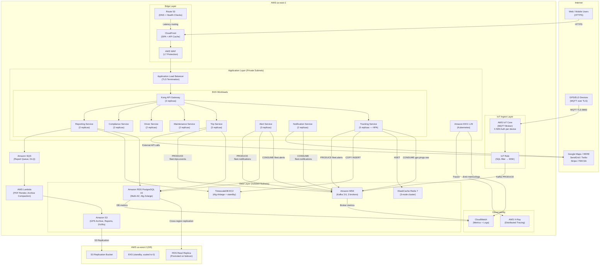

# Cloud Architecture

## Overview

The Fleet Management System runs on AWS, deployed across two regions for high availability and disaster recovery. The primary region is `us-east-1` (N. Virginia); the DR region is `us-west-2` (Oregon). All application workloads run on Amazon EKS using managed node groups with a mix of On-Demand instances for steady-state capacity and Spot instances for stateless batch analytics jobs. The data plane is built on managed AWS services wherever operationally appropriate: RDS for relational data, ElastiCache for caching, MSK for Kafka, and IoT Core for MQTT device ingestion.

GPS telemetry is the system's highest-volume data stream. The ingest pipeline is purpose-designed to sustain up to 50,000 pings per second from connected devices, route them through a durable Kafka backbone, write hot data to TimescaleDB for sub-second queries, and archive aged data to S3 in Parquet format for long-term retention. Cost optimisation is achieved through a combination of Reserved Instance commitments, Spot for batch workloads, S3 Intelligent Tiering, and TimescaleDB's native columnar compression, which reduces storage by up to 95% on data older than 7 days.

---

## AWS Services Reference

| AWS Service | Usage | Tier / SKU | Justification |
|---|---|---|---|
| Amazon EKS | Kubernetes control plane for all microservices | 1.29 Managed node group (m6i.2xlarge On-Demand × 6, c6i.4xlarge Spot × 4 for batch) | Managed control plane eliminates patching overhead; IRSA provides pod-level IAM; Karpenter for node autoscaling |
| Amazon RDS (PostgreSQL 15) | Operational relational data: vehicles, drivers, trips, maintenance, fuel, compliance records | db.r6g.2xlarge Multi-AZ with one read replica | Multi-AZ for automatic failover (<60s RTO); read replica offloads reporting queries; RDS Proxy reduces connection overhead from 400+ pods |
| TimescaleDB on EC2 | Time-series GPS ping storage and continuous aggregates | r6g.4xlarge (primary) + r6g.2xlarge (standby) with gp3 EBS RAID-0 | TimescaleDB compression and hypertable partitioning not available in managed RDS; self-managed EC2 gives full extension control; streaming replication for HA |
| Amazon ElastiCache (Redis 7) | Live vehicle position cache, session tokens, route cache, rate-limit counters | cache.r6g.large × 3-node cluster mode | Sub-millisecond position reads; cluster mode for horizontal shard scaling; automatic failover in <60s; encryption at rest and in transit |
| Amazon MSK (Kafka 3.6) | Event bus for all domain events: GPS pings, trips, alerts, compliance, notifications | kafka.m5.2xlarge × 3 brokers, 3 AZs, 1 TB gp3 per broker | Managed Kafka eliminates ZooKeeper/broker patching; MSK Connect for S3 sink; exactly-once semantics with transactional producers |
| AWS IoT Core | MQTT broker for GPS/ELD device connections | Per-message pricing (no provisioned capacity) | Scales to millions of concurrent device connections without capacity planning; X.509 certificate authentication per device; IoT Rules bridge to MSK Kafka |
| Amazon S3 | GPS data archival (Parquet), report PDFs, DVIR image uploads, Terraform state | Standard → Intelligent Tiering → Glacier Flexible Retrieval | Infinite scale for archival; Intelligent Tiering auto-migrates GPS Parquet files based on access patterns; S3 Select for ad-hoc analytics without full download |
| Amazon CloudFront | CDN for Web Application static assets and API acceleration | Price Class 100 (US/EU/APAC) | Sub-50ms TTFB for SPA assets globally; Origin Shield reduces origin load; signed URLs for DVIR image access |
| Amazon Route 53 | DNS for all public and internal endpoints; health-check-based failover | Latency routing + health checks | Active-passive failover to DR region; private hosted zone for internal service discovery |
| AWS Certificate Manager | TLS certificates for all ALB listeners and CloudFront distributions | Free (managed renewal) | Automated rotation; wildcard certificate `*.fleet-platform.io` covers all subdomains |
| Amazon SQS | Dead-letter queue for Notification Service; async report generation queue | Standard queue | Decouples report generation from API request; DLQ captures failed notification deliveries for ops review |
| AWS Lambda | IFTA report PDF rendering; GPS archive compaction trigger; IoT device provisioning | arm64, 512 MB, 15-min timeout | Event-driven, zero-idle cost; PDF generation peaks are infrequent; Graviton2 reduces Lambda cost by 20% |
| Amazon CloudWatch | Metrics, logs, alarms for all EKS workloads and AWS managed services | Standard + detailed monitoring on RDS/MSK | Container Insights for Kubernetes pod metrics; log groups per service with 90-day retention; composite alarms for P1 alerting |
| AWS X-Ray | Distributed tracing for request flows across microservices | Per-trace pricing (5% sampling rate) | End-to-end latency attribution across Kong → service → database; Trace Map visualises service dependencies |
| AWS WAF | Layer-7 protection for ALB and CloudFront | WebACL with managed rule groups (AWSManagedRulesCommonRuleSet) | Blocks OWASP Top 10; rate limiting at 1000 req/5min per IP on public API; geo-blocking for non-operating regions |
| Amazon VPC | Network isolation: public, private, and data-tier subnets across 3 AZs | /16 CIDR split into /24 subnets per tier/AZ | All EKS nodes, RDS, and ElastiCache in private subnets; NAT Gateway per AZ for outbound; VPC endpoints for S3 and DynamoDB (no NAT cost) |

---

## Cloud Architecture Diagram

---

## GPS Data Pipeline Architecture

The GPS ingest pipeline is designed for high durability and cost-efficient long-term retention across three storage tiers.

**Tier 1 — Hot Storage (0 to 24 months)**
Devices publish MQTT messages to AWS IoT Core over TLS on port 8883. Each device authenticates using a unique X.509 certificate provisioned at device registration. An IoT Rule evaluates all messages on topic `fleet/+/+/telemetry` and forwards them to the MSK Kafka topic `gps.pings.raw` using the MSK action. The Tracking Service consumes from this topic in batches, validates, enriches, and writes to TimescaleDB's `gps_pings` hypertable. TimescaleDB partitions the hypertable by `(device_id, time)` in 1-week chunks. Chunks older than 7 days have columnar compression applied automatically, achieving 90–95% space reduction while remaining fully queryable with SQL.

**Tier 2 — Warm Archive (24 months to 7 years)**
An MSK Connect S3 Sink Connector runs alongside the main pipeline, consuming from `gps.pings.raw` and writing Parquet files to `s3://fleet-gps-archive/{tenantId}/year={y}/month={m}/day={d}/`. Files are partitioned for efficient query pushdown by Athena. S3 Intelligent Tiering automatically transitions objects from Standard to Infrequent Access (after 30 days) and to Archive Instant Access (after 90 days) based on access frequency, without requiring lifecycle rule tuning. AWS Athena queries this tier for historical reports and compliance audits.

**Tier 3 — Cold Archive (7+ years)**
After 7 years, S3 Lifecycle rules transition Parquet files to S3 Glacier Flexible Retrieval. This tier meets FMCSA record-keeping requirements (minimum 6 months ELD data required; 7-year retention satisfies all state-level transport regulations). Retrieval for legal discovery takes 3–5 hours using Bulk Glacier retrieval, triggered by a Lambda function on-demand.

| Tier | Storage | Retention | Access Latency | Cost Target |
|---|---|---|---|---|
| Hot | TimescaleDB (compressed hypertable) | 0–24 months | <100ms SQL query | ~$0.023/GB/month (gp3 EBS) |
| Warm | S3 Intelligent Tiering (Parquet) | 24 months–7 years | Seconds (Athena) | ~$0.0023/GB/month |
| Cold | S3 Glacier Flexible Retrieval | 7+ years | 3–5 hours bulk | ~$0.0036/GB/month |

---

## Cost Optimisation

**Compute — Reserved and Spot Mix**
EKS application nodes run on `m6i.2xlarge` 1-year Reserved Instances for the steady-state workload (6 nodes), covering the always-on microservices. Batch analytics jobs (IFTA report generation, GPS archive compaction, driver score recalculation) run on `c6i.4xlarge` Spot Instances managed by Karpenter. Spot usage is estimated at 40% of batch compute cost versus On-Demand, saving approximately $800/month at current scale.

**Database — Right-Sizing and Compression**
RDS `db.r6g.2xlarge` is right-sized against query profiling data; the instance is vertically scalable to `r6g.4xlarge` without downtime (RDS Multi-AZ failover handles resize). TimescaleDB columnar compression on chunks older than 7 days reduces TimescaleDB EBS volume size by an average of 92%, extending time before a storage upgrade is needed by 10×.

**Storage — S3 Intelligent Tiering**
All GPS archive objects in S3 are enrolled in Intelligent Tiering from day one. The monitoring fee ($0.0025 per 1,000 objects) is offset by automatic transitions that save 40–68% versus keeping all data in Standard. DVIR images (JPEG, typically 200 KB each) are also enrolled in Intelligent Tiering, as historical images are rarely accessed after 30 days.

**Kafka — Topic Retention Tuning**
MSK Kafka topic `gps.pings.raw` has a retention period of 24 hours (sufficient for consumer lag recovery) and `fleet.tracking.processed` retains for 7 days. Log compaction is enabled on vehicle state topics. This keeps MSK broker storage under 3 TB across all brokers, avoiding upgrade to the next MSK storage tier.

---

## Multi-Region Disaster Recovery

| Parameter | Value |
|---|---|
| Primary region | `us-east-1` (N. Virginia) |
| DR region | `us-west-2` (Oregon) |
| RTO (Recovery Time Objective) | < 4 hours |
| RPO (Recovery Point Objective) | < 1 hour |
| Failover mechanism | Route 53 health-check DNS failover; manual promotion of RDS read replica |

**RDS Cross-Region Replication**
The primary RDS PostgreSQL instance (`us-east-1`) has a cross-region read replica in `us-west-2` with an average replication lag of under 5 seconds under normal load. In a disaster scenario, the replica is promoted to a standalone instance using the AWS Console or `aws rds promote-read-replica` CLI command. The promotion process takes 5–10 minutes. Total estimated RTO for the database tier is 15 minutes.

**TimescaleDB**
TimescaleDB uses PostgreSQL streaming replication to a standby EC2 instance within the same region (AZ failure protection). Cross-region DR for TimescaleDB relies on the S3 Parquet archive (RPO = last MSK Connect S3 sink flush, typically <5 minutes). In a full region failure, queries against GPS data older than the RPO window are served from Athena over the S3 archive.

**EKS and Application Tier**
The `us-west-2` EKS cluster is maintained in standby with node groups scaled to zero (0 running nodes). Helm charts and all container images are stored in ECR with cross-region replication enabled. On failover, node groups are scaled up using the `aws eks update-nodegroup-config` command, and Helm releases are applied via the DR runbook. Estimated time to application tier recovery: 45 minutes.

**GPS Device Connectivity**
AWS IoT Core is a globally distributed service. IoT device connections automatically fail over to the DR region endpoint when the primary endpoint becomes unreachable. Device certificates are replicated to the DR region IoT Core using AWS IoT Device Management bulk provisioning scripts run weekly.
