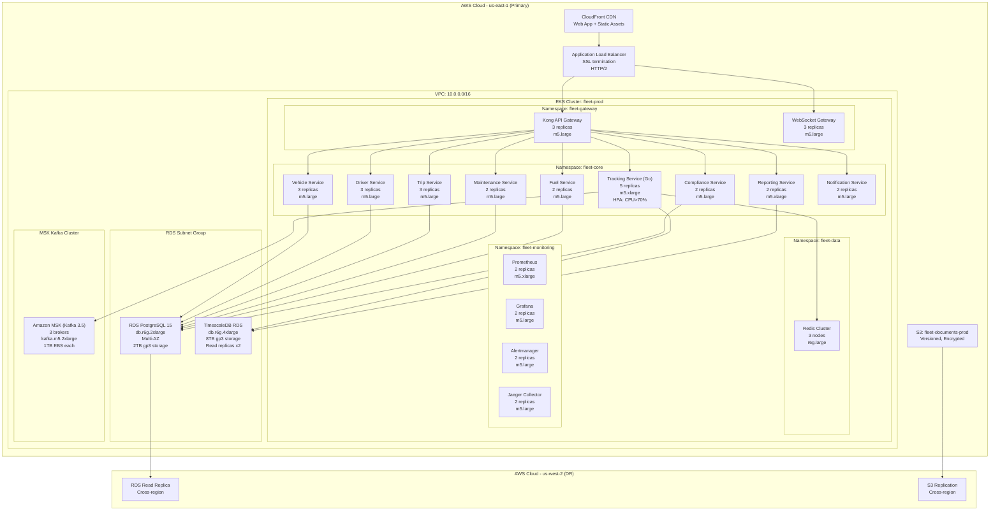

# Fleet Management System — Kubernetes Deployment Diagram

## Overview

The Fleet Management System is deployed on Amazon EKS (Elastic Kubernetes Service) in `us-east-1` as the primary region, with a passive disaster-recovery footprint in `us-west-2`. All production workloads run inside a private VPC with no direct public internet exposure. Ingress is handled exclusively through an Application Load Balancer terminating TLS at the edge and routing through Kong API Gateway.

---

## Deployment Architecture



---

## EKS Cluster Configuration

### Cluster Specification

| Parameter | Value |
|---|---|
| Cluster name | `fleet-prod` |
| Kubernetes version | `1.28` |
| Region | `us-east-1` |
| VPC CNI | Amazon VPC CNI v1.15 |
| Control plane logging | API, audit, authenticator, controllerManager, scheduler |
| Endpoint access | Private only (no public endpoint) |
| Secrets encryption | AWS KMS (`fleet-eks-secrets-key`) |

### Node Groups

#### `ng-core` — General-purpose services
- **Instance type:** `m5.large` (2 vCPU, 8 GB RAM)
- **Min / desired / max:** 6 / 9 / 18
- **AZ placement:** One node per AZ (`us-east-1a`, `1b`, `1c`)
- **Labels:** `role=core-services`
- **Taints:** none
- **AMI:** Amazon Linux 2 EKS-optimized

#### `ng-tracking` — Tracking and WebSocket workloads
- **Instance type:** `m5.xlarge` (4 vCPU, 16 GB RAM)
- **Min / desired / max:** 3 / 5 / 15
- **Labels:** `role=tracking`
- **Taints:** `workload=tracking:NoSchedule` (only Tracking and WS Gateway pods scheduled here)
- **AMI:** Amazon Linux 2 EKS-optimized

#### `ng-reporting` — Reporting and analytics
- **Instance type:** `m5.xlarge` (4 vCPU, 16 GB RAM)
- **Min / desired / max:** 2 / 2 / 6
- **Labels:** `role=reporting`
- **Taints:** `workload=reporting:NoSchedule`

#### `ng-monitoring` — Observability stack
- **Instance type:** `m5.xlarge` (4 vCPU, 16 GB RAM)
- **Min / desired / max:** 2 / 2 / 4
- **Labels:** `role=monitoring`
- **Taints:** `workload=monitoring:NoSchedule`

---

## Kubernetes Namespaces and Resource Quotas

### `fleet-core`
```yaml
apiVersion: v1
kind: ResourceQuota
metadata:
  name: fleet-core-quota
  namespace: fleet-core
spec:
  hard:
    requests.cpu: "40"
    requests.memory: 80Gi
    limits.cpu: "80"
    limits.memory: 160Gi
    pods: "100"
    services: "30"
```

### `fleet-gateway`
```yaml
spec:
  hard:
    requests.cpu: "12"
    requests.memory: 24Gi
    limits.cpu: "24"
    limits.memory: 48Gi
    pods: "20"
```

### `fleet-monitoring`
```yaml
spec:
  hard:
    requests.cpu: "8"
    requests.memory: 32Gi
    limits.cpu: "16"
    limits.memory: 64Gi
    pods: "20"
```

---

## HPA and VPA Policies

### Tracking Service (Go) — HPA
```yaml
apiVersion: autoscaling/v2
kind: HorizontalPodAutoscaler
metadata:
  name: tracking-service-hpa
  namespace: fleet-core
spec:
  scaleTargetRef:
    apiVersion: apps/v1
    kind: Deployment
    name: tracking-service
  minReplicas: 5
  maxReplicas: 30
  metrics:
    - type: Resource
      resource:
        name: cpu
        target:
          type: Utilization
          averageUtilization: 70
    - type: Resource
      resource:
        name: memory
        target:
          type: Utilization
          averageUtilization: 75
  behavior:
    scaleUp:
      stabilizationWindowSeconds: 60
      policies:
        - type: Pods
          value: 5
          periodSeconds: 60
    scaleDown:
      stabilizationWindowSeconds: 300
```

### Vehicle / Driver / Trip Services — HPA
- CPU utilization target: **75%**
- Min replicas: **3**, Max replicas: **10**
- Scale-up window: 90 seconds; scale-down: 300 seconds

### Reporting Service — VPA
```yaml
apiVersion: autoscaling.k8s.io/v1
kind: VerticalPodAutoscaler
metadata:
  name: reporting-service-vpa
  namespace: fleet-core
spec:
  targetRef:
    apiVersion: apps/v1
    kind: Deployment
    name: reporting-service
  updatePolicy:
    updateMode: "Auto"
  resourcePolicy:
    containerPolicies:
      - containerName: reporting-service
        minAllowed:
          cpu: 500m
          memory: 512Mi
        maxAllowed:
          cpu: "4"
          memory: 8Gi
```

---

## Database Cluster Setup

### PostgreSQL RDS (Primary)
- **Engine:** PostgreSQL 15.4
- **Instance class:** `db.r6g.2xlarge` (8 vCPU, 64 GB RAM)
- **Storage:** 2 TB gp3, 12,000 IOPS, 500 MB/s throughput
- **Multi-AZ:** Synchronous standby in `us-east-1b`
- **Automated backups:** 7-day retention, 02:00–03:00 UTC
- **Failover:** Automatic, typically < 60 seconds
- **Parameter group:** `max_connections=500`, `shared_buffers=16GB`, `effective_cache_size=48GB`, `work_mem=64MB`

### TimescaleDB (GPS time-series)
- **Engine:** PostgreSQL 15 with TimescaleDB 2.12 extension on RDS Custom
- **Instance class:** `db.r6g.4xlarge` (16 vCPU, 128 GB RAM)
- **Storage:** 8 TB gp3, 32,000 IOPS
- **Read replicas:** 2 replicas in `us-east-1b` and `us-east-1c` for analytics queries
- **Chunk interval:** 1 hour for `gps_pings` hypertable
- **Compression:** Enabled after 7 days, achieving ~10x compression ratio

---

## Kafka MSK Configuration

| Parameter | Value |
|---|---|
| Kafka version | 3.5.1 |
| Broker count | 3 (one per AZ) |
| Instance type | `kafka.m5.2xlarge` |
| Storage per broker | 1 TB EBS gp3 |
| Replication factor | 3 |
| Min in-sync replicas | 2 |
| Auto-create topics | Disabled |
| Log retention | 24 hours (GPS topics), 7 days (event topics) |
| TLS encryption | In-transit encryption enabled |
| SASL/SCRAM | Enabled for broker authentication |

**Topics:**
- `fleet.gps.pings` — 24 partitions, retention 24h
- `fleet.trips.events` — 12 partitions, retention 7d
- `fleet.alerts.geofence` — 6 partitions, retention 7d
- `fleet.maintenance.events` — 6 partitions, retention 30d
- `fleet.notifications.outbound` — 12 partitions, retention 24h

---

## Redis Cluster Mode

- **ElastiCache for Redis 7.0** — cluster mode enabled
- **Shards:** 3 primary + 3 replica (one replica per shard)
- **Instance type:** `cache.r6g.large` (2 vCPU, 13 GB RAM) per node
- **Total memory:** ~39 GB usable across shards
- **Automatic failover:** Enabled (replica promotes in < 30 seconds)
- **Encryption at rest:** AWS KMS
- **Encryption in transit:** TLS 1.2+
- **Multi-AZ:** Shards spread across `us-east-1a`, `1b`, `1c`

---

## CDN Configuration (CloudFront)

- **Origins:** ALB (dynamic API traffic), S3 (static assets and SPA)
- **Behaviors:**
  - `/api/*` → ALB, TTL 0, forwarded headers: `Authorization`, `X-Request-ID`
  - `/static/*` → S3, TTL 1 year, gzip + Brotli compression
  - `/*` → S3 SPA, TTL 0, origin-request Lambda@Edge for client-side routing
- **SSL:** ACM certificate, TLS 1.2 minimum (TLS 1.3 preferred)
- **WAF:** Attached AWS WAF WebACL with OWASP managed rule group
- **Price class:** `PriceClass_100` (US/Europe/Asia)
- **Access logging:** Enabled to `s3://fleet-cdn-logs-prod`

---

## Monitoring Stack

### Prometheus (fleet-monitoring namespace)
- **Deployment:** 2 replicas with remote-write to Amazon Managed Prometheus (AMP)
- **Retention:** 15 days local, indefinite in AMP
- **Scrape interval:** 15 seconds for application metrics, 30 seconds for infrastructure
- **Storage:** 200 GB EBS gp3 (Persistent Volume per replica)
- **ServiceMonitors:** One per microservice, annotated with `prometheus.io/scrape: "true"`

### Grafana
- **Deployment:** 2 replicas, persistent sessions via shared PostgreSQL backend
- **Dashboards:** GPS Ingestion Rate, Fleet Active Vehicles, Service Latency P99, Kafka Consumer Lag, Database Connection Pool
- **Alerts:** Routed to Alertmanager → PagerDuty for P1/P2, Slack for P3/P4

### Alertmanager
- **Receivers:** PagerDuty (critical), Slack `#fleet-alerts` (warning), email (low severity)
- **Inhibition rules:** Suppress downstream service alerts when upstream is firing

### Jaeger (Distributed Tracing)
- **Collector:** 2 replicas receiving OpenTelemetry OTLP traces
- **Storage backend:** Amazon OpenSearch Service (separate domain: `fleet-traces`)
- **Sampling:** 10% head-based for GPS ingestion; 100% for all error traces

---

## Helm Chart Organization

```
infrastructure/helm/
├── fleet-core/                 # Umbrella chart for core microservices
│   ├── Chart.yaml
│   ├── values.yaml             # Production defaults
│   ├── values-staging.yaml
│   └── charts/
│       ├── vehicle-service/
│       ├── driver-service/
│       ├── trip-service/
│       ├── tracking-service/
│       ├── maintenance-service/
│       ├── fuel-service/
│       ├── compliance-service/
│       ├── reporting-service/
│       └── notification-service/
├── fleet-gateway/              # Kong + WebSocket Gateway
│   ├── Chart.yaml
│   └── values.yaml
├── fleet-monitoring/           # Prometheus, Grafana, Alertmanager, Jaeger
│   ├── Chart.yaml
│   └── values.yaml
└── fleet-infra/                # Cluster-level: ingress-nginx, cert-manager, cluster-autoscaler
    ├── Chart.yaml
    └── values.yaml
```

Each service chart includes: `Deployment`, `Service`, `HorizontalPodAutoscaler`, `PodDisruptionBudget` (minAvailable: 1), `ServiceMonitor`, and `NetworkPolicy`. ConfigMaps and Secrets are managed via External Secrets Operator syncing from AWS Secrets Manager.
