# Activity Diagrams — Government Services Portal

## Overview

This document contains activity diagrams modelling the three key process flows in the Government Services Portal:
1. **Complete Service Application Flow** — from submission through officer review to certificate issuance.
2. **Fee Payment Flow** — online fee payment via ConnectIPS with webhook reconciliation.
3. **Grievance Escalation Flow** — grievance filing through resolution or escalation.

---

## Diagram 1 — Complete Service Application Flow

```mermaid
flowchart TD
    START(["🟢 Citizen Initiates Application"])
    A1["Browse Service Catalog"]
    A2["Select Service"]
    A3{"Logged In?"}
    A4["Redirect to Login / Register"]
    A5{"Eligibility Check"}
    A6["Show Ineligibility Reason\n(Application Blocked)"]
    A7["Render Dynamic Application Form"]
    A8["Citizen Fills Form Fields"]
    A9{"All Required\nFields Valid?"}
    A10["Highlight Validation Errors"]
    A11["Citizen Attaches Documents"]
    A12{"Documents from\nNepal Document Wallet (NDW) or Upload?"}
    A13["Initiate Nepal Document Wallet (NDW) OAuth Flow"]
    A14["Citizen Authorises & Selects Document"]
    A15["Local File Upload"]
    A16["Virus Scan Document"]
    A17{"Scan Passed?"}
    A18["Quarantine File\nNotify Citizen"]
    A19["Store Document in S3 (Encrypted)"]
    A20["Update Document Checklist"]
    A21{"All Required Documents\nAttached?"}
    A22{"Service Has Fee?"}
    A23["Generate Fee Invoice (Base + VAT (13%))"]
    A24["Citizen Selects Payment Mode"]
    A25["Redirect to ConnectIPS Gateway"]
    A26{"Payment\nSuccessful?"}
    A27["Invoice Marked PAID\nApplication Advances"]
    A28["Application Remains\nPAYMENT_PENDING\n24-hour Retry Window"]
    A29["Create Application Record\nAssign ARN"]
    A30["Transition: SUBMITTED"]
    A31["Notify Citizen via SMS + Email\nwith ARN"]
    A32["Place Application in Department Queue"]

    A33["Celery: Auto-assign to Field Officer\n(Round-robin by workload)"]
    A34["Transition: UNDER_REVIEW"]
    A35["Notify Officer via in-portal + email"]
    A36["Officer Reviews Application\nForm Data + Documents"]
    A37{"Officer Decision"}

    A38["Transition: PENDING_INFO"]
    A39["Notify Citizen of Info Request\n(15-day deadline)"]
    A40{"Citizen Responds\nWithin 15 Days?"}
    A41["Application: AUTO_CLOSED\nNotify Citizen"]
    A42["Re-trigger Review Workflow\nNotify Officer"]

    A43["Officer: Forward to Dept Head"]
    A44["Dept Head Reviews\nEscalated Application"]
    A45{"Dept Head Decision"}

    A46["Transition: APPROVED"]
    A47["Trigger Certificate Generation\n(Celery Task)"]
    A48["Render PDF Template\nwith Applicant Data"]
    A49["DSC Signing Service\nApplies Officer Digital Signature"]
    A50{"DSC Signing\nSuccessful?"}
    A51["Retry (max 3 times)\nAlert Dept Head on Failure"]
    A52["Embed QR Code\n(Public Verification URL)"]
    A53["Store Certificate PDF in S3"]
    A54["Transition: CERTIFICATE_ISSUED"]
    A55["Notify Citizen via SMS + Email\nwith Download Link"]

    A56["Transition: REJECTED"]
    A57["Record Rejection Reason + Remarks"]
    A58["Notify Citizen: Rejection Reason,\nRe-application Guidance,\nGrievance Rights"]

    ENDSUCCESS(["🏁 Certificate Available for Download"])
    ENDREJECT(["🔴 Application Rejected"])
    ENDEXPIRY(["⏳ Application Auto-Closed"])

    START --> A1 --> A2 --> A3
    A3 -- No --> A4 --> A3
    A3 -- Yes --> A5
    A5 -- Ineligible --> A6
    A5 -- Eligible --> A7 --> A8 --> A9
    A9 -- No --> A10 --> A8
    A9 -- Yes --> A11 --> A12
    A12 -- Nepal Document Wallet (NDW) --> A13 --> A14 --> A16
    A12 -- Local Upload --> A15 --> A16
    A16 --> A17
    A17 -- Fail --> A18 --> A11
    A17 -- Pass --> A19 --> A20 --> A21
    A21 -- No --> A11
    A21 -- Yes --> A22
    A22 -- No --> A29
    A22 -- Yes --> A23 --> A24 --> A25 --> A26
    A26 -- Yes --> A27 --> A29
    A26 -- No --> A28
    A29 --> A30 --> A31 --> A32 --> A33 --> A34 --> A35 --> A36 --> A37

    A37 -- Request More Info --> A38 --> A39 --> A40
    A40 -- No --> A41 --> ENDEXPIRY
    A40 -- Yes --> A42 --> A36

    A37 -- Escalate --> A43 --> A44 --> A45
    A45 -- Approve --> A46
    A45 -- Reject --> A56

    A37 -- Approve --> A46
    A37 -- Reject --> A56

    A46 --> A47 --> A48 --> A49 --> A50
    A50 -- Fail --> A51 --> A49
    A50 -- Success --> A52 --> A53 --> A54 --> A55 --> ENDSUCCESS

    A56 --> A57 --> A58 --> ENDREJECT
```



---

## Diagram 2 — Fee Payment Flow

```mermaid
flowchart TD
    START2(["🟢 Application Requires Fee Payment"])

    B1["System Generates Fee Invoice\n(Base Fee + 18% VAT (13%))"]
    B2{"Fee Waiver\nRequested?"}
    B3["Citizen Uploads Waiver Proof\n(BPL Card / Age Proof)"]
    B4["Dept Head Reviews Waiver Request"]
    B5{"Waiver\nApproved?"}
    B6["Invoice Amount = रू0\nFee Waiver Granted"]
    B7["Waiver Rejected\nNotify Citizen with Reason"]
    B8["Display Invoice:\nAmount, Deadline, Breakdown"]
    B9["Citizen Selects Payment Mode\n(eSewa/Khalti/ConnectIPS / Net Banking / Card)"]
    B10["System Creates ConnectIPS Order\n(Unique Order ID + Amount + ARN)"]
    B11["Citizen Redirected to\nConnectIPS Payment Page"]
    B12{"Payment Gateway\nResponse"}

    B13["ConnectIPS Returns SUCCESS\n+ Transaction Reference"]
    B14["ConnectIPS Returns FAILURE\n+ Error Code"]
    B15["Gateway Timeout / No Response"]

    B16["ConnectIPS Sends Webhook\nPOST /api/v1/payments/webhook"]
    B17["System Verifies\nHMAC Webhook Signature"]
    B18{"Signature Valid?"}
    B19["Log Invalid Webhook\nAlert Security Team"]
    B20{"Invoice Already\nMarked PAID?\n(Idempotency Check)"]
    B21["Discard Duplicate\nLog Event"]
    B22["Update FeeInvoice: PAID\nRecord ConnectIPS Transaction Ref"]
    B23["Transition Application:\nPAYMENT_PENDING → SUBMITTED"]
    B24["Generate Receipt PDF\n(Invoice + Payment Ref + Timestamp)"]
    B25["Store Receipt in S3\nEmail to Citizen\nAvailable in Dashboard"]
    B26["Display Failure Reason\nOffer Retry"]
    B27{"Retry Attempted?"}
    B28["Return to Payment Mode Selection"]
    B29["Mark Application:\nFEE_PAYMENT_FAILED\nSend Reminder in 24 hrs"]

    B30["System Polls ConnectIPS\nStatus API every 2 min\n(max 5 attempts)"]
    B31{"ConnectIPS Status\nConfirmed?"}
    B32["Proceed as SUCCESS\nfrom B16"]
    B33["Mark: PAYMENT_PENDING\nManual Reconciliation Alert"]

    B34["Offline Challan Option\n(for designated services)"]
    B35["Citizen Generates Challan\nVisits Bank Branch"]
    B36["Bank Marks Challan Paid\nin Core Banking"]
    B37["Nightly Reconciliation Job\nMatches Challan to Application"]
    B38["Update Invoice: PAID\nAdvance Application"]

    END2(["🏁 Payment Confirmed\nApplication Proceeds to Review"])
    ENDPEND(["⏳ Pending Manual Reconciliation"])

    START2 --> B1 --> B2
    B2 -- Yes --> B3 --> B4 --> B5
    B5 -- Yes --> B6 --> B8
    B5 -- No --> B7 --> B8
    B2 -- No --> B8 --> B9 --> B10 --> B11 --> B12

    B12 -- Success --> B13 --> B16
    B12 -- Failure --> B14 --> B26 --> B27
    B12 -- Timeout --> B15 --> B30

    B16 --> B17 --> B18
    B18 -- Invalid --> B19
    B18 -- Valid --> B20
    B20 -- Yes --> B21
    B20 -- No --> B22 --> B23 --> B24 --> B25 --> END2

    B27 -- Yes --> B28 --> B9
    B27 -- No --> B29

    B30 --> B31
    B31 -- Yes --> B32 --> B16
    B31 -- No --> B33 --> ENDPEND

    B34 --> B35 --> B36 --> B37 --> B38 --> END2
```

---

## Diagram 3 — Grievance Escalation Flow

```mermaid
flowchart TD
    START3(["🟢 Citizen Files Grievance"])

    C1["Citizen Selects Grievance Category\n(Rejection / Delay / Conduct / Technical)"]
    C2["Citizen Optionally Links to ARN"]
    C3["Citizen Writes Description\n(50–1000 characters)"]
    C4["Citizen Optionally Attaches Evidence"]
    C5{"Linked Application\nFound?"}
    C6["Route to Relevant Department\n(linked department head)"]
    C7["Route to Citizen Services\nGrievance Cell"]
    C8["Create Grievance Record\nAssign GRN"]
    C9["Transition: OPEN"]
    C10["Notify Citizen with GRN via SMS + Email"]
    C11["Start 30-Day SLA Clock"]
    C12["Notify Assigned Officer / Dept Head\nvia In-portal + Email"]

    C13["Dept Head / Grievance Officer\nAssigns to Handler"]
    C14["Transition: ASSIGNED"]
    C15["Handler Reviews Grievance\nConsults Application History"]

    C16{"Investigation\nRequired?"}
    C17["Request Clarification from Citizen\nTransition: PENDING_CITIZEN_INPUT"]
    C18["Citizen Responds\nOR 7-day Deadline Passes"]
    C19["Handler Conducts Investigation\nContacts Field Officer if Needed"]

    C20{"Resolution\nPossible?"}
    C21["Draft Resolution\nDocument Findings"]
    C22["Transition: RESOLVED"]
    C23["Record Resolution Notes"]
    C24["Notify Citizen: Resolved\nResolution Summary + Corrective Action"]
    C25["Ask Citizen to Rate Resolution\n(1–5 stars, 7-day window)"]
    C26["Close Grievance Record"]

    C27{"SLA Deadline\nApproaching?\n< 5 days remaining"}
    C28["Auto-Alert to Dept Head:\nGrievance at Risk of Breach"]
    C29{"SLA\nBreached?"}
    C30["Escalate to Ministry-Level\nGrievance Authority"]
    C31["Transition: ESCALATED"]
    C32["Notify Citizen:\nGrievance Escalated to Higher Authority"]
    C33["Senior Authority Reviews\n30-day Secondary SLA"]

    C34{"Senior Authority\nDecision"}
    C35["Override and Resolve\nCompensation if applicable"]
    C36["Uphold Previous Decision\nFinal Disposition"]

    C37["Citizen Dissatisfied\nRequests Further Escalation"]
    C38{"Further Escalation\nAvailable?"]
    C39["Escalate to Province/National\nGrievance Ombudsman Portal"]
    C40["Mark as EXTERNALLY_ESCALATED\nNotify Citizen"]

    ENDRES(["✅ Grievance Resolved"])
    ENDFINAL(["📋 Final Disposition Recorded"])
    ENDEXT(["🔗 Escalated to External Authority"])

    START3 --> C1 --> C2 --> C3 --> C4 --> C5
    C5 -- Yes --> C6 --> C8
    C5 -- No --> C7 --> C8
    C8 --> C9 --> C10 --> C11 --> C12 --> C13 --> C14 --> C15 --> C16

    C16 -- Yes --> C17 --> C18 --> C19
    C16 -- No --> C19
    C19 --> C20

    C20 -- Yes --> C21 --> C22 --> C23 --> C24 --> C25 --> C26 --> ENDRES
    C20 -- No --> C27

    C27 -- Yes --> C28 --> C29
    C27 -- No --> C29

    C29 -- Yes --> C30 --> C31 --> C32 --> C33 --> C34
    C29 -- No --> C20

    C34 -- Resolve --> C35 --> ENDRES
    C34 -- Uphold --> C36 --> ENDFINAL

    C36 --> C37 --> C38
    C38 -- Yes --> C39 --> C40 --> ENDEXT
    C38 -- No --> ENDFINAL
```

---

## Activity Flow Summary

| Flow | Key Decision Points | SLA | Notifications Triggered |
|------|-------------------|-----|------------------------|
| Application Submission | Eligibility, Payment, Officer Decision | Configurable per service | ARN confirmation, status changes, certificate issuance |
| Fee Payment | Waiver approval, Payment success/failure, Webhook validation | 24 hrs for payment retry | Invoice, receipt, failure alert |
| Grievance Escalation | SLA breach, Resolution possible, Further escalation | 30 days (primary), 30 days (secondary) | GRN, progress updates, resolution, escalation |

---

## Compliance Notes

- All citizen notification touchpoints are mandatory under **National e-Governance Plan (NeGP)** service delivery standards.
- Grievance SLA of 30 days aligns with **Department of Administrative Reforms and Public Grievances (DARPG)** guidelines.
- Certificate DSC signing complies with **IT Act 2000, Section 5** (legal recognition of digital signatures).
- Document retention after certificate issuance follows **Public Records Act 1993** guidelines.
