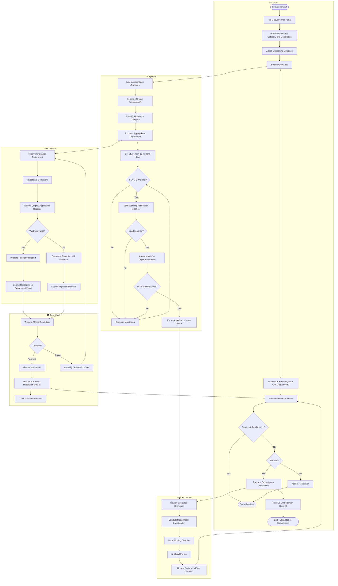
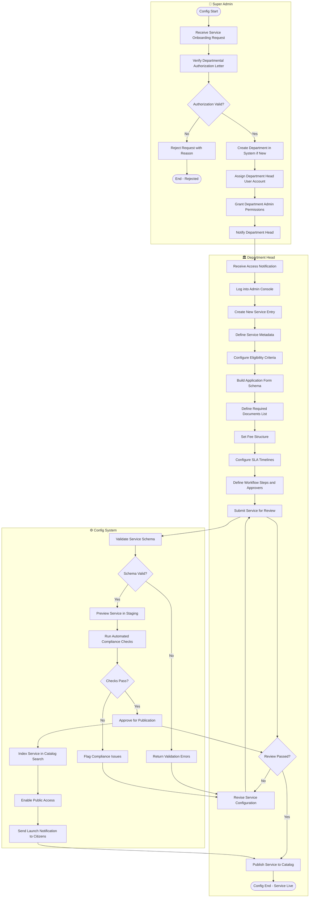
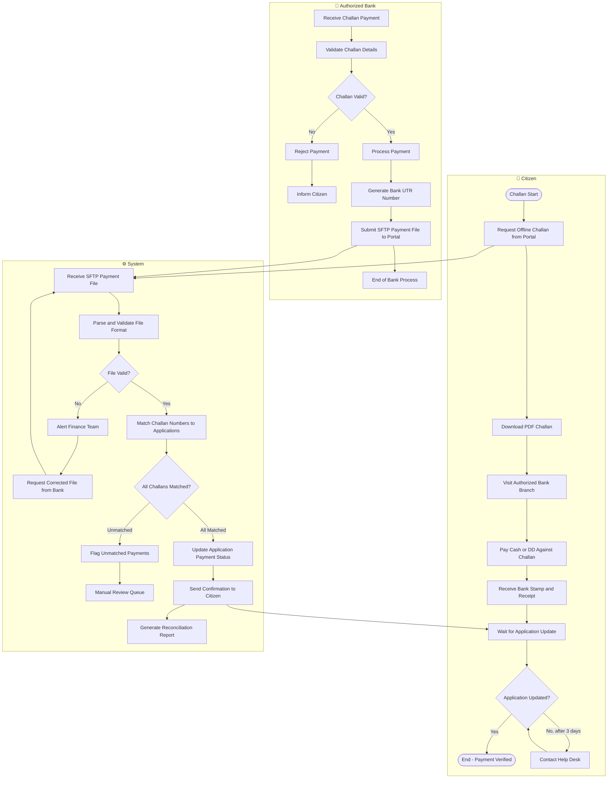

# BPMN Swimlane Diagram — Government Services Portal

## Overview

This document presents Business Process Model and Notation (BPMN) swimlane diagrams for the Government Services Portal's core processes. Each process is decomposed into lanes representing the actors (Citizen, System, Field Officer, Department Head, etc.) responsible for each activity. The diagrams use Mermaid flowchart notation to approximate BPMN swimlane semantics.

**Notation Guide:**
- Rectangles: Tasks / Activities
- Diamonds: Gateways (Decision points)
- Rounded rectangles: Start / End events
- Arrows: Sequence flows
- Subgraphs: Swimlanes (participant pools)

---

## Process 1: Service Application End-to-End

This is the primary citizen-facing process, spanning from service discovery through final certificate issuance.

```mermaid
flowchart TD
    subgraph CITIZEN["🧑 Citizen"]
        C1([Start]) --> C2[Browse Service Catalog]
        C2 --> C3{Eligible?}
        C3 -- No --> C4[View Eligibility Requirements]
        C4 --> C2
        C3 -- Yes --> C5[Fill Multi-Step Application Form]
        C5 --> C6[Upload Supporting Documents]
        C6 --> C7{All docs uploaded?}
        C7 -- No --> C6
        C7 -- Yes --> C8[Review Application Summary]
        C8 --> C9{Confirm Submission?}
        C9 -- No --> C5
        C9 -- Yes --> C10[Submit Application]
        C10 --> C11[Receive Acknowledgment SMS/Email]
        C11 --> C12[Receive Fee Payment Request]
        C12 --> C13[Pay Application Fee via ConnectIPS]
        C13 --> C14{Payment Successful?}
        C14 -- No --> C15[Retry Payment or Generate Challan]
        C15 --> C13
        C14 -- Yes --> C16[Receive Payment Receipt]
        C16 --> C17[Monitor Application Status]
        C17 --> C18{Clarification Requested?}
        C18 -- Yes --> C19[Respond to Clarification Request]
        C19 --> C17
        C18 -- No --> C20{Decision Received?}
        C20 -- Rejected --> C21[Review Rejection Reason]
        C21 --> C22{File Grievance?}
        C22 -- Yes --> C23[Submit Grievance]
        C22 -- No --> C24([End - Rejected])
        C20 -- Approved --> C25[Download Digital Certificate]
        C25 --> C26([End - Approved])
    end

    subgraph SYSTEM["⚙️ Portal System"]
        S1[Validate Form Data] --> S2[Check Document Completeness]
        S2 --> S3[Generate Application Reference ID]
        S3 --> S4[Trigger Acknowledgment Notification]
        S4 --> S5[Calculate Fee Amount]
        S5 --> S6[Initiate ConnectIPS Payment Session]
        S6 --> S7{ConnectIPS Callback Received?}
        S7 -- Timeout --> S8[Reconcile via Webhook Retry]
        S8 --> S7
        S7 -- Success --> S9[Update Application Status: PAYMENT_COMPLETED]
        S9 --> S10[Route to Department Queue]
        S10 --> S11[Assign to Available Field Officer]
        S11 --> S12[Monitor SLA Timer]
        S12 --> S13{SLA Breached?}
        S13 -- Yes --> S14[Escalate to Department Head]
        S13 -- No --> S15[Continue Monitoring]
        S15 --> S12
        S14 --> S16[Update Escalation Record]
    end

    subgraph OFFICER["👮 Field Officer"]
        O1[Receive Application in Queue] --> O2[Review Application Details]
        O2 --> O3[Verify Documents]
        O3 --> O4{Documents Valid?}
        O4 -- No --> O5[Request Clarification from Citizen]
        O5 --> O6[Await Citizen Response]
        O6 --> O3
        O4 -- Yes --> O7[Perform Field Verification if Required]
        O7 --> O8[Prepare Recommendation Report]
        O8 --> O9{Recommend?}
        O9 -- Reject --> O10[Document Rejection Reason]
        O10 --> O11[Submit Rejection to Dept Head]
        O9 -- Approve --> O12[Submit Approval Recommendation]
    end

    subgraph HOD["🏛️ Department Head"]
        H1[Review Officer Recommendation] --> H2{Decision?}
        H2 -- Approve --> H3[Digitally Approve Application]
        H3 --> H4[Trigger Certificate Generation]
        H4 --> H5[DSC Sign Certificate]
        H5 --> H6[Upload to S3 and Nepal Document Wallet (NDW)]
        H6 --> H7[Notify Citizen of Approval]
        H2 -- Reject --> H8[Record Final Rejection with Reason]
        H8 --> H9[Notify Citizen of Rejection]
        H2 -- Return --> H10[Return to Officer with Comments]
        H10 --> H1
    end

    C10 --> S1
    S11 --> O1
    O12 --> H1
    O11 --> H1
    H7 --> C25
    H9 --> C21
```

### Process Metrics

| Process | Average Duration | SLA Target | Automated Steps | Manual Steps |
|---------|-----------------|------------|-----------------|--------------|
| Form Fill & Submission | 15–45 minutes | N/A (citizen) | 5 | 3 |
| Fee Payment | 2–10 minutes | N/A (citizen) | 4 | 1 |
| Document Verification | 1–3 working days | 3 working days | 2 | 4 |
| Officer Review | 3–7 working days | 7 working days | 1 | 5 |
| HOD Approval | 1–2 working days | 2 working days | 3 | 2 |
| Certificate Issuance | 5–15 minutes | 30 minutes post-approval | 6 | 0 |
| **Full End-to-End** | **7–15 working days** | **15 working days** | **21** | **15** |

---

## Process 2: Grievance Redressal Process



---

## Process 3: Department Service Configuration

This process covers how a Super Admin or Department Head configures a new government service on the portal.



---

## Process 4: Offline Challan Payment Reconciliation



---

## Exception Handling Procedures

| Exception | Trigger | Handling Procedure | Responsible Party |
|-----------|---------|-------------------|-------------------|
| Duplicate Application Submission | Citizen submits same application twice within 24 hours | System returns existing application reference; citizen redirected to status page | System (automated) |
| Payment Gateway Unavailable | ConnectIPS returns 503 or timeout | Show maintenance message; offer challan fallback; retry after 15 minutes | System + Field Officer notification |
| Document Upload Virus Detected | ClamAV flags uploaded file | Quarantine file; notify citizen; do not block application progress for 48 hours; request resubmission | System + Citizen Notification |
| Officer Unresponsive > 3 Days | Application not touched for 3 business days | Auto-reminder to officer; CC department head on day 4; auto-reassign on day 5 | System (Celery beat scheduler) |
| DSC Expiry During Certificate Generation | Signing service returns certificate expiry error | Queue certificate; notify Super Admin; fallback to manual stamp and scan; log incident | System + Super Admin alert |
| SLA Breach — Grievance | Grievance unresolved after 15 working days | Auto-escalate to Department Head; SMS alert to citizen; create escalation audit record | Celery Beat + Notification Service |
| Database Connection Pool Exhausted | All 100 PgBouncer connections busy | Queue wait with 30-second timeout; return 503 with Retry-After header; scale Fargate tasks | System + CloudWatch alarm |
| NID NASC (National Identity Management Centre) API Down | NASC (National Identity Management Centre) returns 5xx or times out | Switch to email OTP fallback; log NASC (National Identity Management Centre) outage; alert Super Admin; maintain 15-minute circuit breaker | Auth Service + Circuit Breaker |

---

## Operational Policy Addendum

### Citizen Data Privacy Policies

- **PP-01 — Minimal Data Collection**: Application forms collect only the data fields mandated by the relevant government act (e.g., Municipal Act, Motor Vehicles Act). No additional personal data is collected without explicit citizen consent.
- **PP-02 — Purpose Limitation**: Data collected during an application is used solely for processing that application. Reuse for unrelated services requires fresh consent.
- **PP-03 — NID Data Handling**: NID numbers are never stored in full; only a SHA-256 hash of the masked NID is persisted. Compliant with NID Act 2016 Section 29.
- **PP-04 — Citizen Data Access**: Citizens may request a full export of their personal data held by the portal via the Data Access Request feature. Response within 30 calendar days per PDPA draft guidelines.
- **PP-05 — Data Breach Notification**: In the event of a confirmed data breach, affected citizens will be notified within 72 hours via SMS and email. CERT-In will be notified per IT Amendment Rules 2022.
- **PP-06 — Retention and Deletion**: Application data retained for 7 years post-closure (RTI compliance). Citizens may request deletion of draft/incomplete applications at any time.

### Service Delivery SLA Policies

- **SLA-01 — Application Acknowledgment**: System sends acknowledgment (SMS + email) within 5 minutes of successful submission. Target: 99.5% within SLA.
- **SLA-02 — Fee Payment Confirmation**: Payment confirmation sent within 2 minutes of ConnectIPS webhook receipt. Target: 99.9% within SLA.
- **SLA-03 — Officer First Review**: Field officer must initiate review within 3 working days of payment confirmation. Breach triggers automated escalation.
- **SLA-04 — Certificate Delivery**: Approved certificates generated and delivered to Nepal Document Wallet (NDW) within 30 minutes of Department Head approval.
- **SLA-05 — Grievance Acknowledgment**: Grievances acknowledged (auto) within 1 hour of filing. First human response within 3 working days.
- **SLA-06 — Portal Availability**: Target 99.9% uptime (≤ 8.7 hours downtime/year). Measured via CloudWatch Synthetic Canaries.

### Fee and Payment Policies

- **FP-01 — Fee Immutability at Submission**: The fee amount displayed at form-start is locked for 48 hours. Price changes by admins take effect for new applications only.
- **FP-02 — Challan Validity**: Offline challans are valid for 7 calendar days from generation. Expired challans must be regenerated; no extensions without HOD approval.
- **FP-03 — Duplicate Payment Protection**: Idempotency keys (Redis, 24-hour TTL) prevent double-charging. All payment initiation endpoints are idempotent.
- **FP-04 — Refund Timeline**: Automatic refunds for rejected applications initiated within 24 hours. Bank processing: 5–7 working days. Citizen notified at each stage.
- **FP-05 — Reconciliation Cadence**: SFTP challan files processed daily at 06:00 IST. Unmatched payments escalated to Finance team by 09:00 IST same day.
- **FP-06 — Payment Records Retention**: All payment records retained for 10 years for audit and RTI compliance.

### System Availability Policies

- **AV-01 — Scheduled Maintenance Window**: Sundays 02:00–04:00 IST. Citizens notified 48 hours in advance via portal banner and SMS. Emergency maintenance may occur with 2-hour notice.
- **AV-02 — RTO/RPO Targets**: Recovery Time Objective: 4 hours for full system. Recovery Point Objective: 1 hour (RDS automated backup frequency).
- **AV-03 — Multi-AZ Deployment**: All production services run across two AWS Availability Zones (ap-south-1a, ap-south-1b). Single-AZ failure does not cause downtime.
- **AV-04 — Auto-Scaling Thresholds**: ECS services scale out when CPU > 70% for 2 consecutive minutes. Scale in when CPU < 30% for 10 minutes. Minimum 2 tasks always running.
- **AV-05 — Disaster Recovery Testing**: Full DR failover drill conducted quarterly. Results documented and remediation actions tracked in JIRA.
