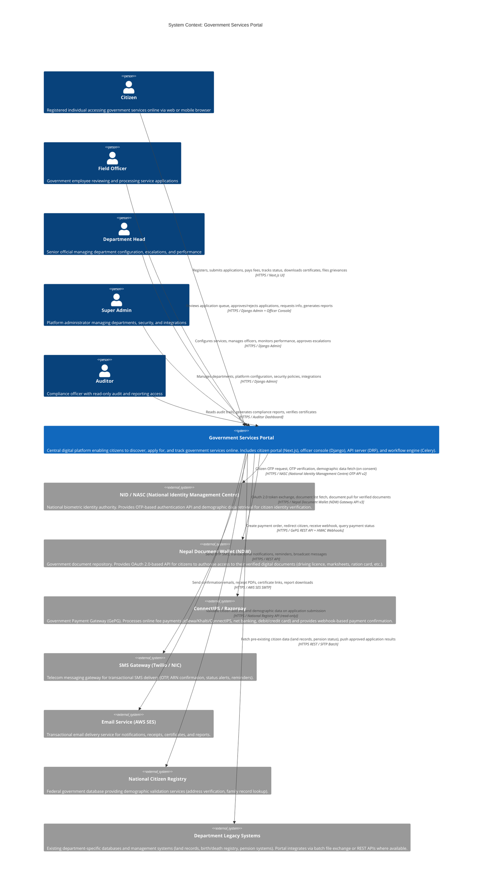

# System Context Diagram — Government Services Portal

## Overview

This document presents the C4 System Context diagram and supporting context views for the Government Services Portal, showing the portal's position within the broader ecosystem of government digital infrastructure, external services, and human actors.

---

## C4 Context Diagram



---

## External System Integration Details

### NID / NASC (National Identity Management Centre)

| Attribute | Value |
|-----------|-------|
| **Integration Type** | REST API (NASC (National Identity Management Centre) OTP Service v2) |
| **Purpose** | Citizen identity verification during registration and login |
| **Data Exchanged** | NID number (one-way hash in requests), OTP, masked demographic data (name, gender, DoB) on consent |
| **Data Sensitivity** | Highly Sensitive PII — NID Act 2016 compliance mandatory |
| **Compliance** | NID Act 2016, Section 8 (authentication); no raw NID number stored after verification |
| **Availability SLA** | 99.9% (NASC (National Identity Management Centre) SLA); portal implements circuit breaker with fallback |

### Nepal Document Wallet (NDW)

| Attribute | Value |
|-----------|-------|
| **Integration Type** | OAuth 2.0 + REST API (Nepal Document Wallet (NDW) Gateway v3) |
| **Purpose** | Pull citizen's verified government documents (driving licence, certificate, marksheet) |
| **Data Exchanged** | OAuth tokens, document metadata, document binary (PDF) |
| **Data Sensitivity** | Restricted PII; documents treated as sensitive |
| **Compliance** | Nepal Document Wallet (NDW) Act provisions under IT Act 2000; citizen must explicitly authorise each document pull |
| **Fallback** | If Nepal Document Wallet (NDW) unavailable, citizen can upload physical scans as fallback |

### ConnectIPS / Razorpay

| Attribute | Value |
|-----------|-------|
| **Integration Type** | REST API + HMAC-signed Webhooks |
| **Purpose** | Online fee collection (eSewa/Khalti/ConnectIPS, net banking, cards) for paid government services |
| **Data Exchanged** | Order ID, amount, currency, citizen ID, ARN; payment status (success/failure); transaction reference |
| **Data Sensitivity** | Financial; no card numbers stored in portal (PCI DSS compliance via ConnectIPS) |
| **Compliance** | RBI guidelines on payment aggregators; Government e-Payment Gateway mandate |
| **Idempotency** | Webhook processing is idempotent (duplicate webhooks rejected via DB lock) |

### SMS Gateway (Twilio / NIC SMS)

| Attribute | Value |
|-----------|-------|
| **Integration Type** | REST API |
| **Purpose** | OTP delivery, transactional notifications, SLA reminders, emergency broadcasts |
| **Data Exchanged** | Phone number (masked in logs), message content, delivery status |
| **Data Sensitivity** | Restricted (phone number is PII) |
| **Fallback** | NIC Nepal Telecom / Sparrow SMS gateway as secondary if primary Twilio fails |

### Email Service (AWS SES)

| Attribute | Value |
|-----------|-------|
| **Integration Type** | AWS SES SMTP / API |
| **Purpose** | Transactional emails: confirmations, receipts, certificates, reports |
| **Data Exchanged** | Email address, templated HTML/text content, attachments (PDFs) |
| **Data Sensitivity** | Restricted (email address is PII) |
| **Deliverability** | DKIM and SPF configured; bounce/complaint handling via SNS |

### National Citizen Registry

| Attribute | Value |
|-----------|-------|
| **Integration Type** | REST API (read-only) |
| **Purpose** | Validate address and demographic data on application submission |
| **Data Exchanged** | Citizen ID, address components, demographic validation flag |
| **Data Sensitivity** | Restricted PII |
| **Compliance** | Data sharing governed by inter-government data-sharing agreement |

### Department Legacy Systems

| Attribute | Value |
|-----------|-------|
| **Integration Type** | REST API (where available) or SFTP batch file exchange |
| **Purpose** | Fetch existing citizen records (land title, pension status); push approved application results |
| **Data Exchanged** | Structured records per department schema |
| **Data Sensitivity** | Varies by department; may include sensitive land and financial records |
| **Error Handling** | Failed syncs queued for retry; manual reconciliation dashboard for exceptions |

---

## Context Boundary Summary

```mermaid
flowchart TD
    subgraph Govt["Government IT Infrastructure"]
        NASC (National Identity Management Centre)["NASC (National Identity Management Centre) / NID\n(Identity)"]
        DL["Nepal Document Wallet (NDW)\n(Documents)"]
        PG["ConnectIPS\n(Payments)"]
        NCR["National Citizen Registry\n(Demographics)"]
        LS["Department Legacy Systems"]
    end

    subgraph Commercial["Commercial Services"]
        SMS["SMS Gateway\n(Twilio)"]
        EMAIL["Email / AWS SES"]
    end

    subgraph Portal["Government Services Portal\n(Within Scope)"]
        CP["Citizen Portal\n(Next.js)"]
        OC["Officer Console\n(Django)"]
        API["API Server\n(DRF)"]
        WF["Workflow Engine\n(Celery)"]
        DB["PostgreSQL + Redis\n(Data Layer)"]
        S3["Document Store\n(S3)"]
    end

    CITIZEN["👤 Citizen"] --> CP
    OFFICER["👮 Field Officer"] --> OC
    DHEAD["🏛 Dept Head"] --> OC
    SADMIN["⚙️ Super Admin"] --> OC
    AUDITOR["🔍 Auditor"] --> OC

    CP --> API --> WF --> DB
    OC --> API
    API --> S3

    API --> NASC (National Identity Management Centre)
    API --> DL
    API --> PG
    API --> NCR
    WF --> LS
    WF --> SMS
    WF --> EMAIL
```

---

## Compliance and Security Context

| Concern | Regulation | Portal Response |
|---------|-----------|----------------|
| NID Data Handling | NID Act 2016 | No raw NID stored; masked display; OTP verification only |
| PII Protection | PDPA 2023 (Nepal) | Encrypted at rest (AES-256), TLS 1.3 in transit |
| Financial Records | Companies Act 2013 | Fee records retained 7 years |
| Audit Logs | IT Act 2000, Sec 67C | Immutable, tamper-evident logs retained 7 years |
| RTI Disclosure | RTI Act 2005 | Proactive disclosure reports generated quarterly |
| e-Signatures | IT Act 2000, Sec 5 | DSC used for certificate signing |
| Payment Security | RBI Payment Aggregator Guidelines | No card data stored; PCI DSS via ConnectIPS |
