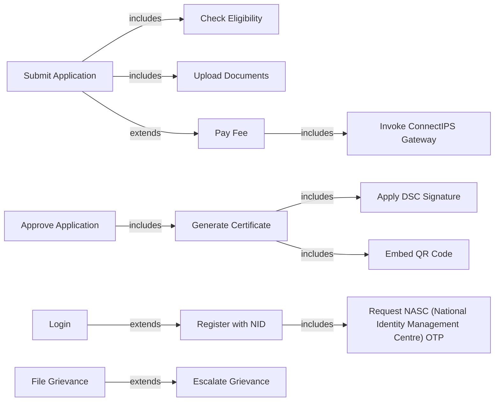

# Use Case Diagram — Government Services Portal

## Overview

This document presents the system use case diagram for the Government Services Portal, showing all actors and their interactions with the system grouped by functional domain.

---

## Actor Definitions

| Actor | Type | Description |
|-------|------|-------------|
| **Citizen** | Primary External | Registered individual accessing government services online |
| **Field Officer** | Primary External | Government employee who reviews and processes applications |
| **Department Head** | Primary External | Senior official managing department operations and configuration |
| **Super Admin** | Primary External | Platform administrator with cross-department system access |
| **Auditor** | Primary External | Compliance officer with read-only audit access |
| **NASC (National Identity Management Centre) / NID** | Secondary External | National identity authority providing OTP verification API |
| **Nepal Document Wallet (NDW)** | Secondary External | Government document repository for verified document pull |
| **ConnectIPS / Razorpay** | Secondary External | Payment gateway for fee collection |
| **SMS Gateway** | Secondary External | Telecom gateway for OTP and notification delivery |
| **Email Service (SES)** | Secondary External | AWS SES for transactional email delivery |

---

## Use Case Diagram (Mermaid)

```mermaid
flowchart TD
    %% Actors
    CIT(["👤 Citizen"])
    FO(["👮 Field Officer"])
    DH(["🏛 Department Head"])
    SA(["⚙️ Super Admin"])
    AUD(["🔍 Auditor"])
    NASC (National Identity Management Centre)(["🔐 NASC (National Identity Management Centre) / NID"])
    DIGI(["📁 Nepal Document Wallet (NDW)"])
    PAY(["💳 ConnectIPS"])
    SMS(["📱 SMS Gateway"])
    EMAIL(["✉️ Email / SES"])

    %% ── Domain: Identity & Onboarding ──
    subgraph IdentityDomain["Identity & Onboarding"]
        UC1["Register with NID OTP"]
        UC2["Login (OTP / Password)"]
        UC3["Link Nepal Document Wallet (NDW) Account"]
        UC4["Manage Citizen Profile"]
        UC5["Account Recovery"]
    end

    %% ── Domain: Service Discovery & Application ──
    subgraph ServiceDomain["Service Discovery & Application"]
        UC6["Browse Service Catalog"]
        UC7["Check Service Eligibility"]
        UC8["Submit Service Application"]
        UC9["Save Draft Application"]
        UC10["Upload Supporting Documents"]
        UC11["Respond to Pending Info Request"]
        UC12["Track Application Status"]
    end

    %% ── Domain: Payments ──
    subgraph PaymentDomain["Fee Payment"]
        UC13["Pay Service Fee Online"]
        UC14["Download Payment Receipt"]
        UC15["Request Fee Waiver"]
    end

    %% ── Domain: Certificates & Grievances ──
    subgraph CitizenOutputDomain["Certificates & Grievances"]
        UC16["Download Issued Certificate"]
        UC17["Verify Certificate (QR)"]
        UC18["File Grievance"]
        UC19["Track Grievance Status"]
        UC20["Escalate Grievance"]
    end

    %% ── Domain: Field Officer Review ──
    subgraph OfficerDomain["Field Officer Review"]
        UC21["View Application Queue"]
        UC22["Review Application Details"]
        UC23["Request Additional Info"]
        UC24["Approve Application"]
        UC25["Reject Application"]
        UC26["Forward to Department Head"]
        UC27["Perform Field Visit and Report"]
        UC28["Bulk Process Applications"]
    end

    %% ── Domain: Department Administration ──
    subgraph DeptDomain["Department Administration"]
        UC29["Configure Service Definitions"]
        UC30["Manage Field Officer Accounts"]
        UC31["Monitor Department Dashboard"]
        UC32["Review Escalated Applications"]
        UC33["Generate Department Reports"]
        UC34["Approve Fee Waivers"]
        UC35["Configure Notification Templates"]
        UC36["Manage Holiday Calendar"]
    end

    %% ── Domain: Platform Administration ──
    subgraph AdminDomain["Platform Administration"]
        UC37["Manage Department Hierarchy"]
        UC38["Platform Configuration & Feature Flags"]
        UC39["Manage Citizen Accounts (Support)"]
        UC40["Configure Security Policies"]
        UC41["Manage Integration Configuration"]
        UC42["View Platform Audit Logs"]
        UC43["Mass Notification Broadcast"]
    end

    %% ── Domain: Audit & Compliance ──
    subgraph AuditDomain["Audit & Compliance"]
        UC44["View Audit Dashboard"]
        UC45["Review Application Decision Trail"]
        UC46["Audit Financial Transactions"]
        UC47["Monitor SLA Compliance"]
        UC48["Review Grievance Records"]
        UC49["Export RTI Compliance Reports"]
        UC50["Review Security Violation Logs"]
        UC51["Verify Certificate Integrity (Batch)"]
    end

    %% ── Citizen Associations ──
    CIT --> UC1
    CIT --> UC2
    CIT --> UC3
    CIT --> UC4
    CIT --> UC5
    CIT --> UC6
    CIT --> UC7
    CIT --> UC8
    CIT --> UC9
    CIT --> UC10
    CIT --> UC11
    CIT --> UC12
    CIT --> UC13
    CIT --> UC14
    CIT --> UC15
    CIT --> UC16
    CIT --> UC17
    CIT --> UC18
    CIT --> UC19
    CIT --> UC20

    %% ── Field Officer Associations ──
    FO --> UC2
    FO --> UC21
    FO --> UC22
    FO --> UC23
    FO --> UC24
    FO --> UC25
    FO --> UC26
    FO --> UC27
    FO --> UC28

    %% ── Department Head Associations ──
    DH --> UC2
    DH --> UC29
    DH --> UC30
    DH --> UC31
    DH --> UC32
    DH --> UC33
    DH --> UC34
    DH --> UC35
    DH --> UC36

    %% ── Super Admin Associations ──
    SA --> UC37
    SA --> UC38
    SA --> UC39
    SA --> UC40
    SA --> UC41
    SA --> UC42
    SA --> UC43

    %% ── Auditor Associations ──
    AUD --> UC44
    AUD --> UC45
    AUD --> UC46
    AUD --> UC47
    AUD --> UC48
    AUD --> UC49
    AUD --> UC50
    AUD --> UC51

    %% ── External System Associations ──
    UC1 -.->|"NID OTP API"| NASC (National Identity Management Centre)
    UC2 -.->|"OTP Verification"| NASC (National Identity Management Centre)
    UC3 -.->|"OAuth 2.0"| DIGI
    UC10 -.->|"Document Pull API"| DIGI
    UC13 -.->|"Payment Gateway"| PAY
    UC1 -.->|"OTP SMS"| SMS
    UC2 -.->|"OTP SMS"| SMS
    UC12 -.->|"Status Notifications"| SMS
    UC12 -.->|"Status Notifications"| EMAIL
    UC16 -.->|"Certificate Email"| EMAIL
```

---

## Use Case Grouping Summary

### By Domain

| Domain | Use Case Count | Primary Actor(s) |
|--------|---------------|-----------------|
| Identity & Onboarding | 5 (UC1–UC5) | Citizen |
| Service Discovery & Application | 7 (UC6–UC12) | Citizen |
| Fee Payment | 3 (UC13–UC15) | Citizen |
| Certificates & Grievances | 5 (UC16–UC20) | Citizen |
| Field Officer Review | 8 (UC21–UC28) | Field Officer |
| Department Administration | 8 (UC29–UC36) | Department Head |
| Platform Administration | 7 (UC37–UC43) | Super Admin |
| Audit & Compliance | 8 (UC44–UC51) | Auditor |
| **Total** | **51** | |

---

## Include and Extend Relationships



---

## Actor Role Matrix

| Use Case | Citizen | Field Officer | Dept Head | Super Admin | Auditor |
|----------|:-------:|:-------------:|:---------:|:-----------:|:-------:|
| Register / Login | ✓ | ✓ | ✓ | ✓ | ✓ |
| Submit Application | ✓ | | | | |
| Review Application | | ✓ | ✓ | | |
| Approve/Reject | | ✓ | ✓ | | |
| Configure Service | | | ✓ | | |
| Manage Platform | | | | ✓ | |
| Audit All Activities | | | | ✓ | ✓ |
| File Grievance | ✓ | | | | |
| Resolve Grievance | | ✓ | ✓ | | |
| View Audit Logs | | | | ✓ | ✓ |
| Generate Reports | | | ✓ | ✓ | ✓ |

---

## Compliance Notes

- All use cases involving NID data (UC1, UC2, UC22) comply with **NID Act 2016** authentication-use regulations; NID numbers are masked in storage and display.
- UC3 (Nepal Document Wallet (NDW)) implements OAuth 2.0 per **MeitY Nepal Document Wallet (NDW) Technical Specification v3**.
- UC13 (Fee Payment) routes through **ConnectIPS** as per Government e-Payment Gateway (GePG) mandate for federal government departments.
- UC49 (RTI Reports) produces data compliant with **RTI Act 2005 Section 4(1)(b)** proactive disclosure requirements.
- UC50 (Security Logs) maintains data per **IT Act 2000 Section 67C** (6-year retention of electronic records).
