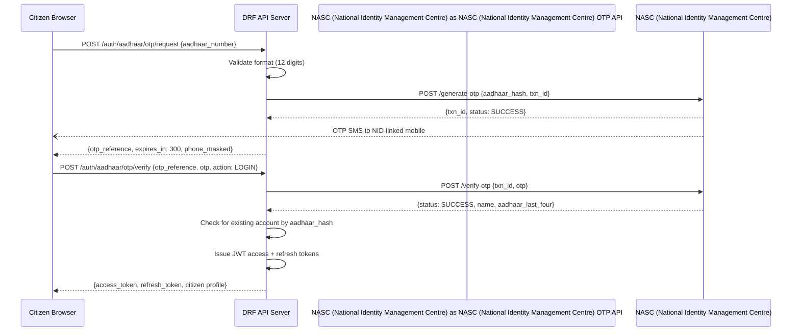

# API Design — Government Services Portal

## Overview

This document defines the complete REST API specification for the Government Services Portal. All endpoints are versioned under `/api/v1/`. Authentication uses JWT Bearer tokens issued by the NID OTP or password login flows.

**Base URL:** `https://portal.gov.in/api/v1`  
**Content-Type:** `application/json`  
**Authentication:** `Authorization: Bearer <access_token>`  
**API Versioning:** URL-path versioning (`/api/v1/`, `/api/v2/`)

---

## Authentication API

### POST /api/v1/auth/aadhaar/otp/request
Request an OTP to the NID-linked mobile number.

**Request:**
```json
{ "aadhaar_number": "123412341234" }
```
**Response 200:**
```json
{
  "status": "success",
  "data": { "otp_reference": "OTP-REF-ABC123", "expires_in_seconds": 300, "phone_masked": "XXXXXX5678" },
  "meta": { "request_id": "uuid", "timestamp": "2024-07-15T10:30:00Z" }
}
```
**Error 429 (Rate Limit):**
```json
{ "status": "error", "code": "OTP_RATE_LIMITED", "message": "Too many OTP requests. Try again after 15 minutes.", "retry_after_seconds": 900 }
```

---

### POST /api/v1/auth/aadhaar/otp/verify
Verify the OTP and complete registration or login.

**Request:**
```json
{ "otp_reference": "OTP-REF-ABC123", "otp": "547823", "action": "REGISTER | LOGIN" }
```
**Response 200 (Login):**
```json
{
  "status": "success",
  "data": {
    "access_token": "eyJ...",
    "refresh_token": "eyJ...",
    "token_type": "Bearer",
    "expires_in": 900,
    "citizen": { "citizen_id": "CIT2024001234", "full_name": "Rajesh Kumar", "aadhaar_last_four": "1234" }
  }
}
```
**Error 401:**
```json
{ "status": "error", "code": "INVALID_OTP", "message": "The OTP entered is incorrect.", "attempts_remaining": 2 }
```

---

### POST /api/v1/auth/token/refresh
Refresh an expired access token using the refresh token.

**Request:**
```json
{ "refresh": "eyJ..." }
```
**Response 200:**
```json
{ "status": "success", "data": { "access": "eyJ...", "expires_in": 900 } }
```

---

## Citizen API

### POST /api/v1/citizens/register
Complete citizen registration after NID verification.

**Auth:** NID OTP verified session  
**Request:**
```json
{
  "otp_reference": "OTP-REF-ABC123",
  "email": "rajesh.kumar@email.com",
  "password": "Secure@Pass123",
  "alternate_phone": "9876543210",
  "preferred_language": "hi"
}
```
**Response 201:**
```json
{
  "status": "success",
  "data": { "citizen_id": "CIT2024001234", "full_name": "Rajesh Kumar", "email": "r***@email.com", "created_at": "2024-07-15T10:31:00Z" }
}
```

---

### GET /api/v1/citizens/me
Get authenticated citizen's profile.

**Auth:** Citizen JWT  
**Response 200:**
```json
{
  "status": "success",
  "data": {
    "citizen_id": "CIT2024001234",
    "full_name": "Rajesh Kumar",
    "preferred_name": "Rajesh",
    "email": "r***@email.com",
    "phone_masked": "XXXXXX5678",
    "date_of_birth": "1985-03-15",
    "address": { "line1": "123 Main St", "city": "Mumbai", "province": "Maharashtra", "pincode": "400001" },
    "aadhaar_verified": true,
    "digilocker_linked": false,
    "account_status": "ACTIVE"
  }
}
```

---

### PATCH /api/v1/citizens/me
Update citizen profile fields.

**Auth:** Citizen JWT  
**Request:**
```json
{ "email": "new.email@example.com", "preferred_language": "en" }
```
**Response 200:**
```json
{ "status": "success", "data": { "updated_fields": ["email"], "verification_required": ["email"] }, "message": "Verification email sent to new address." }
```

---

## Identity Verification API

### POST /api/v1/identity/digilocker/connect
Initiate Nepal Document Wallet (NDW) OAuth 2.0 connection.

**Auth:** Citizen JWT  
**Response 200:**
```json
{ "status": "success", "data": { "oauth_url": "https://digilocker.gov.in/oauth2/1/authorize?client_id=...&redirect_uri=...&province=uuid&scope=openid%20documents", "province": "uuid" } }
```

---

### GET /api/v1/identity/digilocker/callback
Handle Nepal Document Wallet (NDW) OAuth callback (called by Nepal Document Wallet (NDW)).

**Query Params:** `?code=AUTH_CODE&province=uuid`  
**Response:** Redirects to citizen portal with success/failure status.

---

### GET /api/v1/identity/digilocker/documents
List documents available in citizen's Nepal Document Wallet (NDW).

**Auth:** Citizen JWT (Nepal Document Wallet (NDW) linked)  
**Response 200:**
```json
{
  "status": "success",
  "data": {
    "documents": [
      { "doc_id": "DL-DOC-001", "type": "DRIVING_LICENCE", "issuer": "MH Transport Dept", "issue_date": "2020-05-15", "name": "Driving Licence - MH01 20190012345" },
      { "doc_id": "DL-DOC-002", "type": "AADHAAR_CARD", "issuer": "NASC (National Identity Management Centre)", "issue_date": "2015-01-01", "name": "NID Card" }
    ]
  }
}
```

---

## Application API

### GET /api/v1/applications
List authenticated citizen's applications.

**Auth:** Citizen JWT  
**Query Params:** `?status=UNDER_REVIEW&page=1&page_size=20&ordering=-submitted_at`  
**Response 200:**
```json
{
  "status": "success",
  "data": {
    "count": 3,
    "next": null,
    "previous": null,
    "results": [
      { "application_id": "uuid", "arn": "MH/RTO/2024/0012345", "service_name": "Driving Licence Renewal", "status": "UNDER_REVIEW", "submitted_at": "2024-07-15T10:40:00Z", "sla_deadline": "2024-07-22" },
      { "application_id": "uuid2", "arn": "MH/EDU/2024/0001230", "service_name": "Income Certificate", "status": "CERTIFICATE_ISSUED", "submitted_at": "2024-07-10T09:00:00Z" }
    ]
  }
}
```

---

### POST /api/v1/applications
Create a new application (draft or submit).

**Auth:** Citizen JWT  
**Request:**
```json
{
  "service_id": "uuid",
  "form_data": {
    "applicant_name": "Rajesh Kumar",
    "date_of_birth": "1985-03-15",
    "licence_number": "MH01-20190012345",
    "address": "123 Main St, Mumbai"
  },
  "action": "DRAFT | SUBMIT"
}
```
**Response 201 (SUBMITTED):**
```json
{
  "status": "success",
  "data": {
    "application_id": "uuid",
    "arn": "MH/RTO/2024/0012345",
    "status": "PAYMENT_PENDING",
    "invoice": { "invoice_id": "uuid", "total_amount": 590.00, "payment_deadline": "2024-07-22" }
  }
}
```
**Error 409 (Duplicate):**
```json
{ "status": "error", "code": "DUPLICATE_APPLICATION", "message": "An active application already exists for this service.", "existing_arn": "MH/RTO/2024/0011111" }
```

---

### GET /api/v1/applications/{application_id}
Get full application details including status timeline.

**Auth:** Citizen JWT (owner) or Field Officer / Dept Head JWT  
**Response 200:**
```json
{
  "status": "success",
  "data": {
    "application_id": "uuid",
    "arn": "MH/RTO/2024/0012345",
    "service": { "service_id": "uuid", "name": "Driving Licence Renewal", "department": "MH Transport Dept" },
    "status": "UNDER_REVIEW",
    "form_data": { "applicant_name": "Rajesh Kumar", "licence_number": "MH01-20190012345" },
    "submitted_at": "2024-07-15T10:40:00Z",
    "sla_deadline": "2024-07-22",
    "assigned_officer": { "designation": "RTO Inspector", "zone": "Mumbai West" },
    "status_timeline": [
      { "status": "SUBMITTED", "timestamp": "2024-07-15T10:40:00Z", "actor": "Citizen" },
      { "status": "UNDER_REVIEW", "timestamp": "2024-07-15T11:00:00Z", "actor": "System (Auto-assigned)" }
    ],
    "pending_info_request": null,
    "estimated_completion": "2024-07-22"
  }
}
```

---

### GET /api/v1/applications/track
Public tracking endpoint (no login required).

**Query Params:** `?arn=MH/RTO/2024/0012345&dob=1985-03-15`  
**Response 200:**
```json
{
  "status": "success",
  "data": {
    "arn": "MH/RTO/2024/0012345",
    "service_name": "Driving Licence Renewal",
    "status": "UNDER_REVIEW",
    "submitted_at": "2024-07-15T10:40:00Z",
    "estimated_completion": "2024-07-22",
    "action_required": null
  }
}
```

---

## Document API

### POST /api/v1/applications/{application_id}/documents
Upload a document for an application.

**Auth:** Citizen JWT  
**Content-Type:** `multipart/form-data`  
**Request Form Fields:**
- `file`: Binary file (max 5 MB, PDF/JPEG/PNG)
- `document_type`: `INCOME_CERT | AADHAAR_CARD | PHOTO | ADDRESS_PROOF | CASTE_CERT`

**Response 201:**
```json
{
  "status": "success",
  "data": {
    "document_id": "uuid",
    "document_type": "INCOME_CERT",
    "file_name": "income_certificate.pdf",
    "file_size_bytes": 204800,
    "scan_status": "PENDING",
    "preview_url": "https://presigned-s3.../preview?expires=3600",
    "uploaded_at": "2024-07-15T10:42:00Z"
  }
}
```
**Error 415:**
```json
{ "status": "error", "code": "UNSUPPORTED_FILE_TYPE", "message": "Only PDF, JPEG, and PNG files are accepted." }
```
**Error 413:**
```json
{ "status": "error", "code": "FILE_TOO_LARGE", "message": "File size exceeds the 5 MB limit." }
```

---

### POST /api/v1/applications/{application_id}/documents/digilocker-pull
Pull a document from Nepal Document Wallet (NDW) and attach to application.

**Auth:** Citizen JWT  
**Request:**
```json
{ "digilocker_doc_id": "DL-DOC-001", "document_type": "DRIVING_LICENCE" }
```
**Response 201:**
```json
{
  "status": "success",
  "data": { "document_id": "uuid", "document_type": "DRIVING_LICENCE", "source": "DIGILOCKER", "scan_status": "CLEAN", "issue_date": "2020-05-15", "issuer": "MH Transport Dept" }
}
```

---

## Payment API

### GET /api/v1/payments/invoices/{invoice_id}
Get fee invoice details.

**Auth:** Citizen JWT  
**Response 200:**
```json
{
  "status": "success",
  "data": {
    "invoice_id": "uuid",
    "invoice_number": "INV/2024-07/001234",
    "application_arn": "MH/RTO/2024/0012345",
    "base_amount": 500.00,
    "gst_rate": 18.0,
    "gst_amount": 90.00,
    "total_amount": 590.00,
    "status": "UNPAID",
    "payment_deadline": "2024-07-22",
    "waiver_applied": false
  }
}
```

---

### POST /api/v1/payments/invoices/{invoice_id}/initiate
Initiate payment for an invoice.

**Auth:** Citizen JWT  
**Request:**
```json
{ "payment_mode": "eSewa/Khalti/ConnectIPS | NET_BANKING | DEBIT_CARD | CREDIT_CARD" }
```
**Response 200:**
```json
{
  "status": "success",
  "data": {
    "paygov_order_id": "PG-ORDER-789",
    "payment_url": "https://paygov.gov.in/payment?order=PG-ORDER-789&token=...",
    "expires_in_seconds": 900
  }
}
```

---

### POST /api/v1/payments/webhook
Receive ConnectIPS payment webhook (called by ConnectIPS, not citizen).

**Auth:** HMAC-SHA256 signature in `X-ConnectIPS-Signature` header  
**Request (from ConnectIPS):**
```json
{
  "order_id": "PG-ORDER-789",
  "transaction_id": "TXN-987654",
  "status": "SUCCESS | FAILURE",
  "amount": 590.00,
  "payment_mode": "eSewa/Khalti/ConnectIPS",
  "timestamp": "2024-07-15T10:46:00Z"
}
```
**Response 200:**
```json
{ "status": "acknowledged" }
```

---

### GET /api/v1/payments/invoices/{invoice_id}/receipt
Download payment receipt PDF.

**Auth:** Citizen JWT  
**Response 200:**
```json
{ "status": "success", "data": { "receipt_url": "https://presigned-s3.../receipt.pdf?expires=30" } }
```

---

## Certificate API

### GET /api/v1/certificates
List citizen's issued certificates.

**Auth:** Citizen JWT  
**Response 200:**
```json
{
  "status": "success",
  "data": {
    "results": [
      { "certificate_id": "uuid", "certificate_number": "RTO/2024/DL/00012345", "service_name": "Driving Licence Renewal", "issue_date": "2024-07-17", "expiry_date": "2029-07-17", "status": "ISSUED" }
    ]
  }
}
```

---

### GET /api/v1/certificates/{certificate_id}/download
Download a certificate PDF.

**Auth:** Citizen JWT  
**Response 200:**
```json
{ "status": "success", "data": { "download_url": "https://presigned-s3.../cert.pdf?expires=30", "expires_in_seconds": 30 } }
```

---

### GET /api/v1/certificates/{certificate_id}/verify
Public certificate verification (no authentication required).

**Response 200 (Valid):**
```json
{
  "status": "success",
  "data": {
    "certificate_number": "RTO/2024/DL/00012345",
    "service_name": "Driving Licence Renewal",
    "department": "MH Transport Dept",
    "issue_date": "2024-07-17",
    "expiry_date": "2029-07-17",
    "issued_to": "Rajesh K*** (masked)",
    "status": "VALID",
    "dsc_verified": true
  }
}
```
**Response 200 (Revoked):**
```json
{ "status": "success", "data": { "certificate_number": "RTO/2024/DL/00012345", "status": "REVOKED", "revoked_at": "2024-07-20", "revocation_reason": "Issued in error" } }
```

---

## Grievance API

### POST /api/v1/grievances
File a new grievance.

**Auth:** Citizen JWT  
**Request:**
```json
{
  "application_id": "uuid",
  "category": "REJECTION_DISPUTE | SERVICE_DELAY | OFFICER_CONDUCT | TECHNICAL | OTHER",
  "description": "My application was rejected despite meeting all eligibility criteria...",
  "evidence_document_ids": ["doc-uuid-1"]
}
```
**Response 201:**
```json
{
  "status": "success",
  "data": { "grievance_id": "uuid", "grn": "GRN/2024/005678", "status": "OPEN", "sla_deadline": "2024-08-14", "filed_at": "2024-07-15T11:00:00Z" }
}
```

---

### GET /api/v1/grievances/{grievance_id}
Get grievance details and timeline.

**Auth:** Citizen JWT  
**Response 200:**
```json
{
  "status": "success",
  "data": {
    "grievance_id": "uuid",
    "grn": "GRN/2024/005678",
    "status": "IN_PROGRESS",
    "category": "REJECTION_DISPUTE",
    "description": "My application was rejected...",
    "filed_at": "2024-07-15T11:00:00Z",
    "sla_deadline": "2024-08-14",
    "timeline": [
      { "status": "OPEN", "timestamp": "2024-07-15T11:00:00Z" },
      { "status": "ASSIGNED", "timestamp": "2024-07-15T12:00:00Z", "actor": "Department Head" },
      { "status": "IN_PROGRESS", "timestamp": "2024-07-16T09:00:00Z" }
    ],
    "resolution_notes": null,
    "citizen_rating": null
  }
}
```

---

## Officer API

### GET /api/v1/officers/queue
Get field officer's assigned application queue.

**Auth:** Field Officer JWT  
**Query Params:** `?status=UNDER_REVIEW&ordering=sla_deadline&page=1`  
**Response 200:**
```json
{
  "status": "success",
  "data": {
    "count": 12,
    "results": [
      { "application_id": "uuid", "arn": "MH/RTO/2024/0012345", "citizen_name": "Rajesh Kumar", "service_name": "DL Renewal", "submitted_at": "2024-07-15T10:40:00Z", "sla_deadline": "2024-07-18", "days_remaining": 2, "sla_status": "AT_RISK" }
    ]
  }
}
```

---

### POST /api/v1/officers/applications/{application_id}/review
Mark application as under review (begin review session).

**Auth:** Field Officer JWT  
**Response 200:**
```json
{ "status": "success", "data": { "application_id": "uuid", "status": "UNDER_REVIEW", "review_started_at": "2024-07-16T09:00:00Z" } }
```

---

### POST /api/v1/officers/applications/{application_id}/approve
Approve an application.

**Auth:** Field Officer JWT  
**Request:**
```json
{ "approval_note": "All documents verified. Applicant meets eligibility criteria.", "checklist_confirmed": true }
```
**Response 200:**
```json
{ "status": "success", "data": { "application_id": "uuid", "arn": "MH/RTO/2024/0012345", "status": "APPROVED", "certificate_generation": "queued", "approved_at": "2024-07-17T15:00:00Z" } }
```

---

### POST /api/v1/officers/applications/{application_id}/reject
Reject an application.

**Auth:** Field Officer JWT  
**Request:**
```json
{ "rejection_reason_code": "INELIGIBLE_AGE | INCOMPLETE_DOCS | FALSE_DECLARATION | OTHER", "remarks": "Applicant does not meet the minimum age requirement of 18 years. Date of birth provided: 2008-05-12." }
```
**Response 200:**
```json
{ "status": "success", "data": { "application_id": "uuid", "status": "REJECTED", "rejected_at": "2024-07-17T15:30:00Z" } }
```

---

### POST /api/v1/officers/applications/{application_id}/request-info
Request additional information from the citizen.

**Auth:** Field Officer JWT  
**Request:**
```json
{ "requested_items": ["Income certificate issued within last 12 months", "Updated address proof"], "response_deadline_days": 15 }
```
**Response 200:**
```json
{ "status": "success", "data": { "status": "PENDING_INFO", "response_deadline": "2024-07-30", "citizen_notified": true } }
```

---

## Admin API

### GET /api/v1/admin/services
List all service definitions.

**Auth:** Department Head or Super Admin JWT  
**Query Params:** `?department_id=uuid&status=PUBLISHED&page=1`  
**Response 200:**
```json
{
  "status": "success",
  "data": {
    "results": [
      { "service_id": "uuid", "service_code": "MH_RTO_DL_RENEWAL", "name": "Driving Licence Renewal", "status": "PUBLISHED", "version": 3, "base_fee": 500.00, "sla_working_days": 7 }
    ]
  }
}
```

---

### POST /api/v1/admin/services
Create a new service definition.

**Auth:** Department Head JWT  
**Request:**
```json
{
  "service_code": "MH_RTO_DL_RENEWAL",
  "name": "Driving Licence Renewal",
  "description": "Online renewal of driving licence for citizens of Maharashtra",
  "department_id": "uuid",
  "category": "Transport",
  "base_fee": 500.00,
  "fee_type": "FIXED",
  "sla_working_days": 7,
  "form_schema": { "type": "object", "required": ["licence_number", "address"], "properties": { "licence_number": { "type": "string", "title": "Licence Number" } } },
  "required_documents": [ { "type": "DRIVING_LICENCE", "issuer": "Any RTO", "max_age_months": null } ]
}
```
**Response 201:**
```json
{ "status": "success", "data": { "service_id": "uuid", "status": "DRAFT", "version": 1 } }
```

---

### GET /api/v1/admin/departments
List departments.

**Auth:** Super Admin JWT  
**Response 200:**
```json
{
  "status": "success",
  "data": { "results": [ { "department_id": "uuid", "department_code": "MH-RTO", "name": "Maharashtra Regional Transport Office", "type": "STATE", "is_active": true } ] }
}
```

---

### GET /api/v1/admin/reports
Generate or retrieve reports.

**Auth:** Department Head / Auditor JWT  
**Query Params:** `?report_type=DAILY_SUMMARY&date_from=2024-07-01&date_to=2024-07-31&format=PDF`  
**Response 200:**
```json
{ "status": "success", "data": { "report_id": "uuid", "status": "GENERATING", "estimated_ready_in_seconds": 30, "poll_url": "/api/v1/admin/reports/uuid/status" } }
```

---

## Standard Error Codes

| Error Code | HTTP Status | Description |
|------------|------------|-------------|
| `UNAUTHORIZED` | 401 | Missing or invalid JWT token |
| `FORBIDDEN` | 403 | Insufficient role permissions |
| `NOT_FOUND` | 404 | Resource does not exist |
| `VALIDATION_ERROR` | 422 | Request body fails validation |
| `DUPLICATE_APPLICATION` | 409 | Active application already exists |
| `WORKFLOW_VIOLATION` | 409 | Invalid state transition attempted |
| `INELIGIBLE` | 403 | Citizen does not meet eligibility criteria |
| `FILE_TOO_LARGE` | 413 | Uploaded file exceeds 5 MB |
| `UNSUPPORTED_FILE_TYPE` | 415 | File type not in PDF/JPEG/PNG |
| `OTP_RATE_LIMITED` | 429 | Too many OTP requests |
| `API_RATE_LIMITED` | 429 | API rate limit exceeded (100 req/min/IP) |
| `EXTERNAL_SERVICE_ERROR` | 503 | NID/Nepal Document Wallet (NDW)/ConnectIPS unavailable |
| `INTERNAL_ERROR` | 500 | Unexpected server error |

---

## NID OTP Authentication Flow



---

## Pagination Convention

All list endpoints use cursor-based pagination for performance:

```json
{
  "status": "success",
  "data": {
    "count": 150,
    "next": "/api/v1/applications?cursor=eyJ...",
    "previous": null,
    "page_size": 20,
    "results": [...]
  }
}
```

Page size defaults to 20; maximum 100. `cursor` parameter is opaque (base64-encoded ordering key).
