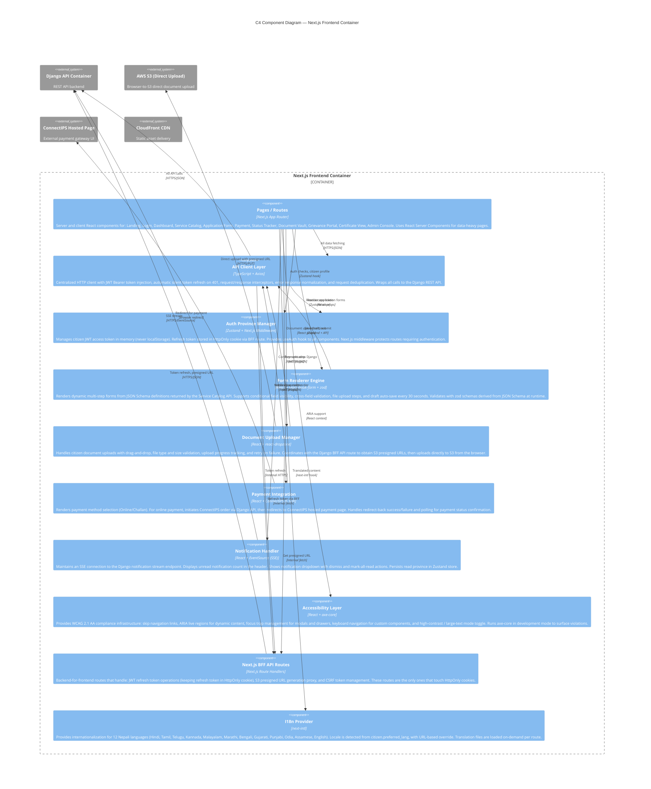

# C4 Component Diagram — Government Services Portal

## 1. Overview of C4 Level 3

This document presents **C4 Level 3 — Component Diagrams** for the two primary software containers of the Government Services Portal:

1. **Django API Container** — the Python/Django REST Framework backend running in AWS ECS Fargate
2. **Next.js Frontend Container** — the TypeScript/Next.js 14 App Router frontend running in AWS ECS Fargate

C4 Level 3 zooms inside a single container to show its internal components, their responsibilities, and the relationships between them. This level is used by developers to understand what they need to build or modify and how their component integrates with others.

**C4 notation key used in this document:**
- `Component(alias, "Label", "Technology", "Description")` for internal components
- `ComponentDb(alias, "Label", "Technology", "Description")` for data stores accessed directly by a component
- `Rel(from, to, "Label", "Protocol")` for component-to-component relationships
- Arrows show the direction of dependency (who calls whom)

---

## 2. C4 Component: Django API Container

```mermaid
C4Component
    title C4 Component Diagram — Django API Container

    Container_Boundary(api, "Django API Container") {

        Component(auth_comp, "Auth Component", "Django App: auth_app", "Handles NID OTP login, email OTP, SMS OTP, JWT issuance, token refresh, logout, and Nepal Document Wallet (NDW) OAuth2 flow. Implements rate limiting and replay protection using Redis.")

        Component(service_catalog, "Service Catalog Component", "Django App: services", "Manages the registry of government services. Exposes service listing with category filters, service detail with form schema, and citizen eligibility evaluation using JSONLogic rules.")

        Component(app_processing, "Application Processing Component", "Django App: applications", "Central component for citizen application lifecycle. Handles create, submit, retrieve, assign-to-officer, clarification, and status operations. Delegates state transitions to WorkflowEngine.")

        Component(workflow_engine, "Workflow Engine Component", "Python Module: state_machine", "Enforces legal state transitions for ServiceApplication, Payment, and Grievance models. Runs transitions atomically. Fires Django signals for side effects. Maintains WorkflowStep audit trail.")

        Component(payment_comp, "Payment Component", "Django App: payments", "Handles payment initiation for ConnectIPS and offline challan generation. Processes incoming ConnectIPS webhooks with signature verification. Manages payment state machine. Implements Redis-based duplicate payment prevention.")

        Component(document_mgmt, "Document Management Component", "Django App: documents", "Manages citizen document uploads to S3 with KMS encryption. Queues malware scans. Provides officer document verification. Generates presigned download URLs with expiry.")

        Component(notification_dispatcher, "Notification Dispatcher Component", "Django App: notifications + Celery tasks", "Dispatches notifications via SMS (Fast2SMS/MSG91), email (AWS SES), push (FCM), and in-app channels. Uses template rendering with i18n. Logs all dispatch attempts. Implements retry with exponential backoff.")

        Component(grievance_comp, "Grievance Component", "Django App: grievances", "Manages citizen grievance filing, officer assignment, investigation workflow, resolution, and SLA-based auto-escalation. Integrates with NotificationDispatcher for all status change alerts.")

        Component(report_gen, "Report Generator Component", "Django App: reports", "Generates operational reports for Dept Head, Super Admin, and Auditor roles: SLA compliance, application throughput, payment reconciliation, officer performance, and grievance resolution rates. Queries read replica.")

        Component(audit_logger, "Audit Logger Component", "Python Module: audit_logger", "Receives Django signals from WorkflowEngine, PaymentComponent, and AuthComponent. Writes immutable audit_log records for every state transition, login event, admin action, and data access. Never raises exceptions to avoid blocking business operations.")

    }

    ComponentDb(postgres_db, "PostgreSQL 15", "AWS RDS Multi-AZ", "Primary relational store for all domain entities")
    ComponentDb(postgres_ro, "PostgreSQL Read Replica", "AWS RDS", "Read-only replica used by ReportGenerator")
    ComponentDb(redis_cache, "Redis 7", "AWS ElastiCache Cluster", "Session cache, OTP txn store, payment locks, Celery broker and result backend")
    ComponentDb(s3_store, "S3 Document Store", "AWS S3 + KMS", "Encrypted document and certificate object storage")

    System_Ext(uidai, "NASC (National Identity Management Centre) NID API", "External government auth service")
    System_Ext(digilocker, "Nepal Document Wallet (NDW) API", "External document wallet")
    System_Ext(paygov, "ConnectIPS Gateway", "Government payment gateway")
    System_Ext(sms_gw, "SMS Gateway", "Fast2SMS / MSG91")
    System_Ext(aws_ses, "AWS SES", "Transactional email service")

    Rel(auth_comp, uidai, "OTP request + verify", "HTTPS/REST")
    Rel(auth_comp, digilocker, "OAuth2 token exchange", "HTTPS/REST")
    Rel(auth_comp, redis_cache, "Store OTP txnId, session", "Redis")
    Rel(auth_comp, postgres_db, "Create/update Citizen record", "SQL")
    Rel(auth_comp, audit_logger, "Login events via signal", "Django Signal")

    Rel(service_catalog, postgres_db, "Read service definitions", "SQL")
    Rel(service_catalog, redis_cache, "Cache popular services", "Redis")

    Rel(app_processing, workflow_engine, "Trigger state transitions", "Python call")
    Rel(app_processing, document_mgmt, "Verify documents uploaded", "Python call")
    Rel(app_processing, payment_comp, "Initiate payment flow", "Python call")
    Rel(app_processing, postgres_db, "CRUD on service_applications", "SQL")
    Rel(app_processing, audit_logger, "Application events via signal", "Django Signal")

    Rel(workflow_engine, postgres_db, "Update application status, create workflow_steps", "SQL")
    Rel(workflow_engine, audit_logger, "All state transitions via signal", "Django Signal")
    Rel(workflow_engine, notification_dispatcher, "State change notifications via signal", "Django Signal")

    Rel(payment_comp, paygov, "Create order, verify webhook", "HTTPS/REST")
    Rel(payment_comp, redis_cache, "Payment duplicate lock", "Redis")
    Rel(payment_comp, postgres_db, "CRUD on payments", "SQL")
    Rel(payment_comp, workflow_engine, "Trigger payment_confirmed transition", "Python call")
    Rel(payment_comp, audit_logger, "Payment events via signal", "Django Signal")

    Rel(document_mgmt, s3_store, "Upload / download documents", "AWS SDK")
    Rel(document_mgmt, postgres_db, "CRUD on application_documents", "SQL")
    Rel(document_mgmt, notification_dispatcher, "Notify on verification", "Python call")

    Rel(notification_dispatcher, sms_gw, "Send SMS", "HTTPS/REST")
    Rel(notification_dispatcher, aws_ses, "Send email", "HTTPS/SMTP")
    Rel(notification_dispatcher, postgres_db, "Log notification records", "SQL")
    Rel(notification_dispatcher, redis_cache, "Pub/Sub for SSE push", "Redis Pub/Sub")

    Rel(grievance_comp, workflow_engine, "Grievance state transitions", "Python call")
    Rel(grievance_comp, postgres_db, "CRUD on grievances", "SQL")
    Rel(grievance_comp, notification_dispatcher, "Grievance status alerts", "Python call")
    Rel(grievance_comp, audit_logger, "Grievance events via signal", "Django Signal")

    Rel(report_gen, postgres_ro, "Read-only analytical queries", "SQL")
    Rel(report_gen, s3_store, "Export reports to S3", "AWS SDK")

    Rel(audit_logger, postgres_db, "Write audit_logs (append-only)", "SQL")
```

---

## 3. C4 Component: Next.js Frontend Container

---

## 4. Component Ownership Table

| Component | Team | Django App / Next.js Module | Key Files | Test Coverage Target |
|---|---|---|---|---|
| Auth Component | Platform & Security | auth_app | `auth_app/views.py`, `auth_app/services.py`, `auth_app/serializers.py` | 95% |
| Service Catalog Component | Service Management | services | `services/views.py`, `services/models.py`, `services/serializers.py` | 90% |
| Application Processing Component | Core Workflow | applications | `applications/views.py`, `applications/services.py`, `applications/serializers.py` | 95% |
| Workflow Engine Component | Core Workflow | state_machine | `state_machine/engine.py`, `state_machine/fields.py`, `state_machine/signals.py` | 100% |
| Payment Component | Payments | payments | `payments/views.py`, `payments/services.py`, `payments/paygov.py`, `payments/webhooks.py` | 95% |
| Document Management Component | Platform | documents | `documents/views.py`, `documents/storage.py`, `documents/scanner.py` | 90% |
| Notification Dispatcher Component | Platform | notifications | `notifications/services.py`, `notifications/tasks.py`, `notifications/adapters/` | 90% |
| Grievance Component | Citizen Services | grievances | `grievances/views.py`, `grievances/services.py`, `grievances/tasks.py` | 90% |
| Report Generator Component | Analytics | reports | `reports/views.py`, `reports/generators.py`, `reports/queries.py` | 85% |
| Audit Logger Component | Platform & Security | audit_logger | `audit_logger/receivers.py`, `audit_logger/writers.py` | 95% |
| Pages / Routes | Frontend | app/ | `app/**/page.tsx`, `app/**/layout.tsx` | 80% (E2E) |
| API Client Layer | Frontend Platform | lib/ | `lib/api-client.ts`, `lib/api-hooks.ts` | 90% |
| Auth Province Manager | Frontend Platform | stores/, middleware | `stores/authStore.ts`, `middleware.ts`, `app/api/auth/route.ts` | 90% |
| Form Renderer Engine | Frontend Core | components/forms/ | `components/forms/FormBuilder.tsx`, `components/forms/FormStep.tsx`, `lib/schema-validator.ts` | 90% |
| Document Upload Manager | Frontend Platform | components/documents/ | `components/documents/DocumentUploader.tsx`, `app/api/upload/route.ts` | 85% |
| Payment Integration | Payments Frontend | components/payments/ | `components/payments/PaymentWidget.tsx`, `app/pay/[id]/page.tsx` | 85% |
| Notification Handler | Frontend Platform | components/notifications/ | `components/notifications/NotificationCenter.tsx`, `stores/notificationStore.ts` | 85% |
| Accessibility Layer | Frontend Platform | components/a11y/ | `components/a11y/SkipNav.tsx`, `components/a11y/AriaLive.tsx`, `components/a11y/FocusTrap.tsx` | 90% |

---

## 5. Component Interface Contracts

### 5.1 Auth Component

**Exposes (REST API):**
- `POST /api/v1/auth/request-otp/` → Accepts `{aadhaar_number}`, returns `{txn_id, mobile_hint, expires_in}`
- `POST /api/v1/auth/verify-otp/` → Accepts `{txn_id, otp}`, returns `{access_token, refresh_token, citizen}`
- `POST /api/v1/auth/refresh-token/` → Accepts `{refresh_token}` in body, returns `{access_token}`
- `POST /api/v1/auth/logout/` → Requires auth, invalidates refresh token, returns `204`
- `GET /api/v1/auth/digilocker/connect/` → Requires auth, returns Nepal Document Wallet (NDW) OAuth2 authorization URL
- `GET /api/v1/auth/digilocker/callback/` → OAuth2 callback; exchanges code for token, stores encrypted token

**Consumes (Internal):**
- `NIDAuthService.request_otp(aadhaar_number)` → `OTPRequestResult`
- `NIDAuthService.verify_otp(txn_id, otp)` → `VerifyOTPResult`
- `JWTManager.issue_tokens(citizen_id)` → `TokenPair`
- `RedisCache.set(key, value, ttl)` / `get(key)` / `delete(key)`

### 5.2 Workflow Engine Component

**Exposes (Python API):**
- `WorkflowEngine.transition(application, trigger, actor_id, notes='')` → `ServiceApplication` (raises `IllegalStateTransitionError` on invalid transition)
- `WorkflowEngine.get_available_triggers(application, actor)` → `list[str]`
- `WorkflowEngine.get_workflow_history(application_id)` → `list[WorkflowStep]`

**Signals fired:**
- `application_state_changed` with args `(instance, old_state, new_state, actor_id, notes)`

**Consumed by:** ApplicationProcessing, PaymentComponent, GrievanceComponent

### 5.3 Document Management Component

**Exposes (REST API):**
- `POST /api/v1/applications/{id}/documents/` → Multipart upload; returns `{doc_id, document_type, scan_status}`
- `GET /api/v1/applications/{id}/documents/` → Returns list of documents with verification status
- `POST /api/v1/applications/{id}/documents/{doc_id}/verify/` → Officer verification; returns updated document
- `GET /api/v1/documents/{doc_id}/download/` → Returns `{presigned_url, expires_in}`

**Exposes (Python API):**
- `DocumentService.check_all_documents_verified(application_id)` → `bool`
- `DocumentService.get_required_documents_status(application_id)` → `dict[str, bool]`

### 5.4 Payment Component

**Exposes (REST API):**
- `POST /api/v1/payments/initiate/` → Returns `{payment_id, redirect_url, amount, expires_at}`
- `POST /api/v1/payments/webhook/paygov/` → No auth; HMAC verified; returns `200`
- `GET /api/v1/payments/application/{app_id}/status/` → Returns `{status, amount, gateway_txn_id, completed_at}`
- `GET /api/v1/payments/{payment_id}/challan/` → Returns challan PDF as `application/pdf`

**Exposes (Python API):**
- `PaymentService.get_payment_status(application_id)` → `Payment | None`

### 5.5 Notification Dispatcher Component

**Exposes (Python API):**
- `NotificationService.send(citizen_id, template_key, context, channels)` → `None` (async dispatch via Celery)
- `NotificationService.send_immediately(citizen_id, template_key, context, channels)` → `list[NotificationResult]` (synchronous, for critical alerts)

**Exposes (REST API):**
- `GET /api/v1/notifications/` → Citizen's notification history
- `PATCH /api/v1/notifications/{id}/read/` → Mark as read
- `GET /api/v1/notifications/stream/` → SSE stream endpoint

### 5.6 API Client Layer (Next.js)

**Exposes (TypeScript API):**
- `apiClient.get<T>(url, config?)` → `Promise<T>`
- `apiClient.post<T>(url, data, config?)` → `Promise<T>`
- `apiClient.patch<T>(url, data, config?)` → `Promise<T>`
- `apiClient.delete(url, config?)` → `Promise<void>`
- All methods throw `ApiError` with `.code`, `.message`, `.fieldErrors` on HTTP error responses

**Behaviour contract:**
- Automatically injects `Authorization: Bearer {access_token}` from `authStore`
- On `401 Unauthorized`: silently calls `/api/auth/` BFF route for token refresh, retries original request once
- On second `401`: calls `authStore.logout()`, redirects to `/login`
- On network error: throws `NetworkError` (separate from `ApiError`)

---

## 6. Operational Policy Addendum

### 6.1 Component Deployment Independence Policy

Each Django app (Auth, Services, Applications, Payments, Documents, Notifications, Grievances, Reports) is packaged in the same Docker image but can be individually disabled via Django `INSTALLED_APPS` and Nginx routing rules without a full redeploy. Feature flags (stored in Redis, managed via admin console) can disable individual API endpoint groups within seconds. This enables partial degradation: if the Certificate Generation component fails, the rest of the portal continues to function. Components with external dependencies (Payment, Nepal Document Wallet (NDW), NID) have circuit breakers that automatically degrade gracefully when external APIs are unavailable.

### 6.2 Component Security Boundary Policy

Each component accesses only the database tables it owns. Django ORM models are imported only by their owning app's views and service classes; cross-app model imports are prohibited by import-linter. The Workflow Engine may import `ServiceApplication`, `Payment`, and `Grievance` models since it is a shared infrastructure component. Authentication and authorization checks are performed at the view layer using DRF permission classes (`IsOfficer`, `IsCitizen`, `IsDeptHead`, `IsSuperAdmin`, `IsAuditor`) — never inside service classes or models. Service classes assume the caller has already verified authorization.

### 6.3 Component Testing Strategy Policy

Each component has three levels of tests: (1) **Unit tests** for service classes and utility functions using mocked dependencies, (2) **Integration tests** for views using DRF's `APITestCase` with a test database, and (3) **Contract tests** for external adapter interfaces using recorded HTTP interactions (VCR cassettes). The frontend has (1) **Component tests** using React Testing Library for interactive components, (2) **API Client tests** using MSW (Mock Service Worker) to simulate backend responses, and (3) **E2E tests** using Playwright covering critical citizen journeys (login, apply, pay, download certificate). Code coverage is enforced in CI; PRs that reduce coverage below the thresholds in the Component Ownership Table are blocked.

### 6.4 Component Observability Policy

Every component emits structured logs in JSON format to CloudWatch. Log entries include: `component_name`, `request_id` (from `X-Request-ID` header, propagated through Celery task context), `citizen_id` (masked as first 8 chars of UUID), `action`, `duration_ms`, and `error` (if applicable). Custom CloudWatch metrics are emitted for: payment initiation rate, payment success rate, OTP request rate, OTP verification success rate, certificate generation duration, notification delivery success rate per channel, and Celery task queue depth per queue name. Alarms are configured for: payment success rate < 95%, OTP verification success rate < 90%, Celery queue depth > 500, and any 5xx error rate > 1% over 5 minutes.
