# Class Diagram — Government Services Portal

## 1. Class Design Principles

The Government Services Portal backend follows **Clean Architecture** with three clear rings:

- **Domain Layer:** Pure Python classes (`Citizen`, `ServiceApplication`, `Payment`, `Certificate`) that encode business rules. These classes have no Django or DRF imports and can be unit-tested in isolation.
- **Infrastructure Layer:** Django ORM models that map domain entities to database tables, DRF serializers that handle serialization/deserialization, and external service adapters (`NIDAuthService`, `Nepal Document Wallet (NDW)Service`, `ConnectIPSService`).
- **Application Layer:** Service classes (`ApplicationService`, `PaymentService`, `NotificationService`) that orchestrate domain objects and infrastructure to fulfil use cases.

**Design principles applied:**
- **Single Responsibility Principle:** Each class has one reason to change. `WorkflowEngine` handles only state transitions; `NotificationService` handles only dispatch logic.
- **Dependency Inversion:** Service classes depend on abstract interfaces (`IPaymentGateway`, `INotificationChannel`), not concrete implementations. Concrete adapters are injected via Django settings or a lightweight DI pattern.
- **DRF Serializers as input validators:** Serializers validate and deserialize incoming HTTP data before it reaches the service layer. They are never used for domain logic.
- **Repository Pattern:** Django querysets are encapsulated in manager methods (e.g., `ServiceApplicationManager.get_officer_queue()`), keeping ORM details out of service classes.
- **Observer Pattern via Django Signals:** State transitions fire Django signals consumed by `audit_logger`, `NotificationService`, and `CertificateGenerator`.

---

## 2. Core Domain Classes

```mermaid
classDiagram
    class Citizen {
        +UUID id
        +str aadhaar_hash
        +str mobile
        +str email
        +str full_name
        +date dob
        +str gender
        +str province
        +str pincode
        +str preferred_lang
        +bool is_verified
        +str digilocker_token_enc
        +datetime created_at
        +verify_aadhaar_otp(otp: str, txn_id: str) bool
        +get_active_applications() list
        +get_documents() list
        +update_profile(data: dict) None
        +link_digilocker(auth_code: str) None
        +revoke_digilocker() None
    }

    class ServiceApplication {
        +UUID id
        +UUID citizen_id
        +UUID service_id
        +ApplicationStatus status
        +dict form_data
        +datetime submitted_at
        +UUID assigned_officer_id
        +datetime approved_at
        +datetime rejected_at
        +str rejection_reason
        +UUID certificate_id
        +submit() None
        +assign_officer(officer_id: UUID) None
        +request_clarification(notes: str) None
        +receive_clarification(response_data: dict) None
        +approve(officer_id: UUID, notes: str) None
        +reject(officer_id: UUID, reason: str) None
        +issue_certificate(cert_id: UUID) None
        +archive() None
        +compute_sla_deadline() datetime
        +is_sla_breached() bool
        +get_workflow_steps() list
    }

    class Service {
        +UUID id
        +UUID dept_id
        +str name
        +str code
        +str category
        +str description
        +Decimal fee_amount
        +str fee_currency
        +int sla_days
        +bool is_active
        +dict form_schema
        +dict eligibility_criteria
        +check_eligibility(citizen: Citizen) EligibilityResult
        +validate_form_data(data: dict) ValidationResult
        +get_required_documents() list
        +get_fee_for_citizen(citizen: Citizen) Decimal
    }

    class Payment {
        +UUID id
        +UUID application_id
        +Decimal amount
        +str currency
        +PaymentGateway gateway
        +str gateway_txn_id
        +PaymentStatus status
        +datetime initiated_at
        +datetime completed_at
        +str challan_number
        +str refund_id
        +mark_completed(txn_id: str) None
        +mark_failed(reason: str) None
        +initiate_refund(reason: str) None
        +mark_refunded(refund_id: str) None
        +generate_challan() str
        +is_idempotent_duplicate(txn_id: str) bool
    }

    class Certificate {
        +UUID id
        +UUID application_id
        +str certificate_number
        +str s3_key
        +datetime signed_at
        +str dsc_fingerprint
        +str digilocker_uri
        +bool is_revoked
        +revoke(reason: str, actor_id: UUID) None
        +get_download_url(expires_in: int) str
        +verify_signature() bool
        +push_to_digilocker() str
    }

    class Grievance {
        +UUID id
        +UUID citizen_id
        +UUID application_id
        +str category
        +str description
        +GrievanceStatus status
        +UUID assigned_to
        +datetime filed_at
        +datetime resolved_at
        +datetime sla_due_at
        +acknowledge(officer_id: UUID) None
        +assign(officer_id: UUID) None
        +escalate(reason: str) None
        +refer_to_ombudsman() None
        +resolve(resolution: str, officer_id: UUID) None
        +close() None
        +is_sla_breached() bool
        +compute_sla_deadline() datetime
    }

    class WorkflowEngine {
        +dict VALID_TRANSITIONS
        +transition(application: ServiceApplication, trigger: str, actor_id: UUID, notes: str) None
        +get_available_triggers(application: ServiceApplication, actor: StaffUser) list
        +validate_transition(from_state: str, trigger: str) bool
        +record_step(application_id: UUID, step_name: str, actor_id: UUID, action: str, notes: str) WorkflowStep
        +get_workflow_history(application_id: UUID) list
        +initialize_workflow(application: ServiceApplication) list
    }

    class WorkflowStep {
        +UUID id
        +UUID application_id
        +str step_name
        +int step_order
        +str status
        +UUID actor_id
        +str action_taken
        +str notes
        +datetime acted_at
        +complete(actor_id: UUID, action: str, notes: str) None
        +skip(reason: str) None
    }

    class Department {
        +UUID id
        +str name
        +str code
        +UUID head_user_id
        +bool is_active
        +str contact_email
        +get_active_services() list
        +get_staff() list
        +get_pending_applications() list
        +get_sla_report(from_date: date, to_date: date) dict
    }

    class StaffUser {
        +UUID id
        +UUID dept_id
        +StaffRole role
        +str full_name
        +str email
        +str mobile
        +bool is_active
        +get_assigned_applications() list
        +get_permissions() list
        +can_approve(application: ServiceApplication) bool
        +can_assign_officers() bool
    }

    class NotificationService {
        +list CHANNEL_ADAPTERS
        +send(citizen_id: UUID, template_key: str, context: dict, channels: list) None
        +send_sms(mobile: str, message: str) NotificationResult
        +send_email(email: str, subject: str, body: str) NotificationResult
        +send_push(citizen_id: UUID, title: str, body: str) NotificationResult
        +render_template(template_key: str, context: dict, lang: str) str
        +log_notification(notification: Notification) None
    }

    class DocumentVault {
        +IStorageBackend storage
        +upload(file: BinaryIO, application_id: UUID, doc_type: str) ApplicationDocument
        +get_presigned_url(s3_key: str, expires_in: int) str
        +verify_document(doc_id: UUID, officer_id: UUID) None
        +delete(doc_id: UUID) None
        +scan_for_malware(s3_key: str) ScanResult
        +validate_mime_type(file: BinaryIO, expected: str) bool
    }

    class NIDAuthService {
        +str UID_API_BASE_URL
        +str CLIENT_ID
        +str CLIENT_SECRET
        +request_otp(aadhaar_number: str) OTPRequestResult
        +verify_otp(txn_id: str, otp: str) VerifyOTPResult
        +fetch_demographic_data(txn_id: str) DemographicData
        +cache_txn_id(txn_id: str, mobile: str) None
        +validate_txn_id(txn_id: str) bool
    }

    class Nepal Document Wallet (NDW)Service {
        +str DIGILOCKER_API_BASE
        +str CLIENT_ID
        +exchange_code_for_token(auth_code: str) TokenPair
        +fetch_issued_documents(access_token: str) list
        +pull_document(access_token: str, uri: str) bytes
        +push_certificate(access_token: str, cert_bytes: bytes, metadata: dict) str
        +refresh_token(refresh_token: str) TokenPair
    }

    class ConnectIPSService {
        +str PAYGOV_BASE_URL
        +str MERCHANT_ID
        +str API_KEY
        +create_order(application_id: UUID, amount: Decimal) OrderResult
        +verify_payment(order_id: str, gateway_txn_id: str) VerifyResult
        +initiate_refund(gateway_txn_id: str, amount: Decimal, reason: str) RefundResult
        +verify_webhook_signature(payload: bytes, signature: str) bool
        +generate_challan(application_id: UUID, amount: Decimal) ChallanResult
    }

    ServiceApplication "1" --> "1" Citizen : belongs to
    ServiceApplication "1" --> "1" Service : applies for
    ServiceApplication "1" --> "1" Payment : has
    ServiceApplication "1" --> "1" Certificate : produces
    ServiceApplication "1" --> "*" WorkflowStep : tracked by
    ServiceApplication "1" --> "*" Grievance : may have
    Service "1" --> "1" Department : owned by
    Department "1" --> "*" StaffUser : employs
    WorkflowEngine ..> ServiceApplication : transitions
    WorkflowEngine "1" --> "*" WorkflowStep : creates
    NotificationService ..> Citizen : notifies
    DocumentVault ..> ServiceApplication : stores docs for
    NIDAuthService ..> Citizen : authenticates
    Nepal Document Wallet (NDW)Service ..> Certificate : pushes
    ConnectIPSService ..> Payment : processes
```

---

## 3. Django Model Classes

```mermaid
classDiagram
    class Model {
        <<Django Base>>
    }

    class TimestampedModel {
        +DateTimeField created_at
        +DateTimeField updated_at
        +class Meta
        +abstract = True
    }

    class CitizenModel {
        +UUIDField id
        +CharField aadhaar_hash
        +CharField mobile
        +EmailField email
        +CharField full_name
        +DateField dob
        +CharField gender
        +CharField province
        +CharField pincode
        +CharField preferred_lang
        +BooleanField is_verified
        +TextField digilocker_token_enc
        +class Meta: db_table = "citizens"
    }

    class DepartmentModel {
        +UUIDField id
        +CharField name
        +CharField code
        +ForeignKey head_user_id
        +BooleanField is_active
        +EmailField contact_email
        +class Meta: db_table = "departments"
    }

    class StaffUserModel {
        +UUIDField id
        +ForeignKey dept_id
        +CharField role
        +CharField full_name
        +EmailField email
        +CharField mobile
        +BooleanField is_active
        +class Meta: db_table = "staff_users"
    }

    class ServiceModel {
        +UUIDField id
        +ForeignKey dept_id
        +CharField name
        +CharField code
        +CharField category
        +TextField description
        +DecimalField fee_amount
        +CharField fee_currency
        +IntegerField sla_days
        +BooleanField is_active
        +JSONField form_schema
        +JSONField eligibility_criteria
        +class Meta: db_table = "services"
    }

    class ServiceApplicationModel {
        +UUIDField id
        +ForeignKey citizen_id
        +ForeignKey service_id
        +CharField status
        +JSONField form_data
        +DateTimeField submitted_at
        +ForeignKey assigned_officer_id
        +DateTimeField approved_at
        +DateTimeField rejected_at
        +TextField rejection_reason
        +OneToOneField certificate_id
        +ServiceApplicationManager objects
        +class Meta: db_table = "service_applications"
    }

    class PaymentModel {
        +UUIDField id
        +OneToOneField application_id
        +DecimalField amount
        +CharField currency
        +CharField gateway
        +CharField gateway_txn_id
        +CharField status
        +DateTimeField initiated_at
        +DateTimeField completed_at
        +CharField challan_number
        +CharField refund_id
        +class Meta: db_table = "payments"
    }

    class CertificateModel {
        +UUIDField id
        +OneToOneField application_id
        +CharField certificate_number
        +CharField s3_key
        +DateTimeField signed_at
        +CharField dsc_fingerprint
        +CharField digilocker_uri
        +BooleanField is_revoked
        +class Meta: db_table = "certificates"
    }

    class GrievanceModel {
        +UUIDField id
        +ForeignKey citizen_id
        +ForeignKey application_id
        +CharField category
        +TextField description
        +CharField status
        +ForeignKey assigned_to
        +DateTimeField filed_at
        +DateTimeField resolved_at
        +DateTimeField sla_due_at
        +class Meta: db_table = "grievances"
    }

    class AuditLogModel {
        +UUIDField id
        +UUIDField actor_id
        +CharField actor_type
        +CharField action
        +CharField resource_type
        +UUIDField resource_id
        +CharField ip_address
        +DateTimeField timestamp
        +JSONField metadata
        +class Meta: db_table = "audit_logs", managed = True
    }

    Model <|-- TimestampedModel
    TimestampedModel <|-- CitizenModel
    TimestampedModel <|-- DepartmentModel
    TimestampedModel <|-- StaffUserModel
    TimestampedModel <|-- ServiceModel
    TimestampedModel <|-- ServiceApplicationModel
    TimestampedModel <|-- PaymentModel
    TimestampedModel <|-- CertificateModel
    TimestampedModel <|-- GrievanceModel
    Model <|-- AuditLogModel
```



---

## 4. DRF Serializer Classes

```mermaid
classDiagram
    class Serializer {
        <<DRF Base>>
    }

    class CitizenProfileSerializer {
        +CharField full_name
        +EmailField email
        +CharField mobile
        +CharField province
        +CharField pincode
        +CharField preferred_lang
        +validate_mobile(value) str
        +validate_pincode(value) str
    }

    class CitizenRegistrationSerializer {
        +CharField aadhaar_hash
        +CharField mobile
        +validate(data) dict
        +create(validated_data) CitizenModel
    }

    class ServiceListSerializer {
        +UUIDField id
        +CharField name
        +CharField code
        +CharField category
        +DecimalField fee_amount
        +IntegerField sla_days
    }

    class ServiceDetailSerializer {
        +UUIDField id
        +CharField name
        +CharField description
        +DictField form_schema
        +DictField eligibility_criteria
        +DecimalField fee_amount
        +IntegerField sla_days
        +DepartmentNestedSerializer department
    }

    class ApplicationCreateSerializer {
        +UUIDField service_id
        +DictField form_data
        +validate_form_data(value) dict
        +validate(data) dict
        +create(validated_data) ServiceApplicationModel
    }

    class ApplicationDetailSerializer {
        +UUIDField id
        +CharField status
        +DictField form_data
        +DateTimeField submitted_at
        +PaymentNestedSerializer payment
        +CertificateNestedSerializer certificate
        +ListField workflow_steps
        +ListField documents
    }

    class PaymentInitiateSerializer {
        +UUIDField application_id
        +CharField gateway
        +validate_gateway(value) str
        +validate(data) dict
    }

    class DocumentUploadSerializer {
        +FileField file
        +CharField document_type
        +validate_file(value) File
        +validate_document_type(value) str
    }

    class GrievanceCreateSerializer {
        +UUIDField application_id
        +CharField category
        +TextField description
        +validate_category(value) str
        +create(validated_data) GrievanceModel
    }

    class OTPRequestSerializer {
        +CharField aadhaar_number
        +validate_aadhaar_number(value) str
    }

    class OTPVerifySerializer {
        +CharField txn_id
        +CharField otp
        +validate_otp(value) str
    }

    Serializer <|-- CitizenProfileSerializer
    Serializer <|-- CitizenRegistrationSerializer
    Serializer <|-- ServiceListSerializer
    Serializer <|-- ServiceDetailSerializer
    Serializer <|-- ApplicationCreateSerializer
    Serializer <|-- ApplicationDetailSerializer
    Serializer <|-- PaymentInitiateSerializer
    Serializer <|-- DocumentUploadSerializer
    Serializer <|-- GrievanceCreateSerializer
    Serializer <|-- OTPRequestSerializer
    Serializer <|-- OTPVerifySerializer

    ApplicationDetailSerializer --> PaymentInitiateSerializer : nests
    ApplicationDetailSerializer --> DocumentUploadSerializer : nests
    ServiceDetailSerializer --> ServiceListSerializer : extends
```



---

## 5. Service Layer Classes

```mermaid
classDiagram
    class ApplicationService {
        +WorkflowEngine workflow_engine
        +DocumentVault document_vault
        +NotificationService notification_service
        +PaymentService payment_service
        +create_draft(citizen_id: UUID, service_id: UUID, form_data: dict) ServiceApplication
        +submit_application(application_id: UUID, citizen_id: UUID) ServiceApplication
        +assign_officer(application_id: UUID, officer_id: UUID, assigning_by: UUID) ServiceApplication
        +request_clarification(application_id: UUID, officer_id: UUID, notes: str) ServiceApplication
        +receive_clarification(application_id: UUID, citizen_id: UUID, data: dict) ServiceApplication
        +approve_application(application_id: UUID, officer_id: UUID, notes: str) ServiceApplication
        +reject_application(application_id: UUID, officer_id: UUID, reason: str) ServiceApplication
        +get_citizen_applications(citizen_id: UUID, filters: dict) QuerySet
        +get_officer_queue(officer_id: UUID, filters: dict) QuerySet
    }

    class PaymentService {
        +IPaymentGateway gateway_adapter
        +RedisClient redis
        +create_payment(application_id: UUID, gateway: str) Payment
        +handle_webhook(gateway: str, payload: dict, signature: str) None
        +initiate_refund(payment_id: UUID, actor_id: UUID, reason: str) Payment
        +generate_challan(application_id: UUID) Payment
        +get_payment_status(application_id: UUID) Payment
        +_acquire_payment_lock(application_id: UUID) bool
        +_release_payment_lock(application_id: UUID) None
    }

    class NotificationService {
        +list channel_adapters
        +TemplateRenderer template_renderer
        +send_application_received(application: ServiceApplication) None
        +send_payment_confirmation(payment: Payment) None
        +send_clarification_request(application: ServiceApplication, notes: str) None
        +send_approval_notification(application: ServiceApplication) None
        +send_rejection_notification(application: ServiceApplication, reason: str) None
        +send_certificate_ready(certificate: Certificate) None
        +send_grievance_acknowledged(grievance: Grievance) None
        +send_sla_breach_alert(application: ServiceApplication) None
        +dispatch(citizen_id: UUID, channels: list, message: str, reference_id: str) None
    }

    class DocumentService {
        +DocumentVault vault
        +MalwareScanner scanner
        +upload_document(application_id: UUID, file, doc_type: str, citizen_id: UUID) ApplicationDocument
        +verify_document(doc_id: UUID, officer_id: UUID) ApplicationDocument
        +get_presigned_download(doc_id: UUID, actor_id: UUID) str
        +list_application_documents(application_id: UUID) list
        +check_all_documents_verified(application_id: UUID) bool
        +delete_document(doc_id: UUID, actor_id: UUID) None
    }

    class AuthService {
        +NIDAuthService aadhaar_service
        +RedisClient redis
        +JWTManager jwt_manager
        +request_aadhaar_otp(aadhaar_number: str, mobile: str) OTPRequestResult
        +verify_aadhaar_otp(txn_id: str, otp: str) AuthResult
        +request_email_otp(email: str) OTPRequestResult
        +verify_email_otp(email: str, otp: str) AuthResult
        +request_mobile_otp(mobile: str) OTPRequestResult
        +verify_mobile_otp(mobile: str, otp: str) AuthResult
        +issue_tokens(citizen: Citizen) TokenPair
        +refresh_access_token(refresh_token: str) str
        +revoke_token(refresh_token: str) None
        +get_current_citizen(access_token: str) Citizen
    }

    class CertificateService {
        +CertificateGenerator generator
        +DSCSigningService dsc_signer
        +DocumentVault vault
        +Nepal Document Wallet (NDW)Service digilocker
        +NotificationService notification_service
        +generate_and_issue(application_id: UUID) Certificate
        +revoke_certificate(cert_id: UUID, actor_id: UUID, reason: str) Certificate
        +get_certificate(cert_id: UUID) Certificate
        +verify_certificate_number(cert_number: str) VerificationResult
        +_generate_certificate_number(service_code: str) str
    }

    ApplicationService --> WorkflowEngine : uses
    ApplicationService --> DocumentService : delegates to
    ApplicationService --> NotificationService : triggers
    ApplicationService --> PaymentService : coordinates
    CertificateService --> DocumentService : stores via
    CertificateService --> NotificationService : triggers
    AuthService --> NIDAuthService : calls
```



---

## 6. Class Descriptions

### `Citizen`
The central actor in the portal. Represents a verified Nepali citizen. Holds encrypted identity data, KYC status, and Nepal Document Wallet (NDW) linkage. The `verify_aadhaar_otp` method delegates to `NIDAuthService` and updates `is_verified` on success. `link_digilocker` exchanges an OAuth2 authorization code for a token pair and stores the encrypted refresh token.

### `ServiceApplication`
The most complex domain object. It is the central entity around which workflow, payments, documents, and certificates revolve. The lifecycle methods (`submit`, `assign_officer`, `approve`, `reject`, etc.) enforce the state machine by delegating to `WorkflowEngine.transition()`. Direct province mutation without going through these methods is prohibited by the state machine guard.

### `Service`
Represents a government service offering. The `form_schema` JSONB field contains a JSON Schema definition that drives the dynamic form renderer on the frontend. The `eligibility_criteria` JSONB field contains JSONLogic rules evaluated server-side against the citizen's profile. The `check_eligibility` method evaluates these rules and returns a structured result with pass/fail and the specific failed criteria.

### `Payment`
Represents a single payment transaction. The `is_idempotent_duplicate` method checks the `gateway_txn_id` to detect replayed webhook calls. `generate_challan` creates an offline payment reference for citizens who cannot pay online. The payment state machine is strictly enforced; only valid transitions (e.g., `INITIATED → PENDING → COMPLETED`) are allowed.

### `Certificate`
An immutable record of an issued government certificate. `revoke` is the only mutating operation after creation, and it requires Super Admin or Department Head authorization. `verify_signature` re-validates the DSC signature against the stored fingerprint to detect tampering. `push_to_digilocker` calls `Nepal Document Wallet (NDW)Service` to push the certificate to the citizen's Nepal Document Wallet (NDW) account.

### `WorkflowEngine`
The central coordinator for application state transitions. Maintains a `VALID_TRANSITIONS` dictionary mapping `(from_state, trigger)` tuples to `to_state` values. The `transition` method is atomic: it validates the trigger, updates the `ServiceApplication.status`, creates a `WorkflowStep` record, and fires the `application_state_changed` Django signal, all within a database transaction.

### `NotificationService`
Dispatches notifications across SMS, email, push, and in-app channels. Uses a template system where templates are keyed by name and interpolated with context variables. Respects the citizen's `preferred_lang` for message rendering. All dispatch attempts are logged to the `notifications` table regardless of success. Failed notifications are retried by a Celery task up to 3 times with exponential backoff.

### `NIDAuthService`
Wraps the NASC (National Identity Management Centre) Authentication API (OTP-based). `request_otp` calls the NASC (National Identity Management Centre) endpoint and stores the returned `txnId` in Redis with a 10-minute TTL. `verify_otp` retrieves the `txnId` from Redis, calls the NASC (National Identity Management Centre) verification endpoint, and on success fetches demographic data via e-KYC to populate or update the `Citizen` record.

### `Nepal Document Wallet (NDW)Service`
Wraps the Nepal Document Wallet (NDW) API for document fetch and certificate push. Handles OAuth2 token refresh transparently. `push_certificate` takes a PDF byte stream, uploads it as an issued document, and returns the Nepal Document Wallet (NDW) URI stored in `Certificate.digilocker_uri`.

### `ConnectIPSService`
Wraps the ConnectIPS (GePG/ConnectIPS Nepal) payment gateway. `create_order` initiates a payment transaction and returns a redirect URL for the citizen. `verify_webhook_signature` validates the HMAC-SHA256 signature of incoming webhook callbacks to prevent spoofing. `generate_challan` creates an offline challan for treasury payment.

---

## 7. Design Patterns Used

| Pattern | Where Used | Benefit |
|---|---|---|
| **Strategy** | `IPaymentGateway` interface implemented by `ConnectIPSService` and `RazorpayService`; `INotificationChannel` implemented by `SMSAdapter`, `EmailAdapter`, `PushAdapter` | New payment gateways or notification channels can be added without modifying existing service classes; selected via Django settings |
| **Observer** | Django signals fired by `WorkflowEngine.transition()` — consumed by `audit_logger`, `NotificationService`, `CertificateService` | State transition side-effects (audit log, notifications) are decoupled from the core transition logic; each consumer registers independently |
| **Province** | `WorkflowEngine` with `VALID_TRANSITIONS` map enforces legal state transitions on `ServiceApplication`, `Payment`, and `Grievance` | Prevents illegal province mutations; makes all valid transitions explicit and testable; serves as living documentation of the business process |
| **Factory** | `PaymentGatewayFactory.get_adapter(gateway_name)` returns the correct `IPaymentGateway` implementation; `NotificationChannelFactory.get_channels(citizen)` returns active channels based on citizen preferences | Encapsulates construction logic; calling code never uses `if gateway == 'PAYGOV': ...` conditionals |
| **Repository** | Django model managers (`ServiceApplicationManager`, `GrievanceManager`) encapsulate all ORM queries; service classes call manager methods, never raw querysets | Keeps ORM specifics out of service layer; enables testing service classes with mock managers; makes query optimizations transparent to callers |

---

## 8. Operational Policy Addendum

### 8.1 Class and Module Ownership Policy

Each Django app (`auth_app`, `services`, `applications`, `payments`, `certificates`, `grievances`) is owned by a named engineering team. Class modifications to an app require review approval from the owning team lead. Cross-app imports follow a strict dependency graph enforced by an `import-linter` CI check: `applications` may import from `services` and `payments`, but `services` must not import from `applications`. The domain layer classes must have zero imports from `django`, `rest_framework`, or any third-party library.

### 8.2 Service Layer Interface Contracts Policy

All `IPaymentGateway` and `INotificationChannel` implementations must satisfy the defined abstract interfaces and pass the shared contract test suite in `tests/contracts/`. Adding a new gateway (e.g., `BillDeskService`) requires: (1) implementing all abstract methods, (2) passing all contract tests, (3) adding integration tests against the gateway sandbox, and (4) adding the gateway name to the `ALLOWED_GATEWAYS` setting. Removing a gateway requires verifying that no active payments have that gateway set.

### 8.3 Serializer Validation Policy

All DRF serializers must validate inputs against both syntactic rules (field types, lengths) and semantic rules (e.g., NID number format, pincode validity). Semantic validation failures must return structured error responses with field-level detail. Serializers must never call external APIs (NID, Nepal Document Wallet (NDW)); external calls belong in the service layer. Serializer `create` and `update` methods must use `atomic()` to ensure database consistency. All serializer tests must include negative test cases for each validation rule.

### 8.4 Test Coverage Policy

All domain layer classes must maintain 100% branch coverage. Service layer classes must maintain ≥90% coverage. Django model classes must maintain ≥80% coverage. DRF serializers must have tests for each validation rule, both passing and failing cases. Integration tests must cover all inter-service communication paths. The CI pipeline blocks merges if coverage drops below the configured thresholds in `pyproject.toml`.
