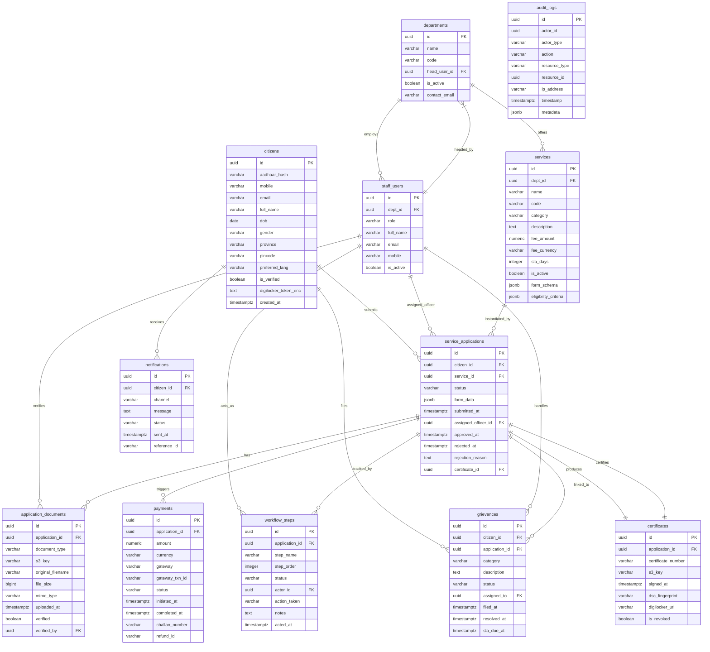

# ERD and Database Schema — Government Services Portal

## 1. Database Design Principles

The Government Services Portal database is designed around the following principles:

**Normalization to 3NF with strategic denormalization.** Core transactional tables (citizens, service_applications, payments) are fully normalized to eliminate update anomalies. High-read reporting tables (audit_logs, notifications) carry select denormalized columns to avoid expensive joins at query time.

**Immutability for audit trails.** Records in `audit_logs`, `workflow_steps`, and `payments` are never updated after creation. Corrections are logged as new entries. This ensures a tamper-evident history required under the Right to Information Act and eGovernance standards.

**JSONB for variable-structure data.** Service form schemas, eligibility criteria, and application form data are stored as validated JSONB columns. This enables flexible service configuration without schema migrations per new service, while retaining PostgreSQL's full JSON query and indexing capabilities.

**Encrypted sensitive columns.** NID numbers are stored only as a bcrypt hash (`aadhaar_hash`). Nepal Document Wallet (NDW) tokens are AES-256-GCM encrypted at the application layer before persistence. S3 keys reference KMS-encrypted objects; the key itself is not sensitive but access is controlled by IAM.

**Soft deletion everywhere.** No citizen, service, or application record is hard-deleted. `is_active`, `is_revoked`, or status transitions handle logical deletion to preserve referential integrity and audit continuity.

**Time-zone awareness.** All `timestamp with time zone` columns store UTC. The application layer converts to `Asia/Kolkata` (IST) for display. This prevents DST-related inconsistencies.

**Row-level security (RLS).** PostgreSQL RLS policies restrict citizen-facing queries so that a row is only accessible when the `citizen_id` matches the authenticated session user. Officer queries are scoped by `dept_id`.

---

## 2. Full Entity-Relationship Diagram



---

## 3. Table Definitions

### 3.1 `citizens`

| Column | Type | Constraints | Index | Description |
|---|---|---|---|---|
| id | UUID | PK, DEFAULT gen_random_uuid() | PRIMARY | Surrogate primary key; used in all foreign key references |
| aadhaar_hash | VARCHAR(64) | NOT NULL, UNIQUE | UNIQUE idx_citizens_aadhaar_hash | bcrypt hash of 12-digit NID number; raw NID never stored |
| mobile | VARCHAR(15) | NOT NULL, UNIQUE | UNIQUE idx_citizens_mobile | 10-digit mobile number with country prefix; used for OTP delivery |
| email | VARCHAR(254) | UNIQUE, NULLABLE | idx_citizens_email | RFC 5321 compliant email; optional for citizens without email |
| full_name | VARCHAR(200) | NOT NULL | — | Full name as pulled from Nepal Document Wallet (NDW) / NID e-KYC |
| dob | DATE | NOT NULL | — | Date of birth in ISO 8601; used for age-based eligibility checks |
| gender | VARCHAR(10) | NOT NULL, CHECK (gender IN ('MALE','FEMALE','OTHER')) | — | Gender as per NID record |
| province | VARCHAR(50) | NOT NULL | idx_citizens_state | Nepali province name; used for department routing |
| pincode | VARCHAR(6) | NOT NULL | — | 6-digit postal code; used for service area eligibility |
| preferred_lang | VARCHAR(10) | NOT NULL, DEFAULT 'en' | — | BCP 47 language tag (e.g. 'hi', 'ta', 'en') for localised notifications |
| is_verified | BOOLEAN | NOT NULL, DEFAULT FALSE | idx_citizens_is_verified | TRUE once NID OTP e-KYC is completed |
| digilocker_token_enc | TEXT | NULLABLE | — | AES-256-GCM encrypted Nepal Document Wallet (NDW) OAuth2 refresh token |
| created_at | TIMESTAMPTZ | NOT NULL, DEFAULT NOW() | idx_citizens_created_at | Account creation timestamp in UTC |

### 3.2 `departments`

| Column | Type | Constraints | Index | Description |
|---|---|---|---|---|
| id | UUID | PK, DEFAULT gen_random_uuid() | PRIMARY | Surrogate primary key |
| name | VARCHAR(200) | NOT NULL | — | Full department name (e.g. "Revenue Department, Tamil Nadu") |
| code | VARCHAR(20) | NOT NULL, UNIQUE | UNIQUE idx_departments_code | Short code used in service codes and API paths (e.g. "REV-TN") |
| head_user_id | UUID | FK → staff_users(id), NULLABLE | idx_departments_head | Staff user who is the department head; nullable during setup |
| is_active | BOOLEAN | NOT NULL, DEFAULT TRUE | idx_departments_is_active | Soft-disable an entire department and all its services |
| contact_email | VARCHAR(254) | NOT NULL | — | Official department email for citizen enquiries |

### 3.3 `services`

| Column | Type | Constraints | Index | Description |
|---|---|---|---|---|
| id | UUID | PK | PRIMARY | Surrogate primary key |
| dept_id | UUID | FK → departments(id), NOT NULL | idx_services_dept | Owning department |
| name | VARCHAR(300) | NOT NULL | — | Human-readable service name |
| code | VARCHAR(30) | NOT NULL, UNIQUE | UNIQUE idx_services_code | Machine-readable code (e.g. "INCOME-CERT-01") |
| category | VARCHAR(100) | NOT NULL | idx_services_category | Category for catalogue browsing (e.g. "Revenue", "Social Welfare") |
| description | TEXT | NOT NULL | GIN idx_services_description_fts (tsvector) | Full description; full-text search index applied |
| fee_amount | NUMERIC(12,2) | NOT NULL, DEFAULT 0.00 | — | Service fee in NPR; 0 for free services |
| fee_currency | VARCHAR(3) | NOT NULL, DEFAULT 'NPR' | — | ISO 4217 currency code |
| sla_days | INTEGER | NOT NULL, DEFAULT 30 | — | Statutory processing days as per province SLA policy |
| is_active | BOOLEAN | NOT NULL, DEFAULT TRUE | idx_services_is_active | Soft-disable without deleting service history |
| form_schema | JSONB | NOT NULL | GIN idx_services_form_schema | JSON Schema defining form fields, validations, and conditional logic |
| eligibility_criteria | JSONB | NOT NULL | GIN idx_services_eligibility | JSONLogic rules for automatic eligibility screening |

### 3.4 `service_applications`

| Column | Type | Constraints | Index | Description |
|---|---|---|---|---|
| id | UUID | PK | PRIMARY | Surrogate primary key |
| citizen_id | UUID | FK → citizens(id), NOT NULL | idx_applications_citizen | Applicant citizen |
| service_id | UUID | FK → services(id), NOT NULL | idx_applications_service | Service being applied for |
| status | VARCHAR(30) | NOT NULL, DEFAULT 'DRAFT' | idx_applications_status | Current state-machine state |
| form_data | JSONB | NOT NULL | GIN idx_applications_form_data | Submitted form data validated against service.form_schema |
| submitted_at | TIMESTAMPTZ | NULLABLE | idx_applications_submitted | Timestamp when citizen formally submitted (state → SUBMITTED) |
| assigned_officer_id | UUID | FK → staff_users(id), NULLABLE | idx_applications_officer | Field officer assigned for review |
| approved_at | TIMESTAMPTZ | NULLABLE | — | Timestamp of approval decision |
| rejected_at | TIMESTAMPTZ | NULLABLE | — | Timestamp of rejection decision |
| rejection_reason | TEXT | NULLABLE | — | Officer-entered reason displayed to citizen |
| certificate_id | UUID | FK → certificates(id), NULLABLE | — | Linked certificate once issued |

### 3.5 `application_documents`

| Column | Type | Constraints | Index | Description |
|---|---|---|---|---|
| id | UUID | PK | PRIMARY | Surrogate primary key |
| application_id | UUID | FK → service_applications(id), NOT NULL | idx_docs_application | Parent application |
| document_type | VARCHAR(100) | NOT NULL | idx_docs_type | Standard document type code (e.g. "INCOME_PROOF", "ID_PROOF") |
| s3_key | VARCHAR(512) | NOT NULL, UNIQUE | UNIQUE idx_docs_s3_key | S3 object key; bucket name stored in app config, not DB |
| original_filename | VARCHAR(255) | NOT NULL | — | Citizen's original file name for display |
| file_size | BIGINT | NOT NULL | — | File size in bytes; used for quota enforcement |
| mime_type | VARCHAR(100) | NOT NULL | — | MIME type validated server-side (e.g. "application/pdf") |
| uploaded_at | TIMESTAMPTZ | NOT NULL, DEFAULT NOW() | idx_docs_uploaded_at | Upload timestamp |
| verified | BOOLEAN | NOT NULL, DEFAULT FALSE | idx_docs_verified | TRUE once officer has verified the document |
| verified_by | UUID | FK → staff_users(id), NULLABLE | — | Officer who performed verification |

### 3.6 `payments`

| Column | Type | Constraints | Index | Description |
|---|---|---|---|---|
| id | UUID | PK | PRIMARY | Surrogate primary key |
| application_id | UUID | FK → service_applications(id), NOT NULL | UNIQUE idx_payments_application (enforces one active payment per application) | Parent application |
| amount | NUMERIC(12,2) | NOT NULL | — | Amount in NPR at time of payment initiation |
| currency | VARCHAR(3) | NOT NULL, DEFAULT 'NPR' | — | ISO 4217 |
| gateway | VARCHAR(20) | NOT NULL | — | Payment gateway used: 'PAYGOV', 'RAZORPAY', 'CHALLAN' |
| gateway_txn_id | VARCHAR(100) | NULLABLE, UNIQUE | UNIQUE idx_payments_gateway_txn | Gateway-assigned transaction identifier |
| status | VARCHAR(20) | NOT NULL, DEFAULT 'INITIATED' | idx_payments_status | Payment state-machine state |
| initiated_at | TIMESTAMPTZ | NOT NULL, DEFAULT NOW() | — | Payment creation timestamp |
| completed_at | TIMESTAMPTZ | NULLABLE | — | Payment success or failure timestamp |
| challan_number | VARCHAR(50) | NULLABLE, UNIQUE | idx_payments_challan | Offline challan reference number |
| refund_id | VARCHAR(100) | NULLABLE | — | Gateway refund ID if refund was processed |

### 3.7 `certificates`

| Column | Type | Constraints | Index | Description |
|---|---|---|---|---|
| id | UUID | PK | PRIMARY | Surrogate primary key |
| application_id | UUID | FK → service_applications(id), NOT NULL, UNIQUE | UNIQUE idx_certs_application | One certificate per approved application |
| certificate_number | VARCHAR(50) | NOT NULL, UNIQUE | UNIQUE idx_certs_number | Human-readable unique certificate number (e.g. "TN-REV-2024-000123") |
| s3_key | VARCHAR(512) | NOT NULL | — | S3 key of the DSC-signed PDF |
| signed_at | TIMESTAMPTZ | NOT NULL | idx_certs_signed_at | DSC signing timestamp |
| dsc_fingerprint | VARCHAR(128) | NOT NULL | — | SHA-256 fingerprint of the DSC certificate used |
| digilocker_uri | VARCHAR(512) | NULLABLE | — | Nepal Document Wallet (NDW) issued document URI for citizen's Nepal Document Wallet (NDW) vault |
| is_revoked | BOOLEAN | NOT NULL, DEFAULT FALSE | idx_certs_is_revoked | TRUE if certificate has been administratively revoked |

### 3.8 `grievances`

| Column | Type | Constraints | Index | Description |
|---|---|---|---|---|
| id | UUID | PK | PRIMARY | Surrogate primary key |
| citizen_id | UUID | FK → citizens(id), NOT NULL | idx_grievances_citizen | Filing citizen |
| application_id | UUID | FK → service_applications(id), NULLABLE | idx_grievances_application | Related application, if any |
| category | VARCHAR(100) | NOT NULL | idx_grievances_category | Grievance category (e.g. "DELAY", "WRONG_REJECTION", "OFFICER_CONDUCT") |
| description | TEXT | NOT NULL | — | Citizen's description of the grievance |
| status | VARCHAR(30) | NOT NULL, DEFAULT 'FILED' | idx_grievances_status | Current state-machine state |
| assigned_to | UUID | FK → staff_users(id), NULLABLE | idx_grievances_assigned | Grievance officer handling the case |
| filed_at | TIMESTAMPTZ | NOT NULL, DEFAULT NOW() | idx_grievances_filed_at | Grievance filing timestamp |
| resolved_at | TIMESTAMPTZ | NULLABLE | — | Resolution timestamp |
| sla_due_at | TIMESTAMPTZ | NOT NULL | idx_grievances_sla_due | SLA deadline; computed as filed_at + grievance policy SLA days |

### 3.9 `workflow_steps`

| Column | Type | Constraints | Index | Description |
|---|---|---|---|---|
| id | UUID | PK | PRIMARY | Surrogate primary key |
| application_id | UUID | FK → service_applications(id), NOT NULL | idx_wf_steps_application | Parent application |
| step_name | VARCHAR(100) | NOT NULL | — | Step identifier (e.g. "DOCUMENT_VERIFICATION", "FIELD_ENQUIRY") |
| step_order | INTEGER | NOT NULL | idx_wf_steps_order | Ordering sequence within the workflow |
| status | VARCHAR(20) | NOT NULL | idx_wf_steps_status | PENDING, IN_PROGRESS, COMPLETED, SKIPPED |
| actor_id | UUID | FK → staff_users(id), NULLABLE | — | Staff user who acted on this step |
| action_taken | VARCHAR(50) | NULLABLE | — | Specific action recorded (e.g. "APPROVED_DOCS", "REQUESTED_RESUBMIT") |
| notes | TEXT | NULLABLE | — | Officer's notes; visible in internal audit trail |
| acted_at | TIMESTAMPTZ | NULLABLE | idx_wf_steps_acted_at | Timestamp when action was taken |

### 3.10 `notifications`

| Column | Type | Constraints | Index | Description |
|---|---|---|---|---|
| id | UUID | PK | PRIMARY | Surrogate primary key |
| citizen_id | UUID | FK → citizens(id), NOT NULL | idx_notifications_citizen | Recipient citizen |
| channel | VARCHAR(20) | NOT NULL | idx_notifications_channel | Delivery channel: 'SMS', 'EMAIL', 'PUSH', 'IN_APP' |
| message | TEXT | NOT NULL | — | Final rendered message content sent to citizen |
| status | VARCHAR(20) | NOT NULL, DEFAULT 'PENDING' | idx_notifications_status | PENDING, SENT, DELIVERED, FAILED |
| sent_at | TIMESTAMPTZ | NULLABLE | idx_notifications_sent_at | Timestamp of successful dispatch to gateway |
| reference_id | VARCHAR(100) | NULLABLE | idx_notifications_reference | Gateway message ID for delivery tracking |

### 3.11 `audit_logs`

| Column | Type | Constraints | Index | Description |
|---|---|---|---|---|
| id | UUID | PK | PRIMARY | Surrogate primary key |
| actor_id | UUID | NOT NULL | idx_audit_actor | ID of the actor (citizen, staff, system) |
| actor_type | VARCHAR(20) | NOT NULL | idx_audit_actor_type | CITIZEN, STAFF, SYSTEM, ADMIN |
| action | VARCHAR(100) | NOT NULL | idx_audit_action | Action performed (e.g. "APPLICATION_SUBMITTED", "PAYMENT_INITIATED") |
| resource_type | VARCHAR(50) | NOT NULL | idx_audit_resource_type | Resource type acted upon (e.g. "ServiceApplication", "Payment") |
| resource_id | UUID | NOT NULL | idx_audit_resource_id | PK of the resource acted upon |
| ip_address | VARCHAR(45) | NOT NULL | — | IPv4 or IPv6 address of the request |
| timestamp | TIMESTAMPTZ | NOT NULL, DEFAULT NOW() | idx_audit_timestamp | UTC timestamp of the action |
| metadata | JSONB | NULLABLE | GIN idx_audit_metadata | Additional context (user-agent, changed fields, old/new values) |

---

## 4. Database Indexes

| Table | Index Name | Columns | Type | Rationale |
|---|---|---|---|---|
| citizens | idx_citizens_aadhaar_hash | aadhaar_hash | UNIQUE B-TREE | Login lookup by hashed NID |
| citizens | idx_citizens_mobile | mobile | UNIQUE B-TREE | OTP lookup by mobile number |
| citizens | idx_citizens_email | email | B-TREE | Email login and notification lookup |
| citizens | idx_citizens_state | province | B-TREE | Geographic filtering for reports |
| citizens | idx_citizens_is_verified | is_verified | PARTIAL (WHERE is_verified = FALSE) | Quickly find unverified accounts for cleanup |
| citizens | idx_citizens_created_at | created_at | B-TREE | Time-range queries for registration reports |
| departments | idx_departments_code | code | UNIQUE B-TREE | API routing by department code |
| departments | idx_departments_is_active | is_active | PARTIAL (WHERE is_active = TRUE) | List active departments only |
| services | idx_services_dept | dept_id | B-TREE | Fetch services by department |
| services | idx_services_code | code | UNIQUE B-TREE | API routing by service code |
| services | idx_services_category | category | B-TREE | Browse-by-category queries |
| services | idx_services_description_fts | to_tsvector('english', description) | GIN | Full-text search on service catalogue |
| services | idx_services_is_active | is_active | PARTIAL (WHERE is_active = TRUE) | Filter only live services |
| services | idx_services_form_schema | form_schema | GIN (jsonb_path_ops) | JSONB path queries on form schema |
| service_applications | idx_applications_citizen | citizen_id | B-TREE | Citizen's own application list |
| service_applications | idx_applications_service | service_id | B-TREE | All applications for a service |
| service_applications | idx_applications_status | status | B-TREE | Queue filtering by status |
| service_applications | idx_applications_officer | assigned_officer_id | B-TREE | Officer workqueue |
| service_applications | idx_applications_submitted | submitted_at | B-TREE | SLA monitoring queries |
| service_applications | idx_applications_citizen_service | (citizen_id, service_id) | UNIQUE PARTIAL (WHERE status NOT IN ('REJECTED','ARCHIVED')) | Prevent duplicate active applications |
| application_documents | idx_docs_application | application_id | B-TREE | Fetch all documents for an application |
| application_documents | idx_docs_s3_key | s3_key | UNIQUE B-TREE | S3 key integrity check |
| application_documents | idx_docs_verified | verified | PARTIAL (WHERE verified = FALSE) | Officer verification queue |
| payments | idx_payments_application | application_id | UNIQUE B-TREE | One active payment per application |
| payments | idx_payments_gateway_txn | gateway_txn_id | UNIQUE B-TREE | Webhook idempotency lookup |
| payments | idx_payments_status | status | B-TREE | Payment reconciliation queries |
| payments | idx_payments_challan | challan_number | UNIQUE B-TREE | Offline challan verification |
| certificates | idx_certs_application | application_id | UNIQUE B-TREE | Certificate fetch by application |
| certificates | idx_certs_number | certificate_number | UNIQUE B-TREE | Public certificate verification by number |
| certificates | idx_certs_signed_at | signed_at | B-TREE | Issuance reports by date range |
| certificates | idx_certs_is_revoked | is_revoked | PARTIAL (WHERE is_revoked = TRUE) | Revocation list queries |
| grievances | idx_grievances_citizen | citizen_id | B-TREE | Citizen's own grievances |
| grievances | idx_grievances_status | status | B-TREE | Status-based queue management |
| grievances | idx_grievances_sla_due | sla_due_at | B-TREE | SLA breach detection (scheduled job) |
| grievances | idx_grievances_assigned | assigned_to | B-TREE | Officer grievance workqueue |
| workflow_steps | idx_wf_steps_application | application_id | B-TREE | Fetch all steps for an application |
| workflow_steps | idx_wf_steps_status | status | B-TREE | Pending step queue |
| notifications | idx_notifications_citizen | citizen_id | B-TREE | Citizen notification history |
| notifications | idx_notifications_status | status | PARTIAL (WHERE status = 'PENDING') | Pending notification dispatch queue |
| notifications | idx_notifications_sent_at | sent_at | B-TREE | Time-range delivery reports |
| audit_logs | idx_audit_actor | actor_id | B-TREE | Actor-based audit trail queries |
| audit_logs | idx_audit_timestamp | timestamp | B-TREE | Chronological audit log browsing |
| audit_logs | idx_audit_resource_id | resource_id | B-TREE | All audit entries for a specific resource |
| audit_logs | idx_audit_action | action | B-TREE | Filter by action type in security reports |

---

## 5. Partitioning Strategy

### 5.1 `audit_logs` — Range Partitioning by `timestamp`

`audit_logs` is the highest-volume table in the system. Government compliance requires audit retention for 7 years; unrestricted table size would make routine queries slow and maintenance difficult.

```sql
CREATE TABLE audit_logs (
    id UUID NOT NULL DEFAULT gen_random_uuid(),
    actor_id UUID NOT NULL,
    actor_type VARCHAR(20) NOT NULL,
    action VARCHAR(100) NOT NULL,
    resource_type VARCHAR(50) NOT NULL,
    resource_id UUID NOT NULL,
    ip_address VARCHAR(45) NOT NULL,
    timestamp TIMESTAMPTZ NOT NULL DEFAULT NOW(),
    metadata JSONB
) PARTITION BY RANGE (timestamp);

-- Create quarterly partitions for the current year
CREATE TABLE audit_logs_2024_q1 PARTITION OF audit_logs
    FOR VALUES FROM ('2024-01-01') TO ('2024-04-01');

CREATE TABLE audit_logs_2024_q2 PARTITION OF audit_logs
    FOR VALUES FROM ('2024-04-01') TO ('2024-07-01');

CREATE TABLE audit_logs_2024_q3 PARTITION OF audit_logs
    FOR VALUES FROM ('2024-07-01') TO ('2024-10-01');

CREATE TABLE audit_logs_2024_q4 PARTITION OF audit_logs
    FOR VALUES FROM ('2024-10-01') TO ('2025-01-01');
```

A Django management command `create_next_quarter_partition` runs on the first day of each quarter via a Celery beat schedule. Old partitions (older than 7 years) are detached and archived to S3 Glacier before DROP. Indexes are created per partition to ensure they remain small and efficient.

### 5.2 `notifications` — Range Partitioning by `sent_at`

`notifications` accumulates millions of rows over time. Citizens never browse notifications older than 6 months; old data is legally required for dispute resolution but can be cold-stored.

```sql
CREATE TABLE notifications (
    id UUID NOT NULL DEFAULT gen_random_uuid(),
    citizen_id UUID NOT NULL,
    channel VARCHAR(20) NOT NULL,
    message TEXT NOT NULL,
    status VARCHAR(20) NOT NULL DEFAULT 'PENDING',
    sent_at TIMESTAMPTZ,
    reference_id VARCHAR(100)
) PARTITION BY RANGE (sent_at);
```

Monthly partitions are created. Partitions older than 6 months are moved to a read-replica-only tablespace. Partitions older than 2 years are exported to Parquet on S3 and dropped from the live database. The Celery task `archive_old_notifications` runs monthly.

---

## 6. Migration Strategy

### 6.1 Django Migration Approach

All schema changes are managed exclusively through Django migrations using `manage.py makemigrations` and `manage.py migrate`. No raw SQL DDL is executed outside of migration files. Each migration file is reviewed in pull requests before merging.

**Migration file naming convention:** Each migration carries a descriptive name:
```
0001_initial_schema.py
0002_add_citizens_preferred_lang.py
0003_add_services_eligibility_criteria.py
```

**Data migrations** are separated from schema migrations. A schema migration adds a column; a subsequent data migration populates it; a final migration (in the next release) may add NOT NULL constraints after data is backfilled.

### 6.2 Zero-Downtime Migrations

Zero-downtime is achieved by following the expand-contract pattern:

1. **Expand phase (Release N):** Add new nullable column or new table. Django Migrations run before new code deploys. Old code is unaware of the new column and ignores it.
2. **Migrate phase (Release N):** Backfill data via a Celery task or management command. Run `CREATE INDEX CONCURRENTLY` to avoid table locks.
3. **Contract phase (Release N+1):** Remove old column or old index. Django migration runs after new code deploys and old pods are drained.

**Rules enforced in CI:**
- Never run `ALTER TABLE ... SET NOT NULL` on a populated column without a default in a single step.
- Always use `CREATE INDEX CONCURRENTLY` — enforced by a custom migration linter.
- Never rename columns directly; use expand-contract (add new column, backfill, migrate reads/writes, drop old column).
- `manage.py migrate --plan` is executed in CI to detect destructive operations.

### 6.3 RDS Upgrade Strategy

PostgreSQL minor version upgrades (e.g., 15.3 → 15.5) are applied as in-place RDS updates during maintenance windows. Major version upgrades use Blue/Green Deployment on RDS to allow pre-validation on the new engine version before cutover.

---

## 7. Operational Policy Addendum

### 7.1 Citizen Data Privacy Policy

All citizen PII (name, date of birth, gender, mobile, email) is classified as sensitive personal data under the Digital Personal Data Protection Act, 2023. NID numbers are never stored in plaintext; only a bcrypt hash (cost factor 12) is persisted. Nepal Document Wallet (NDW) OAuth tokens are encrypted with AES-256-GCM using a KMS-managed key before database storage. The `citizens` table has PostgreSQL row-level security enabled: application service accounts can only SELECT rows matching the authenticated citizen's ID. Bulk export of the citizens table requires Super Admin approval logged in `audit_logs`. Data retention is 7 years post account closure, after which all PII columns are overwritten with nulls and the record is flagged `is_deleted = TRUE`. Backup exports to S3 are encrypted with SSE-KMS.

### 7.2 Service Delivery SLA Policy

Every service record carries an `sla_days` value derived from the province's eGovernance mandate. The `service_applications.submitted_at` timestamp starts the SLA clock. A Celery beat task `check_sla_breaches` runs every 6 hours: it queries applications in statuses UNDER_REVIEW or CLARIFICATION_REQUESTED where `submitted_at + sla_days` is within 2 days, triggering an escalation notification to the department head. Applications that breach SLA are flagged and appear in the Super Admin SLA breach dashboard. Breach data is included in monthly performance reports submitted to the province IT department. Field officers who consistently breach SLA are flagged in the HR integration module.

### 7.3 Fee and Payment Policy

Service fees stored in `services.fee_amount` are set by department administrators and reviewed quarterly. Fee changes are effective immediately for new applications; in-flight applications are charged at the fee at time of submission (captured in `payments.amount`). Payments are idempotent: a unique partial index on `payments(application_id)` where `status NOT IN ('FAILED', 'REFUNDED')` prevents double-charging. Refunds are initiated only by Super Admin or Auditor roles. Offline challan payments are reconciled within 3 working days by treasury staff. All payment events are written to `audit_logs` with full metadata including gateway response.

### 7.4 System Availability Policy

The production database runs on AWS RDS PostgreSQL 15 with Multi-AZ enabled. Automated daily backups are retained for 35 days; weekly snapshots are retained for 12 months. Point-in-time recovery (PITR) is enabled with a recovery objective of 5 minutes (RPO). The read replica in the same region handles all reporting queries and audit log reads. Redis ElastiCache (cluster mode) provides sub-5ms session and queue access with in-transit and at-rest encryption. Database connection pooling via PgBouncer (transaction mode, pool size 50) prevents connection exhaustion under load. Planned maintenance (index rebuilds, vacuum, statistics updates) is scheduled in the 02:00–04:00 IST window on Sundays.
