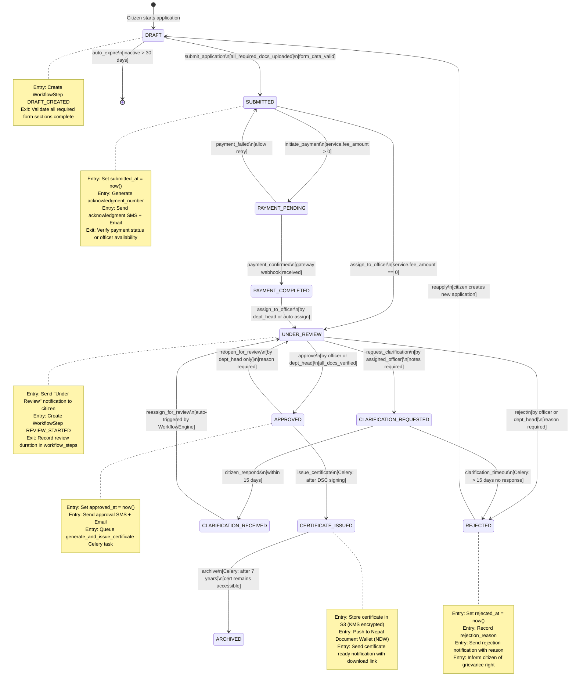
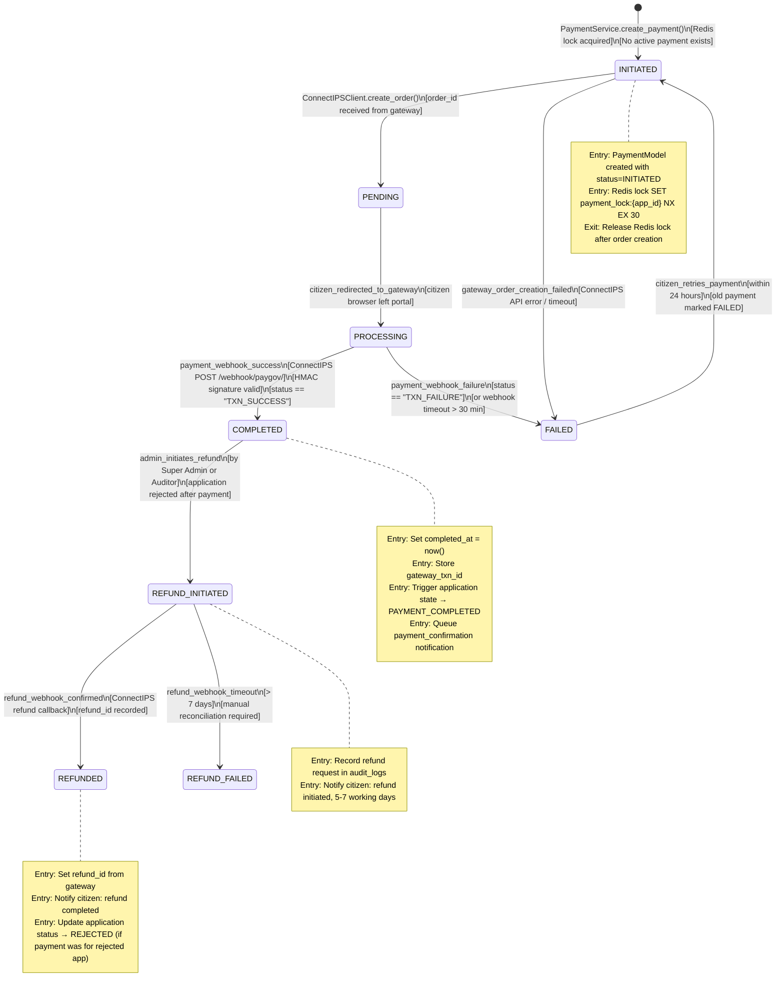
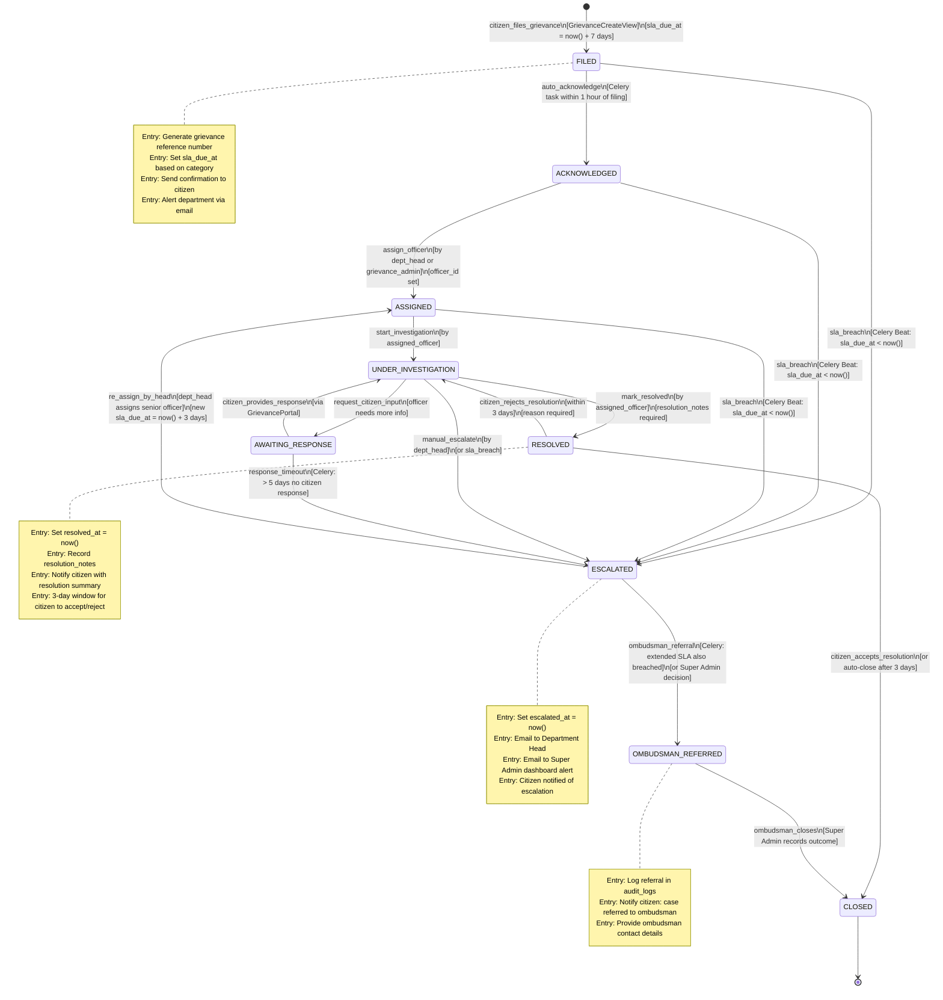

# State Machine Diagram — Government Services Portal

## 1. Overview of State Machine Approach in Django

The Government Services Portal uses a **custom Django state machine** built on top of Django model fields and Python class-level transition definitions. This approach was chosen over third-party libraries (django-fsm, transitions) to maintain full control over transition validation, signal emission, and audit logging within atomic database transactions.

**Core design decisions:**

- **Provinces as string constants on the model:** Each stateful model defines a `class Status` inner class with string constants (e.g., `DRAFT = 'DRAFT'`). The database column is a `CharField` with `choices` defined from these constants.
- **Transitions validated by `WorkflowEngine`:** No code outside `WorkflowEngine` may directly set a status field. A custom `StateProtectionMixin` raises `IllegalStateTransitionError` if `.status =` is assigned outside a transition.
- **Atomic transitions:** Every `WorkflowEngine.transition()` call runs inside `transaction.atomic()`. The state update, workflow step creation, and signal emission all succeed or all roll back together.
- **Signal-driven side effects:** `application_state_changed`, `payment_state_changed`, and `grievance_state_changed` Django signals carry `old_state` and `new_state` keyword arguments. Receivers (notification_service, audit_logger, certificate_generator) are registered in each app's `ready()` method.
- **Transition guards:** Each transition can have a list of guard functions that receive the model instance and actor. If any guard returns `False`, the transition is rejected with a descriptive error.

---

## 2. Application Lifecycle State Machine

### State Descriptions

| State | Description |
|---|---|
| **DRAFT** | Citizen has started the form but not yet submitted. Auto-deleted after 30 days of inactivity. |
| **SUBMITTED** | Citizen has submitted the complete form and documents. Acknowledgment number issued. |
| **PAYMENT_PENDING** | For paid services: application awaits payment. For free services: this province is skipped automatically. |
| **PAYMENT_COMPLETED** | Payment confirmed by gateway webhook. Application enters the officer review queue. |
| **UNDER_REVIEW** | Assigned field officer is actively reviewing the application and documents. |
| **CLARIFICATION_REQUESTED** | Officer has requested additional information or documents from the citizen. SLA timer paused. |
| **CLARIFICATION_RECEIVED** | Citizen has responded to the clarification request. Application returns to officer review. |
| **APPROVED** | Department Head or authorized officer has approved the application. Certificate generation queued. |
| **REJECTED** | Application has been rejected with a documented reason. Citizen may appeal via grievance. |
| **CERTIFICATE_ISSUED** | Certificate generated, DSC-signed, uploaded to S3, and pushed to Nepal Document Wallet (NDW). |
| **ARCHIVED** | Application and associated data archived to cold storage after retention period. |



---

## 3. Payment State Machine



---

## 4. Grievance State Machine



---

## 5. Document Verification State Machine

```mermaid
stateDiagram-v2
    [*] --> UPLOADED : citizen_uploads_document\n[DocumentUploadView]\n[S3 upload successful]

    UPLOADED --> PENDING_VERIFICATION : malware_scan_clean\n[Celery: scan_document_for_malware]\n[ScanResult.clean == True]
    UPLOADED --> REJECTED : malware_detected\n[Celery: scan_document_for_malware]\n[ScanResult.clean == False]\n[File deleted from S3]

    PENDING_VERIFICATION --> VERIFIED : officer_verifies\n[DocumentVerifyView]\n[verified_by = officer.id]
    PENDING_VERIFICATION --> REJECTED : officer_rejects\n[with rejection_reason]
    PENDING_VERIFICATION --> RESUBMIT_REQUESTED : officer_requests_resubmit\n[different doc needed]\n[reason provided]

    REJECTED --> [*]

    RESUBMIT_REQUESTED --> UPLOADED : citizen_resubmits\n[new file uploaded]\n[old document record replaced]

    VERIFIED --> [*]

    note right of UPLOADED
        Entry: ApplicationDocumentModel created
        Entry: Queue scan_document_for_malware Celery task
        Entry: Log upload in audit_logs
    end note

    note right of PENDING_VERIFICATION
        Entry: Notify officer: new document ready for review
        Entry: Document appears in officer's review queue
    end note

    note right of VERIFIED
        Entry: verified = True; verified_by = officer.id
        Entry: Check if all application docs are verified
        Entry: If all verified → trigger document_all_verified signal
    end note

    note right of RESUBMIT_REQUESTED
        Entry: Notify citizen: document rejected with reason
        Entry: Document count in application decremented
        Entry: Application status stays UNDER_REVIEW
    end note
```



---

## 6. Django Implementation

The state machine is implemented as a combination of a custom `StateField`, a `StateProtectionMixin`, and the `WorkflowEngine` service class.

```python
# state_machine/fields.py
from django.db import models
from django.core.exceptions import ValidationError


class IllegalStateTransitionError(Exception):
    """Raised when a transition is not permitted by the state machine."""
    pass


class StateProtectionMixin:
    """
    Mixin that prevents direct assignment to protected state fields.
    Models inheriting this mixin must list protected fields in _protected_state_fields.
    """
    _protected_state_fields: list[str] = []
    _transition_in_progress: bool = False

    def __setattr__(self, name: str, value):
        if (
            name in self.__class__._protected_state_fields
            and not self._transition_in_progress
            and self.pk is not None  # Allow setting during initial object creation
        ):
            raise IllegalStateTransitionError(
                f"Direct assignment to '{name}' is not allowed. "
                f"Use WorkflowEngine.transition() to change state."
            )
        super().__setattr__(name, value)


# applications/models.py
from django.db import models
from state_machine.fields import StateProtectionMixin


class ServiceApplication(StateProtectionMixin, models.Model):
    _protected_state_fields = ['status']

    class Status(models.TextChoices):
        DRAFT = 'DRAFT', 'Draft'
        SUBMITTED = 'SUBMITTED', 'Submitted'
        PAYMENT_PENDING = 'PAYMENT_PENDING', 'Payment Pending'
        PAYMENT_COMPLETED = 'PAYMENT_COMPLETED', 'Payment Completed'
        UNDER_REVIEW = 'UNDER_REVIEW', 'Under Review'
        CLARIFICATION_REQUESTED = 'CLARIFICATION_REQUESTED', 'Clarification Requested'
        CLARIFICATION_RECEIVED = 'CLARIFICATION_RECEIVED', 'Clarification Received'
        APPROVED = 'APPROVED', 'Approved'
        REJECTED = 'REJECTED', 'Rejected'
        CERTIFICATE_ISSUED = 'CERTIFICATE_ISSUED', 'Certificate Issued'
        ARCHIVED = 'ARCHIVED', 'Archived'

    status = models.CharField(
        max_length=30,
        choices=Status.choices,
        default=Status.DRAFT,
        db_index=True,
    )
    # ... other fields


# state_machine/engine.py
from django.db import transaction
from django.dispatch import Signal
from applications.models import ServiceApplication
from workflow_steps.models import WorkflowStep

application_state_changed = Signal()  # provides: instance, old_state, new_state, actor_id


class WorkflowEngine:

    VALID_TRANSITIONS: dict[tuple[str, str], str] = {
        ('DRAFT', 'submit_application'): 'SUBMITTED',
        ('SUBMITTED', 'initiate_payment'): 'PAYMENT_PENDING',
        ('SUBMITTED', 'assign_to_officer'): 'UNDER_REVIEW',
        ('PAYMENT_PENDING', 'payment_confirmed'): 'PAYMENT_COMPLETED',
        ('PAYMENT_PENDING', 'payment_failed'): 'SUBMITTED',
        ('PAYMENT_COMPLETED', 'assign_to_officer'): 'UNDER_REVIEW',
        ('UNDER_REVIEW', 'request_clarification'): 'CLARIFICATION_REQUESTED',
        ('UNDER_REVIEW', 'approve'): 'APPROVED',
        ('UNDER_REVIEW', 'reject'): 'REJECTED',
        ('CLARIFICATION_REQUESTED', 'citizen_responds'): 'CLARIFICATION_RECEIVED',
        ('CLARIFICATION_REQUESTED', 'clarification_timeout'): 'REJECTED',
        ('CLARIFICATION_RECEIVED', 'reassign_for_review'): 'UNDER_REVIEW',
        ('APPROVED', 'issue_certificate'): 'CERTIFICATE_ISSUED',
        ('APPROVED', 'reopen_for_review'): 'UNDER_REVIEW',
        ('CERTIFICATE_ISSUED', 'archive'): 'ARCHIVED',
    }

    TRANSITION_GUARDS: dict[tuple[str, str], list] = {
        ('DRAFT', 'submit_application'): [
            'guard_all_required_docs_uploaded',
            'guard_form_data_valid',
        ],
        ('UNDER_REVIEW', 'approve'): [
            'guard_all_documents_verified',
        ],
    }

    @transaction.atomic
    def transition(
        self,
        application: ServiceApplication,
        trigger: str,
        actor_id,
        notes: str = '',
    ) -> ServiceApplication:
        old_state = application.status
        key = (old_state, trigger)

        if key not in self.VALID_TRANSITIONS:
            raise IllegalStateTransitionError(
                f"Transition '{trigger}' from state '{old_state}' is not valid."
            )

        # Run guards
        for guard_name in self.TRANSITION_GUARDS.get(key, []):
            guard_fn = getattr(self, guard_name)
            if not guard_fn(application):
                raise IllegalStateTransitionError(
                    f"Guard '{guard_name}' prevented transition '{trigger}'."
                )

        new_state = self.VALID_TRANSITIONS[key]

        # Perform state update bypassing StateProtectionMixin
        application._transition_in_progress = True
        application.status = new_state
        application._transition_in_progress = False
        self._apply_entry_actions(application, new_state, actor_id)
        application.save(update_fields=['status', *self._get_entry_action_fields(new_state)])

        # Record workflow step
        WorkflowStep.objects.create(
            application=application,
            step_name=trigger.upper(),
            step_order=self._get_step_order(application),
            status='COMPLETED',
            actor_id=actor_id,
            action_taken=trigger,
            notes=notes,
        )

        # Fire signal for side-effects (audit log, notifications, certificate generation)
        application_state_changed.send(
            sender=ServiceApplication,
            instance=application,
            old_state=old_state,
            new_state=new_state,
            actor_id=actor_id,
            notes=notes,
        )

        return application

    def _apply_entry_actions(self, application, new_state, actor_id):
        from django.utils import timezone
        if new_state == 'SUBMITTED':
            application.submitted_at = timezone.now()
        elif new_state == 'APPROVED':
            application.approved_at = timezone.now()
        elif new_state == 'REJECTED':
            application.rejected_at = timezone.now()

    def _get_entry_action_fields(self, new_state) -> list[str]:
        field_map = {
            'SUBMITTED': ['submitted_at'],
            'APPROVED': ['approved_at'],
            'REJECTED': ['rejected_at'],
        }
        return field_map.get(new_state, [])

    def guard_all_required_docs_uploaded(self, application) -> bool:
        required = set(application.service.get_required_documents())
        uploaded = set(
            application.documents.values_list('document_type', flat=True)
        )
        return required.issubset(uploaded)

    def guard_all_documents_verified(self, application) -> bool:
        return not application.documents.filter(verified=False).exists()

    def get_available_triggers(self, application, actor) -> list[str]:
        return [
            trigger for (province, trigger) in self.VALID_TRANSITIONS.keys()
            if province == application.status and actor.can_use_trigger(trigger)
        ]
```

---

## 7. State Transition Event Table

| From State | To State | Trigger | Actor | Side Effects | Validation Guards |
|---|---|---|---|---|---|
| DRAFT | SUBMITTED | submit_application | Citizen | Set submitted_at; generate acknowledgment number; send SMS/email; create SUBMISSION workflow step | All required documents uploaded; all form sections complete |
| SUBMITTED | PAYMENT_PENDING | initiate_payment | System (auto) | Create Payment record with INITIATED status | service.fee_amount > 0 |
| SUBMITTED | UNDER_REVIEW | assign_to_officer | Dept Head / System | Create ASSIGNMENT workflow step; notify citizen and officer | service.fee_amount == 0 (free service) |
| PAYMENT_PENDING | PAYMENT_COMPLETED | payment_confirmed | System (ConnectIPS webhook) | Set payment.completed_at; notify citizen with receipt | HMAC signature valid; not duplicate txnId |
| PAYMENT_PENDING | SUBMITTED | payment_failed | System (ConnectIPS webhook) | Mark payment FAILED; allow new payment initiation | — |
| PAYMENT_COMPLETED | UNDER_REVIEW | assign_to_officer | Dept Head / Auto-assign | Create ASSIGNMENT workflow step; notify officer of new application | — |
| UNDER_REVIEW | CLARIFICATION_REQUESTED | request_clarification | Field Officer | Pause SLA timer; notify citizen; create CLARIFICATION workflow step | Notes / clarification question required |
| UNDER_REVIEW | APPROVED | approve | Field Officer / Dept Head | Set approved_at; queue certificate generation; notify citizen | All documents must be verified |
| UNDER_REVIEW | REJECTED | reject | Field Officer / Dept Head | Set rejected_at; record rejection_reason; notify citizen with reason and grievance right | Rejection reason required |
| CLARIFICATION_REQUESTED | CLARIFICATION_RECEIVED | citizen_responds | Citizen | Resume SLA timer; notify officer; auto-trigger reassign_for_review | Response data attached |
| CLARIFICATION_REQUESTED | REJECTED | clarification_timeout | Celery Beat | Set rejected_at; reason = "No clarification received within 15 days"; notify citizen | sla_due_at + 15 days < now() |
| CLARIFICATION_RECEIVED | UNDER_REVIEW | reassign_for_review | System (auto) | Notify assigned officer of response | — |
| APPROVED | CERTIFICATE_ISSUED | issue_certificate | System (Celery) | Generate PDF; DSC sign; upload to S3; push to Nepal Document Wallet (NDW); notify citizen | DSC signing successful; S3 upload successful |
| APPROVED | UNDER_REVIEW | reopen_for_review | Dept Head only | Create REOPEN workflow step with reason | Reason required; Dept Head role only |
| CERTIFICATE_ISSUED | ARCHIVED | archive | System (Celery Beat) | Move documents to cold storage; retain certificate reference | Retention period (7 years) elapsed |

---

## 8. Operational Policy Addendum

### 8.1 State Machine Change Control Policy

The `VALID_TRANSITIONS` dictionary in `WorkflowEngine` is the authoritative definition of all permitted state changes. Any addition, modification, or removal of a transition requires: (1) an updated state diagram in this document, (2) an updated `State Transition Event Table` above, (3) a migration to handle any existing applications in affected states, and (4) sign-off from the Product Owner and Tech Lead. New transitions cannot be deployed without corresponding unit tests covering the guard functions and side effects.

### 8.2 SLA Timer Management Policy

The SLA clock starts at `submitted_at` and runs continuously except during the `CLARIFICATION_REQUESTED` province. When the application enters `CLARIFICATION_REQUESTED`, the elapsed time is recorded in `workflow_steps`. When it transitions back to `UNDER_REVIEW` via `citizen_responds`, the remaining SLA time is computed as `original_sla_deadline - elapsed_time_before_clarification`. This "paused" SLA is stored in a computed field updated by the WorkflowEngine. Celery Beat tasks must account for paused SLAs when identifying breaches.

### 8.3 Audit Trail for State Transitions Policy

Every state transition creates an immutable `WorkflowStep` record and fires the `application_state_changed` signal which writes to `audit_logs`. Neither record may be updated or deleted after creation. The audit log entry includes: `old_state`, `new_state`, `trigger`, `actor_id`, `actor_type`, `ip_address`, and a `metadata` JSON blob containing the full request context. Auditors can reconstruct the complete lifecycle of any application from the `workflow_steps` and `audit_logs` tables alone.

### 8.4 Error Recovery for Failed Transitions Policy

If a `WorkflowEngine.transition()` call fails midway (e.g., database error after status update but before signal dispatch), the `transaction.atomic()` block rolls back all changes. The application remains in its previous state. The calling view receives the exception, logs it via Sentry, and returns `HTTP 500` to the client with a generic error message. Celery tasks that trigger transitions implement retry logic with exponential backoff. If a Celery task exhausts all retries, the application status is not changed and a dead-letter entry is created for manual remediation by Super Admin.
