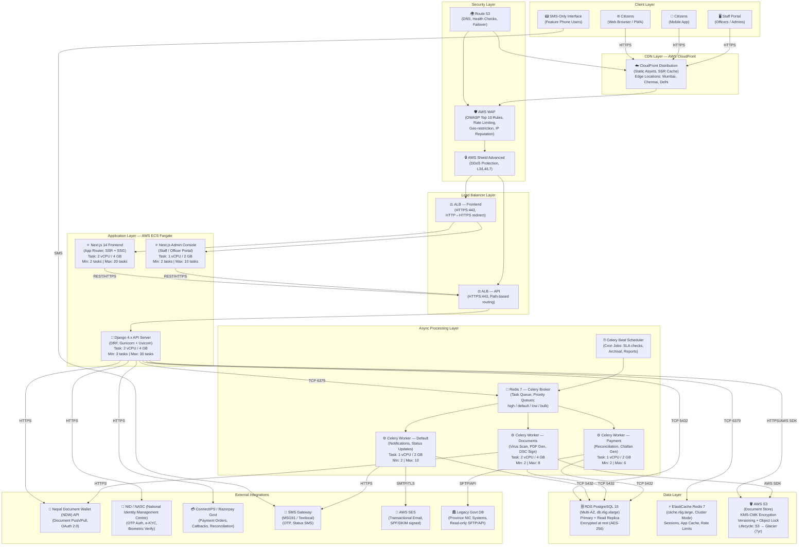
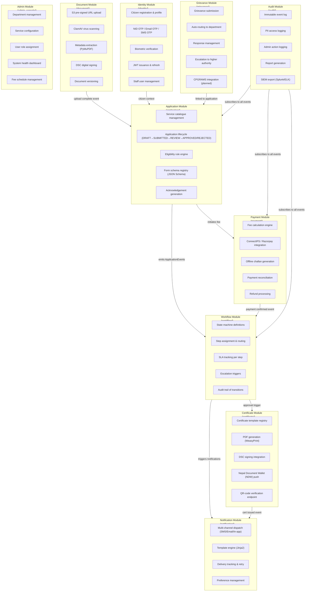

# Architecture Diagram — Government Services Portal

## 1. Overview

The Government Services Portal is designed as a **modular monolith with asynchronous processing** — a deliberate architectural choice that balances operational simplicity with the scalability needs of a public-sector platform serving millions of citizens. Rather than distributing the domain across independently deployable microservices from day one, the backend is structured as a single deployable Django application organised into tightly bounded modules (Identity, Application, Payment, Document, Notification, Workflow, Audit, Certificate, Grievance, Admin). Module boundaries are enforced through Python package conventions and Django app isolation: no cross-module direct model imports are permitted; inter-module communication is mediated through well-defined service interfaces or Django signals.

Asynchronous processing is handled by Celery workers backed by Redis 7, which decouple time-consuming operations (document virus scanning, PDF generation, DSC signing, payment reconciliation, notification delivery, Nepal Document Wallet (NDW) synchronisation) from the synchronous HTTP request cycle. This ensures that API response times remain under SLA thresholds even when downstream integrations (NID NASC (National Identity Management Centre), ConnectIPS, Nepal Document Wallet (NDW)) experience latency.

The frontend is a Next.js 14 App Router application compiled to static assets and server-side rendered pages, served via AWS CloudFront CDN. A separate Admin Console (also Next.js) serves Field Officers, Department Heads, Super Admins, and Auditors through an isolated deployment.

The entire platform runs on AWS, using managed services (RDS, ElastiCache, S3, ECS Fargate, CloudFront, Route 53, WAF, Shield) to reduce operational burden on the engineering team and maximise availability guarantees.

---

## 2. High-Level Architecture Diagram

---

## 3. Domain Architecture

The application is divided into ten bounded modules. Each module owns its models, services, serializers, and API views. No module directly imports models from another module; cross-module reads use published service interfaces.

---

## 4. Component Interaction Matrix

| Source Component | Target Component | Interaction Type | Protocol | Direction |
|---|---|---|---|---|
| Next.js Frontend | Django API | REST API calls | HTTPS/JSON | →  |
| Django API | PostgreSQL RDS | ORM queries | TCP 5432 | ↔ |
| Django API | ElastiCache Redis | Cache get/set, session store | TCP 6379 | ↔ |
| Django API | Redis Broker | Enqueue Celery tasks | TCP 6379 | → |
| Django API | AWS S3 | Pre-signed URL generation, object metadata | HTTPS (AWS SDK) | ↔ |
| Django API | NID NASC (National Identity Management Centre) | OTP initiate, OTP verify | HTTPS/JSON | → |
| Django API | ConnectIPS | Create order, verify signature | HTTPS/JSON | ↔ |
| Django API | Nepal Document Wallet (NDW) | OAuth token exchange, document push | HTTPS/JSON | ↔ |
| Celery Worker | PostgreSQL RDS | Task result persistence, model updates | TCP 5432 | ↔ |
| Celery Worker | AWS S3 | Document read, PDF write, signed cert upload | HTTPS (AWS SDK) | ↔ |
| Celery Worker | SMS Gateway | OTP and status SMS delivery | HTTPS/JSON | → |
| Celery Worker | AWS SES | Transactional email dispatch | SMTP/TLS or HTTPS API | → |
| Celery Worker | Nepal Document Wallet (NDW) API | Issued certificate push | HTTPS/JSON | → |
| Celery Beat | Redis Broker | Scheduled task publication | TCP 6379 | → |
| Admin Console (Next.js) | Django API | Admin REST API calls | HTTPS/JSON | → |
| Django API | Legacy Govt DB | Citizen data pre-fill lookup | SFTP / REST (read-only) | → |
| CloudFront | ALB Frontend | Origin fetch (cache miss) | HTTPS | → |
| WAF | ALB Frontend / API | Filtered traffic forwarding | HTTPS | → |

---

## 5. Architecture Decisions

| # | Decision | Rationale | Alternatives Considered |
|---|---|---|---|
| AD-001 | **Modular monolith over microservices** | Reduces operational complexity, eliminates distributed transaction problems (saga pattern), enables easier refactoring. Team size and maturity justify this choice at initial scale. | Microservices (rejected: premature complexity), serverless functions (rejected: cold start latency unacceptable for citizen-facing flows) |
| AD-002 | **Django DRF as API backend** | Strong ORM, mature ecosystem, government sector precedent (NIC uses Django widely), built-in admin, excellent security defaults (CSRF, SQL injection protection). Python 3.11 performance improvements are significant. | FastAPI (rejected: less mature ecosystem for admin and auth), Spring Boot (rejected: team expertise, slower iteration) |
| AD-003 | **Next.js 14 App Router with TypeScript** | SSR support for accessibility and SEO, incremental static regeneration for service catalogue, strong TypeScript tooling for frontend correctness, WCAG 2.1 AA compliance easier with server components. | Create React App (rejected: no SSR), Nuxt.js (rejected: smaller talent pool in Nepal), plain Django templates (rejected: poor UX for complex forms) |
| AD-004 | **PostgreSQL 15 as primary database** | ACID compliance for financial and civic records, JSONB for flexible form data, Row Level Security for tenant isolation, excellent full-text search for service catalogue, strong government sector audit trail via triggers. | MySQL (rejected: weaker JSONB, no RLS), DynamoDB (rejected: eventual consistency unacceptable for payments), Oracle (rejected: cost, vendor lock-in) |
| AD-005 | **Redis 7 for cache, sessions, and Celery broker** | Single technology for three purposes reduces ops overhead. Redis Cluster for HA. Keyspace notifications for session invalidation. Sorted sets for rate limiting. Stream support for audit events. | RabbitMQ (rejected: separate system for broker), Memcached (rejected: no persistence, no pub/sub), Kafka (rejected: operational overhead, overkill at this scale) |
| AD-006 | **AWS S3 + KMS-CMK for document storage** | MEITY-approved cloud vendor, server-side encryption with customer-managed keys, S3 Object Lock for immutability (legal compliance), lifecycle policies for 7-year retention, pre-signed URLs avoid proxying large files through application tier. | On-premise NAS (rejected: operational burden, no geo-redundancy), Azure Blob (rejected: not on MEITY approved list for this workload) |
| AD-007 | **NID OTP as primary authentication** | Complies with Government of Nepal Digital Nepal mandate, legally valid identity verification for e-governance services, reduces friction for citizens who already have NID. Email+SMS OTP as fallback. | Username/password only (rejected: weak identity assurance), SAML federation (rejected: no government IdP available at province level) |
| AD-008 | **Celery for async task processing** | Mature Python task queue, priority queue support for urgent notifications vs. bulk reports, robust retry logic with exponential backoff, visibility into task province via Flower. | Django Q (rejected: smaller community), Dramatiq (rejected: less Redis integration), AWS SQS + Lambda (rejected: breaks monolith deployment model) |
| AD-009 | **ECS Fargate over EC2 self-managed** | No instance management, automatic scaling per task, IAM task roles for fine-grained S3/KMS access, integration with ALB for zero-downtime deploys, pay-per-task-second pricing suits variable government traffic patterns. | EKS Kubernetes (rejected: operational complexity, team not Kubernetes-native), EC2 Auto Scaling (rejected: bin-packing overhead, slower scaling), Lambda (rejected: cold starts, 15-minute timeout) |
| AD-010 | **DSC-based digital signing of certificates** | Legal validity under IT Act 2000 and subsequent amendments, required for certificates to be accepted by government departments. Controller of Certifying Authorities (CCA) compliant. | Self-signed certificates (rejected: no legal standing), NID-based eSign (considered: will be added in Phase 2 as alternative signing method) |

---

## 6. Scaling Strategy

The platform is designed for horizontal scaling at every tier, with no shared mutable province in application processes.

**Frontend (Next.js):** ECS Fargate tasks scale based on ALB `RequestCountPerTarget` metric. Target: 1,000 requests/task/minute. Auto-scaling group with a 3-minute cooldown. Static assets are served entirely from CloudFront edge, eliminating origin load for the majority of traffic (>70% cache hit rate expected). New task startup time is approximately 45 seconds, so proactive scale-out is triggered at 70% of the target metric.

**Django API:** ECS Fargate tasks scale on both `RequestCountPerTarget` (target: 500 requests/task/minute for compute-heavy API calls) and CPU utilisation (target: 65%). Gunicorn runs 4 workers per task with Uvicorn worker class for async support. Database connection pooling via PgBouncer (deployed as a sidecar within the ECS task) caps connections to RDS at `(max_connections / (api_tasks × workers))` ≈ 8 connections per worker process at peak 30 tasks.

**Celery Workers:** Separate auto-scaling groups per queue (document, payment, default) based on Redis queue depth via a custom CloudWatch metric exported by a Prometheus-to-CloudWatch adapter. Document workers scale more aggressively during citizen rush hours (9 AM – 1 PM IST). Payment workers maintain minimum 2 replicas 24/7 for reconciliation jobs.

**Database:** RDS PostgreSQL Multi-AZ with a read replica in the same region. Read-heavy operations (service catalogue, application status lookup) are routed to the read replica via Django's database router. Write operations always hit the primary. PgBouncer in transaction pooling mode on each API task reduces connection pressure. At anticipated peak (50,000 concurrent users), read replica traffic absorbs approximately 60% of query load.

**Redis:** ElastiCache Redis 7 in Cluster Mode with 3 shards × 1 read replica each. Session data is sharded by citizen ID. Cache keys use consistent hashing to minimise resharding impact. Rate-limiting counters use Redis atomic `INCR` + `EXPIRE`. Celery task queues reside in a dedicated cluster node group separate from the application cache to prevent cache evictions affecting task delivery.

**CDN / Static:** CloudFront with origin shield in Mumbai region absorbs the bulk of citizen-facing traffic. Cache TTLs: static assets (JS/CSS/images) 1 year with content-hash filenames; HTML pages 30 seconds with `stale-while-revalidate`; API responses (service catalogue) 5 minutes; application status — not cached.

---

## 7. Deployment Architecture Overview

The deployment architecture is described in detail in `infrastructure/aws-infrastructure.md`. In summary:

- **Two environments:** `staging` (single-AZ, reduced instance sizes) and `production` (Multi-AZ, full capacity).
- **Deployment pipeline:** GitHub Actions → ECR image push → ECS rolling deployment (25% min healthy, 200% max). Zero-downtime deploys enforced by ALB connection draining (30-second drain timeout).
- **Database migrations:** Run as a one-off ECS task pre-deployment, gated by a migration compatibility check (Django `--check` flag). Backwards-compatible migrations are required; destructive changes require a two-phase deployment.
- **Secrets management:** AWS Secrets Manager for database credentials, API keys (NID, ConnectIPS, Nepal Document Wallet (NDW)). Injected as environment variables into ECS tasks at runtime. Rotation is automated for database credentials every 30 days.
- **Infrastructure as Code:** Terraform 1.6+ for all AWS resources. Province stored in S3 with DynamoDB lock table. Separate Terraform workspaces per environment.

---

## 8. Operational Policy Addendum

### 8.1 Citizen Data Privacy Policy

- All Personally Identifiable Information (PII) stored in PostgreSQL is classified as **Restricted** and encrypted at rest using AES-256 (RDS encryption with AWS-managed keys). Fields containing NID numbers, biometric hashes, and financial data are additionally encrypted at the application layer using a KMS-derived data encryption key (envelope encryption pattern).
- NID numbers stored in the system are **tokenised** using the Virtual ID (VID) mechanism; the actual NID number is never persisted in the database. Only the NID-seeded token and e-KYC demographic data (name, DoB, gender, address) are stored after explicit citizen consent.
- Citizens have the right to request a data export (all their application records, documents, and audit logs) within 30 days of request, fulfilling obligations under the Digital Personal Data Protection Act (DPDPA) 2023.
- PII access by staff users is logged in the immutable audit module. Every access to a citizen's profile, application, or documents by an officer is recorded with timestamp, officer ID, and purpose code.
- Data subject deletion requests result in the pseudonymisation of citizen records (replacing PII with anonymised tokens) after all legally mandated retention periods have elapsed. Financial and legal records are retained for 7 years per Govt. of Nepal record retention rules before pseudonymisation.

### 8.2 Service Delivery SLA Policy

- Every service available on the portal must have a defined **statutory processing time** (e.g., "Domicile Certificate: 15 working days from complete application"). This SLA is configured per-service in the service catalogue by the Department Head.
- The workflow engine automatically triggers an SLA breach alert (to the Field Officer's supervisor and Department Head) when a pending application step exceeds 80% of the allocated processing time.
- Applications that breach their statutory deadline are automatically flagged in the Department Head dashboard and generate a compliance report entry. Citizens receive an automated notification and a revised expected delivery date.
- The Auditor role has read-only access to an SLA compliance dashboard showing per-department, per-service breach rates, average processing times, and trend analysis over rolling 30/90-day windows.
- The platform targets **99.5% of applications processed within their statutory time** as measured monthly. Departments failing to meet this target for two consecutive months trigger an administrative escalation workflow to the Super Admin.

### 8.3 Fee and Payment Policy

- All service fees are configured in the fee schedule by the Super Admin and are version-controlled: fee changes take effect from a specified effective date, and historical applications always reference the fee at the time of submission, not the current fee.
- Payment proof (ConnectIPS transaction ID, amount, timestamp, challan number for offline payments) is stored immutably in the Payment record. No payment record can be deleted or modified once confirmed; adjustments are handled via a Refund record linked to the original Payment.
- Offline challan payments must be verified by a Field Officer within 5 working days. Unverified challans trigger a reminder to the officer and, after 10 working days, escalate to the Department Head.
- Partial fee waivers (for BPL cardholders, disabled persons, ex-servicemen per province policy) are configured per-service per-category by the Department Head. The system automatically applies the waiver upon verification of the supporting document at submission time.
- Payment reconciliation with ConnectIPS/Razorpay is performed twice daily by the Celery payment worker. Discrepancies (callbacks received but no order in system, or orders marked pending for >24 hours) generate an alert to the Finance Officer role and are logged in the audit module.

### 8.4 System Availability and Incident Policy

- The production environment targets **99.9% monthly availability** (≤ 43.8 minutes downtime/month) for citizen-facing services and **99.5%** for staff-facing (admin portal).
- Planned maintenance windows are scheduled between **01:00 and 05:00 IST Sunday mornings** and announced to citizens via the portal banner and SMS at least 48 hours in advance.
- AWS CloudWatch alarms are configured for: API 5xx error rate > 1% (P1 — 5-minute response), P95 API latency > 3 seconds (P2 — 30-minute response), RDS CPU > 80% for 5 minutes (P2), Redis memory > 75% (P3), S3 upload failure rate > 2% (P2).
- All P1 incidents trigger PagerDuty escalation to the on-call engineer (24/7 rotation) and the System Admin. P1 resolution target: 30 minutes. P2: 4 hours. Post-incident review is mandatory for P1 and P2 incidents, with findings published to the internal engineering wiki within 5 working days.
- Disaster Recovery: RDS automated backups retained for 35 days. S3 documents are versioned and cross-region replicated to `ap-south-2` (Hyderabad). Recovery Time Objective (RTO): 4 hours. Recovery Point Objective (RPO): 1 hour. DR drills are conducted quarterly.
