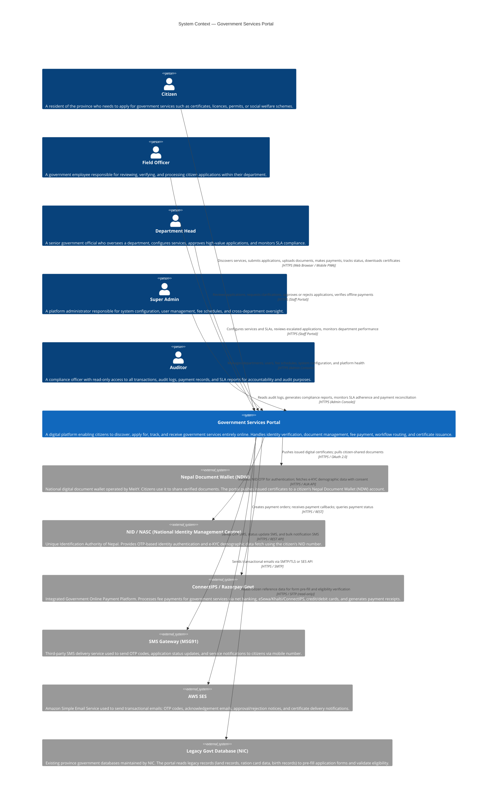
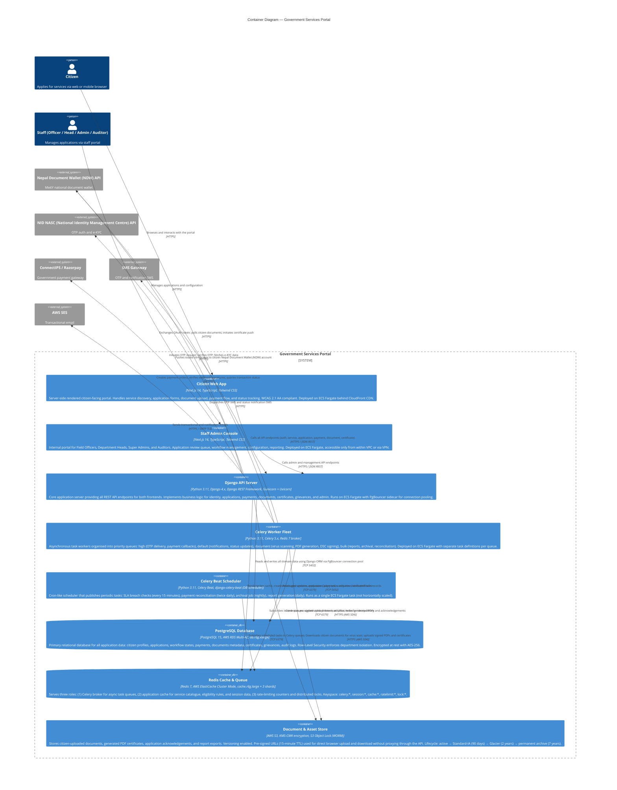

# C4 Context and Container Diagram — Government Services Portal

## 1. Overview of the C4 Model

The C4 model (Context, Container, Component, Code) provides a hierarchical set of software architecture diagrams that progressively zoom in on the system. This document covers the first two levels:

- **Level 1 — Context Diagram:** Shows the system as a single black box and its relationships with the people and external systems that interact with it. Suitable for communicating with non-technical stakeholders, department heads, and project sponsors.
- **Level 2 — Container Diagram:** Zooms into the Government Services Portal system and shows the separately deployable units (containers) and how they communicate. Suitable for architects, senior engineers, DevOps, and security reviewers.

Levels 3 (Component) and 4 (Code) are covered in `detailed-design/component-diagrams.md` and the codebase itself.

**Key conventions used in this document:**
- Solid lines represent synchronous communication.
- Dashed lines represent asynchronous communication (event-driven or queue-based).
- All external system dependencies are highlighted with `System_Ext` notation.
- All containers within the portal boundary run on AWS infrastructure.

---

## 2. Level 1: C4 Context Diagram

---

## 3. Level 2: C4 Container Diagram

---

## 4. Container Descriptions

| Container | Technology | Primary Responsibility | Team Owner | Horizontal Scaling |
|---|---|---|---|---|
| **Citizen Web App** | Next.js 14, TypeScript, Tailwind CSS, React 18 | Server-side rendering of citizen-facing pages; form orchestration; real-time application status via polling; accessibility (WCAG 2.1 AA); multilingual support (Hindi, English, regional language) | Frontend Team | ECS Fargate auto-scaling on ALB RequestCount; min 2 / max 20 tasks |
| **Staff Admin Console** | Next.js 14, TypeScript, Tailwind CSS, React Table | Application review queue; workflow action UI; department configuration; SLA and compliance dashboards; report export | Frontend Team | ECS Fargate auto-scaling; min 2 / max 10 tasks; VPN-restricted |
| **Django API Server** | Python 3.11, Django 4.x, DRF, Gunicorn, Uvicorn, PgBouncer (sidecar) | All business logic; REST API for both frontends; authentication (JWT, NID OTP); workflow state transitions; fee calculation; payment order creation; document metadata management | Backend Team | ECS Fargate auto-scaling on CPU (65%) and RequestCount; min 3 / max 30 tasks |
| **Celery Worker Fleet** | Python 3.11, Celery 5.x, four separate task definitions per queue | Async processing: document virus scan, PDF generation, DSC signing, notification dispatch, payment reconciliation, Nepal Document Wallet (NDW) sync, report generation, SLA checks, archival | Backend / Platform Team | Separate ECS Fargate auto-scaling per queue based on Redis queue depth CloudWatch metric |
| **Celery Beat Scheduler** | Python 3.11, Celery Beat, django-celery-beat | Cron scheduling: SLA breach detection, reconciliation, archival, nightly report | Backend / Platform Team | Single task — NOT horizontally scaled (uses distributed lock to prevent duplicate scheduling) |
| **PostgreSQL Database** | PostgreSQL 15, RDS Multi-AZ, db.r6g.xlarge (primary + 1 read replica) | Persistent store for all domain entities: citizens, applications, workflow steps, payments, documents metadata, certificates, audit events | Data / DBA Team | Vertical (instance class); read replica for read-heavy queries; no horizontal sharding at initial scale |
| **Redis Cache & Queue** | Redis 7, ElastiCache Cluster Mode, 3 shards × 1 replica | Celery broker (task queues + results), session store (citizen + staff), application cache (service catalogue, eligibility), rate limiting, distributed locks | Platform / Backend Team | ElastiCache Cluster Mode with 3 shards; shard scaling via AWS console; key namespace sharding |
| **Document & Asset Store** | AWS S3, KMS-CMK (separate keys per data classification), S3 Object Lock | Citizen uploaded documents, generated certificates, acknowledgement PDFs, exported reports, application attachments | Platform / Security Team | S3 is infinitely scalable; Object Lock prevents deletion; lifecycle policies for cost management |

---

## 5. Communication Protocols

| Source Container | Target Container | Protocol | Port | Auth Method | Data Format | Notes |
|---|---|---|---|---|---|---|
| Citizen Web App | Django API Server | HTTPS REST | 443 | JWT Bearer Token (access token 15 min TTL) | JSON | All API calls include `X-Request-ID` header for distributed tracing |
| Staff Admin Console | Django API Server | HTTPS REST | 443 | JWT Bearer Token (staff role, 8 hr TTL) | JSON | Staff JWT payload includes `role`, `department_id`, `permissions[]` claims |
| Django API Server | PostgreSQL | TCP/TLS | 5432 | PgBouncer authenticates via scram-sha-256; application uses role `portal_app` | PostgreSQL wire protocol | Connection pooling: transaction mode, max 200 pooled connections |
| Django API Server | Redis | TCP (TLS in production) | 6379 | AUTH password + TLS client cert on ElastiCache | Redis RESP protocol | Keyspace isolation by prefix; separate DB indexes for cache/session/broker |
| Django API Server | AWS S3 | HTTPS | 443 | IAM Task Role (ECS) — no long-lived credentials | AWS SDK v2 (Python boto3) | Pre-signed URLs for client-direct upload; 15-minute TTL |
| Django API Server | NID NASC (National Identity Management Centre) | HTTPS | 443 | AUA credentials (client cert + API key), request signed with RSA-2048 | XML (AUA format) / JSON (newer API) | Credentials stored in AWS Secrets Manager |
| Django API Server | ConnectIPS / Razorpay | HTTPS | 443 | HMAC-SHA256 webhook signature; API key + secret from Secrets Manager | JSON | Idempotency key sent on every order creation request |
| Django API Server | Nepal Document Wallet (NDW) | HTTPS | 443 | OAuth 2.0 Authorization Code Flow; access token per citizen session | JSON | Token refresh handled transparently; citizen must consent on first use |
| Celery Worker | PostgreSQL | TCP/TLS | 5432 | Same PgBouncer pool as API server | PostgreSQL wire protocol | Workers use a separate PgBouncer pool to avoid competing with API |
| Celery Worker | Redis | TCP (TLS) | 6379 | AUTH password + TLS | Redis RESP | Workers subscribe to named queues: high, default, document, bulk |
| Celery Worker | S3 | HTTPS | 443 | IAM Task Role (separate ECS task role with S3 write permission) | AWS SDK boto3 | Worker task role has KMS decrypt permission for reading citizen docs |
| Celery Worker | SMS Gateway (MSG91) | HTTPS | 443 | API key from Secrets Manager, TLS 1.3 | JSON | Retry 3× with exponential backoff; fallback to secondary Nepal Telecom / Sparrow SMS gateway |
| Celery Worker | AWS SES | HTTPS / SMTP TLS | 443 / 587 | IAM Task Role (ses:SendEmail permission) | MIME email / JSON (SES API) | DKIM signed, SPF configured; bounce and complaint webhooks to API |
| Celery Worker | Nepal Document Wallet (NDW) | HTTPS | 443 | OAuth 2.0 bearer token (stored in PostgreSQL per citizen) | JSON | Push certificate to citizen's Nepal Document Wallet (NDW) namespace |
| Celery Beat | Redis | TCP (TLS) | 6379 | AUTH password | Redis RESP | Reads schedule from PostgreSQL via django-celery-beat; publishes to broker |
| ALB | Django API Server | HTTP (internal) | 8000 | None (ALB listener performs TLS termination; internal VPC traffic) | HTTP/1.1 | Health check: `GET /api/health/` — expects 200 within 5 seconds |
| CloudFront | ALB Frontend | HTTPS | 443 | Origin Access Policy (OAP) with shared secret header `X-CloudFront-Secret` | HTTPS | Viewer Protocol Policy: Redirect HTTP to HTTPS |

---

## 6. Container Security Boundaries

The system is divided into three security zones enforced by AWS VPC security groups and network ACLs:

### Zone 1: Public DMZ (Internet-Facing)
CloudFront distributions, Route 53 DNS, and AWS WAF operate in AWS-managed infrastructure outside the VPC. No application containers reside here. WAF rules enforce: rate limiting (100 req/sec/IP for API, 500 req/sec/IP for static assets), OWASP Core Rule Set, AWS Managed IP Reputation list, SQL injection protection, and geofencing (requests from embargoed countries are blocked). Shield Advanced provides automatic DDoS response at Layers 3, 4, and 7.

### Zone 2: Application Tier (Private Subnets — App VPC)
All ECS Fargate tasks (Citizen Web App, Admin Console, Django API, Celery Workers, Celery Beat) run in private subnets. They have no inbound internet access; they receive traffic exclusively from ALBs. Outbound internet access for calling external APIs (NID, ConnectIPS, Nepal Document Wallet (NDW), SMS Gateway, SES) is routed through a NAT Gateway with a fixed Elastic IP address — this IP is registered with NASC (National Identity Management Centre) and ConnectIPS as the authorised source IP for API calls.

Security group rules: API containers accept inbound 8000 only from ALB security group. Celery workers accept no inbound connections. All containers accept outbound 443 (HTTPS) and TCP 5432/6379 to Data Tier security groups only.

### Zone 3: Data Tier (Isolated Private Subnets — Data VPC)
RDS PostgreSQL and ElastiCache Redis reside in isolated private subnets with no route to the internet. Security groups accept inbound TCP 5432 / 6379 only from App Tier security groups. RDS has deletion protection enabled. ElastiCache has at-rest encryption and in-transit TLS enabled. Backups are encrypted and stored in a separate S3 bucket with cross-account replication to the DR account.

### IAM Boundaries
Each ECS task has a dedicated IAM Task Role with least-privilege permissions:
- **API Task Role:** `s3:GetObject`, `s3:PutObject` (specific bucket), `kms:Decrypt` (specific key), `secretsmanager:GetSecretValue` (specific secret ARNs).
- **Celery Document Task Role:** `s3:GetObject`, `s3:PutObject`, `kms:Decrypt`, `kms:GenerateDataKey`.
- **Celery Worker Task Role:** `ses:SendEmail`, `secretsmanager:GetSecretValue`.
- No task role has `s3:DeleteObject`, `iam:*`, or EC2 management permissions.

---

## 7. Operational Policy Addendum

### 7.1 Container Deployment and Release Policy

- All container images are built from verified base images: `python:3.11-slim-bookworm` (Django/Celery) and `node:20-alpine3.19` (Next.js). Base images are scanned weekly via Amazon ECR Image Scanning (powered by Snyk). Critical CVEs block deployment via the CI pipeline quality gate.
- Images are tagged with the Git SHA and semantic version (e.g., `portal-api:v2.4.1-abc1234`). The `latest` tag is never used in production task definitions.
- Container images do not contain secrets. All secrets are injected at runtime from AWS Secrets Manager via the ECS `secrets` field in task definitions.
- Blue-green deployments are used for the Django API to ensure zero-downtime releases. The new task version is started, health-checked, ALB target weight is shifted 10% at a time over 5 minutes, and the old version is drained and stopped.
- Container images are stored in Amazon ECR with lifecycle policies: `untagged` images deleted after 7 days; `release` tagged images retained for 180 days; `latest` on dev branches retained for 30 days.

### 7.2 Inter-Container Communication Security Policy

- All communication between containers and the data tier (RDS, ElastiCache) is encrypted in transit using TLS 1.3. TLS certificates are managed by AWS Certificate Manager (ACM). Self-signed certificates are not used in production.
- JWT tokens issued by Django API are signed using RS256 (asymmetric RSA-2048). The public key is published at `/.well-known/jwks.json` for potential future federated verification. The private key is stored in AWS Secrets Manager, not in the container file system.
- Inter-service calls within the VPC use the internal ALB DNS name, not direct container IPs, allowing security group rules to be enforced consistently.
- Rate limiting is enforced at two layers: AWS WAF (IP-based, 100 req/sec) and Django middleware (user-based, using Redis atomic counters). API endpoints for OTP initiation are additionally throttled to 5 requests per mobile number per 10 minutes.

### 7.3 Data Container Backup and Recovery Policy

- RDS automated backups are enabled with a 35-day retention period. Manual snapshots are taken before every production deployment and retained for 90 days.
- ElastiCache Redis is configured with AOF (Append-Only File) persistence enabled for data durability. Snapshotting occurs every 6 hours to S3.
- S3 document bucket versioning is enabled. Object Lock is configured in Compliance mode for certificates and payment records (retention: 10 years). Regular documents are protected by versioning only.
- Backup restoration is tested quarterly as part of DR drills. The drill involves restoring RDS to a point-in-time 24 hours in the past and verifying all application functionality in the staging environment.

### 7.4 Monitoring and Observability Policy

- Distributed tracing is implemented using AWS X-Ray. Every incoming HTTP request generates a trace ID, propagated as `X-Amzn-Trace-Id` header across all container-to-container calls, logged in CloudWatch and queryable in the X-Ray console.
- Structured JSON logging is mandatory for all containers. Log fields: `timestamp`, `level`, `request_id`, `user_id` (hashed for PII compliance), `event`, `duration_ms`, `status_code`. Logs are shipped to CloudWatch Logs with 90-day retention, then archived to S3 for 7 years.
- Application metrics (custom business metrics: applications submitted per minute, payments processed, OTP success rate, workflow completion time) are published to CloudWatch Custom Metrics every minute via a StatsD agent on each ECS task.
- A Grafana dashboard (deployed on ECS, pulling from CloudWatch) provides real-time visibility into: active ECS task count, API P50/P95/P99 latency, error rates, queue depths, database connection counts, and Redis memory usage.
