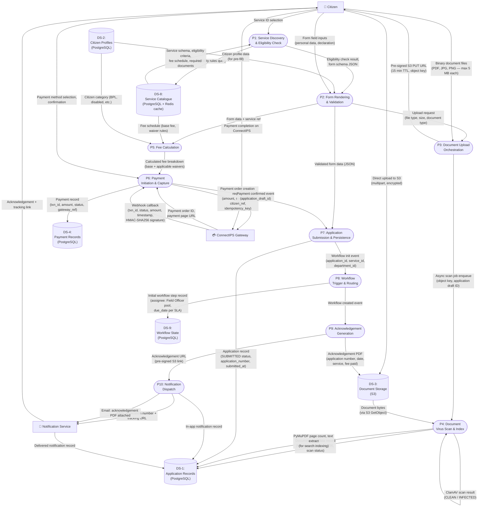
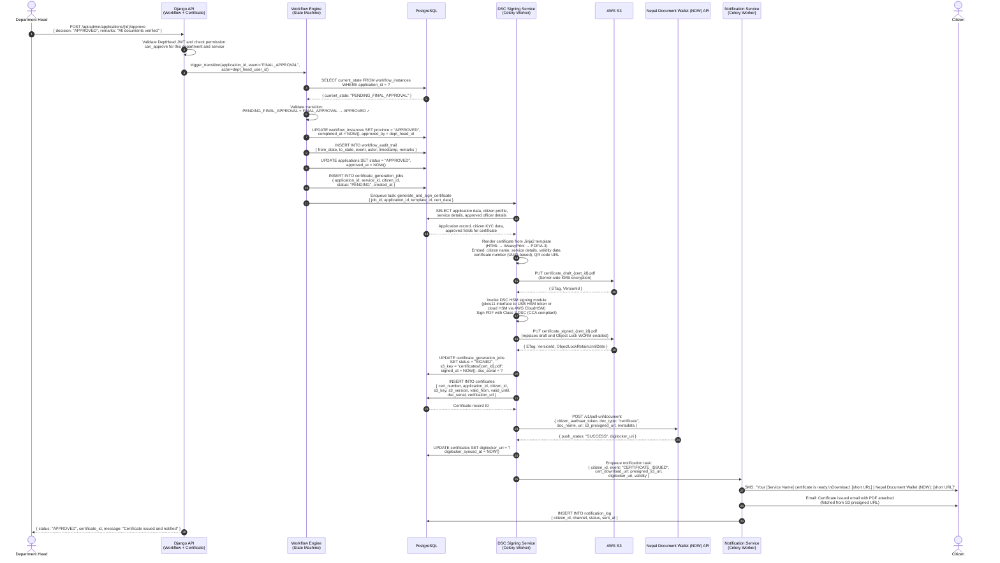
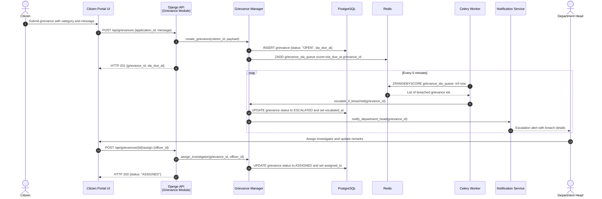

# Data Flow Diagram — Government Services Portal

## 1. Overview

This document describes the data flows within the Government Services Portal at three levels of abstraction. The Level 0 DFD treats the entire portal as a single process and shows the primary data stores and external entities that exchange data with the system. The Level 1 DFDs zoom into the three most critical flows — Application Submission, Authentication, and Certificate Issuance — showing individual processes, data stores, and the data elements that flow between them.

All data flows are governed by the data classification policy (Section 7) and the data retention policy (Section 8). Flows that involve Restricted or Confidential data are indicated in the diagram annotations. Every flow that crosses a trust boundary (citizen browser ↔ CDN, CDN ↔ ALB, ALB ↔ Django API, API ↔ external systems) is encrypted in transit using TLS 1.3.

The diagrams use standard DFD notation adapted for Mermaid:
- **Rounded rectangles / ovals** = Processes
- **Open-ended rectangles** = Data Stores
- **Rectangles** = External Entities
- **Arrows** = Data Flows (labelled with the data element name)

---

## 2. Level 0 DFD: System Overview

```mermaid
flowchart TD
    CITIZEN["👤 Citizen\n(External Entity)"]
    STAFF["👔 Staff / Officers\n(External Entity)"]
    AADHAAR["🪪 NID NASC (National Identity Management Centre)\n(External Entity)"]
    PAYGOV["💳 ConnectIPS\n(External Entity)"]
    DIGILOCKER["📂 Nepal Document Wallet (NDW)\n(External Entity)"]
    SMS_GW["📱 SMS Gateway\n(External Entity)"]
    EMAIL["📧 Email (SES)\n(External Entity)"]
    LEGACY["🏛 Legacy Govt DB\n(External Entity)"]

    PORTAL(["⚙️ GOVERNMENT SERVICES PORTAL\n(Central Process)"])

    DS1[("DS-1: Application Records\n(PostgreSQL)")]
    DS2[("DS-2: Citizen Profiles\n(PostgreSQL)")]
    DS3[("DS-3: Document Storage\n(AWS S3)")]
    DS4[("DS-4: Payment Records\n(PostgreSQL)")]
    DS5[("DS-5: Certificate Registry\n(PostgreSQL + S3)")]
    DS6[("DS-6: Session & Cache\n(Redis)")]
    DS7[("DS-7: Audit Log\n(PostgreSQL)")]

    CITIZEN -->|"Service requests, application data,\ndocuments, payment, OTP"| PORTAL
    PORTAL -->|"Acknowledgements, status updates,\ncertificates, notifications"| CITIZEN

    STAFF -->|"Review decisions, clarification requests,\napproval/rejection, config changes"| PORTAL
    PORTAL -->|"Application queue, dashboards,\nreports, audit data"| STAFF

    PORTAL -->|"OTP initiate request\n(NID number + consent)"| AADHAAR
    AADHAAR -->|"OTP delivery, e-KYC demographics\n(name, DoB, gender, address)"| PORTAL

    PORTAL -->|"Payment order creation\n(amount, service ref, citizen ref)"| PAYGOV
    PAYGOV -->|"Payment callback\n(txn ID, status, timestamp)"| PORTAL

    PORTAL -->|"OAuth token exchange,\ncertificate push (PDF + metadata)"| DIGILOCKER
    DIGILOCKER -->|"Access token,\ncitizen document list"| PORTAL

    PORTAL -->|"SMS payload\n(OTP, status, notification)"| SMS_GW
    SMS_GW -->|"Delivery status callback"| PORTAL

    PORTAL -->|"Email payload\n(HTML/text, attachments)"| EMAIL
    EMAIL -->|"Bounce/complaint webhooks"| PORTAL

    PORTAL -->|"Citizen reference data query\n(by NID VID / ration card)"| LEGACY
    LEGACY -->|"Pre-fill data\n(land records, BPL status, birth data)"| PORTAL

    PORTAL <-->|"Read / Write"| DS1
    PORTAL <-->|"Read / Write"| DS2
    PORTAL <-->|"Read / Write"| DS3
    PORTAL <-->|"Read / Write"| DS4
    PORTAL <-->|"Read / Write"| DS5
    PORTAL <-->|"Read / Write"| DS6
    PORTAL -->|"Write-only (immutable)"| DS7
```



---

## 3. Level 1 DFD: Application Submission Flow



---

## 4. Level 1 DFD: Authentication Flow

```mermaid
sequenceDiagram
    autonumber
    actor Citizen
    participant UI as Browser UI<br/>(Next.js)
    participant API as Django API<br/>(Auth Module)
    participant NASC (National Identity Management Centre) as NID NASC (National Identity Management Centre)<br/>(AUA API)
    participant SMS as SMS Gateway
    participant DB as PostgreSQL<br/>(Citizen Profiles)
    participant Cache as Redis<br/>(Session / OTP Store)

    Citizen->>UI: Enter mobile number (or NID number)
    UI->>API: POST /api/auth/otp/initiate/<br/>{ mobile: "9876543210", auth_type: "aadhaar_otp" }
    API->>API: Validate mobile format and check rate limit<br/>(Redis INCR key=otp:mobile:9876543210, TTL 10 min)
    API->>Cache: SET otp_attempt_count (check ≤ 5 attempts)
    Cache-->>API: Current attempt count

    alt NID OTP selected
        API->>NASC (National Identity Management Centre): POST /auth/otp<br/>{ uid: "<aadhaar_number>", ac: "<AUA_code>", consent: "Y" }<br/>Request signed with AUA private key (RSA-2048)
        NASC (National Identity Management Centre)-->>API: { txn: "<txn_id>", info: "OTP sent" }
        API->>Cache: SET otp_session:<txn_id> = { mobile, aadhaar_token, expires_at }<br/>TTL: 300 seconds
    else SMS OTP selected
        API->>API: Generate 6-digit TOTP (RFC 6238 compliant)
        API->>Cache: SET otp_code:<mobile> = { hash(otp), expires_at }<br/>TTL: 300 seconds
        API->>SMS: POST /send-otp { mobile, otp_code, template_id }
        SMS-->>API: { message_id, status: "queued" }
    end

    API-->>UI: { txn_id: "<txn_id>", expires_in: 300 }
    UI->>Citizen: Display OTP input screen with countdown timer

    Citizen->>UI: Enter 6-digit OTP
    UI->>API: POST /api/auth/otp/verify/<br/>{ txn_id: "<txn_id>", otp: "483921" }
    API->>Cache: GET otp_session:<txn_id>

    alt NID OTP verification
        API->>NASC (National Identity Management Centre): POST /auth/verify<br/>{ txn: "<txn_id>", otp: "483921",<br/>ac: "<AUA_code>" }<br/>Signed with AUA private key
        NASC (National Identity Management Centre)-->>API: { ret: "y", info: "<encrypted_e-KYC>" }<br/>OR { ret: "n", err: "OTP_INVALID" }
        API->>API: Decrypt e-KYC using AUA decrypt key<br/>Extract: name, dob, gender, address, aadhaar_token
    else SMS OTP verification
        API->>API: Verify TOTP using stored hash<br/>Check expiry and attempt count
    end

    API->>DB: SELECT * FROM citizens WHERE aadhaar_token = ?<br/>OR WHERE mobile = ?
    DB-->>API: Citizen record (or null for new citizen)

    alt New Citizen (registration)
        API->>DB: INSERT INTO citizens<br/>{ aadhaar_token, mobile, name, dob, gender,<br/>address, kyc_verified: true, created_at }
        DB-->>API: Citizen record with generated citizen_id
        API->>API: Emit CitizenRegistered domain event<br/>(triggers: welcome SMS, audit log)
    else Existing Citizen (login)
        API->>DB: UPDATE citizens SET last_login_at = NOW(), login_count = login_count + 1
    end

    API->>API: Generate JWT access token (RS256)<br/>{ sub: citizen_id, role: "citizen",<br/>aadhaar_verified: true, exp: now+900s }
    API->>API: Generate JWT refresh token (RS256)<br/>{ sub: citizen_id, type: "refresh", exp: now+7d }
    API->>Cache: SET session:<citizen_id> = { refresh_token_hash, device_fingerprint, ip }<br/>TTL: 7 days
    API->>DB: INSERT INTO audit_log<br/>{ event: "CITIZEN_LOGIN", citizen_id, ip_address,<br/>user_agent, timestamp, auth_type }

    API-->>UI: { access_token, refresh_token, expires_in: 900, citizen_id }
    UI->>UI: Store access_token in memory (not localStorage)<br/>Store refresh_token in httpOnly Secure SameSite=Strict cookie
    UI->>Citizen: Redirect to citizen dashboard
```

---

## 5. Level 1 DFD: Certificate Issuance Flow



---

## 6. Data Store Descriptions

| ID | Name | Type | Technology | Contains Sensitive Data | Encryption at Rest | Notes |
|---|---|---|---|---|---|---|
| DS-1 | Application Records | Relational DB | PostgreSQL 15 (RDS) | Yes — Confidential | AES-256 (RDS encryption) | Central store for all service applications, status, workflow state, documents metadata, notifications |
| DS-2 | Citizen Profiles | Relational DB | PostgreSQL 15 (RDS) | Yes — Restricted | AES-256 (RDS) + application-layer field encryption (KMS-CMK) for NID token, mobile, email | Row-Level Security per citizen_id; NID token stored instead of raw NID number |
| DS-3 | Document Storage | Object Store | AWS S3 | Yes — Restricted (uploaded documents), Confidential (certificates) | SSE-KMS with CMK (separate keys per document classification) | Versioning enabled; Object Lock (Compliance mode) for certificates; ClamAV scan before index |
| DS-4 | Payment Records | Relational DB | PostgreSQL 15 (RDS) | Yes — Confidential | AES-256 (RDS encryption) | Immutable after creation; no DELETE permitted; refunds create a separate linked record |
| DS-5 | Certificate Registry | Relational DB + Object Store | PostgreSQL 15 + S3 | Yes — Confidential | AES-256 (RDS + S3 KMS) | PostgreSQL stores metadata and verification data; S3 stores signed PDF files |
| DS-6 | Session & Cache | In-Memory Store | Redis 7 (ElastiCache) | Yes — session tokens, OTP hashes | TLS in-transit; ElastiCache at-rest encryption | TTL-based expiry; no PII stored beyond session token and hashed OTP; not persisted to disk beyond AOF snapshots |
| DS-7 | Audit Log | Relational DB (append-only) | PostgreSQL 15 (RDS) — separate schema | Yes — user IDs, IP addresses, event types | AES-256 (RDS) | INSERT-only permissions for application roles; no UPDATE/DELETE; retained 7 years |
| DS-8 | Service Catalogue | Relational DB + Cache | PostgreSQL 15 + Redis cache | No — public information | AES-256 (RDS) | Cached in Redis with 5-minute TTL; includes service JSON Schema definitions, fee schedules, eligibility rules |
| DS-9 | Workflow State | Relational DB | PostgreSQL 15 (RDS) | Yes — officer assignments, decision remarks | AES-256 (RDS) | Complete audit trail of all state transitions; immutable history |
| DS-10 | Notification Log | Relational DB | PostgreSQL 15 (RDS) | Yes — mobile numbers, email addresses (in delivery log) | AES-256 (RDS) | Stores sent/failed status for all notifications; mobile and email hashed in analytics aggregation |

---

## 7. Data Classification

| Classification Level | Definition | Examples in This System | Access Controls | Storage Rules |
|---|---|---|---|---|
| **Public** | Information intended for public consumption. No harm if disclosed. | Service names, fee schedules, required document list, service eligibility criteria, office addresses, processing timelines | Unrestricted read; write by Super Admin only | Cached on CDN; no encryption requirement beyond transport TLS |
| **Internal** | Information for internal use by government staff. Disclosure causes minor operational harm. | Application status (without PII), department names, officer usernames, system health metrics, SLA reports | Authenticated staff users; role-based access | Standard RDS encryption; 3-year retention |
| **Confidential** | Information whose disclosure could cause significant harm to individuals or department operations. | Full application forms, documents uploaded by citizens, payment amounts and references, grievance details, workflow decisions with remarks | Authenticated and authorised users only (citizen sees own data; officers see assigned applications); logged access | RDS AES-256 + S3 KMS; 7-year retention; access logged in audit module |
| **Restricted** | Highest sensitivity. Disclosure could cause severe harm, legal liability, or breach statutory obligations. | NID token (VID), biometric data, e-KYC demographics, mobile number, email address, financial account details, medical documents (for health schemes) | Owner (citizen) + explicitly authorised officers + Super Admin; all access logged with justification | Application-layer field encryption (KMS-CMK envelope encryption) on top of RDS encryption; access requires audit record; pseudonymised after retention period |

---

## 8. Data Retention Policy

| Data Category | Retention Period | Legal Basis | Action at Expiry |
|---|---|---|---|
| Citizen profile (KYC data) | 7 years from last activity | IT Act 2000, DPDPA 2023, Govt. record-keeping rules | Pseudonymisation: PII fields replaced with anonymised tokens; application history retained in anonymised form |
| Service applications (approved) | 7 years from completion date | Public Records Act 1993, service-specific statutes (e.g., land records: 30 years) | Archive to S3 Glacier; purge from active PostgreSQL after 7 years |
| Service applications (rejected/withdrawn) | 3 years from final status date | Statutory grievance appeal window | Archive to S3 Glacier; purge from active DB |
| Payment records | 8 years from payment date | Income Tax Act, Companies Act VAT (13%) compliance (if applicable) | Archive to S3 Glacier Deep Archive; immutable record maintained |
| Uploaded citizen documents | 7 years from application completion | Dept. record retention schedule | Move to S3 Glacier (2 yr), then Deep Archive (7 yr), then delete |
| Issued certificates | 20 years from issue date (or as per service statute) | Evidence Act; service-specific statutes | Retain in S3 with Object Lock for full period; certificate metadata in DB for 20 years |
| Audit logs | 7 years from event date | CVC guidelines, IT Act, DPDPA 2023 | Archive to S3 Glacier; queryable via Athena |
| Session data (Redis) | 7 days from last activity | Operational necessity | TTL expiry on Redis; no archival |
| OTP attempts | 24 hours | Security policy | TTL expiry on Redis |
| Notification logs | 3 years | Customer support, compliance | Archive to cold storage after 1 year |
| Staff activity logs | 5 years | Service rules, CVC guidelines | Archive to S3; searchable via Athena for compliance queries |

---

## 9. Operational Policy Addendum

### 9.1 Data Sovereignty and Residency Policy

- All data generated, processed, or stored by the Government Services Portal must reside within AWS `ap-south-1` (Mumbai) as the primary region. The disaster recovery replica resides in `ap-south-2` (Hyderabad). No citizen data is transferred outside Nepal's geographic boundaries, complying with the Digital Personal Data Protection Act (DPDPA) 2023 and MeitY cloud policy for government applications.
- Data transfers to external systems (NID NASC (National Identity Management Centre), Nepal Document Wallet (NDW), ConnectIPS) are governed by data sharing agreements and are limited to the minimum data elements required for the specific transaction. No bulk citizen data exports to external systems are permitted.
- Integration with the Legacy Govt DB (NIC province systems) uses a read-only SFTP connection to pull reference data. No citizen data flows from the portal back to legacy systems in real-time; periodic reconciliation reports are generated and shared via secure SFTP as defined in the inter-department data sharing agreement.
- Logs exported to SIEM (Splunk/ELK) are pre-processed to anonymise or hash PII fields (mobile numbers, email addresses, NID tokens) before export, ensuring that SIEM operators never see raw citizen PII.

### 9.2 Data Minimisation and Purpose Limitation Policy

- The portal adheres to the principle of data minimisation: only data elements strictly necessary for delivering the requested government service are collected. Service form schemas are reviewed by the Legal/Compliance team before publication to remove unnecessary fields.
- NID e-KYC data (name, date of birth, gender, address) is fetched only once per citizen registration with explicit consent. Subsequent service applications use the stored citizen profile and do not re-fetch e-KYC unless the citizen requests an update or the data is older than 2 years.
- Citizens can view exactly what data the portal holds about them via the "My Data" section in the citizen portal. This fulfils the right to information under DPDPA 2023.
- Documents uploaded for a specific application are linked to that application and are not reused for other applications without explicit citizen confirmation. The system prompts citizens to reuse a previously uploaded document (e.g., address proof) rather than silently copying it, ensuring informed consent.

### 9.3 Consent Management Policy

- Consent for NID-based authentication and e-KYC fetch is recorded at the time of registration, stored in `citizens.consent_records` as a JSONB field with: consent_type, consent_given_at, consent_text_version, ip_address, and user_agent. Consent texts are version-controlled.
- Citizens can revoke consent for non-mandatory data uses (e.g., analytics, personalisation) from the privacy settings page. Revocation is effective immediately; the Celery worker processes revocation by updating preferences and triggering data deletion where applicable.
- Consent for Nepal Document Wallet (NDW) integration is obtained per-session via the Nepal Document Wallet (NDW) OAuth 2.0 consent screen. The portal does not store Nepal Document Wallet (NDW) access tokens beyond the session duration. Only the Nepal Document Wallet (NDW) push (certificate delivery) is a non-consent-revocable operation as it fulfils the primary service delivery purpose.

### 9.4 Data Breach Response Policy

- AWS GuardDuty, CloudTrail, and VPC Flow Logs are continuously monitored. A CloudWatch alarm triggers a P1 PagerDuty alert if: >50 failed authentication attempts/minute from a single IP, >1,000 database error responses/minute, or any `DELETE FROM` SQL statement executed on production RDS outside a migration context.
- In the event of a confirmed data breach, the Incident Response team must: (1) isolate affected containers within 30 minutes, (2) rotate all secrets (DB passwords, API keys) within 1 hour, (3) notify CERT-In within 6 hours as required by the Information Technology (Amendment) Act, (4) notify affected citizens within 72 hours via SMS and email as required by DPDPA 2023, (5) submit a detailed breach report to the Data Protection Board within 7 days.
- Post-breach forensic analysis uses the immutable audit log (DS-7) and CloudTrail as the source of truth. The audit log retention of 7 years ensures that forensic evidence is available long after an incident.

---

## 10. Level 1 DFD: Grievance Escalation and SLA Breach Flow



