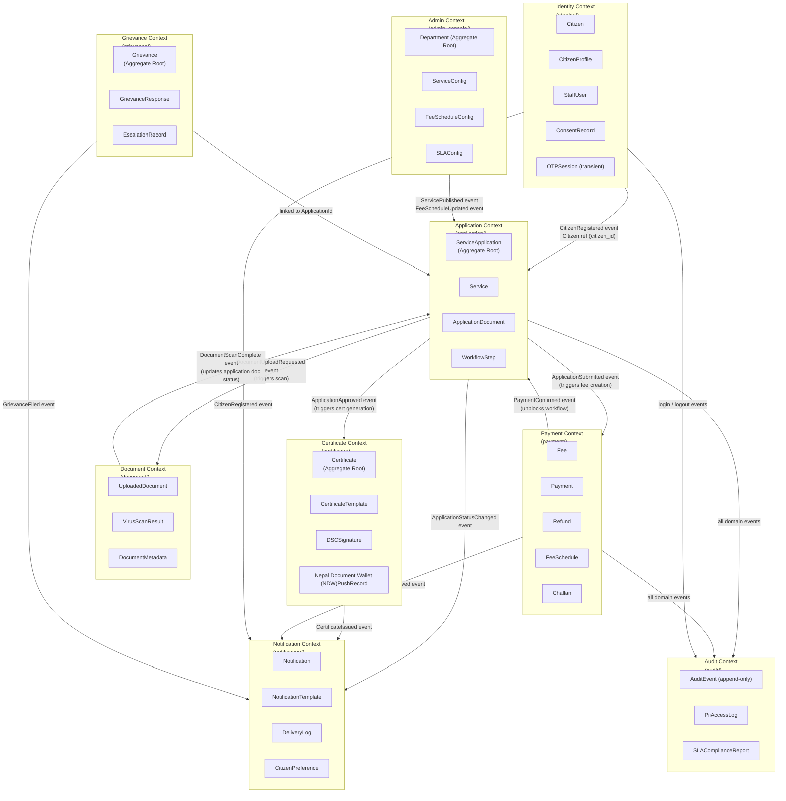

# Domain Model — Government Services Portal

## 1. Overview: Domain-Driven Design Approach

The Government Services Portal is designed using **Domain-Driven Design (DDD)** principles. The business domain is decomposed into a set of cohesive **Bounded Contexts**, each owning its models, services, and interfaces. Within each context, the domain model is structured around **Aggregate Roots** — the consistency boundary for transactional operations — surrounded by **Entities**, **Value Objects**, and **Domain Services**.

The central aggregate in this system is `ServiceApplication`, which represents a citizen's end-to-end interaction with a government service — from submission through payment, review, and certificate issuance. This aggregate emits **Domain Events** that other contexts (Payment, Notification, Certificate, Audit) subscribe to, enabling loose coupling between bounded contexts while maintaining strong consistency within each context's own boundary.

**Key DDD Concepts Applied:**
- **Ubiquitous Language:** All code, documentation, and stakeholder communication uses the same terminology defined in Section 3 (e.g., "application" not "request", "certificate" not "output", "grievance" not "complaint").
- **Aggregate Root Pattern:** Only aggregate roots have public repositories; internal entities are always accessed through the root.
- **Domain Events:** State changes within an aggregate emit domain events rather than directly calling methods on other aggregates.
- **Anti-Corruption Layers:** All external integrations (NID, Nepal Document Wallet (NDW), ConnectIPS) are wrapped in dedicated adapter classes that translate between the external system's model and the portal's domain model.

---

## 2. Core Domain Model Diagram

```mermaid
classDiagram
    direction TB

    class Citizen {
        +UUID citizen_id
        +String aadhaar_token
        +String mobile_number
        +String email
        +Boolean mobile_verified
        +Boolean aadhaar_verified
        +DateTime created_at
        +DateTime last_login_at
        +CitizenStatus status
        +verify_mobile(otp: String) Boolean
        +verify_aadhaar(otp: String) Boolean
        +deactivate() void
        +update_contact(mobile: String, email: String) void
        +has_active_session() Boolean
    }

    class CitizenProfile {
        +UUID profile_id
        +UUID citizen_id
        +String full_name
        +Date date_of_birth
        +Gender gender
        +Address permanent_address
        +Address correspondence_address
        +String fathers_name
        +String caste_category
        +String bpl_card_number
        +Boolean is_differently_abled
        +Boolean is_ex_serviceman
        +DateTime kyc_verified_at
        +String kyc_source
        +update_address(address: Address) void
        +get_age() Integer
        +is_eligible_for_waiver() Boolean
    }

    class Service {
        +UUID service_id
        +String service_code
        +String name
        +String description
        +UUID department_id
        +ServiceCategory category
        +ServiceStatus status
        +Integer statutory_days
        +JSON form_schema
        +JSON eligibility_rules
        +JSON required_documents
        +String processing_sla_days
        +DateTime effective_from
        +DateTime effective_until
        +get_current_fee_schedule() FeeSchedule
        +is_eligible(citizen: Citizen) EligibilityResult
        +get_required_documents() List~DocumentRequirement~
        +is_available() Boolean
    }

    class ServiceApplication {
        <<Aggregate Root>>
        +UUID application_id
        +String application_number
        +UUID citizen_id
        +UUID service_id
        +UUID department_id
        +ApplicationStatus status
        +JSON form_data
        +Money fee_amount
        +Money fee_paid
        +DateTime submitted_at
        +DateTime completed_at
        +DateTime sla_due_at
        +String rejection_reason
        +submit() void
        +pay_fee(payment: Payment) void
        +assign_to_officer(officer: StaffUser) void
        +request_clarification(remarks: String) void
        +approve(officer: StaffUser, remarks: String) void
        +reject(officer: StaffUser, reason: String) void
        +withdraw() void
        +is_within_sla() Boolean
        +can_transition_to(status: ApplicationStatus) Boolean
        +get_pending_documents() List~DocumentRequirement~
        +calculate_sla_breach_risk() Float
    }

    class ApplicationDocument {
        +UUID document_id
        +UUID application_id
        +String document_type
        +String original_filename
        +String s3_key
        +String s3_version_id
        +String sha256_hash
        +Integer file_size_bytes
        +String mime_type
        +DocumentScanStatus scan_status
        +Boolean is_verified_by_officer
        +DateTime uploaded_at
        +UUID uploaded_by
        +verify(officer: StaffUser) void
        +reject(reason: String) void
        +get_presigned_download_url(ttl_seconds: Integer) String
        +is_valid_for_submission() Boolean
    }

    class Fee {
        +UUID fee_id
        +UUID application_id
        +UUID fee_schedule_id
        +Money base_amount
        +Money waiver_amount
        +WaiverReason waiver_reason
        +Money net_amount
        +FeeStatus status
        +DateTime calculated_at
        +apply_waiver(reason: WaiverReason, amount: Money) void
        +is_paid() Boolean
        +get_outstanding_amount() Money
    }

    class Payment {
        +UUID payment_id
        +UUID application_id
        +UUID fee_id
        +PaymentMethod method
        +Money amount
        +String gateway_order_id
        +String gateway_txn_id
        +PaymentStatus status
        +String challan_number
        +DateTime initiated_at
        +DateTime confirmed_at
        +String receipt_s3_key
        +confirm(txn_id: String, gateway_response: dict) void
        +fail(reason: String) void
        +initiate_refund(reason: String, amount: Money) Refund
        +get_receipt_url() String
        +is_reconciled() Boolean
    }

    class Certificate {
        +UUID certificate_id
        +String certificate_number
        +UUID application_id
        +UUID citizen_id
        +UUID service_id
        +String s3_key
        +String s3_version_id
        +Date valid_from
        +Date valid_until
        +String dsc_serial_number
        +String dsc_thumbprint
        +CertificateStatus status
        +String digilocker_uri
        +String verification_url
        +DateTime issued_at
        +verify_authenticity() Boolean
        +get_download_url(ttl: Integer) String
        +push_to_digilocker() void
        +is_valid_on_date(date: Date) Boolean
        +get_qr_code_data() String
    }

    class WorkflowStep {
        +UUID step_id
        +UUID application_id
        +String step_name
        +WorkflowStepStatus status
        +UUID assigned_to
        +UUID department_id
        +Integer order_index
        +Integer sla_hours
        +DateTime assigned_at
        +DateTime due_at
        +DateTime completed_at
        +String decision_remarks
        +StepDecision decision
        +assign(officer: StaffUser) void
        +complete(decision: StepDecision, remarks: String) void
        +escalate(reason: String) void
        +is_overdue() Boolean
        +get_remaining_sla_hours() Integer
    }

    class Grievance {
        +UUID grievance_id
        +String grievance_number
        +UUID citizen_id
        +UUID application_id
        +GrievanceCategory category
        +String description
        +GrievanceStatus status
        +UUID assigned_to_department
        +UUID assigned_to_officer
        +DateTime filed_at
        +DateTime resolution_due_at
        +DateTime resolved_at
        +String resolution_remarks
        +submit() void
        +assign(officer: StaffUser) void
        +resolve(remarks: String) void
        +escalate(level: EscalationLevel) void
        +is_within_sla() Boolean
    }

    class Department {
        <<Aggregate Root>>
        +UUID department_id
        +String department_code
        +String name
        +String description
        +UUID head_officer_id
        +DepartmentStatus status
        +List~UUID~ service_ids
        +add_service(service: Service) void
        +assign_head(officer: StaffUser) void
        +get_active_services() List~Service~
        +get_pending_applications_count() Integer
        +get_sla_compliance_rate() Float
    }

    class StaffUser {
        +UUID user_id
        +String employee_id
        +String full_name
        +String email
        +String mobile
        +StaffRole role
        +UUID department_id
        +StaffStatus status
        +List~Permission~ permissions
        +DateTime last_login_at
        +has_permission(permission: Permission) Boolean
        +can_review_application(application: ServiceApplication) Boolean
        +get_assigned_queue() List~ServiceApplication~
        +deactivate() void
    }

    class Notification {
        +UUID notification_id
        +UUID citizen_id
        +UUID application_id
        +NotificationChannel channel
        +NotificationType type
        +String template_code
        +JSON template_context
        +NotificationStatus status
        +String delivery_reference
        +Integer retry_count
        +DateTime scheduled_at
        +DateTime sent_at
        +DateTime delivered_at
        +send() void
        +retry() void
        +mark_delivered(reference: String) void
        +is_expired() Boolean
    }

    %% Relationships

    Citizen "1" *-- "1" CitizenProfile : has profile
    Citizen "1" *-- "0..*" ServiceApplication : submits
    Citizen "1" *-- "0..*" Grievance : files
    Citizen "1" *-- "0..*" Notification : receives

    ServiceApplication "1" *-- "1..*" ApplicationDocument : contains
    ServiceApplication "1" *-- "1" Fee : has
    ServiceApplication "1" *-- "0..*" Payment : paid by
    ServiceApplication "1" *-- "0..*" WorkflowStep : processed through
    ServiceApplication "1" *-- "0..1" Certificate : results in
    ServiceApplication "1" *-- "0..*" Notification : triggers
    ServiceApplication "0..*" -- "1" Service : is instance of
    ServiceApplication "0..*" -- "1" Department : handled by

    Department "1" o-- "1..*" StaffUser : employs
    Department "1" o-- "0..*" Service : manages

    WorkflowStep "0..*" -- "1" StaffUser : assigned to
    Certificate "0..*" -- "1" Service : issued under

    Fee "1" -- "0..*" Payment : paid through
```

---

## 3. Aggregate Definitions

### Aggregate 1: ServiceApplication

The `ServiceApplication` is the central aggregate root of the portal domain. It represents the complete lifecycle of a citizen's application for a government service. All operations on an application must go through this root to maintain transactional consistency.

| Aggregate Root | `ServiceApplication` |
|---|---|
| **Entities within aggregate** | `ApplicationDocument`, `Fee`, `Payment`, `WorkflowStep`, `Notification` (references only) |
| **Value Objects** | `ApplicationStatus`, `Money`, `ApplicationNumber`, `FormData`, `FeeBreakdown`, `SLAConfig` |
| **Domain Events Emitted** | `ApplicationSubmitted`, `ApplicationFeeCalculated`, `ApplicationPaymentReceived`, `ApplicationAssigned`, `ApplicationClarificationRequested`, `ApplicationApproved`, `ApplicationRejected`, `ApplicationWithdrawn`, `ApplicationSLABreached`, `ApplicationCertificateIssued` |

**Invariants specific to this aggregate:**
- An application may not transition to `SUBMITTED` unless all required documents have `scan_status = CLEAN`.
- An application may not be approved unless the associated `Fee` has `status = PAID` (or waiver is approved).
- Once an application reaches a terminal state (`APPROVED`, `REJECTED`, `WITHDRAWN`), no further state transitions are possible.
- The `application_number` is globally unique, immutable, and assigned at submission time using the format: `{STATE_CODE}/{SERVICE_CODE}/{YEAR}/{SEQUENTIAL_NUMBER}` (e.g., `MH/DOM/2024/000042371`).

---

### Aggregate 2: Citizen

The `Citizen` aggregate root represents the registered identity of a person using the portal. The `CitizenProfile` is an entity within this aggregate, accessible only through the Citizen root.

| Aggregate Root | `Citizen` |
|---|---|
| **Entities within aggregate** | `CitizenProfile`, `ConsentRecord`, `LinkedAccount` (Nepal Document Wallet (NDW) OAuth token) |
| **Value Objects** | `NIDToken`, `MobileNumber`, `EmailAddress`, `CitizenStatus`, `KYCVerificationResult` |
| **Domain Events Emitted** | `CitizenRegistered`, `CitizenMobileVerified`, `CitizenNIDVerified`, `CitizenProfileUpdated`, `CitizenDeactivated`, `CitizenConsentGranted`, `CitizenConsentRevoked`, `CitizenDataExportRequested` |

---

### Aggregate 3: Department

The `Department` aggregate manages the organisational unit responsible for delivering specific government services. Service configuration and staff assignments are managed through this root.

| Aggregate Root | `Department` |
|---|---|
| **Entities within aggregate** | `Service`, `StaffUser` (references; StaffUser is also a root), `FeeSchedule`, `ServiceSLAConfig` |
| **Value Objects** | `DepartmentCode`, `ServiceCode`, `FeeAmount`, `SLAPeriod`, `DocumentRequirement` |
| **Domain Events Emitted** | `DepartmentCreated`, `ServicePublished`, `ServiceDepublished`, `FeeScheduleUpdated`, `StaffAssigned`, `StaffRoleChanged`, `DepartmentHeadAssigned` |

---

### Aggregate 4: Certificate

The `Certificate` aggregate represents the digital output of an approved service application. Once issued, certificates are immutable. The DSC signature anchors legal validity.

| Aggregate Root | `Certificate` |
|---|---|
| **Entities within aggregate** | `CertificateVersion` (for re-issuance due to correction), `Nepal Document Wallet (NDW)PushRecord` |
| **Value Objects** | `CertificateNumber`, `DSCSignature`, `VerificationURL`, `QRCodeData`, `ValidityPeriod` |
| **Domain Events Emitted** | `CertificateGenerationStarted`, `CertificateSigned`, `CertificateIssuedToNepal Document Wallet (NDW)`, `CertificateRevoked`, `CertificateDownloaded` |

---

## 4. Value Objects

Value objects have no identity; they are defined entirely by their attributes and are immutable once created.

| Value Object | Description | Attributes |
|---|---|---|
| `Money` | Represents a monetary amount in a specific currency. Prevents floating-point errors using Python's `Decimal`. | `amount: Decimal`, `currency: Currency` (default: NPR) |
| `ApplicationNumber` | The human-readable unique identifier for an application, formatted per government convention. Immutable once assigned. | `state_code: str`, `service_code: str`, `year: int`, `sequence: int` — renders as `MH/DOM/2024/000042371` |
| `NIDToken` | A Virtual ID (VID) token representing an NID registration without exposing the actual number. | `token: str` (16-digit VID), `seeded_at: datetime` |
| `MobileNumber` | A validated Nepali mobile number. Enforces E.164 format and Nepali numbering plan (10 digits, starting with 6-9). | `number: str`, `country_code: str = "+977"` |
| `Address` | A structured postal address as used in Nepali government forms. | `house_no: str`, `street: str`, `locality: str`, `district: str`, `province: str`, `pincode: str`, `country: str = "Nepal"` |
| `DocumentRequirement` | Specifies a required document for a service: its type, allowed formats, max size, and whether it is mandatory or conditional. | `doc_type: str`, `label: str`, `allowed_mime_types: list`, `max_size_mb: int`, `is_mandatory: bool`, `condition: str \| None` |
| `EligibilityResult` | The outcome of evaluating a citizen's eligibility for a service. Contains the pass/fail result and the specific rule that was violated if ineligible. | `is_eligible: bool`, `failed_rule: str \| None`, `failed_reason: str \| None` |
| `SLAConfig` | The SLA parameters for a workflow step: the number of calendar or working days allowed. | `days: int`, `is_working_days: bool`, `escalation_at_percent: float = 0.8` |
| `FeeBreakdown` | The itemised fee components: base fee, concession amount, penalty, and net payable. | `base_fee: Money`, `concession: Money`, `penalty: Money`, `net_payable: Money`, `waiver_reason: str \| None` |
| `DSCSignature` | The digital signature applied to a certificate using a Class 3 DSC. | `serial_number: str`, `thumbprint: str`, `algorithm: str`, `signed_at: datetime`, `valid_until: datetime` |
| `VerificationURL` | The public URL where a certificate's authenticity can be verified by scanning its QR code. | `url: str`, `qr_data: str`, `cert_uuid: UUID` |
| `KYCVerificationResult` | The result of an NID e-KYC fetch, including consent tracking. | `name: str`, `dob: date`, `gender: Gender`, `address: Address`, `verified_at: datetime`, `uidai_txn_id: str` |

---

## 5. Domain Services

Domain services encapsulate business logic that does not naturally belong to a single entity or aggregate.

| Domain Service | Location | Responsibility |
|---|---|---|
| `EligibilityService` | `application/services/eligibility.py` | Evaluates a citizen's eligibility for a given service by executing the service's JSON-encoded eligibility rules against the citizen's profile data. Returns an `EligibilityResult`. |
| `FeeCalculationService` | `payment/services/fee_calculator.py` | Calculates the net fee payable for an application, applying fee schedule rules, citizen category waivers, and any applicable penalties for late submission. Returns a `FeeBreakdown`. |
| `WorkflowRoutingService` | `workflow/services/routing.py` | Determines the next workflow step and the officer/pool to assign it to, based on the service's workflow definition, current state, and department configuration. Handles escalation routing when SLA is breached. |
| `DocumentVerificationService` | `document/services/verification.py` | Orchestrates the document validation pipeline: MIME type verification, file size check, ClamAV virus scan (async), SHA-256 hash computation, and officer manual verification tracking. |
| `CertificateGenerationService` | `certificate/services/generator.py` | Renders the certificate from the service-specific Jinja2 HTML template, converts to PDF/A-3 using WeasyPrint, embeds the QR code verification URL, and triggers DSC signing. |
| `DSCSigningService` | `certificate/services/dsc_signer.py` | Interfaces with the HSM (Hardware Security Module) or AWS CloudHSM via PKCS#11 to digitally sign the certificate PDF with a Class 3 DSC. Verifies the signature post-signing. |
| `NotificationDispatchService` | `notification/services/dispatcher.py` | Selects the appropriate notification channel (SMS, email, in-app) based on citizen preferences and notification type. Applies the correct template, renders it, and enqueues the Celery delivery task. |
| `ApplicationSLAService` | `workflow/services/sla.py` | Calculates SLA due dates (accounting for public holidays and working days per province calendar), checks for SLA breaches, and triggers escalation notifications. Runs periodically via Celery Beat. |
| `NIDAuthService` | `identity/services/aadhaar_auth.py` | Anti-corruption layer for NID NASC (National Identity Management Centre) integration. Translates portal domain calls (`initiate_otp`, `verify_otp`, `fetch_ekyc`) to AUA XML API format, handles request signing, response decryption, and error mapping to portal domain exceptions. |
| `PaymentReconciliationService` | `payment/services/reconciliation.py` | Fetches the ConnectIPS daily settlement report, compares it against portal payment records, flags discrepancies (over-payment, under-payment, missing callbacks), and generates a reconciliation report for the Finance Officer. |

---

## 6. Bounded Contexts

---

## 7. Domain Invariants

Domain invariants are business rules that must always be true, regardless of the operation being performed. Violations must result in a domain exception, never a silent failure.

| # | Invariant | Description | Enforcement Point |
|---|---|---|---|
| INV-001 | **Application submission requires all mandatory documents** | A `ServiceApplication` may not transition from `DRAFT` to `SUBMITTED` unless all `DocumentRequirement` items with `is_mandatory=True` have an associated `ApplicationDocument` with `scan_status=CLEAN`. | `ServiceApplication.submit()` method; validated by `DocumentVerificationService` |
| INV-002 | **Fee must be paid before workflow progresses past first step** | A `WorkflowStep` may not be assigned to a Field Officer unless the application's `Fee` has `status=PAID` or an explicit fee waiver has been approved by a Super Admin. | `WorkflowRoutingService.route_next_step()` |
| INV-003 | **NID token is immutable after first verification** | Once a `Citizen.aadhaar_token` is set via a successful NID OTP verification, it may never be updated through any normal application flow. Updates require a Super Admin action with a logged justification. | `Citizen.verify_aadhaar()` method; DB trigger on `citizens.aadhaar_token` column |
| INV-004 | **Payment records are immutable once confirmed** | A `Payment` record with `status=CONFIRMED` may not have its `amount`, `gateway_txn_id`, or `confirmed_at` fields modified. Corrections must create a new `Refund` record. | `Payment.confirm()` enforces final province; no `update()` method exposed after confirmation |
| INV-005 | **Certificate may not be issued for a rejected application** | A `Certificate` may only be created when the linked `ServiceApplication` has `status=APPROVED`. Any attempt to generate a certificate for an application in any other status raises `InvalidStateTransitionError`. | `CertificateGenerationService` validates application status before initiating generation |
| INV-006 | **Application number is globally unique and immutable** | An `ApplicationNumber` is assigned exactly once at submission time and can never be changed or reused, even if the application is withdrawn or rejected. | Unique constraint on `applications.application_number` column; assigned in `ServiceApplication.submit()` via a DB sequence |
| INV-007 | **SLA due date must be a future working day at assignment time** | When a `WorkflowStep` is created, its `due_at` must be calculated as `assigned_at + sla_hours` (adjusted for non-working days and province public holidays). It must never be set to a past date. | `ApplicationSLAService.calculate_due_date()` is the only way to set `WorkflowStep.due_at` |
| INV-008 | **Staff user may only review applications in their assigned department** | A `StaffUser` with `role=FIELD_OFFICER` may only call `approve()`, `reject()`, or `request_clarification()` on applications where `application.department_id == officer.department_id`. Super Admins are exempt. | `ServiceApplication.approve()` / `reject()` / `request_clarification()` validate caller's department context |
| INV-009 | **Citizen may not have more than one active application per service at a time** | A citizen may not submit a new `ServiceApplication` for a given `Service` if an application by the same citizen for the same service is currently in any non-terminal state (`DRAFT`, `SUBMITTED`, `PENDING_PAYMENT`, `UNDER_REVIEW`, `PENDING_CLARIFICATION`). | `ServiceApplication.submit()` queries for existing active applications before state transition |
| INV-010 | **Consent must be recorded before any NID e-KYC data fetch** | The `NIDAuthService.fetch_ekyc()` method may not be called unless a `ConsentRecord` with `consent_type=AADHAAR_EKYC` and `consent_given=True` exists for the requesting citizen with a timestamp within the last 24 hours. | `NIDAuthService.fetch_ekyc()` validates consent before constructing the NASC (National Identity Management Centre) API request |
| INV-011 | **Certificate validity period must not exceed service's maximum validity** | A `Certificate`'s `valid_until` date may not exceed `issued_at + service.max_validity_years`. Certificates for services with no expiry (e.g., caste certificates) have `valid_until=None`. | `CertificateGenerationService` derives validity from `Service.certificate_validity_config` |
| INV-012 | **Grievance may only be filed within the appeal window** | A `Grievance` linked to a `ServiceApplication` may only be filed if the application's `completed_at` date is within the last 90 days (statutory appeal period). Grievances about pending applications may be filed at any time. | `Grievance.submit()` validates the appeal window; returns `GrievanceWindowExpiredError` if violated |

---

## 8. Operational Policy Addendum

### 8.1 Domain Model Governance Policy

- The ubiquitous language defined in this document is the authoritative glossary for all feature development, PR reviews, database migrations, API design, and product discussions. Engineers must use these exact terms in variable names, method names, database column names, and API field names. Synonyms (e.g., "request" instead of "application", "output" instead of "certificate") are rejected in code review.
- Changes to the domain model — especially modifications to aggregate boundaries, new aggregate roots, or changes to domain events — require an Architecture Decision Record (ADR) approved by the lead architect and at least two senior engineers before implementation.
- New invariants proposed by the business (e.g., a new eligibility rule, a new SLA requirement) must be implemented in the domain model layer, not as ad-hoc validation in views or serializers. This ensures that invariants are enforced regardless of the entry point (API, admin command, Celery task).
- The domain model is tested at the unit level using pure Python unit tests (no Django test client, no database) by passing in-memory objects. Domain service unit tests mock external integrations (NID, ConnectIPS) at the service boundary. Integration tests verify that domain events trigger the correct handlers end-to-end.

### 8.2 Aggregate Consistency and Transaction Policy

- Each HTTP request or Celery task must modify **at most one aggregate root** within a single database transaction. Cross-aggregate consistency is achieved through domain events and eventual consistency, not through distributed transactions.
- The `ServiceApplication` aggregate's state transitions are performed optimistically: the application is fetched from the database, the transition is validated in Python memory, and the updated province is saved. A `SELECT FOR UPDATE` lock is acquired on the application row for transitions that involve concurrent modifications (e.g., simultaneous officer assignment and citizen withdrawal). If an optimistic lock conflict is detected, the operation is retried up to 3 times with exponential backoff.
- Celery tasks that handle domain events use idempotency keys (stored in Redis with a 24-hour TTL) to prevent double-processing of events in the event of broker failures or worker restarts. An event handler that detects a duplicate event_id logs a warning and returns without re-processing.

### 8.3 Domain Event Publishing Policy

- All domain events are published to the internal Django signals bus synchronously within the aggregate's state transition method. Signal handlers that initiate async work (e.g., sending a notification) enqueue a Celery task and return immediately — they never perform I/O synchronously in the signal handler.
- Domain events include the following fields: `event_id` (UUID), `event_type` (string), `aggregate_type` (string), `aggregate_id` (UUID), `occurred_at` (ISO 8601 datetime), `actor_id` (UUID of the user who caused the event), `payload` (dict with event-specific data). This format is also used for the audit log entry.
- In a future phase, domain events will be dual-published to an AWS EventBridge event bus to support integration with other government systems (e.g., NIC legacy system, province service bus). The domain model will not change; only the signal handler will additionally publish to EventBridge.

### 8.4 Data Migration and Schema Evolution Policy

- All database schema changes are implemented as Django migrations. Backwards-compatible migrations (additive changes: new columns with defaults, new tables) may be deployed in a single release. Destructive changes (column renames, type changes, column removals) require a two-phase deployment: Phase 1 adds the new column/table and dual-writes, Phase 2 (next release) removes the old column/table after verifying no reads of the old column remain.
- Domain model refactoring (e.g., extracting a new aggregate, splitting a table, changing a value object's representation) follows the Expand-Contract pattern and requires a formal migration plan reviewed by the DBA before implementation.
- All migrations are tested against a production-scale data snapshot (anonymised) in the staging environment before production deployment. Migration runtime is benchmarked, and migrations taking longer than 30 seconds on production-scale data must be performed as online schema changes using `pg_repack` or `ALTER TABLE ... CONCURRENTLY`.
