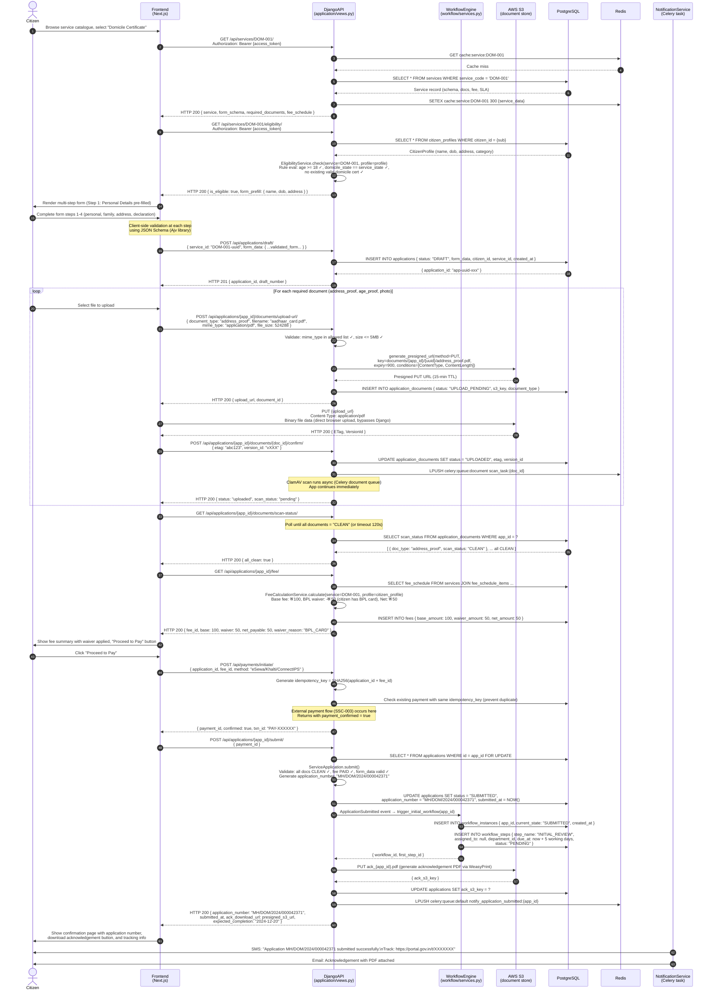
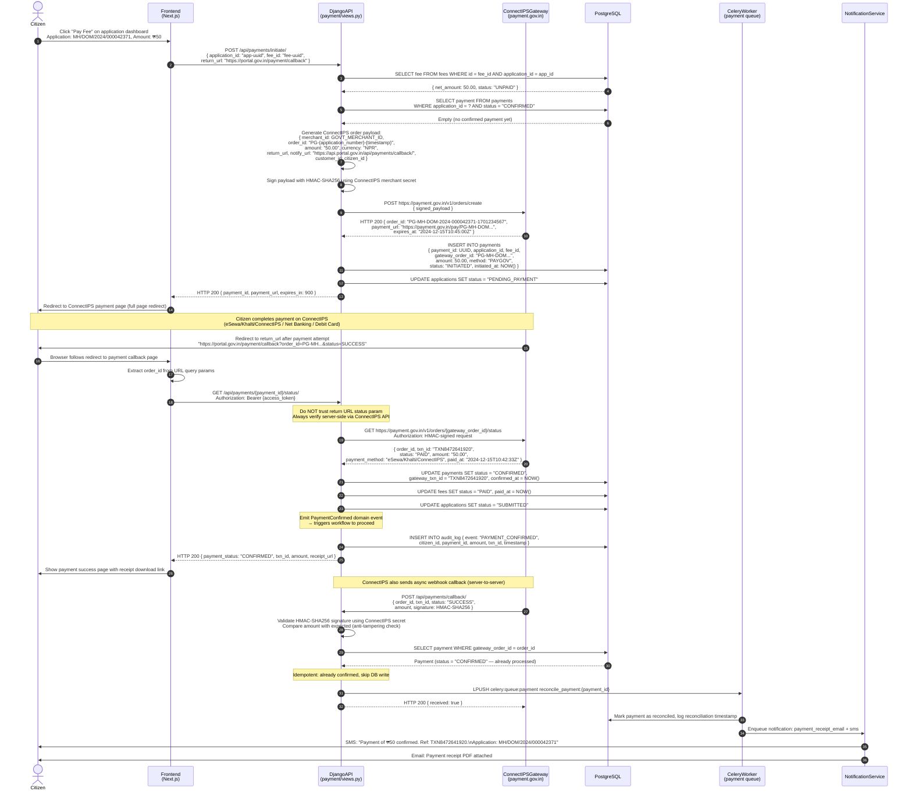
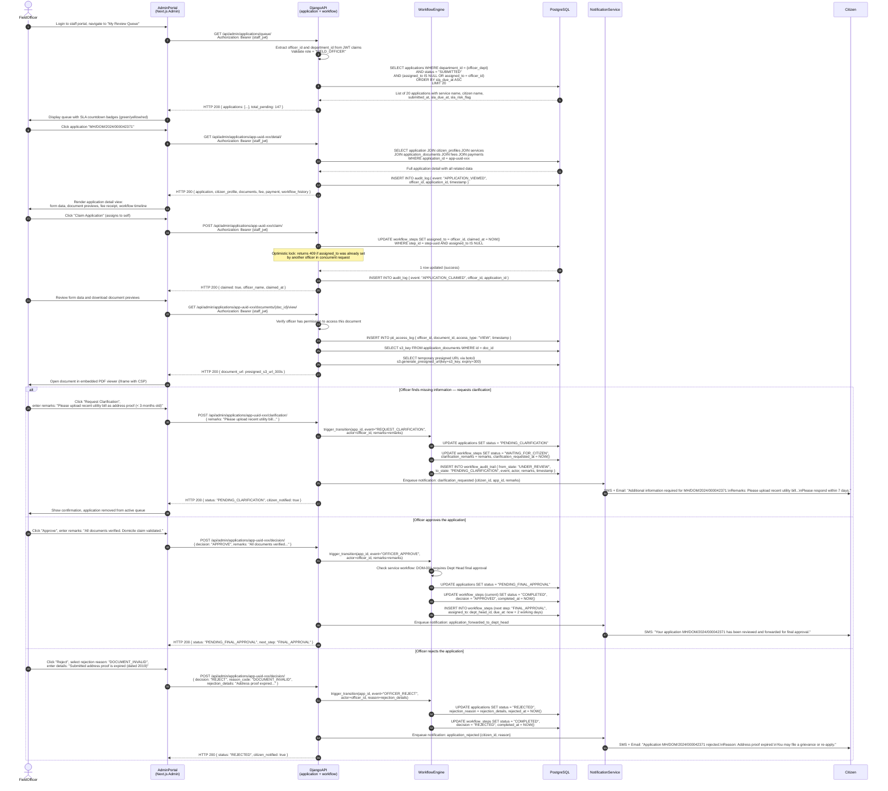
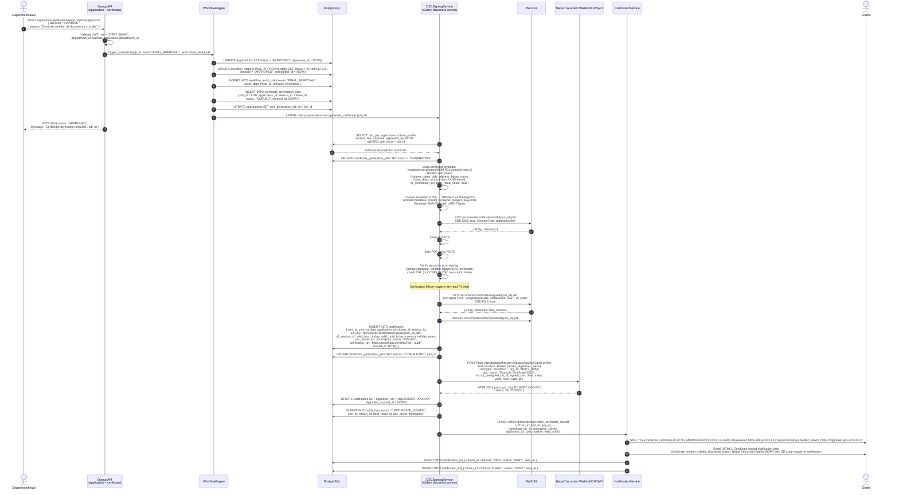
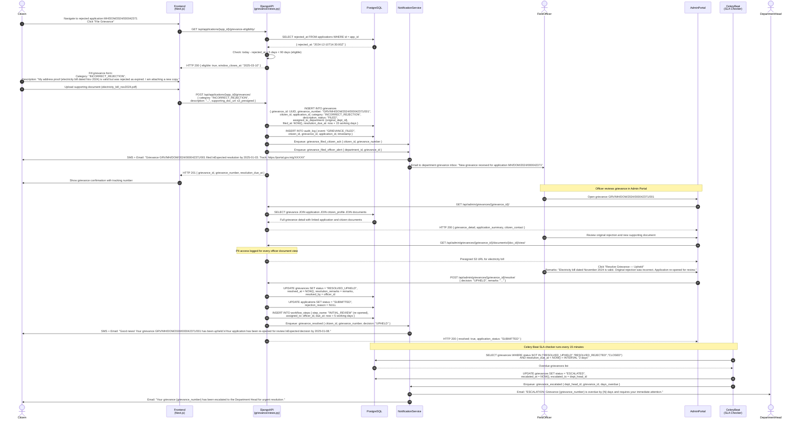

# System Sequence Diagram — Government Services Portal

## 1. Overview

System Sequence Diagrams (SSDs) describe the interactions between external actors and the internal system components for a specific use case, showing the sequence of messages, the actors involved, and the data exchanged. Each SSD in this document corresponds to a key system scenario and is labelled with a unique identifier (SSC-XXX) for traceability to requirements and test cases.

**Participants key used across all diagrams:**
- External actors are shown as `actor` nodes (Citizen, FieldOfficer, DepartmentHead).
- Internal system components are shown as `participant` nodes.
- Thick arrows (`->>`) indicate synchronous calls where the caller waits for a response.
- Dashed arrows (`-->>`) indicate synchronous responses.
- Notes (`Note over`) are used to indicate important business rules or validations.

**Error flows** are noted but not fully diagrammed for brevity. Each happy path diagram is accompanied by a written description of the primary error paths.

---

## 2. SSC-001: Citizen Registration and NID OTP Verification

**Description:** A new citizen visits the portal for the first time. They choose to register using their NID number. The system initiates an OTP to the mobile number linked to their NID account via NASC (National Identity Management Centre). The citizen enters the OTP, NASC (National Identity Management Centre) verifies it, the citizen's profile is created using e-KYC data, and a JWT is issued.

**Primary Error Paths:**
- NASC (National Identity Management Centre) returns `OTP_REQUEST_LIMIT_EXCEEDED`: System returns HTTP 429 with retry-after header.
- NASC (National Identity Management Centre) OTP verification fails (`OTP_INVALID`): System returns HTTP 400; after 5 failures, the session is locked for 30 minutes.
- Mobile number does not match NID-linked mobile: System informs citizen and suggests email OTP fallback.
- Citizen already registered with same NID token: System logs them in instead of re-registering (idempotent).

```mermaid
sequenceDiagram
    autonumber
    actor Citizen
    participant UI as BrowserUI<br/>(Next.js App)
    participant FE as NextJSFrontend<br/>(Server Component)
    participant API as DjangoAPI<br/>(auth/views.py)
    participant NASC (National Identity Management Centre) as NIDNASC (National Identity Management Centre)<br/>(AUA API v2)
    participant SMS as SMSGateway<br/>(MSG91)
    participant DB as PostgreSQL<br/>(identity schema)
    participant Cache as Redis<br/>(session store)

    Citizen->>UI: Navigate to /register, select "Register with NID"
    UI->>FE: GET /register (server-side render)
    FE-->>UI: Render registration form (NID number input + consent checkbox)

    Citizen->>UI: Enter NID number (12 digits), tick consent checkbox, click "Get OTP"
    UI->>UI: Client-side validation: Luhn-like NID checksum (Verhoeff algorithm)

    UI->>API: POST /api/auth/aadhaar/otp/initiate<br/>{ aadhaar_number: "XXXX XXXX XXXX", consent: true }
    Note over API: Rate limit check: max 5 OTP requests per IP per 10 min<br/>Validate consent = true (mandatory)

    API->>Cache: INCR ratelimit:otp:ip:{client_ip}<br/>GET current count
    Cache-->>API: count = 1 (within limit)

    API->>API: Encrypt NID number for NASC (National Identity Management Centre) transmission<br/>(RSA-2048 with NASC (National Identity Management Centre) public key)<br/>Generate txn_id (UUID v4)

    API->>NASC (National Identity Management Centre): POST https://auth.uidai.gov.in/otp<br/>{ uid: "<encrypted_aadhaar>", ac: "<AUA_code>",<br/>sa: "<sub_AUA>", ver: "2.0",<br/>txn: "<txn_id>", type: "A" }<br/>Request signed with AUA private key (pkcs1v15 + SHA-256)
    NASC (National Identity Management Centre)-->>API: HTTP 200 { ret: "y", txn: "<txn_id>",<br/>info: "OTP sent to registered mobile XXXXXX7891" }

    Note over API: NASC (National Identity Management Centre) sends OTP directly to citizen's<br/>NID-linked mobile — NOT via portal

    API->>Cache: SETEX otp_session:{txn_id} 300<br/>{ aadhaar_hash: SHA256(aadhaar), attempt_count: 0, ip: client_ip }
    API-->>UI: HTTP 200 { txn_id: "<txn_id>", expires_in: 300,<br/>masked_mobile: "XXXXXX7891" }

    UI->>Citizen: Display OTP entry screen with 5-minute countdown<br/>Show masked mobile number for confirmation

    Citizen->>UI: Enter 6-digit OTP received on mobile
    UI->>API: POST /api/auth/aadhaar/otp/verify<br/>{ txn_id: "<txn_id>", otp: "483921" }

    API->>Cache: GET otp_session:{txn_id}
    Cache-->>API: Session data (not expired, attempt_count < 5)
    API->>Cache: HINCRBY otp_session:{txn_id} attempt_count 1

    API->>API: Prepare PID block: encrypt OTP with<br/>NASC (National Identity Management Centre) session key (AES-256-GCM)<br/>Build XML Auth request per NASC (National Identity Management Centre) spec

    API->>NASC (National Identity Management Centre): POST https://auth.uidai.gov.in/auth<br/>{ uid: "<encrypted_aadhaar>", txn: "<txn_id>",<br/>pid: "<encrypted_pid_block_with_otp>",<br/>uses: { pi: "y", pa: "y", bio: "n" },<br/>ac: "<AUA_code>" }<br/>Signed with AUA key

    NASC (National Identity Management Centre)-->>API: HTTP 200 { ret: "y", txn: "<txn_id>",<br/>info: "<base64_encrypted_eKYC>" }

    API->>API: Decrypt e-KYC response using AUA session key<br/>Extract KYC: { name, dob, gender, address, co, pc }

    API->>DB: SELECT citizen_id FROM citizens<br/>WHERE aadhaar_token = SHA256(aadhaar + salt)
    DB-->>API: Empty result (new citizen)

    API->>DB: BEGIN TRANSACTION
    API->>DB: INSERT INTO citizens<br/>{ citizen_id: UUID, aadhaar_token: SHA256(aadhaar+salt),<br/>mobile: NASC (National Identity Management Centre)_linked_mobile,<br/>mobile_verified: true, aadhaar_verified: true,<br/>status: "ACTIVE", created_at: NOW() }
    API->>DB: INSERT INTO citizen_profiles<br/>{ profile_id: UUID, citizen_id: new_id,<br/>full_name: eKYC.name, date_of_birth: eKYC.dob,<br/>gender: eKYC.gender, address: eKYC.address,<br/>kyc_verified_at: NOW(), kyc_source: "AADHAAR_EKYC" }
    API->>DB: INSERT INTO consent_records<br/>{ citizen_id, consent_type: "AADHAAR_EKYC",<br/>consent_given: true, consent_at: NOW(),<br/>ip_address, user_agent, text_version: "v2.1" }
    API->>DB: COMMIT

    API->>DB: INSERT INTO audit_log<br/>{ event: "CITIZEN_REGISTERED", citizen_id,<br/>auth_type: "AADHAAR_OTP", ip_address, timestamp }

    API->>API: Generate RS256 JWT access token<br/>{ sub: citizen_id, role: "citizen",<br/>aadhaar_verified: true, exp: now+900 }
    API->>API: Generate RS256 JWT refresh token<br/>{ sub: citizen_id, type: "refresh", jti: UUID, exp: now+604800 }

    API->>Cache: SETEX session:{citizen_id} 604800<br/>{ refresh_jti: jti_hash, ip, user_agent, created_at }
    API->>Cache: DEL otp_session:{txn_id}

    API-->>UI: HTTP 201 { access_token, refresh_token,<br/>expires_in: 900, citizen_id, is_new_registration: true }
    Note over UI: Store access_token in React province (memory only)<br/>Set refresh_token in httpOnly Secure SameSite=Strict cookie

    UI->>Citizen: Redirect to /dashboard with welcome banner<br/>"Registration successful! Welcome, {name}."
```

---

## 3. SSC-002: Submit Service Application (Happy Path)

**Description:** An authenticated citizen selects a service (e.g., "Domicile Certificate"), checks eligibility, fills the multi-step form, uploads required documents, and submits the application. The workflow engine creates the first review step and the citizen receives an acknowledgement.

**Primary Error Paths:**
- Citizen is ineligible for the service: System displays the failing rule and suggests an alternative service.
- Uploaded document fails virus scan: System rejects the document and prompts re-upload.
- Payment fails or is abandoned: Application stays in `PENDING_PAYMENT` province; citizen can resume from their dashboard.
- Duplicate application detected (INV-009): System links citizen to their existing active application.



---

## 4. SSC-003: Fee Payment via ConnectIPS

**Description:** A citizen with a submitted application (or one pending payment) initiates fee payment through ConnectIPS. ConnectIPS hosts the payment page. On completion, ConnectIPS sends a callback to the portal, which records the payment and updates the application status.

**Primary Error Paths:**
- ConnectIPS callback signature validation fails: Payment is marked suspicious; Celery reconciliation job resolves within 24 hours.
- Citizen abandons payment on ConnectIPS: Application remains in `PENDING_PAYMENT`; citizen can retry from dashboard.
- ConnectIPS returns payment failure: System records failure, presents retry option, sends failure notification.
- Webhook is received but application payment already confirmed (duplicate callback): Idempotency key prevents double-recording; 200 OK returned to ConnectIPS with no DB write.



---

## 5. SSC-004: Field Officer Reviews Application

**Description:** A Field Officer logs into the admin portal, picks an application from their review queue, reviews the form and documents, and either requests clarification from the citizen or makes an approve/reject decision.

**Primary Error Paths:**
- Officer tries to review an application outside their department: API returns HTTP 403 Forbidden.
- Application is already being reviewed by another officer (concurrent review): Optimistic lock prevents double assignment; second officer sees "already claimed" message.
- Citizen does not respond to clarification within the SLA: System auto-escalates to Department Head after configured waiting period.



---

## 6. SSC-005: Certificate Issuance by Department Head

**Description:** After a Field Officer forwards an application for final approval, the Department Head reviews it and approves it. The system triggers certificate generation: a PDF is generated, digitally signed using DSC, uploaded to S3, pushed to the citizen's Nepal Document Wallet (NDW), and the citizen is notified.

**Primary Error Paths:**
- DSC HSM signing fails (token not connected, PIN locked): Task retried up to 3 times; after 3 failures, P1 alert raised to platform team. Certificate job marked `SIGNING_FAILED`; manual intervention required.
- Nepal Document Wallet (NDW) push fails (citizen has not linked Nepal Document Wallet (NDW)): Certificate is still issued and available for download from portal. Nepal Document Wallet (NDW) push is retried for 7 days before being marked permanently failed.
- Certificate template rendering fails (missing data field): Error captured in Sentry; certificate job marked `GENERATION_FAILED`; alert sent to backend team.



---

## 7. SSC-006: Grievance Filing and Resolution

**Description:** A citizen files a grievance regarding their rejected application (or a service-related complaint). The grievance is automatically routed to the concerned department. A Field Officer responds. If unresolved within SLA, it escalates to the Department Head.

**Primary Error Paths:**
- Citizen attempts to file a grievance after the 90-day appeal window: System returns HTTP 400 with `GrievanceWindowExpiredError`.
- Department does not respond within SLA (15 days): Celery Beat job detects overdue grievance and escalates to Department Head, sending alert.
- Grievance escalation to province grievance portal (CPGRAMS) is triggered by the Super Admin for unresolved complaints older than 30 days.



---

## 8. Sequence Diagram Notes

The following table summarises key technical decisions and patterns that are visible across the sequence diagrams above.

| # | Pattern / Decision | Diagrams | Technical Detail |
|---|---|---|---|
| SDN-001 | **Server-side JWT validation on every API call** | SSC-001 through SSC-006 | Django API extracts `sub`, `role`, `department_id` from RS256 JWT on every request. No session database lookup required for authentication. Refresh token is validated against Redis session store for revocation detection. |
| SDN-002 | **Direct-to-S3 document upload (pre-signed URLs)** | SSC-002 | Citizens upload documents directly to S3 using pre-signed PUT URLs. The Django API is never in the document upload data path, eliminating bandwidth bottleneck on API containers. API only handles metadata; S3 handles bytes. |
| SDN-003 | **Asynchronous virus scanning** | SSC-002 | ClamAV scan is non-blocking. The citizen can fill other form steps while the scan runs. The submission endpoint polls for scan completion and blocks only at the final submit step. |
| SDN-004 | **Idempotency keys on payment operations** | SSC-003 | All ConnectIPS order creation requests include an idempotency key (`SHA256(application_id + fee_id)`). Webhook callbacks are processed with a Redis idempotency check to prevent duplicate payment confirmations even if ConnectIPS retries the webhook. |
| SDN-005 | **Never trust redirect-based payment status** | SSC-003 | When ConnectIPS redirects the citizen back to the portal, the portal always performs an active server-side status query to ConnectIPS's order API, ignoring any status in the redirect URL parameters. This prevents tampering with the redirect URL to bypass payment. |
| SDN-006 | **Optimistic locking for application claim** | SSC-004 | The `UPDATE workflow_steps SET assigned_to = ? WHERE step_id = ? AND assigned_to IS NULL` query uses the database's atomic update as the lock mechanism. A return of `0 rows affected` signals a concurrent claim by another officer (HTTP 409). |
| SDN-007 | **Immutable audit log entries** | SSC-001 through SSC-006 | Every state transition, document access, payment event, and login event creates an `INSERT INTO audit_log` record. There are no UPDATE or DELETE operations on the audit log table. The DB role has INSERT-only permission on this table. |
| SDN-008 | **DSC signing in Celery worker, not API server** | SSC-005 | Certificate signing is computationally intensive and involves HSM I/O. Running it in a dedicated Celery worker (document queue) prevents it from blocking API response threads. The worker has direct access to the HSM via PKCS#11 over a TLS connection to AWS CloudHSM. |
| SDN-009 | **Nepal Document Wallet (NDW) push is non-blocking** | SSC-005 | Certificate is marked as ISSUED in the portal database as soon as DSC signing completes. Nepal Document Wallet (NDW) push happens in the same Celery task but after the DB write. If Nepal Document Wallet (NDW) push fails, the certificate is still accessible on the portal; the push is retried asynchronously. |
| SDN-010 | **Celery Beat for SLA enforcement** | SSC-006 (escalation), SSC-002 (SLA tracking) | A Celery Beat job runs every 15 minutes to detect SLA breaches. It does NOT send notifications synchronously — it enqueues notification tasks. This means SLA alerts may lag by up to 15 minutes from the exact breach moment, which is acceptable per product SLA. |
| SDN-011 | **PII access logging for all officer document views** | SSC-004, SSC-006 | Every time an officer requests a document's presigned URL, an entry is written to the `pii_access_log` table before the URL is generated. This creates an auditable trail of who accessed which citizen document and when, even if the document was never actually opened (pre-signed URL generated but not fetched). |
| SDN-012 | **Application re-opening via grievance upheld** | SSC-006 | A grievance decision of `UPHELD` directly modifies the linked application's status from `REJECTED` back to `SUBMITTED` and creates a new workflow step, effectively reopening the application. This is a domain service operation within the Grievance context that crosses into the Application context via a published service call (not direct model access). |
