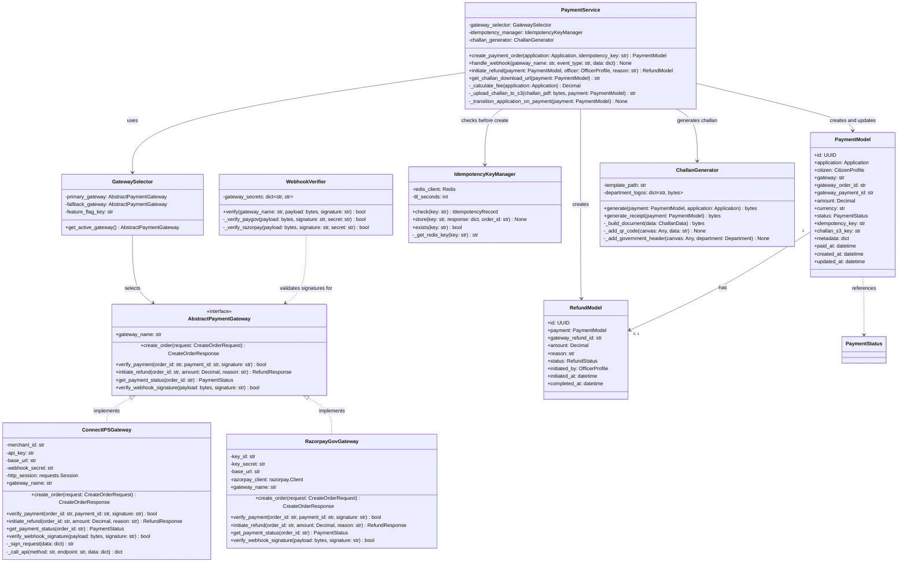
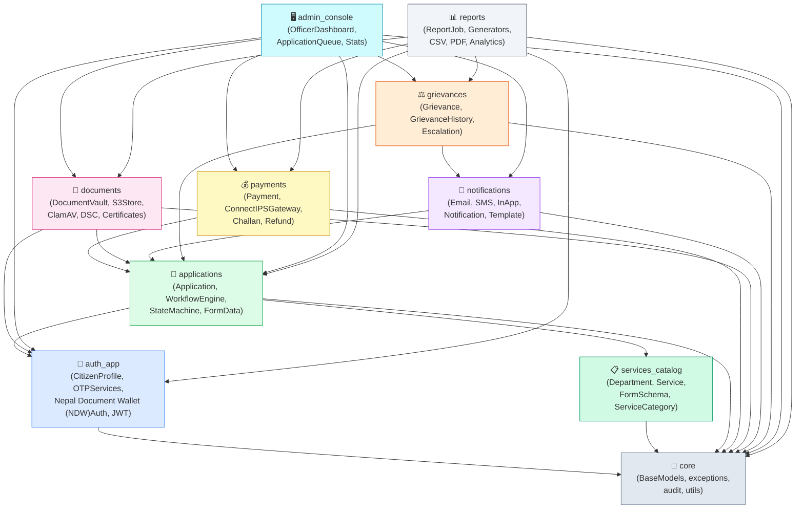

# C4 Code Diagram — Government Services Portal

## Overview of C4 Level 4 (Code-Level Diagrams)

The C4 model (Context, Container, Component, Code) provides a hierarchical way to describe the architecture of a software system. Level 4 — Code — zooms into the internals of individual components to show the classes, interfaces, and relationships that implement each major subsystem.

This document contains five Level 4 code diagrams covering the most complex and security-critical parts of the Government Services Portal:

1. **Application Workflow State Machine** — the engine that drives every citizen application through its lifecycle.
2. **Authentication Flow Classes** — NID OTP, JWT issuance, and rate-limiting infrastructure.
3. **Payment Processing Classes** — multi-gateway payment orchestration with idempotency.
4. **Document Management Classes** — secure document storage, virus scanning, DSC signing, and certificate generation.

Each diagram is followed by a prose description of the key design decisions. A module dependency graph and annotated directory tree complete the document.

---

## Code Diagram 1: Application Workflow State Machine

The state machine is implemented as a pure Python class hierarchy with no external FSM library. This design was chosen to keep the transition rules auditable, testable, and transparent to compliance reviewers.

```mermaid
classDiagram
    direction LR

    class ApplicationState {
        <<enumeration>>
        DRAFT
        SUBMITTED
        PAYMENT_PENDING
        PAYMENT_COMPLETE
        UNDER_REVIEW
        PENDING_CLARIFICATION
        DOCUMENT_VERIFICATION
        APPROVED
        CERTIFICATE_GENERATION
        COMPLETED
        REJECTED
        WITHDRAWN
    }

    class ActorType {
        <<enumeration>>
        CITIZEN
        OFFICER
        SYSTEM
    }

    class TransitionValidator {
        <<interface>>
        +validate(application: Application, actor: Any) bool
        +get_failure_reason() str
    }

    class DocumentsCompleteValidator {
        -required_document_types: list~str~
        +validate(application: Application, actor: Any) bool
        +get_failure_reason() str
    }

    class FeeCalculatedValidator {
        +validate(application: Application, actor: Any) bool
        +get_failure_reason() str
    }

    class PaymentCompleteValidator {
        +validate(application: Application, actor: Any) bool
        +get_failure_reason() str
    }

    class Transition {
        +from_state: ApplicationState
        +to_state: ApplicationState
        +actor: ActorType
        +action: str
        +validators: list~TransitionValidator~
        +side_effect_tasks: list~str~
        +is_valid_for(application: Application, actor: Any) bool
        +get_validation_errors() list~str~
    }

    class ApplicationStateMachine {
        -transitions: list~Transition~
        +get_allowed_transitions(province: ApplicationState, actor_type: ActorType) list~Transition~
        +transition(application: Application, to_state: ApplicationState, actor: Any, note: str) Application
        +can_transition(application: Application, to_state: ApplicationState, actor: Any) bool
        -_find_transition(from_state: ApplicationState, to_state: ApplicationState) Transition
        -_validate_transition(transition: Transition, application: Application, actor: Any) None
        -_dispatch_side_effects(transition: Transition, application: Application) None
    }

    class ApplicationModel {
        +id: UUID
        +reference_number: str
        +province: ApplicationState
        +service: Service
        +citizen: CitizenProfile
        +assigned_officer: OfficerProfile
        +form_data: dict
        +submitted_at: datetime
        +sla_due_at: datetime
        +created_at: datetime
        +updated_at: datetime
        +get_allowed_next_states(actor_type: ActorType) list~ApplicationState~
    }

    class ApplicationStateHistory {
        +id: UUID
        +application: ApplicationModel
        +from_state: ApplicationState
        +to_state: ApplicationState
        +actor_type: ActorType
        +actor_id: UUID
        +note: str
        +created_at: datetime
    }

    class WorkflowService {
        -state_machine: ApplicationStateMachine
        +submit_application(application: ApplicationModel, citizen: CitizenProfile) ApplicationModel
        +initiate_payment(application: ApplicationModel) ApplicationModel
        +mark_payment_complete(application: ApplicationModel, payment: Payment) ApplicationModel
        +assign_to_officer(application: ApplicationModel, officer: OfficerProfile) ApplicationModel
        +approve(application: ApplicationModel, officer: OfficerProfile, note: str) ApplicationModel
        +reject(application: ApplicationModel, officer: OfficerProfile, reason: str) ApplicationModel
        +request_clarification(application: ApplicationModel, officer: OfficerProfile, notes: str) ApplicationModel
        +withdraw(application: ApplicationModel, citizen: CitizenProfile) ApplicationModel
        -_record_transition(application: ApplicationModel, from_state: ApplicationState, to_state: ApplicationState, actor_type: ActorType, actor_id: UUID, note: str) None
    }

    class StateTransitionCeleryTask {
        +send_submission_confirmation(application_id: str) None
        +create_payment_order(application_id: str) None
        +assign_to_officer(application_id: str) None
        +send_status_update(application_id: str, old_state: str, new_state: str) None
        +generate_certificate(application_id: str) None
        +expire_stale_draft(application_id: str) None
    }

    TransitionValidator <|.. DocumentsCompleteValidator : implements
    TransitionValidator <|.. FeeCalculatedValidator : implements
    TransitionValidator <|.. PaymentCompleteValidator : implements

    Transition "1" *-- "0..*" TransitionValidator : contains
    ApplicationStateMachine "1" *-- "1..*" Transition : owns
    ApplicationStateMachine ..> ApplicationModel : operates on
    ApplicationStateMachine ..> StateTransitionCeleryTask : dispatches

    WorkflowService "1" --> "1" ApplicationStateMachine : uses
    WorkflowService ..> ApplicationModel : mutates
    WorkflowService ..> ApplicationStateHistory : creates

    ApplicationModel "1" --> "1" ApplicationState : has
    ApplicationStateHistory "many" --> "1" ApplicationModel : records
```



### Design Notes — State Machine

**Why a pure Python state machine?** External FSM libraries (django-fsm, transitions) add complexity and obscure the transition rules in decorator magic. The explicit `Transition` dataclass makes every allowed state change visible in a single file (`state_machine.py`), which is important for government compliance audits.

**Why validators as a list of callable objects?** Each validator implements a single responsibility. The `DocumentsCompleteValidator` checks that all required document types have been uploaded and virus-scanned. The `FeeCalculatedValidator` checks that the fee has been computed. Composing validators allows reuse across transitions without code duplication.

**Side effects are dispatched asynchronously.** The `state_machine.transition()` method completes the database write inside a transaction and *then* dispatches Celery tasks for notifications and downstream processing. If a Celery task fails, the state transition is not rolled back — the task is retried independently.

---

## Code Diagram 2: Authentication Flow Classes

```mermaid
classDiagram
    direction TB

    class AbstractOTPService {
        <<abstract>>
        +request_otp(identifier: str) OTPRequestResult
        +verify_otp(identifier: str, otp: str, transaction_id: str) OTPVerifyResult
        #_generate_transaction_id() str
        #_store_transaction(transaction_id: str, identifier: str, ttl_seconds: int) None
    }

    class NIDOTPService {
        -uidai_client: UIDaiApiClient
        -otp_tracker: OTPAttemptTracker
        +request_otp(aadhaar_number: str) OTPRequestResult
        +verify_otp(aadhaar_number: str, otp: str, transaction_id: str) OTPVerifyResult
        -_call_uidai_api(aadhaar_number: str) dict
        -_encrypt_aadhaar(aadhaar_number: str) bytes
        -_generate_session_key() bytes
        -_hash_aadhaar(aadhaar_number: str) str
    }

    class EmailOTPService {
        -ses_client: boto3.client
        -otp_tracker: OTPAttemptTracker
        +request_otp(email: str) OTPRequestResult
        +verify_otp(email: str, otp: str, transaction_id: str) OTPVerifyResult
        -_generate_totp(secret: str) str
        -_send_email(email: str, otp: str) None
    }

    class SMSOTPService {
        -sns_client: boto3.client
        -otp_tracker: OTPAttemptTracker
        +request_otp(phone_number: str) OTPRequestResult
        +verify_otp(phone_number: str, otp: str, transaction_id: str) OTPVerifyResult
        -_generate_totp(secret: str) str
        -_send_sms(phone_number: str, otp: str) None
    }

    class OTPAttemptTracker {
        -redis_client: Redis
        -max_attempts: int
        -window_seconds: int
        +check_rate_limit(identifier: str) bool
        +record_attempt(identifier: str, is_successful: bool) None
        +get_attempt_count(identifier: str) int
        +reset_attempts(identifier: str) None
        -_get_redis_key(identifier: str) str
    }

    class UIDaiApiClient {
        -aua_code: str
        -asa_code: str
        -api_key: str
        -base_url: str
        -uidai_public_key: rsa.PublicKey
        +request_otp(encrypted_payload: bytes, txn: str) dict
        +verify_auth(encrypted_payload: bytes, txn: str, otp_encrypted: bytes) dict
        -_build_auth_xml(data: dict) str
        -_sign_request(xml: str) str
    }

    class CitizenModel {
        +id: UUID
        +aadhaar_hash: str
        +phone_number: str
        +email: str
        +full_name: str
        +digilocker_uid: str
        +is_aadhaar_verified: bool
        +is_phone_verified: bool
        +is_email_verified: bool
        +last_login_method: str
        +is_active: bool
        +created_at: datetime
        +updated_at: datetime
    }

    class JWTTokenService {
        +create_tokens_for_citizen(citizen: CitizenModel) TokenPair
        +refresh_access_token(refresh_token: str) str
        +blacklist_token(refresh_token: str) None
        +decode_token(token: str) dict
        -_build_custom_claims(citizen: CitizenModel) dict
    }

    class RedisSessionStore {
        -redis_client: Redis
        -ttl_seconds: int
        +store_otp_session(transaction_id: str, data: dict) None
        +get_otp_session(transaction_id: str) dict
        +delete_otp_session(transaction_id: str) None
        +exists(key: str) bool
    }

    class CitizenAuthView {
        <<APIView>>
        +authentication_classes: list
        +permission_classes: list
        +throttle_classes: list
        +post(request: Request) Response
    }

    class NIDOTPRequestView {
        <<CitizenAuthView>>
        -aadhaar_service: NIDOTPService
        +post(request: Request) Response
    }

    class NIDOTPVerifyView {
        <<CitizenAuthView>>
        -aadhaar_service: NIDOTPService
        -jwt_service: JWTTokenService
        +post(request: Request) Response
    }

    class Nepal Document Wallet (NDW)AuthService {
        -client_id: str
        -client_secret: str
        -redirect_uri: str
        +get_authorization_url(province: str) str
        +exchange_code_for_token(code: str, verifier: str) Nepal Document Wallet (NDW)Tokens
        +fetch_citizen_profile(access_token: str) Nepal Document Wallet (NDW)Profile
        +pull_document(access_token: str, doc_type: str, doc_uri: str) bytes
        -_generate_pkce_pair() tuple~str, str~
    }

    AbstractOTPService <|-- NIDOTPService : extends
    AbstractOTPService <|-- EmailOTPService : extends
    AbstractOTPService <|-- SMSOTPService : extends

    NIDOTPService --> UIDaiApiClient : calls
    NIDOTPService --> OTPAttemptTracker : checks
    NIDOTPService --> RedisSessionStore : stores session
    EmailOTPService --> OTPAttemptTracker : checks
    SMSOTPService --> OTPAttemptTracker : checks

    OTPAttemptTracker --> RedisSessionStore : uses Redis

    NIDOTPRequestView --> NIDOTPService : delegates to
    NIDOTPVerifyView --> NIDOTPService : delegates to
    NIDOTPVerifyView --> JWTTokenService : issues tokens
    NIDOTPVerifyView ..> CitizenModel : creates or fetches

    JWTTokenService ..> CitizenModel : reads claims from
    Nepal Document Wallet (NDW)AuthService ..> CitizenModel : updates on callback
```

### Design Notes — Authentication

**OTP services share an abstract base class.** All three OTP methods (NID, Email, SMS) share the same `request_otp` / `verify_otp` contract, making it easy to add a fourth method (e.g., voice OTP) without changing the view layer.

**`OTPAttemptTracker` uses a Redis sliding window counter.** It stores attempt timestamps in a sorted set with score = Unix timestamp. To check the rate limit, it counts entries in the window `(now - 900, now]`. This gives accurate sliding-window rate limiting without drift.

**`UIDaiApiClient` encapsulates all NASC (National Identity Management Centre) cryptographic complexity.** The NASC (National Identity Management Centre) API requires AES session key generation, RSA encryption of the session key with the NASC (National Identity Management Centre) public key, and XML construction. This complexity is isolated in a single class that is easily mockable in tests.

**JWT tokens use RS256.** The backend signs tokens with an RSA private key; the frontend (and any future microservice) can verify tokens using only the public key. This eliminates the need to share a symmetric secret.

---

## Code Diagram 3: Payment Processing Classes



### Design Notes — Payment

**`AbstractPaymentGateway` enables transparent failover.** The `GatewaySelector` reads a feature flag (stored in Redis) at request time. If ConnectIPS is flagged as degraded, it returns `RazorpayGovGateway` instead. The `PaymentService` is unaware of which gateway is in use — this makes failover zero-code-change.

**Idempotency is enforced at the service layer.** Before calling `gateway.create_order()`, `PaymentService` queries `IdempotencyKeyManager`. If the key exists, the cached response is returned immediately. This prevents duplicate orders when the citizen's browser retries a timed-out payment initiation request.

**`WebhookVerifier` is stateless.** It contains only the HMAC verification logic and no database access. This makes it safe to call before any other processing, including database queries, ensuring that spoofed webhooks are rejected before touching application province.

**Monetary values are always `Decimal`.** The `amount` field in `PaymentModel` is a `DecimalField(max_digits=10, decimal_places=2)`. Float arithmetic is forbidden for all fee and payment calculations.

---

## Code Diagram 4: Document Management Classes

```mermaid
classDiagram
    direction TB

    class AbstractVirusScanner {
        <<interface>>
        +scan(file_bytes: bytes) ScanResult
        +is_clean(file_bytes: bytes) bool
    }

    class ClamAVScanner {
        -host: str
        -port: int
        -pyclamd_client: pyclamd.ClamdNetworkSocket
        +scan(file_bytes: bytes) ScanResult
        +is_clean(file_bytes: bytes) bool
        -_connect() None
        -_stream_scan(file_bytes: bytes) dict
    }

    class S3DocumentStore {
        -bucket_name: str
        -kms_key_id: str
        -s3_client: boto3.client
        +generate_presigned_upload_url(s3_key: str, content_type: str, max_size_bytes: int, ttl_seconds: int) PresignedUploadUrl
        +generate_presigned_download_url(s3_key: str, ttl_seconds: int) str
        +get_object_bytes(s3_key: str) bytes
        +delete_object(s3_key: str) None
        +object_exists(s3_key: str) bool
        -_build_s3_key(citizen_id: UUID, document_type: str, file_id: UUID) str
        -_get_presigned_post_conditions(max_size_bytes: int, content_type: str) list
    }

    class KMSEncryptionHelper {
        -kms_client: boto3.client
        -key_id: str
        +generate_data_key() tuple~bytes, bytes~
        +encrypt(plaintext: bytes) bytes
        +decrypt(ciphertext: bytes) bytes
    }

    class DocumentModel {
        +id: UUID
        +application: Application
        +citizen: CitizenProfile
        +document_type: str
        +original_filename: str
        +s3_key: str
        +content_type: str
        +file_size_bytes: int
        +checksum_sha256: str
        +status: DocumentStatus
        +source: DocumentSource
        +is_verified: bool
        +virus_scan_result: str
        +scanned_at: datetime
        +officer_remarks: str
        +created_at: datetime
        +updated_at: datetime
    }

    class DocumentStatus {
        <<enumeration>>
        PENDING_UPLOAD
        UPLOADED
        SCANNING
        CLEAN
        QUARANTINED
        VERIFIED
        REJECTED
    }

    class DocumentSource {
        <<enumeration>>
        CITIZEN_UPLOAD
        DIGILOCKER
        SYSTEM_GENERATED
    }

    class Nepal Document Wallet (NDW)Client {
        -client_id: str
        -client_secret: str
        -base_url: str
        -http_session: requests.Session
        +get_authorization_url(province: str, code_challenge: str) str
        +exchange_code(code: str, code_verifier: str) Nepal Document Wallet (NDW)Tokens
        +get_user_profile(access_token: str) Nepal Document Wallet (NDW)Profile
        +pull_document(access_token: str, uri: str) bytes
        +list_issued_documents(access_token: str) list~Nepal Document Wallet (NDW)Document~
        -_generate_pkce_pair() tuple~str, str~
        -_refresh_token(refresh_token: str) Nepal Document Wallet (NDW)Tokens
    }

    class DSCSigningService {
        -dsc_service_url: str
        -http_session: requests.Session
        -service_api_key: str
        +sign_pdf(pdf_bytes: bytes, signer_info: SignerInfo) bytes
        +verify_signature(pdf_bytes: bytes) SignatureVerificationResult
        -_call_signing_endpoint(payload: dict) dict
        -_build_signer_info(application: Application) SignerInfo
    }

    class CertificateGenerator {
        -template_registry: dict~str, CertificateTemplate~
        +generate(application: Application, certificate_type: str) bytes
        +generate_with_qr(application: Application, certificate_type: str, verify_url: str) bytes
        -_get_template(certificate_type: str) CertificateTemplate
        -_populate_template(template: CertificateTemplate, data: dict) bytes
        -_add_government_seal(canvas: Any, department: Department) None
        -_add_qr_code(canvas: Any, url: str) None
        -_add_watermark(canvas: Any, text: str) None
    }

    class DocumentVaultService {
        -s3_store: S3DocumentStore
        -virus_scanner: AbstractVirusScanner
        -dsc_service: DSCSigningService
        -certificate_generator: CertificateGenerator
        +initiate_upload(application: Application, document_type: str, filename: str, content_type: str, file_size: int) PresignedUploadResponse
        +confirm_upload(document_id: UUID, s3_key: str) DocumentModel
        +scan_document(document_id: UUID) ScanResult
        +verify_document(document_id: UUID, officer: OfficerProfile, remarks: str) DocumentModel
        +reject_document(document_id: UUID, officer: OfficerProfile, reason: str) DocumentModel
        +import_from_digilocker(application: Application, access_token: str, doc_uri: str, doc_type: str) DocumentModel
        +generate_and_sign_certificate(application: Application, certificate_type: str) DocumentModel
        +get_download_url(document_id: UUID, citizen: CitizenProfile) str
    }

    AbstractVirusScanner <|.. ClamAVScanner : implements

    DocumentVaultService --> S3DocumentStore : stores to
    DocumentVaultService --> AbstractVirusScanner : scans with
    DocumentVaultService --> DSCSigningService : signs with
    DocumentVaultService --> CertificateGenerator : generates with
    DocumentVaultService --> Nepal Document Wallet (NDW)Client : imports from
    DocumentVaultService --> DocumentModel : creates and updates

    S3DocumentStore --> KMSEncryptionHelper : encrypts with

    DocumentModel --> DocumentStatus : has
    DocumentModel --> DocumentSource : has
```

### Design Notes — Document Management

**`DocumentVaultService` is the single facade.** All document operations — upload initiation, virus scanning, Nepal Document Wallet (NDW) import, certificate generation, and download — go through this class. Views never call `S3DocumentStore` directly. This enforces the invariant that documents cannot be stored without virus scanning.

**Uploads use the presigned URL pattern.** The backend never receives file bytes. It generates an S3 presigned POST URL with policy conditions (content-type, max-size). The frontend uploads directly to S3. This offloads bandwidth and avoids buffering large files in the application tier.

**ClamAV scanning is synchronous in the Celery task.** When `scan_document(document_id)` is called, the task downloads the object from S3 into memory (capped at 5 MB) and streams it to the ClamAV daemon. The result is recorded on the `DocumentModel`. If a threat is detected, the document is moved to the quarantine prefix in S3 and the citizen is notified.

**DSC signing happens in an internal microservice.** The `DSCSigningService` is a thin HTTP client. The actual signing logic, HSM interaction, and private key access live in a separate `dsc-service` container on the private VPC. This isolation means the application server never has access to the DSC private key material.

---

## Module Dependency Graph

This graph shows the Django application dependency structure. An arrow from A to B means "app A imports from app B". Circular imports between apps are forbidden.



### Dependency Rules

- **`core`** has no imports from other apps. It is the foundation.
- **`auth_app`** imports only from `core`. It knows nothing about applications or payments.
- **`services_catalog`** imports only from `core`. It defines what services exist, not how applications work.
- **`applications`** is the central orchestration app. It imports `auth_app` (to link citizen) and `services_catalog` (to link service). It does **not** import `payments` or `documents` — those apps import `applications`.
- **`payments`** and **`documents`** import `applications` to link their records to applications. They do not import each other.
- **`notifications`** imports `applications` for context but is not imported by `applications` — the workflow engine dispatches Celery tasks by name (string references), avoiding import cycles.
- **`admin_console`** and **`reports`** are leaf nodes — they import everything but are imported by nothing.

---

## Key File Structure

The following annotated directory tree shows the exact expected file layout for the Django backend. New files must be added in the correct location according to this structure.

```
backend/
├── config/
│   ├── __init__.py
│   ├── settings/
│   │   ├── __init__.py
│   │   ├── base.py           # Shared settings for all environments
│   │   ├── dev.py            # Development overrides (DEBUG=True, local DB)
│   │   ├── staging.py        # Staging overrides
│   │   └── prod.py           # Production overrides (no DEBUG, strict security)
│   ├── urls.py               # Root URL configuration — includes each app's urls.py
│   ├── wsgi.py
│   ├── asgi.py
│   └── celery.py             # Celery app initialisation and beat schedule
│
├── apps/
│   ├── core/
│   │   ├── models.py         # TimeStampedModel, UUIDModel, SoftDeleteModel
│   │   ├── exceptions.py     # GSPBaseException, all custom exception classes
│   │   ├── audit.py          # AuditEvent dataclass, log_audit_event()
│   │   ├── permissions.py    # IsCitizenUser, IsOfficerUser, IsDepartmentAdmin
│   │   ├── pagination.py     # CursorPaginationClass (default page_size=20, max=100)
│   │   ├── renderers.py      # Custom JSON renderer (wraps errors in {error: {...}})
│   │   ├── middleware.py     # RequestIDMiddleware, PiiMaskingMiddleware
│   │   └── utils/
│   │       ├── crypto.py     # hash_aadhaar(), verify_verhoeff()
│   │       ├── dates.py      # calculate_sla_due_date() with holiday calendar
│   │       └── validators.py # validate_aadhaar_verhoeff(), validate_e164_phone()
│   │
│   ├── auth_app/
│   │   ├── models.py         # CitizenProfile, OTPAttempt
│   │   ├── serializers.py    # NIDOTPRequestSerializer, OTPVerifySerializer
│   │   ├── views.py          # NIDOTPRequestView, Nepal Document Wallet (NDW)CallbackView, etc.
│   │   ├── urls.py           # /api/v1/auth/...
│   │   ├── services.py       # NIDOTPService, EmailOTPService, SMSOTPService
│   │   ├── jwt_service.py    # JWTTokenService
│   │   ├── digilocker.py     # Nepal Document Wallet (NDW)Client, Nepal Document Wallet (NDW)AuthService
│   │   ├── uidai_client.py   # UIDaiApiClient
│   │   ├── rate_limiting.py  # OTPAttemptTracker (Redis sliding window)
│   │   ├── permissions.py    # IsVerifiedCitizen
│   │   ├── admin.py          # CitizenProfile admin (read-only, PII masked)
│   │   └── tests/
│   │       ├── factories.py          # CitizenProfileFactory, OTPAttemptFactory
│   │       ├── test_models.py
│   │       ├── test_services.py      # NIDOTPService, EmailOTPService tests
│   │       ├── test_views.py         # API endpoint integration tests
│   │       ├── test_jwt_service.py
│   │       └── test_digilocker.py
│   │
│   ├── services_catalog/
│   │   ├── models.py         # Department, Service, ServiceCategory
│   │   ├── serializers.py    # DepartmentSerializer, ServiceSerializer, ServiceDetailSerializer
│   │   ├── views.py          # ServiceListView, ServiceDetailView, CategoryListView
│   │   ├── urls.py           # /api/v1/services/...
│   │   ├── filters.py        # ServiceFilter (department, category, search, is_online)
│   │   ├── admin.py          # Full CRUD for Department, Service, ServiceCategory
│   │   └── tests/
│   │       ├── factories.py
│   │       ├── test_models.py
│   │       └── test_views.py
│   │
│   ├── applications/
│   │   ├── models.py         # Application, ApplicationStateHistory, ApplicationDocument
│   │   ├── serializers.py    # ApplicationCreateSerializer, ApplicationDetailSerializer
│   │   ├── views.py          # ApplicationCreateView, ApplicationSubmitView, etc.
│   │   ├── urls.py           # /api/v1/applications/...
│   │   ├── state_machine.py  # ApplicationState, Transition, ApplicationStateMachine
│   │   ├── services.py       # WorkflowService, ApplicationService
│   │   ├── selectors.py      # get_applications_for_officer(), get_citizen_applications()
│   │   ├── tasks.py          # send_submission_confirmation, assign_to_officer, etc.
│   │   ├── validators.py     # DocumentsCompleteValidator, FeeCalculatedValidator
│   │   ├── reference_gen.py  # generate_reference_number() — format DEPT/YEAR/SEQUENCE
│   │   └── tests/
│   │       ├── factories.py
│   │       ├── test_state_machine.py  # Full transition matrix coverage
│   │       ├── test_services.py
│   │       ├── test_views.py
│   │       └── test_tasks.py
│   │
│   ├── payments/
│   │   ├── models.py         # Payment, Refund, IdempotencyRecord
│   │   ├── serializers.py    # PaymentCreateSerializer, WebhookEventSerializer
│   │   ├── views.py          # PaymentCreateView, ConnectIPSWebhookView, RefundView
│   │   ├── urls.py           # /api/v1/payments/...
│   │   ├── services.py       # PaymentService
│   │   ├── gateways/
│   │   │   ├── __init__.py
│   │   │   ├── base.py       # AbstractPaymentGateway
│   │   │   ├── paygov.py     # ConnectIPSGateway
│   │   │   ├── razorpay.py   # RazorpayGovGateway
│   │   │   └── selector.py   # GatewaySelector
│   │   ├── challan.py        # ChallanGenerator (ReportLab PDF)
│   │   ├── idempotency.py    # IdempotencyKeyManager (Redis)
│   │   ├── webhook.py        # WebhookVerifier
│   │   ├── tasks.py          # process_webhook_event, retry_failed_payments
│   │   └── tests/
│   │       ├── factories.py
│   │       ├── test_gateways.py
│   │       ├── test_services.py
│   │       ├── test_webhook.py
│   │       └── test_idempotency.py
│   │
│   ├── documents/
│   │   ├── models.py         # Document, CertificateRecord
│   │   ├── serializers.py    # DocumentPresignSerializer, DocumentConfirmSerializer
│   │   ├── views.py          # DocumentPresignView, DocumentConfirmView, CertDownloadView
│   │   ├── urls.py           # /api/v1/documents/...
│   │   ├── vault_service.py  # DocumentVaultService (main facade)
│   │   ├── s3_store.py       # S3DocumentStore
│   │   ├── kms_helper.py     # KMSEncryptionHelper
│   │   ├── virus_scanner.py  # AbstractVirusScanner, ClamAVScanner
│   │   ├── dsc_service.py    # DSCSigningService (HTTP client to dsc-service)
│   │   ├── certificate_gen.py # CertificateGenerator (ReportLab templates)
│   │   ├── digilocker_import.py # Nepal Document Wallet (NDW) document pull logic
│   │   ├── tasks.py          # scan_document, generate_certificate
│   │   └── tests/
│   │       ├── factories.py
│   │       ├── test_vault_service.py
│   │       ├── test_clamav.py
│   │       └── test_certificate_gen.py
│   │
│   ├── notifications/
│   │   ├── models.py         # Notification, NotificationTemplate
│   │   ├── backends/
│   │   │   ├── email.py      # SES email backend
│   │   │   ├── sms.py        # SNS SMS backend
│   │   │   └── in_app.py     # In-app notification backend
│   │   ├── services.py       # NotificationService
│   │   ├── tasks.py          # send_notification, retry_failed_notifications
│   │   └── tests/
│   │       ├── factories.py
│   │       └── test_services.py
│   │
│   ├── grievances/
│   │   ├── models.py         # Grievance, GrievanceHistory
│   │   ├── serializers.py
│   │   ├── views.py          # GrievanceCreateView, GrievanceTrackView
│   │   ├── urls.py
│   │   ├── services.py       # GrievanceService, EscalationService
│   │   ├── tasks.py          # check_sla_breach, auto_escalate
│   │   └── tests/
│   │
│   ├── admin_console/
│   │   ├── views.py          # OfficerDashboardView, ApplicationQueueView
│   │   ├── serializers.py
│   │   ├── urls.py
│   │   ├── selectors.py      # get_officer_queue(), get_department_stats()
│   │   └── tests/
│   │
│   └── reports/
│       ├── models.py         # ReportJob
│       ├── views.py          # ReportCreateView, ReportStatusView, ReportDownloadView
│       ├── urls.py
│       ├── generators/
│       │   ├── applications_summary.py
│       │   ├── payment_reconciliation.py
│       │   └── sla_compliance.py
│       ├── tasks.py          # generate_report_task
│       └── tests/
│
└── requirements/
    ├── base.txt
    ├── dev.txt       # base.txt + pytest, factory-boy, black, mypy, etc.
    └── prod.txt      # base.txt + gunicorn, sentry-sdk
```

---

## Operational Policy Addendum

### 1. Citizen Data Privacy Policies

- **NID non-storage mandate:** The NID number must never be stored in any database table, log file, S3 object, or caching layer. Only the SHA-256 hash (`aadhaar_hash`) is persisted. Any code that would write the raw NID number to any persistent medium must be immediately escalated as a critical security defect.
- **Column-level encryption for PII:** The `full_name`, `email`, `phone_number`, and `address` fields in `CitizenProfile` are encrypted using application-layer AES-256-GCM encryption before being stored. The encryption key is stored in AWS Secrets Manager and retrieved at application startup.
- **Audit on PII access:** Every API endpoint that returns citizen PII in its response body must call `log_audit_event()` with `event_type="PII_ACCESSED"`, recording the requesting officer's identity, the citizen's ID (not their PII), and the timestamp. This log is retained for 3 years.
- **Data minimisation in API responses:** Serializers must explicitly declare every field included in responses using `fields = [...]`. Wildcard serializers (`fields = '__all__'`) are forbidden. Officer-facing serializers must not return the `aadhaar_hash` field.
- **Right to erasure implementation:** `DELETE /api/v1/auth/account/` pseudonymises the citizen record: `full_name` is replaced with "DELETED_CITIZEN", `phone_number` with a UUID-derived placeholder, `email` with "deleted@deleted.invalid", and `aadhaar_hash` is re-hashed with a per-citizen salt so it cannot be used for re-identification. Applications in terminal provinces (COMPLETED, REJECTED, WITHDRAWN) are retained for audit purposes with PII stripped.

### 2. Service Delivery SLA Policies

- **SLA enforcement is code-driven, not manual.** The `sla_due_at` field on every `Application` is calculated and set at the moment of submission by `calculate_sla_due_date(service.processing_days_sla, submitted_at, state_code)`, which accounts for province-specific public holidays using `workalendar`. This field is immutable after submission.
- **SLA clock pausing:** When an application enters `PENDING_CLARIFICATION` province, a `sla_pause_start` timestamp is recorded. When the citizen responds and the application re-enters `UNDER_REVIEW`, a `sla_pause_duration_hours` is added to `sla_due_at`. This is enforced by the `WorkflowService` and cannot be bypassed.
- **Automated SLA breach detection:** A Celery beat task runs every hour and queries for applications where `sla_due_at < now()` and `province NOT IN (COMPLETED, REJECTED, WITHDRAWN, PENDING_CLARIFICATION)`. Breach events trigger escalation notifications to the department head and auto-assign the application to the senior officer.
- **SLA compliance reporting:** Monthly SLA compliance figures (percentage of applications completed within SLA, per service and per department) are automatically computed and emailed to department heads on the first working day of each month.

### 3. Fee and Payment Policies

- **Server-side fee calculation only.** The `fee_structure` JSONB in the `Service` model is the sole source of truth for fees. No fee amount may be accepted from the frontend. The `PaymentService.create_payment_order()` method always calls `_calculate_fee(application)` to determine the payable amount; it does not accept an `amount` parameter from the caller.
- **BPL and exemption verification.** Fee exemptions (BPL, disability, senior citizen) are verified against the citizen's profile attributes, which are populated from Nepal Document Wallet (NDW) document data. An officer cannot manually grant or override a fee exemption; exemptions are computed deterministically from citizen attributes.
- **Zero-fee handling.** Services with a computed fee of रू0 (e.g., after 100% BPL exemption) skip the payment gateway entirely. The application state machine transitions directly from `SUBMITTED` to `PAYMENT_COMPLETE` with a system-generated zero-amount `Payment` record for audit continuity.
- **Partial refund restrictions.** Partial refunds are not supported. Only full refunds are permitted. The refund amount is always equal to the original `payment.amount`. Refunds require an officer with the `payments.can_initiate_refund` permission and are recorded in the `Refund` model with the initiating officer's identity for audit.

### 4. System Availability Policies

- **Zero-downtime deployments.** All production deployments use ECS rolling updates with `minimumHealthyPercent=100` and `maximumPercent=200`. Database migrations must be backward-compatible (new columns must be nullable or have defaults; column renames must use the add-then-deprecate pattern). The `django-pg-zero-downtime-migrations` library enforces safe migration patterns at CI time.
- **Graceful shutdown.** ECS task containers handle `SIGTERM` by completing in-flight requests within a 30-second drain window before exiting. Celery workers handle `SIGTERM` by completing the current task (with a 5-minute hard limit) before shutting down. Tasks that would exceed the limit are re-queued automatically.
- **Circuit breakers for external dependencies.** All calls to NASC (National Identity Management Centre), Nepal Document Wallet (NDW), ConnectIPS, and the DSC service are wrapped with a circuit breaker (using `pybreaker`) that opens after 5 consecutive failures and stays open for 60 seconds. While open, the circuit breaker returns a cached error response immediately, protecting the application from cascading failures caused by slow external APIs.
- **Observability requirements.** Every new Django app must configure structured logging with `structlog` to emit JSON log lines to CloudWatch Logs. Every new Celery task must emit task-start and task-complete metrics to CloudWatch. Every new API endpoint must be covered by a CloudWatch alarm for P95 latency exceeding 2 seconds averaged over 5 minutes.
