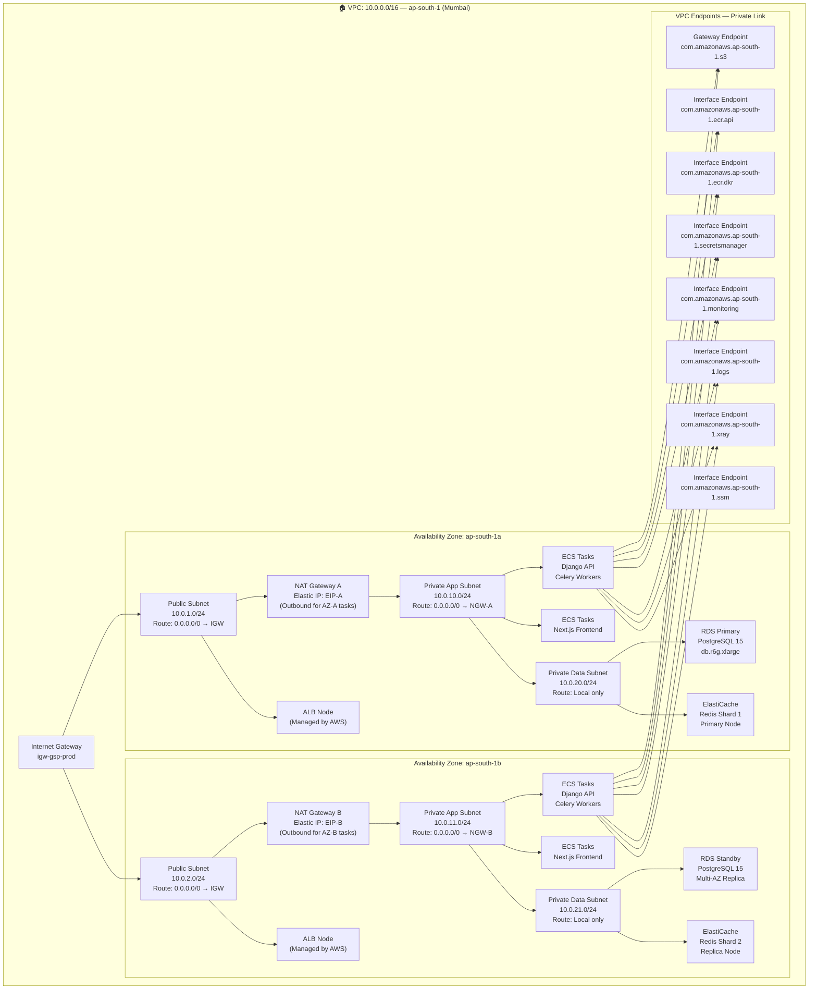

# Cloud Architecture — Government Services Portal

## 1. Overview

The Government Services Portal cloud architecture is designed around six core AWS Well-Architected Framework pillars applied to the Nepali government context: **Operational Excellence**, **Security** (aligned with CERT-In and MeitY Cloud Policy 2022), **Reliability** (99.9% uptime SLA), **Performance Efficiency**, **Cost Optimisation**, and **Sustainability**.

All infrastructure is defined and managed as **Infrastructure as Code (IaC)** using **AWS CloudFormation** (primary) with Terraform modules used for shared networking components. No manual console changes are permitted in production; every change flows through the CI/CD pipeline with peer review and automated drift detection via **AWS Config**.

The architecture uses the `ap-south-1` (Mumbai) AWS region as its primary region because:
- It satisfies the **MeitY Data Localisation** requirement for citizen data to remain within Nepal's geographical boundary
- It is the closest AWS region to the majority of Nepali citizens, minimising latency
- It supports all required services (ECS Fargate, RDS Multi-AZ, ElastiCache, WAF, Shield Advanced, GuardDuty)

Cross-region disaster recovery uses `ap-southeast-1` (Singapore) for data backup replication; no live workloads run outside Nepal.

---

## 2. AWS Account Structure

### 2.1 Multi-Account Strategy

The portal uses an **AWS Organizations** structure with separate accounts to enforce strong blast-radius isolation between environments and shared services.

```
AWS Organizations Root (Management Account)
├── Organizational Unit: Government Services Portal
│   ├── Production Account      (gsp-prod)           — Live citizen-facing workloads
│   ├── Staging Account         (gsp-staging)         — Pre-production integration testing
│   ├── Development Account     (gsp-dev)             — Developer sandbox, short-lived environments
│   └── Shared Services Account (gsp-shared-services) — ECR, Secrets Manager cross-account, CI/CD roles
└── Organizational Unit: Security & Audit
    ├── Security Tooling Account (gsp-security)        — GuardDuty master, Security Hub, Macie
    └── Audit/Log Archive Account (gsp-audit)          — Immutable CloudTrail, Config snapshot archive
```

### 2.2 Account-Level Controls

- **Service Control Policies (SCPs)** are attached at the OU level:
  - `DenyLeaveOrganization` — prevents accounts from leaving the org
  - `RequireRegionRestriction` — allows resource creation only in `ap-south-1` and `ap-southeast-1` (DR backups only)
  - `DenyRootAccountActivity` — blocks all root user API activity except billing
  - `RequireIMDSv2` — enforces IMDSv2 on all EC2 instances (applies to ECS launch types too)
  - `DenyDisableCloudTrail` — prevents CloudTrail from being disabled or modified
- **AWS Config** is enabled in all accounts with a delegated administrator in `gsp-security`
- **AWS CloudTrail** organisation trail records all API calls; logs delivered to `gsp-audit` account S3 bucket with Object Lock
- **AWS Security Hub** aggregates findings from GuardDuty, Inspector, Macie, and Config across all accounts

---

## 3. VPC Architecture Diagram



### 3.1 Subnet Sizing and IP Allocation

| Subnet | CIDR | Usable IPs | Hosts | Purpose |
|---|---|---|---|---|
| Public AZ-A | 10.0.1.0/24 | 251 | ALB nodes, NAT GW | Internet-facing edge |
| Public AZ-B | 10.0.2.0/24 | 251 | ALB nodes, NAT GW | Internet-facing edge |
| Private App AZ-A | 10.0.10.0/24 | 251 | ECS Fargate tasks (ENIs) | Application compute |
| Private App AZ-B | 10.0.11.0/24 | 251 | ECS Fargate tasks (ENIs) | Application compute |
| Private Data AZ-A | 10.0.20.0/24 | 251 | RDS primary, ElastiCache | Data persistence |
| Private Data AZ-B | 10.0.21.0/24 | 251 | RDS standby, ElastiCache | Data persistence |

> Fargate tasks each consume one ENI from the private app subnet. With max 20 API tasks + 10 worker tasks + 10 frontend tasks = 40 ENIs per AZ maximum. The /24 subnet provides 251 usable addresses, giving ample headroom.

---

## 4. AWS Services Inventory

| Service | AWS Offering | Configuration | Region | Purpose | Monthly Cost Est. |
|---|---|---|---|---|---|
| Container Compute | ECS Fargate | 2–40 tasks, mixed CPU/mem | ap-south-1 | Run all application containers without managing servers | रू35,000–रू1,20,000 (elastic) |
| Relational Database | RDS PostgreSQL 15 | db.r6g.xlarge, Multi-AZ, 500 GB gp3, 7-day PITR | ap-south-1 | Primary application database — citizen records, applications, audit logs | रू55,000 |
| In-Memory Cache / Broker | ElastiCache Redis 7 | cache.r6g.large, 2 shards, 1 replica each, cluster mode | ap-south-1 | Django cache, Celery task broker, session store, rate-limit counters | रू25,000 |
| Object Storage | Amazon S3 | Standard + IA + Glacier, versioning, SSE-KMS, CORS | ap-south-1 | Documents, certificates, static assets, access logs | रू3,000–रू8,000 |
| CDN | CloudFront | 2 distributions, custom origins, WAF integration, HTTP/2 | Global | Static asset delivery, TLS termination, DDoS absorption | रू5,000–रू12,000 |
| DNS | Route 53 | 1 public hosted zone, health checks, alias records | Global | Authoritative DNS for portal.gov.in, failover routing | रू800 |
| Web Application Firewall | AWS WAF v2 | Web ACL, managed rule groups, custom rate-limit rules, logging | ap-south-1 | OWASP Top 10 protection, rate limiting, bot control | रू6,000 |
| DDoS Protection | Shield Advanced | Enabled org-wide, SRT access, L3/L4/L7 protection | Global | Advanced DDoS mitigation, cost protection, SRT response | रू1,10,000 (fixed) |
| Secrets Management | Secrets Manager | 15 secrets, 30-day auto-rotation, KMS-encrypted | ap-south-1 | Store DB credentials, API keys, Django secret key | रू500 |
| Observability — Metrics & Logs | CloudWatch | Container Insights, 20 custom metrics, 15 dashboards, 90-day retention | ap-south-1 | Metrics, logs, alarms, dashboards for all services | रू4,000 |
| Distributed Tracing | X-Ray | 10% sampling rate (100% for errors), service map | ap-south-1 | End-to-end request tracing, performance bottleneck identification | रू1,500 |
| Transactional Email | SES | Production mode, DKIM/DMARC, dedicated IP | ap-south-1 | Email OTP, application status notifications, receipts | रू2,000 |
| SMS / Push | SNS | SMS Transactional, Nepal DND filter compliance | ap-south-1 | SMS OTP delivery, citizen push notifications | रू3,000 |
| Container Registry | ECR Private | Image scanning on push, immutable tags, lifecycle policy | ap-south-1 | Store and version Docker images for all services | रू500 |
| Load Balancer | ALB | HTTPS listener, HTTP→HTTPS redirect, access logs to S3 | ap-south-1 | Route traffic to ECS target groups, SSL offloading | रू4,500 |
| TLS Certificates | ACM | 3 certificates (portal.gov.in, *.portal.gov.in, api.portal.gov.in) | ap-south-1 | Free managed TLS certificates, auto-renewal | रू0 (free) |
| Threat Detection | GuardDuty | Enabled: EC2, S3, EKS findings, malware protection | ap-south-1 | Continuous threat detection, anomalous API call detection | रू3,500 |
| Configuration Compliance | AWS Config | 35 managed rules, continuous recording, conformance pack | ap-south-1 | Track resource configuration changes, compliance auditing | रू2,000 |
| Encryption Key Management | AWS KMS | 6 CMKs (RDS, S3-docs, S3-certs, Redis, Secrets, CloudWatch), annual rotation | ap-south-1 | Envelope encryption for all data at rest | रू1,200 |
| Identity & Access | IAM | 8 roles, least-privilege policies, no long-lived access keys | Global | Control AWS API access for services, CI/CD, and humans | रू0 (free) |

---

## 5. Security Architecture

### 5.1 IAM Roles

#### `gsp-ecs-task-role` — Application Runtime Permissions
Assumed by: ECS tasks (API, Workers, Frontend)

```json
{
  "Version": "2012-10-17",
  "Statement": [
    {
      "Sid": "S3DocumentsAccess",
      "Effect": "Allow",
      "Action": ["s3:GetObject", "s3:PutObject", "s3:DeleteObject"],
      "Resource": [
        "arn:aws:s3:::gsp-documents-prod/*",
        "arn:aws:s3:::gsp-certificates-prod/*"
      ]
    },
    {
      "Sid": "S3StaticReadOnly",
      "Effect": "Allow",
      "Action": ["s3:GetObject"],
      "Resource": "arn:aws:s3:::gsp-static-prod/*"
    },
    {
      "Sid": "KMSDecryptForS3",
      "Effect": "Allow",
      "Action": ["kms:GenerateDataKey", "kms:Decrypt"],
      "Resource": [
        "arn:aws:kms:ap-south-1:<ACCOUNT>:key/<s3-docs-key-id>",
        "arn:aws:kms:ap-south-1:<ACCOUNT>:key/<s3-certs-key-id>"
      ]
    },
    {
      "Sid": "XRayTracing",
      "Effect": "Allow",
      "Action": ["xray:PutTraceSegments", "xray:PutTelemetryRecords"],
      "Resource": "*"
    },
    {
      "Sid": "SesSendEmail",
      "Effect": "Allow",
      "Action": ["ses:SendEmail", "ses:SendRawEmail"],
      "Resource": "arn:aws:ses:ap-south-1:<ACCOUNT>:identity/portal.gov.in"
    },
    {
      "Sid": "SnsPublishSMS",
      "Effect": "Allow",
      "Action": ["sns:Publish"],
      "Resource": "*",
      "Condition": {
        "StringEquals": { "sns:Protocol": "sms" }
      }
    }
  ]
}
```

#### `gsp-ecs-execution-role` — ECS Agent Permissions
Assumed by: ECS container agent (not application code)

Key permissions:
- `ecr:GetAuthorizationToken`, `ecr:BatchGetImage`, `ecr:GetDownloadUrlForLayer` — pull images from ECR
- `secretsmanager:GetSecretValue` — inject secrets into containers at startup
- `logs:CreateLogStream`, `logs:PutLogEvents` — write container logs to CloudWatch Logs
- `kms:Decrypt` for the Secrets Manager KMS key

#### `gsp-github-actions-deploy` — CI/CD Deploy Role
Assumed by: GitHub Actions via OIDC (no static AWS credentials)

Trust policy condition: `token.actions.githubusercontent.com:sub = repo:govt-india/gsp:ref:refs/heads/main`

Key permissions:
- `ecr:BatchCheckLayerAvailability`, `ecr:PutImage`, `ecr:InitiateLayerUpload` — push images
- `ecs:UpdateService`, `ecs:RegisterTaskDefinition`, `ecs:DescribeServices` — deploy services
- `iam:PassRole` for `gsp-ecs-task-role` and `gsp-ecs-execution-role` (scoped to these ARNs only)
- `codedeploy:CreateDeployment`, `codedeploy:GetDeployment` — trigger blue/green deployments

#### `gsp-rds-monitoring-role`
Assumed by: Enhanced Monitoring for RDS

Permissions: `logs:CreateLogGroup`, `logs:CreateLogStream`, `logs:PutLogEvents`, `logs:DescribeLogStreams`

### 5.2 Security Groups

| Security Group | Name | Inbound Rules | Outbound Rules |
|---|---|---|---|
| `sg-alb` | gsp-alb-sg | 0.0.0.0/0 → TCP 443; 0.0.0.0/0 → TCP 80 | sg-ecs-api → TCP 8000; sg-ecs-frontend → TCP 3000 |
| `sg-ecs-frontend` | gsp-frontend-sg | sg-alb → TCP 3000 | sg-ecs-api → TCP 8000; VPC → TCP 443 (HTTPS to API) |
| `sg-ecs-api` | gsp-api-sg | sg-alb → TCP 8000; sg-ecs-frontend → TCP 8000 | sg-rds → TCP 5432; sg-redis → TCP 6379; VPC → TCP 443 (HTTPS to ext.) |
| `sg-ecs-worker` | gsp-worker-sg | None (no inbound) | sg-rds → TCP 5432; sg-redis → TCP 6379; VPC → TCP 443 |
| `sg-rds` | gsp-rds-sg | sg-ecs-api → TCP 5432; sg-ecs-worker → TCP 5432 | None |
| `sg-redis` | gsp-redis-sg | sg-ecs-api → TCP 6379; sg-ecs-worker → TCP 6379; sg-ecs-frontend → TCP 6379 | None |
| `sg-vpc-endpoints` | gsp-vpce-sg | VPC CIDR (10.0.0.0/16) → TCP 443 | None |

### 5.3 KMS Key Usage

| KMS Key Alias | Key ID (placeholder) | Encrypts | Rotation | Admin Principal |
|---|---|---|---|---|
| `alias/gsp/rds` | `<rds-key-id>` | RDS PostgreSQL storage, automated snapshots | Annual | `gsp-kms-admin` role |
| `alias/gsp/s3-documents` | `<s3-docs-key-id>` | S3 objects in `gsp-documents-prod` | Annual | `gsp-kms-admin` role |
| `alias/gsp/s3-certificates` | `<s3-certs-key-id>` | S3 objects in `gsp-certificates-prod` | Annual | `gsp-kms-admin` role |
| `alias/gsp/elasticache` | `<redis-key-id>` | ElastiCache Redis at-rest encryption | Annual | `gsp-kms-admin` role |
| `alias/gsp/secrets-manager` | `<sm-key-id>` | All secrets in Secrets Manager | Annual | `gsp-kms-admin` role |
| `alias/gsp/cloudwatch-logs` | `<cw-key-id>` | CloudWatch Logs encryption | Annual | `gsp-kms-admin` role |

All CMKs have `kms:ScheduleKeyDeletion` denied for all principals except the break-glass role to prevent accidental deletion. Key material is generated by AWS; no external key material import is used.

---

## 6. Disaster Recovery Architecture

### 6.1 Recovery Objectives

| Tier | RPO (Recovery Point Objective) | RTO (Recovery Time Objective) |
|---|---|---|
| Database (citizen records, applications) | 1 hour | 4 hours |
| Document storage (S3) | 24 hours (replication lag) | 2 hours |
| Application code (container images) | 0 (ECR multi-region replication) | 2 hours |
| Full portal restoration | 1 hour data loss | 4 hours downtime |

### 6.2 RDS Backup and Recovery

- **Automated backups:** Enabled with **7-day retention** period. Daily snapshots taken in the RDS maintenance window (02:00–03:00 IST Sunday). Transaction log backup frequency: every 5 minutes (supports Point-in-Time Recovery to any second within the retention window).
- **Cross-region snapshot copy:** A Lambda function triggered by `RDS:CreateDBSnapshot` EventBridge rule automatically copies every daily snapshot to `ap-southeast-1` (Singapore) using the secondary KMS key. This satisfies the 1-hour RPO because PITR logs are also copied.
- **Manual snapshots:** Taken before every production deployment and retained for 30 days.
- **Multi-AZ standby:** The RDS standby in `ap-south-1b` uses synchronous replication. Automatic failover completes in 60–120 seconds without DNS change required (RDS handles the CNAME update).
- **Recovery procedure:** In a full `ap-south-1` outage, restore the latest snapshot to `ap-southeast-1`, update Route 53 failover records, and redeploy ECS services to the DR region using the pre-tested DR CloudFormation stack (`gsp-dr-stack`).

### 6.3 S3 Cross-Region Replication

- Replication rules configured on `gsp-documents-prod` and `gsp-certificates-prod` to replicate to `gsp-documents-dr` and `gsp-certificates-dr` buckets in `ap-southeast-1`
- **Replication Time Control (S3 RTC):** Enabled. AWS guarantees 99.99% of objects replicated within 15 minutes; SLA for DR access is 1 hour.
- Delete markers are **not** replicated — deletion of an object in the primary region does not delete the DR copy
- DR bucket uses the same KMS key ARN (cross-region key policy allows access from DR region ECS role)

### 6.4 ElastiCache Disaster Recovery

- **Multi-AZ with Auto-Failover:** Redis cluster has 2 shards, each with 1 replica in the opposite AZ. If a primary shard node fails, ElastiCache promotes the replica within 30–60 seconds
- Redis is used for transient data only (session tokens, rate-limit counters, Celery task province). Cache misses fall back to the database, so ElastiCache recovery is not on the critical path for the 4-hour RTO
- **Backup:** ElastiCache daily snapshots exported to S3 (`gsp-redis-backup-prod`) for audit purposes; recovery uses a fresh cluster (cache will be cold, database absorbs load temporarily)

### 6.5 Route 53 Health Checks and Failover

- **Primary record:** `api.portal.gov.in` → ALB in `ap-south-1` (FAILOVER primary, health check enabled)
- **Secondary record:** `api.portal.gov.in` → ALB in `ap-southeast-1` DR region (FAILOVER secondary, activated only when primary health check fails for 3 consecutive evaluations at 30-second intervals)
- Health check: HTTPS GET to `api.portal.gov.in/health/` — 2xx response required within 10 seconds
- **Failover RTO impact:** Route 53 DNS propagation adds approximately 60–120 seconds to activation of the DR region; browsers respect TTL (60 seconds on health-check records)

---

## 7. Monitoring and Observability

### 7.1 CloudWatch Alarms

The following critical alarms are configured; all alarm actions trigger PagerDuty via SNS → Lambda → PagerDuty API:

| Alarm Name | Metric | Threshold | Period | Action |
|---|---|---|---|---|
| `gsp-api-5xx-rate` | `ApplicationELB/HTTPCode_Target_5XX_Count` | > 10 per minute | 2 × 60s | P1 Page + CodeDeploy rollback |
| `gsp-api-p99-latency` | `ApplicationELB/TargetResponseTime` (p99) | > 3000 ms | 2 × 60s | P2 Page |
| `gsp-rds-cpu-high` | `RDS/CPUUtilization` | > 85% for 5 min | 3 × 60s | P2 Page |
| `gsp-rds-connections-high` | `RDS/DatabaseConnections` | > 400 (80% of max) | 2 × 60s | P2 Page |
| `gsp-rds-free-storage-low` | `RDS/FreeStorageSpace` | < 50 GB | 1 × 300s | P2 Page + ticket |
| `gsp-redis-evictions` | `ElastiCache/Evictions` | > 100 per minute | 2 × 60s | P3 Ticket |
| `gsp-celery-queue-depth` | Custom: `GSP/CeleryQueueDepth` | > 500 tasks | 3 × 60s | P2 Page |
| `gsp-ecs-api-cpu-high` | `ECS/CPUUtilization` (gsp-api service) | > 90% for 5 min | 3 × 60s | P2 Page |
| `gsp-waf-blocked-requests-spike` | `WAF/BlockedRequests` | > 1000 per minute | 1 × 60s | P2 Page + security team |
| `gsp-guardduty-high-severity` | `GuardDuty/FindingCount` (HIGH/CRITICAL) | > 0 | 1 × 60s | P1 Page + security team |

### 7.2 CloudWatch Dashboards

- **`gsp-operational-overview`** — ALB request rate, 5xx rate, P99 latency, ECS task count, RDS CPU, Redis CPU; updated every 60 seconds
- **`gsp-application-health`** — Django application-level metrics (active applications, pending payments, Celery queue depths, OTP success rate) via custom CloudWatch metrics pushed from the application
- **`gsp-infrastructure-cost`** — Daily spend by service using Cost Explorer embedded widget; budget alert at 110% of monthly estimate
- **`gsp-security-posture`** — WAF blocked request trend, GuardDuty finding counts by severity, Config compliance score, failed login attempts per minute

### 7.3 X-Ray Distributed Tracing

- **Sampling rate:** 10% of all requests (configurable); 100% sampling for requests with HTTP 4xx/5xx responses
- **Instrumented components:**
  - Django middleware: `aws_xray_sdk.ext.django` adds trace IDs to all incoming requests
  - `requests` / `boto3` — patched via `xray_recorder.patch_all()` to trace outbound HTTP and AWS SDK calls
  - Celery tasks: custom `before_task_publish` and `task_prerun` signals create subsegments for async work
  - RDS queries traced via Django ORM SQL tracing subsegment
- **Service map** generated automatically in X-Ray console showing call graph: CloudFront → ALB → Django API → RDS/Redis/S3/Nepal Document Wallet (NDW)/ConnectIPS
- Trace IDs are propagated to the frontend via `X-Amzn-Trace-Id` response header, enabling correlation between frontend Next.js errors and backend Django traces

### 7.4 CloudWatch Log Groups

| Log Group | Retention | Source | Notes |
|---|---|---|---|
| `/ecs/gsp-api` | 90 days | ECS API containers | Django application logs, request logs |
| `/ecs/gsp-frontend` | 90 days | ECS Frontend containers | Next.js server logs |
| `/ecs/gsp-celery-worker` | 90 days | ECS Worker containers | Celery task execution logs |
| `/ecs/gsp-celery-beat` | 90 days | ECS Beat container | Schedule execution logs |
| `/aws/rds/instance/gsp-prod-db/postgresql` | 30 days | RDS PostgreSQL | Slow query log (>1s), error log |
| `/aws/elasticache/cluster/gsp-redis-prod` | 30 days | ElastiCache Redis | Redis slow log |
| `/aws/waf/gsp-prod-web-acl` | 180 days | WAF | All allowed + blocked requests |
| `/aws/cloudtrail/gsp-org-trail` | 365 days | CloudTrail (all accounts) | All AWS API activity |
| `/aws/guardduty/findings` | 365 days | GuardDuty | Security threat findings |

All log groups with citizen PII exposure (`/ecs/gsp-api`, `/ecs/gsp-celery-worker`) are encrypted with `alias/gsp/cloudwatch-logs` KMS key. Metric filters extract business metrics (application submissions, payment counts) from log patterns and push to custom CloudWatch namespace `GSP/Application`.

### 7.5 CloudWatch Container Insights

ECS Container Insights is enabled on the `gsp-production` cluster. It automatically collects:
- Per-task CPU and memory utilisation
- Network I/O per task
- Storage I/O per task
- Container restart counts
- Task start/stop events with reasons

Insights data is retained for 15 days in the Container Insights storage tier (high resolution) and summarised to 1-minute metrics in standard CloudWatch.

---

## 8. Cost Optimisation Strategies

### 8.1 Fargate Spot for Non-Critical Workloads

- **Celery Workers** are configured with a mixed capacity strategy: 50% Fargate On-Demand (for urgent tasks in `payments` and `notifications` queues) + 50% Fargate Spot (for `document_processing` and `bulk_email` queues).
- Fargate Spot tasks handle graceful SIGTERM via Celery's `acks_late=True` and `reject_on_worker_lost=True` — in-progress tasks are re-queued on Spot interruption (30-second warning).
- Expected Fargate Spot discount: **60–70%** off On-Demand price for eligible tasks.

### 8.2 S3 Intelligent-Tiering and Lifecycle Policies

- **`gsp-documents-prod`:** Intelligent-Tiering enabled. Objects not accessed for 90 days move to Infrequent Access tier automatically; objects not accessed for 180 days move to Archive Instant Access. Expected storage cost reduction: 40% over 12 months.
- **`gsp-certificates-prod`:** Objects use S3 Object Lock (WORM); lifecycle moves to S3 Glacier after 2 years and schedules deletion per record retention schedule (7 years minimum).
- **`gsp-logs-prod`:** Access logs transitioned to S3 Standard-IA after 30 days, Glacier after 90 days, deleted after 365 days.
- **`gsp-static-prod`:** Static assets with content hashes never change; set `Cache-Control: max-age=31536000, immutable` so CloudFront serves from edge cache, reducing origin requests by ~95%.

### 8.3 RDS Reserved Instances

- The `db.r6g.xlarge` RDS instance is purchased on a **1-year Reserved Instance** (No Upfront) for the production primary and standby, saving approximately **40%** versus On-Demand pricing.
- Staging uses On-Demand with a **scheduled auto-stop** outside business hours (08:00–20:00 IST weekdays only) using an EventBridge rule + Lambda, saving ~65% of staging RDS costs.

### 8.4 CloudFront and Data Transfer Optimisation

- **Compressed responses:** CloudFront Brotli/gzip compression enabled for text content types. Reduces origin data transfer by ~70% for HTML/JS/CSS.
- **ALB access logging** is enabled but filtered: only 5xx, 4xx, and slow (>2s) requests are forwarded to CloudWatch Logs from S3 using a Firehose transformation Lambda, reducing CloudWatch ingestion costs.
- **CloudFront Price Class:** `PriceClass_200` (Americas, Europe, Asia Pacific) is used instead of all edge locations. Since the portal serves Nepali citizens, Nepali and South Asian edge locations (included in Price Class 200) provide the necessary performance.

---

## 9. Operational Policy Addendum

### 9.1 Access Management and Least Privilege Policy

- No IAM user long-lived access keys are permitted in the production account. All human access uses **AWS IAM Identity Center (SSO)** with SAML 2.0 federation to the government identity provider (NIC IAM). Sessions are limited to 8 hours.
- Developers have read-only access to production CloudWatch Logs and X-Ray. Write access to production infrastructure requires a separate elevated role obtained via a just-in-time access request workflow (ServiceNow + Slack approval).
- The **break-glass** IAM role (`gsp-break-glass-admin`) has full administrator access and is stored in a locked KMS-encrypted Secrets Manager secret. Its use triggers an SNS alert to the CISO and is audited in CloudTrail. It is reviewed and rotated monthly.
- All IAM role trust policies use `aws:PrincipalTag` conditions where applicable to enforce attribute-based access control (ABAC), preventing lateral movement even within the same account.

### 9.2 Patch Management and Vulnerability Remediation

- **Container images** are rebuilt weekly via a scheduled GitHub Actions workflow that pulls the latest `python:3.11-slim-bookworm` base image, even if no application code changed. This ensures OS-level patches are applied promptly.
- ECR Inspector automatically scans all images on push. Critical CVEs (CVSS ≥ 9.0) block deployment via a GitHub Actions status check that queries the ECR scan result API.
- **RDS** uses the `auto minor version upgrade: enabled` setting. Major version upgrades (e.g., PostgreSQL 15 → 16) are planned, tested in staging, and applied during a scheduled maintenance window.
- A monthly patching review meeting evaluates Inspector findings, GuardDuty findings, and Security Hub scores, producing a remediation action list tracked in Jira.

### 9.3 Compliance and Audit Policy

- **CloudTrail** is enabled as an organisation trail in the management account; all member accounts forward events. Trail logs are stored in the `gsp-audit` account S3 bucket with Object Lock (COMPLIANCE mode, 7-year retention), preventing tampering by any account including root.
- **AWS Config** runs 35 managed rules covering: encrypted volumes, public S3 buckets, unrestricted security groups, MFA on IAM users, CloudTrail enabled, RDS backup enabled, etc. Config conformance pack `Operational-Best-Practices-for-MeitY` is applied.
- **VAPT (Vulnerability Assessment and Penetration Testing)** is conducted by a CERT-In empanelled organisation once every 6 months. Findings are tracked to closure before the next assessment. Reports are submitted to the CISO and NIC security team.
- A **Quarterly Access Review** is conducted for all IAM roles, SSO assignments, and database users. Unused roles (no activity in 90 days) are disabled pending review and deleted after 30 additional days.

### 9.4 Business Continuity and DR Testing Policy

- **DR drills** are conducted semi-annually (April and October). The drill simulates a full `ap-south-1` region outage and validates recovery to `ap-southeast-1` within the 4-hour RTO. Results are documented and reviewed.
- **Chaos Engineering:** Monthly controlled failure injection using AWS Fault Injection Simulator (FIS) experiments:
  - `gsp-rds-failover-experiment` — triggers RDS Multi-AZ failover; validates application reconnection within 3 minutes
  - `gsp-az-outage-experiment` — stops all ECS tasks in `ap-south-1a`; validates AZ-b absorbs 100% traffic
  - `gsp-celery-queue-overload-experiment` — publishes 1000 dummy tasks; validates auto-scaling response
- All experiment results, anomalies, and remediations are logged in the engineering runbook wiki and linked to the corresponding Jira tickets.
- **Runbooks** for common operational scenarios (RDS failover, ECS service restart, Celery queue drain, WAF IP unblock) are maintained in Confluence and reviewed quarterly by the operations team.
