# Deployment Diagram — Government Services Portal

## 1. Overview

The Government Services Portal is deployed on Amazon Web Services (AWS) using a containerised, cloud-native architecture that meets NIC/GIGW compliance requirements, the MeitY cloud policy for government workloads, and the CERT-In guidelines for critical information infrastructure. Every layer is designed for high availability, horizontal scalability, and zero-trust security.

All application components run as Docker containers on **AWS ECS Fargate**, eliminating the need to manage underlying EC2 instances. Traffic enters through **Amazon CloudFront** (CDN + TLS termination), passes through **AWS WAF** and **Shield Advanced** for threat filtering, then reaches the **Application Load Balancer**, which routes requests to the appropriate ECS service. Persistent province is stored in **Amazon RDS PostgreSQL 15** (Multi-AZ) and **Amazon ElastiCache Redis 7** (cluster mode). Documents and certificates are stored in **Amazon S3** with **AWS KMS** envelope encryption and optional DSC signing.

The deployment spans **two Availability Zones** in the `ap-south-1` (Mumbai) region for fault tolerance, with cross-region backup replication to `ap-southeast-1` (Singapore) as part of the disaster recovery strategy.

---

## 2. Full Deployment Diagram

```mermaid
flowchart TD
    %% ── User Layer ──────────────────────────────────────────────────────────
    subgraph USERS["👤 Users"]
        CB["Citizen Browser\nHTTPS"]
        SB["Staff / Admin Browser\nHTTPS"]
        MA["Mobile App\niOS / Android"]
    end

    %% ── DNS ─────────────────────────────────────────────────────────────────
    subgraph DNS["🌐 Route 53 — Hosted Zone: portal.gov.in"]
        R53_PORTAL["portal.gov.in\nAlias → CloudFront"]
        R53_API["api.portal.gov.in\nAlias → ALB"]
        R53_ADMIN["admin.portal.gov.in\nAlias → ALB"]
        R53_CDN["cdn.portal.gov.in\nAlias → CloudFront"]
    end

    %% ── CDN ─────────────────────────────────────────────────────────────────
    subgraph CDN["☁️ CloudFront — Global Edge"]
        CF_WEB["Web Distribution\nportal.gov.in\nTLS 1.2+ / HTTP2"]
        CF_ASSETS["Assets Distribution\ncdn.portal.gov.in\nCache: 365 days"]
    end

    %% ── Security Edge ────────────────────────────────────────────────────────
    subgraph SEC["🛡️ Security Edge"]
        WAF["AWS WAF v2\nOWASP CRS · SQLi · Rate Limit\nGeo-block · Bot Control"]
        SHIELD["Shield Advanced\nDDoS L3/L4/L7\nSRT Access"]
    end

    %% ── Load Balancer ────────────────────────────────────────────────────────
    subgraph LB["⚖️ Application Load Balancer — ap-south-1"]
        ALB["ALB\nHTTPS :443  HTTP→HTTPS :80\nACM Certificate\nAccess Logs → S3"]
        TG_FE["Target Group\nFrontend :3000"]
        TG_API["Target Group\nDjango API :8000"]
        TG_ADM["Target Group\nDjango Admin :8001"]
    end

    %% ── ECS Cluster ─────────────────────────────────────────────────────────
    subgraph ECS["🐳 ECS Fargate Cluster — gsp-production"]

        subgraph AZ_A["Availability Zone: ap-south-1a"]
            FE_A["Frontend Service\nNext.js 14 · Node 20\n2–10 Tasks · 1 vCPU · 2 GB"]
            API_A["API Service\nDjango 4.x · Gunicorn\n2–20 Tasks · 2 vCPU · 4 GB"]
            WRK_A["Celery Worker\n2–10 Tasks · 2 vCPU · 4 GB"]
        end

        subgraph AZ_B["Availability Zone: ap-south-1b"]
            FE_B["Frontend Service\nNext.js 14 · Node 20\n2–10 Tasks · 1 vCPU · 2 GB"]
            API_B["API Service\nDjango 4.x · Gunicorn\n2–20 Tasks · 2 vCPU · 4 GB"]
            WRK_B["Celery Worker\n2–10 Tasks · 2 vCPU · 4 GB"]
        end

        BEAT["Celery Beat Scheduler\n1 Task · 0.5 vCPU · 1 GB\nSingle-instance — Leader Election"]
    end

    %% ── Data Tier ────────────────────────────────────────────────────────────
    subgraph DATA["🗄️ Data Tier — Private Data Subnets"]
        RDS_PRIMARY["RDS PostgreSQL 15\nPrimary — ap-south-1a\ndb.r6g.xlarge · 500 GB gp3\nMulti-AZ Standby → ap-south-1b"]
        REDIS["ElastiCache Redis 7\nCluster Mode Enabled\n2 Shards × 1 Replica\ncache.r6g.large"]
    end

    %% ── Storage ──────────────────────────────────────────────────────────────
    subgraph STORE["📦 Storage"]
        S3_DOCS["S3: gsp-documents-prod\nKMS-SSE · Versioning\nCross-Region Replication"]
        S3_CERTS["S3: gsp-certificates-prod\nKMS-SSE · DSC Signed\nObject Lock WORM"]
        S3_STATIC["S3: gsp-static-prod\nPublic Read (via CF)\nLifecycle: IA after 90d"]
        S3_LOGS["S3: gsp-logs-prod\nALB · WAF · CF Logs\nAthena Queryable"]
    end

    %% ── Supporting Services ───────────────────────────────────────────────────
    subgraph SUPPORT["🔧 Supporting Services"]
        SM["Secrets Manager\nDB creds · API keys\nAuto-rotation 30d"]
        ECR["ECR Private Registry\nImage Scanning\nImmutable Tags"]
        CW["CloudWatch\nLogs · Metrics · Alarms\nContainer Insights"]
        XRAY["X-Ray\nDistributed Tracing\nService Map"]
        GD["GuardDuty\nThreat Detection\nFindings → SNS"]
    end

    %% ── External Integrations ────────────────────────────────────────────────
    subgraph EXT["🔗 External Services"]
        DIGILOCKER["Nepal Document Wallet (NDW) API\nDocument Fetch\nNID verification"]
        AADHAAR["NASC (National Identity Management Centre) / NID OTP\nBiometric Auth"]
        PAYGOV["ConnectIPS / Razorpay Govt\nPayment Gateway"]
        SMS["AWS SNS → SMS\nOTP Delivery"]
        SES["AWS SES\nEmail OTP · Notifications"]
        NIC_CA["NIC CA\nDSC Certificate\nSigning Service"]
    end

    %% ── Connections ──────────────────────────────────────────────────────────
    CB --> R53_PORTAL
    CB --> R53_API
    SB --> R53_ADMIN
    MA --> R53_API
    R53_PORTAL --> CF_WEB
    R53_CDN --> CF_ASSETS
    CF_WEB --> WAF
    CF_ASSETS --> S3_STATIC
    WAF --> SHIELD
    SHIELD --> ALB
    R53_API --> ALB
    R53_ADMIN --> ALB
    ALB --> TG_FE
    ALB --> TG_API
    ALB --> TG_ADM
    TG_FE --> FE_A
    TG_FE --> FE_B
    TG_API --> API_A
    TG_API --> API_B
    TG_ADM --> API_A
    TG_ADM --> API_B
    FE_A & FE_B --> TG_API
    API_A & API_B --> RDS_PRIMARY
    API_A & API_B --> REDIS
    WRK_A & WRK_B --> RDS_PRIMARY
    WRK_A & WRK_B --> REDIS
    BEAT --> REDIS
    API_A & API_B --> S3_DOCS
    API_A & API_B --> S3_CERTS
    WRK_A & WRK_B --> S3_DOCS
    WRK_A & WRK_B --> S3_CERTS
    API_A & API_B --> SM
    WRK_A & WRK_B --> SM
    API_A & API_B --> DIGILOCKER
    API_A & API_B --> AADHAAR
    WRK_A & WRK_B --> PAYGOV
    WRK_A & WRK_B --> NIC_CA
    API_A & API_B --> SMS
    API_A & API_B --> SES
    ECS --> CW
    ECS --> XRAY
    ALB --> S3_LOGS
    WAF --> S3_LOGS
    CF_WEB --> S3_LOGS
```



---

## 3. Container Definitions

| Service | Docker Image | CPU (vCPU) | Memory (GB) | Min Tasks | Max Tasks | Health Check |
|---|---|---|---|---|---|---|
| `gsp-frontend` | `<ECR>/gsp-frontend:sha-<git>` | 1.0 | 2.0 | 2 | 10 | `GET /api/health → 200` |
| `gsp-api` | `<ECR>/gsp-api:sha-<git>` | 2.0 | 4.0 | 2 | 20 | `GET /health/ → 200` |
| `gsp-celery-worker` | `<ECR>/gsp-api:sha-<git>` | 2.0 | 4.0 | 2 | 10 | `celery inspect ping -d worker@$HOSTNAME` |
| `gsp-celery-beat` | `<ECR>/gsp-api:sha-<git>` | 0.5 | 1.0 | 1 | 1 | `ps aux \| grep celery` |

> **Note:** `gsp-celery-worker` and `gsp-celery-beat` share the same Docker image as `gsp-api`; the container command (`CMD`) overrides are set in the ECS task definition.

### Docker Image Build Strategy

- **Base image:** `python:3.11-slim-bookworm` (API), `node:20-alpine` (Frontend)
- **Multi-stage builds** — separate `builder` and `runtime` stages to minimise final image size
- **Non-root user:** All containers run as UID 1000 (`appuser`)
- **Read-only root filesystem** enabled for API and Frontend containers
- **No secrets in image layers** — all secrets injected at runtime via ECS Secrets from AWS Secrets Manager
- **Image scanning** enabled on ECR push; critical/high CVE findings block deployment

---

## 4. ECS Task Definition Details

### 4.1 `gsp-api` Task Definition

```json
{
  "family": "gsp-api",
  "networkMode": "awsvpc",
  "requiresCompatibilities": ["FARGATE"],
  "cpu": "2048",
  "memory": "4096",
  "taskRoleArn": "arn:aws:iam::<ACCOUNT>:role/gsp-ecs-task-role",
  "executionRoleArn": "arn:aws:iam::<ACCOUNT>:role/gsp-ecs-execution-role",
  "containerDefinitions": [
    {
      "name": "gsp-api",
      "image": "<ECR_URI>/gsp-api:sha-<git>",
      "portMappings": [{ "containerPort": 8000, "protocol": "tcp" }],
      "environment": [
        { "name": "DJANGO_SETTINGS_MODULE", "value": "config.settings.production" },
        { "name": "PORT", "value": "8000" },
        { "name": "AWS_DEFAULT_REGION", "value": "ap-south-1" }
      ],
      "secrets": [
        { "name": "DATABASE_URL",      "valueFrom": "arn:aws:secretsmanager:ap-south-1:<ACCOUNT>:secret:gsp/prod/database-url" },
        { "name": "REDIS_URL",         "valueFrom": "arn:aws:secretsmanager:ap-south-1:<ACCOUNT>:secret:gsp/prod/redis-url" },
        { "name": "SECRET_KEY",        "valueFrom": "arn:aws:secretsmanager:ap-south-1:<ACCOUNT>:secret:gsp/prod/django-secret-key" },
        { "name": "DIGILOCKER_SECRET", "valueFrom": "arn:aws:secretsmanager:ap-south-1:<ACCOUNT>:secret:gsp/prod/digilocker-secret" },
        { "name": "PAYGOV_API_KEY",    "valueFrom": "arn:aws:secretsmanager:ap-south-1:<ACCOUNT>:secret:gsp/prod/paygov-api-key" },
        { "name": "SMS_API_KEY",       "valueFrom": "arn:aws:secretsmanager:ap-south-1:<ACCOUNT>:secret:gsp/prod/sms-api-key" }
      ],
      "logConfiguration": {
        "logDriver": "awslogs",
        "options": {
          "awslogs-group": "/ecs/gsp-api",
          "awslogs-region": "ap-south-1",
          "awslogs-stream-prefix": "ecs"
        }
      },
      "healthCheck": {
        "command": ["CMD-SHELL", "curl -f http://localhost:8000/health/ || exit 1"],
        "interval": 30,
        "timeout": 5,
        "retries": 3,
        "startPeriod": 60
      },
      "readonlyRootFilesystem": true,
      "user": "1000:1000"
    }
  ]
}
```

### 4.2 `gsp-frontend` Task Definition

- **Network mode:** `awsvpc` — each task receives a private ENI and IP in the private app subnet
- **CPU / Memory:** 1024 CPU units / 2048 MB
- **Environment variables:** `NEXT_PUBLIC_API_URL`, `NEXT_PUBLIC_DIGILOCKER_CLIENT_ID` (non-secret, baked in at build time or via ECS environment)
- **Secrets:** `NEXTAUTH_SECRET` fetched from Secrets Manager at container start via ECS Secrets
- **Command:** `["node", "server.js"]` (Next.js standalone output)

### 4.3 `gsp-celery-worker` Task Definition

- **Same image as `gsp-api`**; command override: `["celery", "-A", "config.celery", "worker", "-l", "info", "--concurrency=4", "-Q", "default,document_processing,notifications,payments"]`
- **CPU / Memory:** 2048 / 4096 — document processing tasks are CPU-intensive
- **No inbound port mappings** — workers only connect outbound to Redis and RDS

### 4.4 Networking Mode — `awsvpc`

All ECS Fargate tasks use `awsvpc` networking mode. Each task receives:
- A dedicated **Elastic Network Interface (ENI)** in the private app subnet
- A **private IP address** from the subnet CIDR
- Traffic is controlled at the ENI level via **Security Groups** (not iptables inside the container)
- VPC DNS resolver resolves service endpoints (`rds.amazonaws.com`, `elasticache.amazonaws.com`)

---

## 5. Auto-scaling Policies

All ECS services use **Application Auto Scaling** with target-tracking policies. Policies are evaluated every 60 seconds with a 300-second cooldown.

### 5.1 Frontend Service (`gsp-frontend`)

| Policy | Metric | Target | Scale-Out | Scale-In |
|---|---|---|---|---|
| CPU Utilisation | `ECSServiceAverageCPUUtilization` | 60% | +2 tasks when >60% for 2 min | −1 task when <40% for 10 min |
| Request Count | `ALBRequestCountPerTarget` | 500 req/target/min | +2 tasks when >500 for 1 min | −1 task when <300 for 10 min |

### 5.2 API Service (`gsp-api`)

| Policy | Metric | Target | Scale-Out | Scale-In |
|---|---|---|---|---|
| CPU Utilisation | `ECSServiceAverageCPUUtilization` | 65% | +3 tasks when >65% for 2 min | −1 task when <45% for 10 min |
| Memory Utilisation | `ECSServiceAverageMemoryUtilization` | 70% | +2 tasks when >70% for 3 min | −1 task when <50% for 15 min |
| Request Count | `ALBRequestCountPerTarget` | 300 req/target/min | +4 tasks when >300 for 1 min | −2 tasks when <150 for 10 min |

### 5.3 Celery Worker Service (`gsp-celery-worker`)

| Policy | Metric | Target | Scale-Out | Scale-In |
|---|---|---|---|---|
| CPU Utilisation | `ECSServiceAverageCPUUtilization` | 70% | +2 tasks when >70% for 3 min | −1 task when <40% for 15 min |
| SQS Queue Depth (custom) | `ApproximateNumberOfMessagesVisible` | 50 messages/task | +2 tasks per 50 msgs | −1 task when <10 msgs for 10 min |

> The SQS-equivalent metric is published from Celery's Redis queue length via a custom CloudWatch metric pushed every 60 seconds by a Lambda function (`gsp-celery-queue-depth-publisher`).

### 5.4 Celery Beat Scheduler

Celery Beat runs as a **single fixed task** (`desiredCount: 1`) with no auto-scaling. If the task fails, ECS Service Scheduler restarts it automatically. Beat uses Redis-based **`redbeat`** distributed lock to prevent duplicate scheduling if a task restart overlaps.

---

## 6. Deployment Process — CI/CD Pipeline

### 6.1 Pipeline Overview

The CI/CD pipeline uses **GitHub Actions** for continuous integration and deployment. Every merge to `main` triggers a full deployment to production after passing all gates.

```
Developer PR → GitHub Actions CI → Staging Deploy → Smoke Tests → Production Deploy
```

### 6.2 Pipeline Steps

**Stage 1 — Continuous Integration (on every PR)**
1. `checkout` — fetch source with full history
2. `setup-python 3.11` + `pip install -r requirements/ci.txt`
3. `flake8` lint + `mypy` type checking
4. `pytest --cov=. --cov-report=xml` — unit + integration tests against SQLite
5. `trivy image scan` — scan built Docker image for CVEs (block on CRITICAL)
6. `bandit -r .` — Python SAST scan
7. Post coverage report to PR as comment

**Stage 2 — Build and Push (on merge to `main`)**
1. Assume IAM role `gsp-github-actions-deploy` via OIDC (no long-lived AWS keys)
2. `docker buildx build --platform linux/amd64` for API image
3. `docker buildx build --platform linux/amd64` for Frontend image
4. Tag images with Git SHA: `sha-${GITHUB_SHA:0:7}`
5. `docker push` to ECR private registry (`<ACCOUNT>.dkr.ecr.ap-south-1.amazonaws.com/gsp-api`)
6. ECR runs automatic image scan; pipeline waits for scan result
7. If scan passes, update SSM Parameter Store with new image tag

**Stage 3 — Staging Deployment**
1. `aws ecs update-service --cluster gsp-staging --service gsp-api --force-new-deployment`
2. Poll `aws ecs wait services-stable` (timeout 10 minutes)
3. Run smoke tests: `pytest tests/smoke/ --base-url https://staging.portal.gov.in`
4. If smoke tests fail, auto-rollback: re-register previous task definition revision

**Stage 4 — Production Deployment (on approval)**
1. GitHub Environments protection rule: requires 1 approval from `production-deployers` team
2. CodeDeploy Blue/Green deployment triggered (see Section 7)
3. `aws deploy create-deployment --application-name gsp-api-prod`
4. Monitor deployment; rollback on any CloudWatch alarm breach during deployment window

---

## 7. Blue/Green Deployment — Zero-Downtime Strategy

### 7.1 Mechanism

Production deployments use **AWS CodeDeploy with ECS Blue/Green** strategy:

1. **Blue environment** — currently serving 100% of production traffic
2. **Green environment** — new ECS task set registered on the ALB with a new target group
3. CodeDeploy shifts traffic using weighted ALB target group routing:
   - `0%` green → `10%` green (canary, 10 minutes observation)
   - `10%` → `100%` green (linear shift over 20 minutes, or instant if metrics are healthy)
4. **Bake time:** 30 minutes at 100% green before blue task set is terminated
5. If any CloudWatch alarm fires during traffic shift, CodeDeploy automatically rolls back to 100% blue within 60 seconds

### 7.2 Rollback Triggers

The following alarms automatically trigger a rollback:
- `gsp-api-5xx-error-rate` — 5xx responses > 1% over 2 minutes
- `gsp-api-p99-latency` — P99 latency > 3 seconds over 2 minutes
- `gsp-api-health-check-failures` — ALB unhealthy host count > 0

### 7.3 Database Migration Strategy

- Django migrations run as a **one-off ECS task** (`aws ecs run-task`) before the CodeDeploy deployment starts
- Migrations are written to be **backward-compatible** (additive only during the deployment window)
- Non-backward-compatible migrations are gated behind feature flags and applied in a subsequent deployment

---

## 8. Operational Policy Addendum

### 8.1 Citizen Data Privacy Policy

- All citizen PII (name, NID number, mobile, address) stored in the PostgreSQL database is encrypted at rest using **AWS RDS storage encryption with a customer-managed KMS key** (`gsp/rds/citizen-data`). The KMS key policy permits decryption only from the ECS Task Role and the DBA break-glass role.
- NID numbers are **never stored in plaintext** in any log file, database column, or S3 object. Only the last 4 digits (masked: `XXXX-XXXX-1234`) are stored for display purposes; authentication uses tokenised references provided by NASC (National Identity Management Centre).
- Document files uploaded by citizens (income certificates, identity proof, etc.) are stored in S3 bucket `gsp-documents-prod` with **per-object KMS encryption**. Pre-signed URLs with a 15-minute expiry are used for citizen document access; direct S3 public access is blocked at the bucket level.
- Citizen data is retained for the period mandated by the applicable government record retention schedule (minimum 7 years for service applications). Automated S3 lifecycle rules move documents to **S3 Glacier** after 2 years and delete them after the retention period.
- All access to citizen records is logged in CloudWatch Logs with the operator's IAM identity, timestamp, and the specific resource accessed. These logs are immutable (CloudWatch Logs log group with resource-based policy preventing deletion) and retained for 3 years.

### 8.2 Service Delivery SLA

- **Application submission** — Citizens receive an acknowledgement receipt with a unique application reference number within 60 seconds of submission. If the synchronous API response fails, Celery ensures the acknowledgement SMS/email is sent within 5 minutes via the `notifications` queue.
- **Application processing SLA** — Each service type defines its own statutory processing timeline (e.g., income certificate: 7 working days, domicile certificate: 15 working days). The Celery Beat scheduler sends escalation notifications to assigned officers 48 hours before SLA breach.
- **API availability** — The API gateway (ALB + ECS API service) targets **99.9% monthly uptime** (approximately 43 minutes downtime/month). Planned maintenance windows are capped at 30 minutes and scheduled between 02:00–04:00 IST on Sundays with advance notice on the portal status page.
- **Support channels** — Citizens can raise grievances via the portal's built-in grievance module (linked to CPGRAMS), a toll-free helpline (1800-XXX-XXXX), and email. All grievances receive an acknowledgement within 24 hours and a resolution within 30 working days as per the Citizens' Charter.

### 8.3 Fee and Payment Policy

- All fee transactions are processed through **ConnectIPS** (the Government of Nepal's official payment gateway) as the primary channel, with **Razorpay Government** as a fallback. Both gateways use TLS 1.3 for all API calls.
- Fee amounts are defined in the database as `ServiceFee` records and are configurable by authorised administrators. No fee amounts are hard-coded in application logic.
- Payment receipts are digitally signed using the **NIC CA DSC** and stored in `gsp-certificates-prod` S3 bucket with **S3 Object Lock** (WORM compliance) to prevent tampering.
- Refunds for rejected applications are processed within 7 working days. The refund workflow is managed by Celery tasks in the `payments` queue and logs every state transition (initiated, processed, failed) in the `PaymentTransaction` table with full audit trail.
- Fee waiver rules (BPL families, senior citizens, differently-abled applicants) are enforced at the API layer before payment initiation. Waivers are stored as policy records linked to citizen category and updated via the admin panel with a 4-eyes approval workflow.

### 8.4 System Availability and Incident Response

- **Production environment** operates 24×7×365. The ECS services run across two AZs; RDS Multi-AZ ensures automatic failover to the standby within 60–120 seconds in the event of a primary instance failure.
- **Incident severity classification:** P1 (complete service outage) — target response 15 minutes, resolution 4 hours; P2 (partial degradation >10% of citizens affected) — response 30 minutes, resolution 8 hours; P3 (cosmetic or non-critical feature) — response 4 hours, resolution 5 business days.
- **On-call rotation:** Two on-call engineers (primary + secondary) are available 24×7. PagerDuty alerts are triggered by CloudWatch Alarms for P1/P2 conditions. Escalation matrix: primary on-call → secondary on-call (after 10 min) → Engineering Manager (after 20 min) → CTO (after 30 min).
- **Post-incident review:** All P1 and P2 incidents require a written post-mortem within 5 working days, including timeline, root cause, impact analysis, and preventive action items tracked in the engineering backlog.
