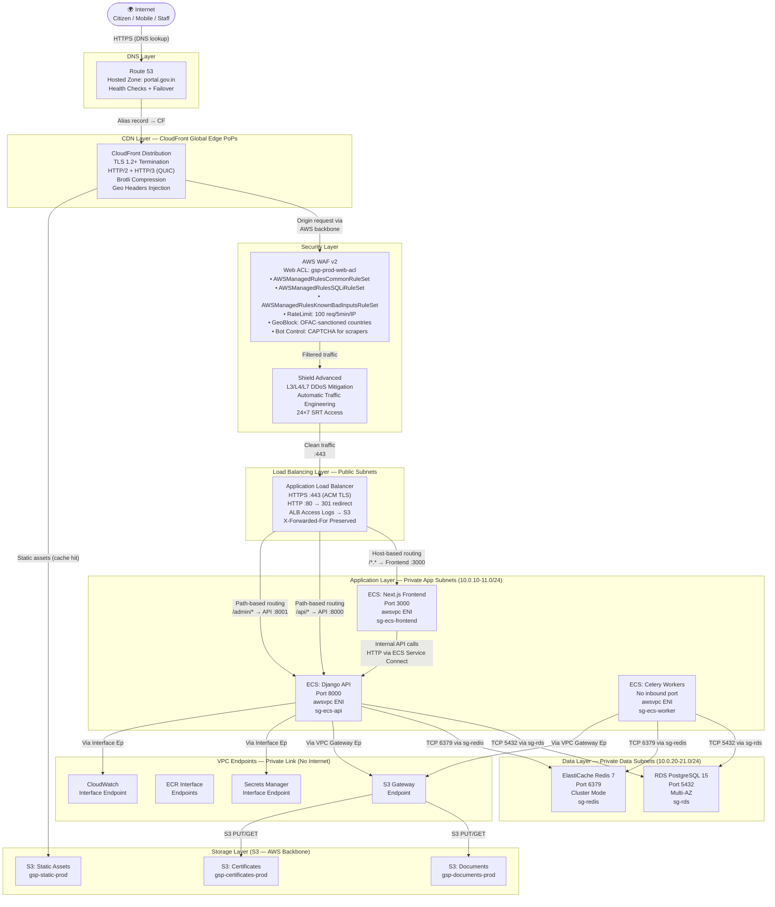

# Network Infrastructure — Government Services Portal

## 1. Overview

The Government Services Portal network infrastructure is designed as a **layered defence-in-depth** model: every layer adds an independent control that limits blast radius if an outer layer is compromised. Traffic enters through globally distributed DNS and CDN (CloudFront + Route 53), is inspected by WAF, absorbed against DDoS by Shield Advanced, then terminates at an Application Load Balancer before reaching ECS Fargate tasks in fully private subnets that have no direct internet exposure.

The network architecture strictly separates:
- **Public subnets** — only load balancers and NAT gateways reside here
- **Private application subnets** — ECS Fargate tasks; internet access only via NAT Gateway
- **Private data subnets** — RDS and ElastiCache; no internet route, no NAT Gateway, reachable only from the application layer via Security Group rules

All inter-service traffic stays within the VPC. AWS service API calls (ECR, S3, Secrets Manager, CloudWatch) traverse **VPC Interface Endpoints** or Gateway Endpoints, never leaving the AWS backbone. This eliminates a class of network exfiltration risk and removes data transfer charges for traffic to supported AWS services.

---

## 2. Network Topology Diagram



---

## 3. DNS Configuration

### 3.1 Hosted Zone

- **Hosted Zone Name:** `portal.gov.in`
- **Zone Type:** Public Hosted Zone
- **NS Servers:** Assigned by Route 53 (ns-xxx.awsdns-xx.com, ns-xxx.awsdns-xx.co.uk, ns-xxx.awsdns-xx.net, ns-xxx.awsdns-xx.org)
- **SOA TTL:** 900 seconds
- **DNSSEC:** Enabled — Route 53 Key Signing Key (KSK) uses Customer Managed KMS key `alias/gsp/route53-dnssec`. DS record published to the `.in` ccTLD registry via NIC Nepal.

### 3.2 DNS Records Table

| Record Name | Type | Value / Target | TTL (s) | Routing Policy | Purpose |
|---|---|---|---|---|---|
| `portal.gov.in` | A (Alias) | `dxxxx.cloudfront.net` | 60 | Failover Primary | Citizen-facing portal → CloudFront |
| `portal.gov.in` | AAAA (Alias) | `dxxxx.cloudfront.net` | 60 | Failover Primary | IPv6 support → CloudFront |
| `api.portal.gov.in` | A (Alias) | `gsp-prod-alb-xxxx.ap-south-1.elb.amazonaws.com` | 60 | Failover Primary | REST API → ALB |
| `api.portal.gov.in` | A (Alias) | `gsp-dr-alb-xxxx.ap-southeast-1.elb.amazonaws.com` | 60 | Failover Secondary | DR failover to Singapore region |
| `admin.portal.gov.in` | A (Alias) | `gsp-prod-alb-xxxx.ap-south-1.elb.amazonaws.com` | 60 | Simple | Staff admin portal → ALB |
| `cdn.portal.gov.in` | A (Alias) | `dxxxx.cloudfront.net` | 300 | Simple | Static asset CDN → CloudFront |
| `mail.portal.gov.in` | MX | `10 inbound-smtp.ap-south-1.amazonaws.com` | 3600 | Simple | SES inbound email routing |
| `portal.gov.in` | TXT | `v=spf1 include:amazonses.com ~all` | 3600 | Simple | SPF record for SES email sending |
| `_dmarc.portal.gov.in` | TXT | `v=DMARC1; p=quarantine; rua=mailto:dmarc-reports@portal.gov.in; pct=100` | 3600 | Simple | DMARC policy for email spoofing protection |
| `xxxxxx._domainkey.portal.gov.in` | TXT | `v=DKIM1; k=rsa; p=<SES DKIM public key>` | 3600 | Simple | DKIM signature for SES |
| `_amazonses.portal.gov.in` | TXT | `<SES domain verification token>` | 3600 | Simple | SES domain ownership verification |
| `www.portal.gov.in` | CNAME | `portal.gov.in` | 300 | Simple | www redirect to apex |

### 3.3 Route 53 Health Checks

| Health Check ID | Type | Target | Path | Interval | Failure Threshold | Alarm |
|---|---|---|---|---|---|---|
| `hc-api-primary` | HTTPS | `api.portal.gov.in` | `/health/` | 30s | 3 failures | `gsp-api-health-primary` CloudWatch alarm |
| `hc-api-dr` | HTTPS | DR ALB endpoint | `/health/` | 30s | 3 failures | (passive — activates failover record only) |
| `hc-portal-primary` | HTTPS | `portal.gov.in` | `/` | 30s | 3 failures | `gsp-portal-health-primary` alarm |

---

## 4. CloudFront Configuration

### 4.1 Distribution Settings

**Distribution 1 — Portal Web (`portal.gov.in`)**

| Setting | Value |
|---|---|
| Alternate Domain Names (CNAMEs) | `portal.gov.in`, `www.portal.gov.in` |
| SSL Certificate | ACM `portal.gov.in` (wildcard) — ap-south-1 (required for CloudFront) |
| Minimum TLS Version | TLSv1.2_2021 |
| HTTP Version | HTTP/2 and HTTP/3 |
| IPv6 | Enabled |
| Default Root Object | *(none — Next.js handles routing)* |
| WAF Web ACL | `arn:aws:wafv2:ap-south-1:<ACCOUNT>:global/webacl/gsp-prod-web-acl` |
| Price Class | PriceClass_200 |
| Logging | Enabled → `s3://gsp-logs-prod/cloudfront/` |
| Compress Objects | Enabled (Brotli + gzip) |

**Distribution 2 — Static Assets (`cdn.portal.gov.in`)**

| Setting | Value |
|---|---|
| Alternate Domain Names | `cdn.portal.gov.in` |
| Origin | `gsp-static-prod.s3.ap-south-1.amazonaws.com` (OAC — no public S3 access) |
| Cache Policy | `CachingOptimized` — 365-day TTL, compress, all query strings cached |
| Viewer Protocol Policy | Redirect HTTP to HTTPS |
| Price Class | PriceClass_200 |

### 4.2 Cache Behaviors — Portal Distribution

| Priority | Path Pattern | Origin | Origin Protocol | Cache TTL (Default) | Cache TTL (Max) | Compress | Forward Headers | Cache Policy |
|---|---|---|---|---|---|---|---|---|
| 0 | `/_next/static/*` | ALB (Frontend) | HTTPS only | 86400s (1d) | 31536000s (1yr) | Yes | None | `CachingOptimized` |
| 1 | `/api/*` | ALB (API) | HTTPS only | 0s (no cache) | 0s | No | `Authorization`, `Accept`, `Content-Type` | `CachingDisabled` |
| 2 | `/admin/*` | ALB (API) | HTTPS only | 0s (no cache) | 0s | No | All | `CachingDisabled` |
| 3 | `/static/*` | S3 Static bucket | HTTPS only | 86400s | 31536000s | Yes | None | `CachingOptimized` |
| 4 | `/media/*` | ALB (API) | HTTPS only | 3600s (1hr) | 86400s | No | `Authorization` | Custom — auth required |
| 5 (default) | `/*` | ALB (Frontend) | HTTPS only | 0s | 60s | Yes | `CloudFront-Viewer-Country`, `Accept-Language` | Custom — SSR pages |

### 4.3 CloudFront Origin Access Control (OAC)

For the S3 origins, CloudFront uses **Origin Access Control** (the successor to OAI). The S3 bucket policy allows `s3:GetObject` only from the CloudFront distribution's ARN using the service principal `cloudfront.amazonaws.com` with a condition on `AWS:SourceArn`. All other S3 public access settings are blocked at the account level.

### 4.4 Custom Response Headers Policy

CloudFront attaches the following security headers to all responses via a **Response Headers Policy**:

```
Strict-Transport-Security: max-age=31536000; includeSubDomains; preload
X-Content-Type-Options: nosniff
X-Frame-Options: DENY
X-XSS-Protection: 1; mode=block
Referrer-Policy: strict-origin-when-cross-origin
Permissions-Policy: camera=(), microphone=(), geolocation=(self), payment=(self)
Content-Security-Policy: default-src 'self'; script-src 'self' 'nonce-{nonce}' https://cdn.portal.gov.in; style-src 'self' 'unsafe-inline'; img-src 'self' data: https://cdn.portal.gov.in; connect-src 'self' https://api.portal.gov.in; frame-ancestors 'none'; base-uri 'self'; form-action 'self'
```

---

## 5. AWS WAF Rules

### 5.1 Web ACL: `gsp-prod-web-acl`

The Web ACL is deployed in **ap-south-1** (global, associated with CloudFront) and also in **ap-south-1** (regional, associated with ALB for direct API access). Both use identical rule sets.

**Default Action:** Allow (blocklist model — everything is allowed unless a rule matches)

### 5.2 Managed Rule Groups

| Rule Group | Priority | Override Action | Excluded Rules | Rationale |
|---|---|---|---|---|
| `AWSManagedRulesCommonRuleSet` | 10 | None (Block) | `SizeRestrictions_BODY` (exempted for file upload endpoint) | OWASP Top 10 protections, generic attack patterns |
| `AWSManagedRulesSQLiRuleSet` | 20 | None (Block) | None | SQL injection pattern matching for database query protection |
| `AWSManagedRulesKnownBadInputsRuleSet` | 30 | None (Block) | None | Log4Shell, SSRF, path traversal, malformed request bodies |
| `AWSManagedRulesBotControlRuleSet` | 40 | Count (first 30 days), then Block | `CategoryVerifiedBot` (Google, Bing) | Bot detection — CAPTCHA challenge for suspicious automation |
| `AWSManagedRulesAmazonIpReputationList` | 50 | None (Block) | None | Block IPs on Amazon's threat intelligence list (botnets, tor exit nodes) |

### 5.3 Custom WAF Rules

**Rule 1 — Global Rate Limit**
```
Name: RateLimitPerIP
Priority: 5
Action: Block (HTTP 429)
Statement:
  RateBasedStatement:
    Limit: 100
    AggregateKeyType: IP
    EvaluationWindowSec: 300 (5 minutes)
    ScopeDownStatement: None (applies to all requests)
CloudWatch Metric: RateLimitBlock
```

**Rule 2 — OTP Endpoint Rate Limit (Strict)**
```
Name: OTPEndpointRateLimit
Priority: 4
Action: Block (HTTP 429)
Statement:
  RateBasedStatement:
    Limit: 10
    AggregateKeyType: IP
    EvaluationWindowSec: 300
    ScopeDownStatement:
      ByteMatchStatement:
        FieldToMatch: UriPath
        SearchString: /api/v1/auth/otp/
        PositionalConstraint: STARTS_WITH
CloudWatch Metric: OTPRateLimitBlock
```

This prevents SMS/email OTP flooding. Combined with the backend's own Redis-based OTP throttle (3 attempts per 10 minutes per mobile number), this provides two independent throttle layers.

**Rule 3 — File Upload Size Limit Bypass Prevention**
```
Name: UploadSizeLimit
Priority: 60
Action: Block
Statement:
  SizeConstraintStatement:
    FieldToMatch: Body
    ComparisonOperator: GT
    Size: 10485760 (10 MB)
CloudWatch Metric: UploadSizeBlock
```

**Rule 4 — Geo-Restriction**
```
Name: GeoBlockSanctionedCountries
Priority: 2
Action: Block
Statement:
  GeoMatchStatement:
    CountryCodes: [KP, IR, SY, CU, SD]
    (OFAC-sanctioned countries)
CloudWatch Metric: GeoBlock
```

**Rule 5 — Admin Panel IP Whitelist**
```
Name: AdminPanelIPWhitelist
Priority: 1
Action: Allow (overrides subsequent rules for matching requests)
Statement:
  AndStatement:
    Statements:
      - ByteMatchStatement: UriPath STARTS_WITH /admin/
      - IPSetReferenceStatement: arn:...ipset/gsp-admin-allowlist-ips
        (contains NIC office IP ranges and VPN exit nodes)
```

### 5.4 WAF Logging

All WAF requests (allowed and blocked) are logged to Amazon Kinesis Data Firehose, which delivers to `s3://gsp-logs-prod/waf/year={YYYY}/month={MM}/day={DD}/`. Log format: JSON with all request metadata (IP, URI, headers, matched rules, action taken). Logs are queryable via Amazon Athena using the `gsp_waf_logs` table in AWS Glue Data Catalog. Retention: 180 days on S3 Standard, then Glacier.

---

## 6. Security Groups Detail

### 6.1 ALB Security Group (`sg-alb` — `gsp-alb-sg`)

**Inbound:**

| Rule # | Protocol | Port | Source | Description |
|---|---|---|---|---|
| 100 | TCP | 443 | 0.0.0.0/0 | HTTPS from CloudFront and direct clients |
| 110 | TCP | 443 | ::/0 | HTTPS IPv6 |
| 120 | TCP | 80 | 0.0.0.0/0 | HTTP for 301 redirect to HTTPS |
| 130 | TCP | 80 | ::/0 | HTTP IPv6 redirect |

**Outbound:**

| Rule # | Protocol | Port | Destination | Description |
|---|---|---|---|---|
| 100 | TCP | 3000 | sg-ecs-frontend | Health checks and traffic to Frontend |
| 110 | TCP | 8000 | sg-ecs-api | Traffic to Django API |

### 6.2 Frontend Security Group (`sg-ecs-frontend` — `gsp-frontend-sg`)

**Inbound:**

| Rule # | Protocol | Port | Source | Description |
|---|---|---|---|---|
| 100 | TCP | 3000 | sg-alb | Traffic from ALB only |

**Outbound:**

| Rule # | Protocol | Port | Destination | Description |
|---|---|---|---|---|
| 100 | TCP | 8000 | sg-ecs-api | Internal API calls from Next.js SSR |
| 200 | TCP | 443 | 0.0.0.0/0 | HTTPS to AWS service VPC endpoints |

### 6.3 API Security Group (`sg-ecs-api` — `gsp-api-sg`)

**Inbound:**

| Rule # | Protocol | Port | Source | Description |
|---|---|---|---|---|
| 100 | TCP | 8000 | sg-alb | Traffic from ALB |
| 110 | TCP | 8000 | sg-ecs-frontend | Internal calls from Next.js SSR |

**Outbound:**

| Rule # | Protocol | Port | Destination | Description |
|---|---|---|---|---|
| 100 | TCP | 5432 | sg-rds | PostgreSQL database access |
| 110 | TCP | 6379 | sg-redis | Redis cache/broker access |
| 200 | TCP | 443 | 0.0.0.0/0 | HTTPS to VPC endpoints and external APIs |

### 6.4 Celery Worker Security Group (`sg-ecs-worker` — `gsp-worker-sg`)

**Inbound:** No rules — workers do not accept inbound connections.

**Outbound:**

| Rule # | Protocol | Port | Destination | Description |
|---|---|---|---|---|
| 100 | TCP | 5432 | sg-rds | PostgreSQL read/write for task processing |
| 110 | TCP | 6379 | sg-redis | Redis broker dequeue and result storage |
| 200 | TCP | 443 | 0.0.0.0/0 | HTTPS to external APIs (Nepal Document Wallet (NDW), ConnectIPS, NIC CA) |

### 6.5 RDS Security Group (`sg-rds` — `gsp-rds-sg`)

**Inbound:**

| Rule # | Protocol | Port | Source | Description |
|---|---|---|---|---|
| 100 | TCP | 5432 | sg-ecs-api | Django API database connections |
| 110 | TCP | 5432 | sg-ecs-worker | Celery worker database connections |

**Outbound:** No outbound rules needed. RDS does not initiate connections.

### 6.6 Redis Security Group (`sg-redis` — `gsp-redis-sg`)

**Inbound:**

| Rule # | Protocol | Port | Source | Description |
|---|---|---|---|---|
| 100 | TCP | 6379 | sg-ecs-api | Django API cache and session access |
| 110 | TCP | 6379 | sg-ecs-worker | Celery broker dequeue |
| 120 | TCP | 6379 | sg-ecs-frontend | Next.js session store (if used) |

**Outbound:** No outbound rules.

### 6.7 VPC Endpoints Security Group (`sg-vpce` — `gsp-vpce-sg`)

**Inbound:**

| Rule # | Protocol | Port | Source | Description |
|---|---|---|---|---|
| 100 | TCP | 443 | 10.0.0.0/16 | Allow all VPC traffic to reach endpoint |

**Outbound:** No outbound rules (endpoints are AWS-managed; responses are allowed by stateful tracking).

---

## 7. Network ACLs

Network ACLs provide a **stateless** subnet-level firewall as a secondary defence layer behind Security Groups. Unlike Security Groups, NACLs are stateless — return traffic must be explicitly permitted with ephemeral port rules.

### 7.1 NACL — Public Subnets (`nacl-public`)

Applied to: `10.0.1.0/24`, `10.0.2.0/24`

**Inbound Rules:**

| Rule # | Protocol | Port Range | Source | Action |
|---|---|---|---|---|
| 100 | TCP | 443 | 0.0.0.0/0 | ALLOW |
| 110 | TCP | 80 | 0.0.0.0/0 | ALLOW |
| 120 | TCP | 1024–65535 | 0.0.0.0/0 | ALLOW (ephemeral return traffic) |
| 32766 | All | All | 0.0.0.0/0 | DENY |

**Outbound Rules:**

| Rule # | Protocol | Port Range | Destination | Action |
|---|---|---|---|---|
| 100 | TCP | 443 | 0.0.0.0/0 | ALLOW |
| 110 | TCP | 80 | 0.0.0.0/0 | ALLOW |
| 120 | TCP | 1024–65535 | 0.0.0.0/0 | ALLOW (ephemeral return traffic to clients) |
| 130 | TCP | 3000 | 10.0.10.0/23 | ALLOW (to private app subnets) |
| 140 | TCP | 8000 | 10.0.10.0/23 | ALLOW (to private app subnets) |
| 32766 | All | All | 0.0.0.0/0 | DENY |

### 7.2 NACL — Private App Subnets (`nacl-private-app`)

Applied to: `10.0.10.0/24`, `10.0.11.0/24`

**Inbound Rules:**

| Rule # | Protocol | Port Range | Source | Action |
|---|---|---|---|---|
| 100 | TCP | 3000 | 10.0.1.0/23 | ALLOW (from ALB in public subnets) |
| 110 | TCP | 8000 | 10.0.1.0/23 | ALLOW (from ALB in public subnets) |
| 120 | TCP | 3000 | 10.0.10.0/23 | ALLOW (inter-service, FE→API) |
| 130 | TCP | 8000 | 10.0.10.0/23 | ALLOW (inter-service) |
| 140 | TCP | 1024–65535 | 0.0.0.0/0 | ALLOW (ephemeral return from NAT/Internet) |
| 32766 | All | All | 0.0.0.0/0 | DENY |

**Outbound Rules:**

| Rule # | Protocol | Port Range | Destination | Action |
|---|---|---|---|---|
| 100 | TCP | 5432 | 10.0.20.0/23 | ALLOW (to RDS) |
| 110 | TCP | 6379 | 10.0.20.0/23 | ALLOW (to Redis) |
| 120 | TCP | 443 | 0.0.0.0/0 | ALLOW (to NAT Gateway / VPC Endpoints) |
| 130 | TCP | 1024–65535 | 10.0.1.0/23 | ALLOW (ephemeral return to ALB) |
| 140 | TCP | 1024–65535 | 10.0.10.0/23 | ALLOW (ephemeral return, inter-service) |
| 32766 | All | All | 0.0.0.0/0 | DENY |

### 7.3 NACL — Private Data Subnets (`nacl-private-data`)

Applied to: `10.0.20.0/24`, `10.0.21.0/24`

**Inbound Rules:**

| Rule # | Protocol | Port Range | Source | Action |
|---|---|---|---|---|
| 100 | TCP | 5432 | 10.0.10.0/23 | ALLOW (PostgreSQL from app layer) |
| 110 | TCP | 6379 | 10.0.10.0/23 | ALLOW (Redis from app layer) |
| 32766 | All | All | 0.0.0.0/0 | DENY |

**Outbound Rules:**

| Rule # | Protocol | Port Range | Destination | Action |
|---|---|---|---|---|
| 100 | TCP | 1024–65535 | 10.0.10.0/23 | ALLOW (ephemeral return to app layer) |
| 32766 | All | All | 0.0.0.0/0 | DENY |

---

## 8. TLS/SSL Configuration

### 8.1 ACM Certificates

| Certificate | Type | Domains | Region | Auto-Renewal | Algorithm |
|---|---|---|---|---|---|
| `cert-portal-cloudfront` | Wildcard | `*.portal.gov.in`, `portal.gov.in` | ap-south-1 | Yes (DNS validation) | RSA 2048 |
| `cert-portal-alb` | Multi-domain SAN | `api.portal.gov.in`, `admin.portal.gov.in` | ap-south-1 | Yes (DNS validation) | RSA 2048 |
| `cert-cdn` | Single domain | `cdn.portal.gov.in` | ap-south-1 | Yes (DNS validation) | RSA 2048 |

All certificates use **DNS validation** via Route 53 CNAME records. ACM auto-renews 60 days before expiry; CloudFront and ALB immediately pick up renewed certificates with no downtime.

### 8.2 TLS Policy

**CloudFront:** Security Policy `TLSv1.2_2021`
- Minimum protocol: TLS 1.2
- Supported protocols: TLSv1.2, TLSv1.3
- Supported cipher suites (TLS 1.2):
  - `TLS_AES_128_GCM_SHA256` (TLS 1.3)
  - `TLS_AES_256_GCM_SHA384` (TLS 1.3)
  - `ECDHE-RSA-AES128-GCM-SHA256`
  - `ECDHE-RSA-AES256-GCM-SHA384`
  - `ECDHE-RSA-AES128-SHA256`
- Disabled: RC4, DES, 3DES, MD5, SHA-1 HMAC, export cipher suites, anonymous cipher suites

**ALB:** Security Policy `ELBSecurityPolicy-TLS13-1-2-2021-06`
- Minimum protocol: TLS 1.2
- Forward Secrecy: All enabled cipher suites support ECDHE (perfect forward secrecy)
- OCSP Stapling: Enabled (reduces OCSP latency for clients)

### 8.3 HTTP Security Headers

All responses include (enforced at CloudFront response headers policy level):

```
Strict-Transport-Security: max-age=31536000; includeSubDomains; preload
```

The domain `portal.gov.in` is submitted to the **HSTS Preload List** (hstspreload.org), ensuring browsers enforce HTTPS without needing to see the header on the first visit. This prevents SSL stripping attacks on first connection.

---

## 9. VPC Flow Logs

### 9.1 Configuration

VPC Flow Logs are enabled at the **VPC level** (captures all ENIs including Fargate task ENIs, ALB ENIs, NAT Gateway ENIs):

| Setting | Value |
|---|---|
| Destination | CloudWatch Logs: `/aws/vpc/flowlogs/gsp-prod` |
| Traffic Type | ALL (accepted + rejected) |
| Format | Custom: `${version} ${account-id} ${interface-id} ${srcaddr} ${dstaddr} ${srcport} ${dstport} ${protocol} ${packets} ${bytes} ${start} ${end} ${action} ${log-status} ${vpc-id} ${subnet-id} ${instance-id} ${tcp-flags} ${type} ${pkt-srcaddr} ${pkt-dstaddr}` |
| Retention | 30 days in CloudWatch Logs, then exported to S3 for Athena querying |
| IAM Role | `gsp-vpc-flow-logs-role` (allows `logs:CreateLogGroup`, `logs:CreateLogStream`, `logs:PutLogEvents`) |

### 9.2 Flow Log Analysis

A Glue Data Catalog table `gsp_vpc_flow_logs` maps to the S3 flow log prefix, enabling Athena queries:

```sql
-- Example: Find rejected connections to RDS in the last 24 hours
SELECT srcaddr, dstport, COUNT(*) as rejected_count
FROM gsp_vpc_flow_logs
WHERE action = 'REJECT'
  AND dstport = 5432
  AND partition_date >= current_date - interval '1' day
GROUP BY srcaddr, dstport
ORDER BY rejected_count DESC;
```

Flow log anomaly detection: An EventBridge rule triggers a Lambda function when a CloudWatch Metric Filter detects > 1000 REJECT events per minute from any single source IP, creating a WAF IP block and a GuardDuty finding.

---

## 10. Inter-Service Communication

### 10.1 ECS Service Connect

ECS **Service Connect** is enabled on the `gsp-production` cluster to provide service-to-service communication with built-in service discovery, load balancing, and connection observability.

**Namespace:** `gsp.production.local` (AWS Cloud Map private namespace)

| Service | Client Alias | Port | Protocol |
|---|---|---|---|
| `gsp-api` | `api.gsp.production.local` | 8000 | HTTP |
| `gsp-frontend` | `frontend.gsp.production.local` | 3000 | HTTP |

**Next.js → Django Internal Calls:** The Next.js App Router server components and API route handlers call the Django API using the internal Service Connect endpoint `http://api.gsp.production.local:8000` for SSR requests. This eliminates the round-trip through CloudFront → WAF → ALB and reduces latency by ~200ms for server-rendered pages.

**Service Connect Observability:** Service Connect automatically publishes connection metrics (request count, response time, error rate) to CloudWatch Container Insights without any application code changes.

### 10.2 Celery to Redis (Broker)

- Celery workers connect to ElastiCache Redis using the Redis cluster endpoint: `gsp-redis-prod.xxxxx.clustercfg.aps1.cache.amazonaws.com:6379`
- TLS encryption in transit is enabled (`rediss://` scheme, certificate from Redis's ACM-managed cert)
- Celery uses `kombu` with Redis as the broker; the `CELERY_BROKER_TRANSPORT_OPTIONS` includes `visibility_timeout=3600` to handle long-running document processing tasks

### 10.3 Database Connection Pooling

Django API tasks connect to RDS via **PgBouncer** running as a sidecar container in each ECS task:
- PgBouncer listens on `localhost:5432` inside the task
- PgBouncer uses **transaction-level pooling** with `pool_size=10` per task, `max_client_conn=100`
- Connection from PgBouncer to RDS: max 200 connections total (10 tasks × 10 pool size × 2 AZs = 200)
- This stays within the RDS `db.r6g.xlarge` connection limit of 500

---

## 11. Network Performance

### 11.1 Latency Targets

| Path | Target P99 Latency | Measurement Point |
|---|---|---|
| Citizen browser → CloudFront edge PoP (Nepal) | < 20 ms | Route 53 Resolver latency |
| CloudFront edge → ALB origin (Mumbai) | < 50 ms | CloudFront origin latency metric |
| ALB → Django API response (cached) | < 100 ms | ALB target response time |
| ALB → Django API response (DB query, simple) | < 300 ms | ALB target response time |
| ALB → Django API response (complex, joins) | < 1000 ms | ALB target response time |
| End-to-end citizen page load (First Contentful Paint) | < 2500 ms | Synthetic monitoring |
| Celery async task (OTP delivery) | < 30 seconds | CloudWatch custom metric |
| Celery async task (certificate generation) | < 5 minutes | CloudWatch custom metric |

### 11.2 Bandwidth and Data Transfer

- **CloudFront → Origin:** Estimated 50 GB/day origin fetch (cache hit rate ~85% for static assets). Origin-bound requests use the AWS backbone, not the public internet.
- **NAT Gateway data:** Estimated 10 GB/day (API calls to Nepal Document Wallet (NDW), NASC (National Identity Management Centre), ConnectIPS, AWS SES/SNS via NAT). Each NAT Gateway handles up to 45 Gbps burst bandwidth.
- **RDS:** Network bandwidth for `db.r6g.xlarge` is up to 4,750 Mbps (EBS optimised). Expected sustained database traffic: < 100 Mbps.
- **ElastiCache Redis:** `cache.r6g.large` network bandwidth: 10 Gbps. Expected < 500 Mbps.

### 11.3 Connection Limits

| Component | Max Connections | Current Usage (Estimated) | Headroom |
|---|---|---|---|
| RDS PostgreSQL (via PgBouncer) | 500 | ~200 (20 API tasks × 10) | 60% |
| ElastiCache Redis per node | 65,000 | ~2,000 (tasks × connections) | 97% |
| ALB — concurrent connections | 1,000,000 | Peak ~10,000 | 99% |
| NAT Gateway — simultaneous flows | 1,000,000 per AZ | Peak ~5,000 | 99.5% |

---

## 12. DDoS Protection

### 12.1 Shield Advanced Capabilities

AWS Shield Advanced is enabled at the **AWS Organisation level** for consolidated protection and billing:

- **L3/L4 protection:** Automatic detection and mitigation of volumetric attacks (UDP floods, SYN floods, reflection attacks). Shield Advanced absorbs traffic at AWS edge before it reaches the VPC.
- **L7 protection:** For CloudFront and ALB resources, Shield Advanced integrates with WAF to automatically create emergency rate-based rules when a L7 application-layer DDoS is detected. The SRT can modify WAF rules in real time.
- **Shield Response Team (SRT):** 24×7 access granted to AWS SRT via IAM role `arn:aws:iam::<ACCOUNT>:role/AWSShieldDRTAccessRole`. The SRT can view WAF logs, CloudFront metrics, and create new WAF rules during an active attack.
- **Cost Protection:** Shield Advanced provides attack cost protection — AWS credits the additional data transfer and WAF request charges incurred during a validated DDoS attack.
- **Proactive engagement:** Enabled. AWS proactively contacts the on-call team when Shield Advanced detects an attack, even before automated mitigations complete.

### 12.2 DDoS Runbook

1. **Detection:** CloudWatch Alarm `gsp-shield-ddos-detected` fires when Shield Advanced event is created.
2. **Automatic response:** WAF rate-based rules tighten automatically (from 100 req/5min to 20 req/5min per IP) via a Lambda function triggered by the alarm.
3. **P1 Incident declared:** On-call engineer notified via PagerDuty. Bridges SRT call with AWS.
4. **Geo-blocking escalation:** If attack is geo-concentrated, on-call engineer can update WAF geo-block rule via `aws wafv2 update-web-acl` CLI command (pre-approved runbook action, no change approval required).
5. **Recovery:** Monitor CloudWatch DDoS metrics; remove emergency WAF rules 30 minutes after attack subsides. Post-incident review within 5 business days.

### 12.3 Rate Limiting Architecture

Rate limiting is implemented in three independent layers for defence in depth:

| Layer | Mechanism | Threshold | Response |
|---|---|---|---|
| L1 — WAF | AWS WAF rate-based rule (per source IP) | 100 req/5min globally; 10 req/5min on `/api/v1/auth/otp/` | HTTP 429, logged to S3 |
| L2 — Application | Django `django-ratelimit` (Redis-backed counters, per user/IP) | 60 req/min on API; 3 OTP attempts/10min per mobile | HTTP 429, JSON error response |
| L3 — Infra (reserved) | ALB connection limits | 1M concurrent connections (auto-managed by AWS) | TCP connection rejected |

---

## 13. Operational Policy Addendum

### 13.1 Network Change Management Policy

- All network infrastructure changes (Security Group rules, NACL modifications, VPC configuration, Route 53 record changes) are managed through **CloudFormation** and follow the standard change management process: draft PR → peer review → automated `cfn-lint` validation → staging apply → production apply.
- **No manual console changes** to networking resources in production. AWS Config rule `restricted-ssh` and custom Config rule `no-unrestricted-inbound-sg` alert and remediate any security group with `0.0.0.0/0` inbound on ports other than 80/443.
- **Emergency firewall changes** (e.g., blocking an attacker IP) are pre-approved actions that can be executed via the `gsp-emergency-waf-block` runbook without a full change ticket. These are self-auditing via WAF logging and must be reviewed within 24 hours.
- Route 53 record changes have a **mandatory 15-minute review window** after making a change in staging to validate DNS propagation before applying to production. DNS records for `portal.gov.in` are protected with Route 53 **Record Lock** to prevent accidental deletion.

### 13.2 Network Security Monitoring Policy

- **VPC Flow Logs** are enabled permanently and cannot be disabled. An AWS Config rule (`vpc-flow-logs-enabled`) monitors this and triggers a P1 alert if flow logs are found disabled.
- **GuardDuty** findings related to network anomalies (e.g., `UnauthorizedAccess:EC2/MaliciousIPCaller`, `Recon:EC2/PortProbeUnprotectedPort`, `Backdoor:EC2/C&CActivity`) are auto-escalated to the security team via SNS → PagerDuty within 5 minutes of detection.
- Monthly network security reviews include: reviewing WAF top-10 blocked IPs, GuardDuty findings summary, VPC Flow Log anomalies, and CloudTrail events for security group changes. Results are documented in the monthly security ops report.
- **Penetration testing** of the network layer (conducted by CERT-In empanelled vendors) must adhere to the AWS penetration testing policy and be pre-notified to AWS via the AWS Customer Support portal. Network pen test scope: ALB endpoints, CloudFront distributions, WAF bypass attempts.

### 13.3 Certificate and TLS Management Policy

- ACM certificates are monitored for expiry via CloudWatch alarm `gsp-acm-cert-expiry` (threshold: < 45 days remaining). ACM auto-renews DNS-validated certificates automatically, but the alarm provides a human-visible safety net.
- All TLS configuration changes (minimum version, cipher suites) require a security team sign-off. Weakening TLS configuration (e.g., enabling TLS 1.0 or weak cipher suites) is categorised as a security P1 change and requires CISO approval.
- Third-party certificates (e.g., NIC CA DSC certificates for document signing) are tracked in a certificate inventory spreadsheet. Expiry reminders are set 90 days, 30 days, and 7 days before expiry. DSC renewal requires a physical token process with the designated NIC CA contact; 60-day lead time is planned.
- HSTS preload submission is reviewed annually. Any change to the `Strict-Transport-Security` header requires testing that all subdomains serve valid HTTPS before the change is applied.

### 13.4 Data Sovereignty and Network Compliance Policy

- **Data Localisation:** All citizen data remains within the `ap-south-1` (Mumbai) AWS region. Cross-region replication to `ap-southeast-1` is restricted to backup/DR S3 buckets and RDS snapshots only; no live query traffic crosses Nepal's borders. The SCP `RequireRegionRestriction` enforces this at the AWS API level.
- **Peering and Transit:** No VPC peering connections are established to external organisations. Any future requirement for NIC or government network connectivity (e.g., NICNET) will use **AWS Direct Connect** with a dedicated VIF, reviewed and approved by the CISO and NIC network team.
- **Traffic Inspection:** A Network Firewall (AWS Network Firewall) deployment is on the roadmap for deeper packet inspection of outbound traffic from ECS tasks to external government APIs. Current controls (Security Group egress, WAF, GuardDuty) are deemed sufficient for the initial release.
- **Compliance Audit:** Network infrastructure configurations are exported quarterly via AWS Config Snapshot and reviewed against the NIC security baseline checklist and CERT-In's empanelled auditor's network security requirements. Findings are tracked to closure within the compliance management system.
