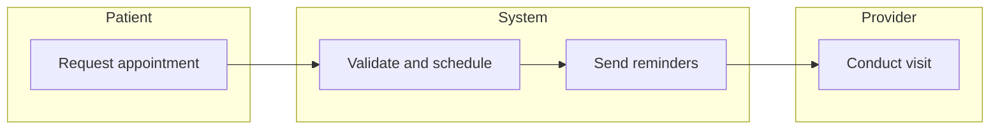

# BPMN Swimlane Diagram

```mermaid
flowchart LR
  subgraph Patient
    A[Request appointment]
  end
  subgraph System
    B[Validate and schedule]
    C[Send reminders]
  end
  subgraph Provider
    D[Conduct visit]
  end
  A --> B --> C --> D
```
