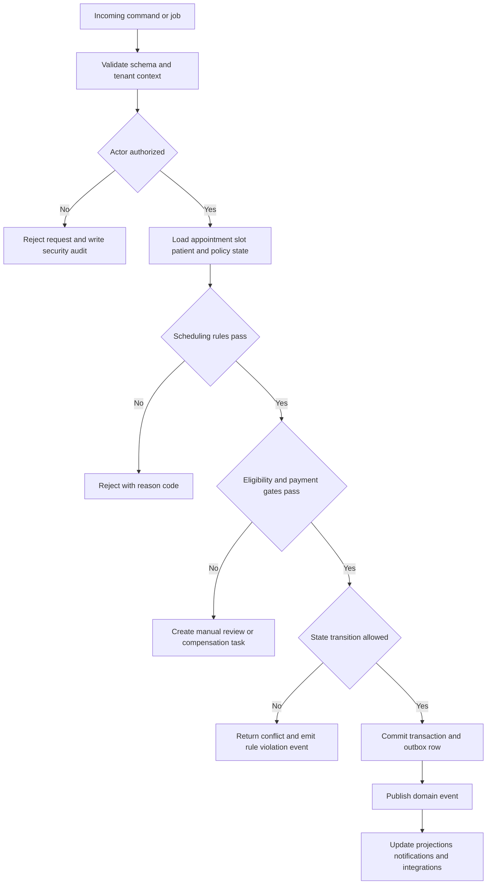

# Business Rules

This document defines enforceable rules for the Healthcare Appointment System so booking, rescheduling, reminders, payments, check-in, privacy, and downtime handling behave consistently across APIs and background jobs.

## Context
- Domain focus: outpatient appointment scheduling, patient access, and visit operations.
- Enforcement points: API gateway, scheduling command handlers, policy engine, background processors, staff console workflows, and compliance exports.
- Rule sources: tenant policy configuration, payer responses, provider schedule definitions, and regulatory obligations.

## Enforceable Rules
1. A patient may hold only one active reservation token for the same provider, date, and visit type at a time unless the actor is authorized staff.
2. Booking requires an active provider, active location, valid slot version, and booking window compliance before any financial side effect occurs.
3. If eligibility is required for the visit type, the most recent successful eligibility response must remain valid at confirmation time; expired responses trigger re-verification.
4. Prior authorization or referral requirements block booking unless the policy allows manual override by authorized staff.
5. Copay authorization is performed before confirming the appointment when the tenant policy requires prepayment; failed authorization leaves the slot unbooked.
6. Appointments cannot be double-booked for the same patient when time ranges overlap unless the second visit is explicitly marked as a linked ancillary service.
7. Rescheduling must atomically reserve the new slot before releasing the current slot so the patient is never left without a valid appointment.
8. Patient self-service cancellation is blocked inside the configured cancellation window, but staff may cancel with a documented reason and fee outcome.
9. A check-in attempt fails if required intake, consent, demographic verification, or copay collection tasks are incomplete and the tenant policy marks them mandatory.
10. Only appointments in `CHECKED_IN` or `IN_CONSULTATION` may transition to `COMPLETED`; only appointments past the grace period may transition to `NO_SHOW`.
11. Calendar exceptions created within two hours of visit start must trigger immediate patient outreach and a manual rebooking worklist.
12. Notification jobs must re-read patient consent at send time; revoked consent cancels delivery even if the appointment event was created earlier.
13. SMS, push, and email templates must exclude diagnosis, referral notes, and free-text clinical complaints unless the channel is explicitly approved for PHI.
14. Manual overrides for schedule capacity, payment waivers, or privacy exceptions require actor identity, reason code, approving role, and expiration timestamp.
15. Downtime reconciliation cannot close until queued actions, audit exports, EHR syncs, and payment reconciliations all reach terminal status.

## Rule Evaluation Pipeline

## Exception and Override Handling
| Exception Class | Who Can Apply | Required Evidence | Follow-Up |
|---|---|---|---|
| Urgent overbook | Front desk supervisor or clinic manager | clinical urgency note, approving actor, expiry | provider acknowledgment before visit starts |
| Payment waiver | Revenue-cycle supervisor | waiver reason, payer or hardship evidence | daily finance reconciliation |
| Manual eligibility approval | Insurance coordinator | payer call reference or portal screenshot | retroactive clearinghouse verification |
| PHI emergency disclosure | Privacy officer or designated delegate | purpose of use, recipient, legal basis | compliance review within 1 business day |
| Downtime manual booking | Operations lead or front desk supervisor | downtime form id, timestamp, staff signature | replay and sign-off after recovery |

## Operational Rules by Subdomain
### Scheduling
- Schedule templates are effective-dated and future-looking; they never mutate completed or cancelled encounters.
- Emergency blocks supersede normal availability, and impacted slots become unavailable even if cache invalidation is delayed.
- Waitlist offers expire automatically after the configured response window and restore the slot to availability or the next candidate.

### Financial Controls
- Authorization holds older than the settlement window are voided automatically if the appointment never reaches `CHECKED_IN`.
- Refunds must honor cancellation policy tiers: full refund, partial refund minus fee, or no refund with fee retained.
- Billing exports cannot include appointments still flagged `RECONCILIATION_REQUIRED`.

### Compliance and Audit
- Audit logs are append-only and cannot be edited from the application UI.
- Access to audit exports, downtime rosters, and payment worklists requires elevated permission and MFA.
- Retention and purge jobs must preserve legal holds and incident evidence.

## Operational Policy Addendum

### Scheduling Conflict Policies
- Double-booking is prevented by the natural key `provider_id + location_id + slot_start + slot_end` plus optimistic locking on `slot_version` during booking and rescheduling.
- Reservation tokens shield a slot for up to 10 minutes during patient checkout, but the slot does not transition to `RESERVED` until the appointment transaction commits.
- Provider calendar updates caused by leave, clinic closure, overrun, or emergency blocks trigger immediate impact analysis; future appointments move to `REBOOK_REQUIRED` and create a staffed outreach task.
- Staff-assisted overrides may exceed normal template capacity only when a justification, approving actor, and override expiry are stored in the audit trail.

### Patient and Provider Workflow States
- Appointment lifecycle: `DRAFT -> PENDING_CONFIRMATION -> CONFIRMED -> CHECKED_IN -> IN_CONSULTATION -> COMPLETED`, with terminal states `CANCELLED`, `NO_SHOW`, `EXPIRED`, and `REBOOK_REQUIRED`.
- Slot lifecycle: `AVAILABLE -> RESERVED -> LOCKED_FOR_VISIT -> RELEASED`, with exceptional states `BLOCKED` for planned closures and `SUSPENDED` for compliance or credential issues.
- Invalid state transitions fail fast with deterministic error codes and do not publish downstream billing or notification events.
- Every transition records actor, channel, reason code, correlation id, timestamp, and source IP where available.

### Notification Guarantees
- Confirmation, reminder, cancellation, reschedule, emergency-closure, and waitlist-offer notifications are delivered through in-app, email, and SMS channels according to patient consent and clinic policy.
- Delivery is at-least-once with message deduplication keyed by `event_id + template_version + channel`; critical events retry for up to 24 hours before manual outreach is queued.
- Quiet hours suppress non-critical SMS and voice outreach, but life-safety or same-day operational notices may escalate to approved emergency templates.
- Notification content follows the minimum-necessary standard and excludes diagnosis, treatment details, or referral notes from SMS and push previews.

### Privacy Requirements
- PHI and billing artifacts are encrypted in transit and at rest, and non-production data must be de-identified before use outside regulated workflows.
- Role-based and attribute-based access controls restrict patient, scheduling, billing, and audit data to least-privilege views; privileged access requires MFA.
- Audit logs are immutable, exportable, and searchable by patient, provider, actor, action, and correlation id for compliance investigations.
- Downtime printouts, callback lists, and manual forms are treated as regulated records and must be secured, reconciled, and shredded per clinic policy after recovery.

### Downtime Fallback Procedures
- In degraded mode, staff retain read-only access to schedules while new booking, cancellation, and payment actions are captured in an ordered reconciliation queue.
- Clinics maintain a printable daily roster, manual check-in sheet, and downtime appointment intake form to continue operations during platform or integration outages.
- Recovery replays queued commands in timestamp order, revalidates slot conflicts and insurance status, syncs EHR and billing side effects, and notifies patients if outcomes changed.
- Incident closure requires backlog drain, reconciliation sign-off, communication to affected clinics, and a post-incident review with corrective actions.
