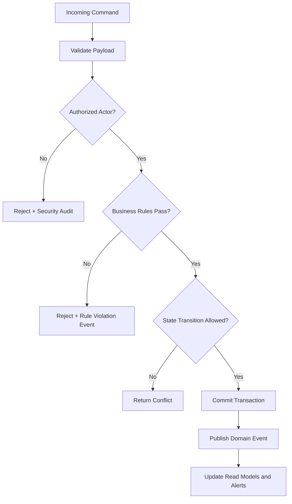

# Business Rules

This document defines enforceable policy rules for **Healthcare Appointment System** so command processing, asynchronous jobs, and operational actions behave consistently under normal and exceptional conditions.

## Context
- Domain focus: healthcare appointment workflows.
- Rule categories: lifecycle transitions, authorization, compliance, and resilience.
- Enforcement points: APIs, workflow/state engines, background processors, and administrative consoles.

## Enforceable Rules
1. Every state-changing command must pass authentication, authorization, and schema validation before processing.
2. Lifecycle transitions must follow the configured state graph; invalid transitions are rejected with explicit reason codes.
3. High-impact operations (financial, security, or regulated data actions) require additional approval evidence.
4. Manual overrides must include approver identity, rationale, and expiration timestamp.
5. Retries and compensations must be idempotent and must not create duplicate business effects.

## Rule Evaluation Pipeline

## Exception and Override Handling
- Overrides are restricted to approved exception classes and require dual logging (business + security audit).
- Override windows automatically expire and trigger follow-up verification tasks.
- Repeated override patterns are reviewed for policy redesign and automation improvements.

## Operational Policy Addendum

### Scheduling Conflict Policies
- Double-booking is prohibited per provider, location, and time-slot; writes enforce an optimistic concurrency check on slot version plus an idempotency key.
- When two booking requests race for the same slot, the first committed request wins and all later requests receive `SLOT_ALREADY_BOOKED` with alternative slot suggestions.
- Provider calendar changes (leave, overrun, emergency block) trigger an automatic revalidation pass that marks impacted bookings as `REBOOK_REQUIRED` and starts remediation workflows.
- Escalation SLA: unresolved conflicts older than 15 minutes are routed to operations for manual intervention and patient outreach.

### Patient/Provider Workflow States
- Patient appointment lifecycle: `DRAFT -> PENDING_CONFIRMATION -> CONFIRMED -> CHECKED_IN -> IN_CONSULTATION -> COMPLETED` with terminal branches `CANCELLED`, `NO_SHOW`, and `EXPIRED`.
- Provider schedule lifecycle: `AVAILABLE -> RESERVED -> LOCKED_FOR_VISIT -> RELEASED`; exceptional states include `BLOCKED` (planned) and `SUSPENDED` (incident/compliance).
- State transitions are event-driven and auditable; every transition records actor, timestamp, source channel, and reason code.
- Invalid transitions are rejected with deterministic error codes and do not mutate downstream billing or notification state.

### Notification Guarantees
- Notification channels include in-app, email, and SMS (when consented); delivery policy is at-least-once with idempotent message keys to prevent duplicate side effects.
- Critical events (`CONFIRMED`, `RESCHEDULED`, `CANCELLED`, `REBOOK_REQUIRED`) are retried with exponential backoff for up to 24 hours.
- If all automated retries fail, a fallback task is created for support-assisted outreach and the record is flagged `NOTIFICATION_ATTENTION_REQUIRED`.
- Template rendering and localization are versioned so users receive content consistent with the transaction version that triggered the event.

### Privacy Requirements
- All PHI/PII is encrypted in transit (TLS 1.2+) and at rest (AES-256 or cloud-provider equivalent managed keys).
- Access control follows least privilege with RBAC/ABAC, MFA for privileged roles, and full audit logging for create/read/update/export actions on medical or billing data.
- Data minimization applies to notifications and analytics exports; only required fields are shared and retention follows policy/legal hold requirements.
- Integrations must use signed requests, scoped credentials, and periodic key rotation; sandbox/test data must be de-identified.

### Downtime Fallback Procedures
- During partial outages, the system enters degraded mode: read-only schedule views remain available while new bookings are queued for deferred processing.
- Clinics maintain a printable/offline daily roster and manual check-in sheet; staff can continue visits using downtime SOPs and reconcile once service is restored.
- Recovery requires replaying queued commands/events in order, conflict revalidation, and sending reconciliation notices for any changed appointments.
- Incident closure criteria include successful backlog drain, data consistency checks, and post-incident communication to affected patients/providers.

