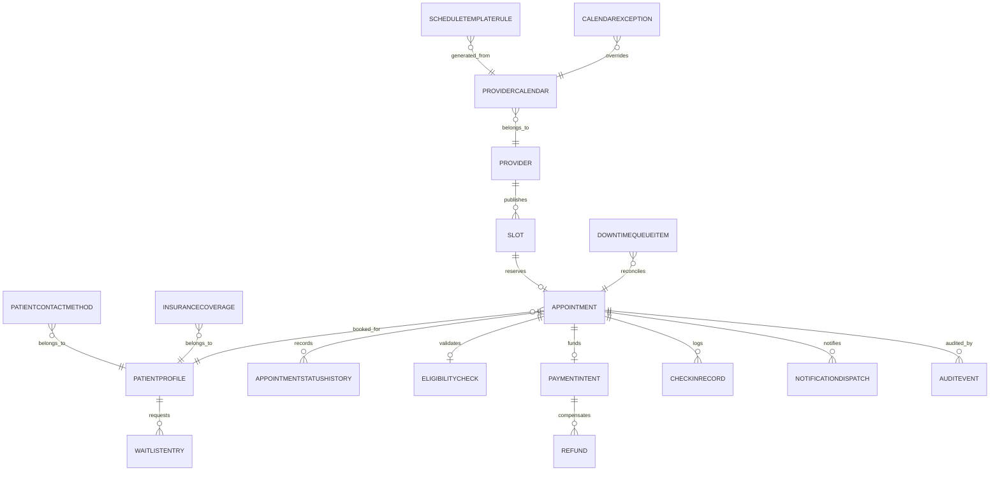

# Data Dictionary

This data dictionary is the canonical reference for the entities, fields, and governed vocabularies used to implement healthcare appointment scheduling, payment readiness, reminder delivery, and downtime recovery.

## Scope and Goals
- Provide a shared data contract for APIs, service boundaries, analytics, and operations.
- Identify which records contain PHI, PCI-adjacent references, schedule state, and audit evidence.
- Clarify lifecycle ownership so each service knows which tables it may mutate and which read models it may project.

## Core Entities
| Entity | Description | Required Attributes |
|---|---|---|
| PatientProfile | Patient demographic and portal identity record | `patient_id, tenant_id, mrn, first_name, last_name, date_of_birth, legal_sex, timezone, portal_status, preferred_language` |
| PatientContactMethod | Reachability channels and consent flags for communications | `contact_id, patient_id, channel, value, verified_at, consent_status, quiet_hours_start, quiet_hours_end` |
| InsuranceCoverage | Active or historical payer coverage for a patient | `coverage_id, patient_id, payer_name, subscriber_id, group_number, relationship_to_subscriber, effective_from, effective_to, plan_type, status` |
| Provider | Clinician record with credentials and scheduling status | `provider_id, tenant_id, npi, display_name, specialty_code, status, accepting_new_patients, telehealth_enabled` |
| ProviderCalendar | Effective-dated weekly schedule container per provider and location | `calendar_id, provider_id, timezone, effective_from, version, status` |
| ScheduleTemplateRule | Recurring rule that generates candidate slots | `template_rule_id, calendar_id, day_of_week, start_time, end_time, location_id, visit_types, slot_duration_minutes, buffer_minutes, max_concurrency` |
| CalendarException | One-off closure, leave, or capacity expansion | `exception_id, provider_id, date_from, date_to, exception_type, reason_code, notify_affected_patients, created_by` |
| Slot | Concrete bookable unit of provider capacity | `slot_id, provider_id, location_id, start_time, end_time, visit_type_set, slot_version, status, source_calendar_version` |
| Appointment | Patient-facing appointment record | `appointment_id, patient_id, provider_id, clinic_id, slot_id, visit_type, channel, status, confirmation_number, booking_channel, scheduled_start, scheduled_end` |
| AppointmentStatusHistory | Immutable ledger of appointment lifecycle transitions | `history_id, appointment_id, from_status, to_status, actor_id, actor_role, reason_code, occurred_at, correlation_id` |
| EligibilityCheck | Cached insurance verification response | `eligibility_check_id, appointment_id, coverage_id, eligible, copay_amount_cents, deductible_remaining_cents, requires_referral, prior_auth_required, checked_at, valid_until` |
| PaymentIntent | Copay authorization or capture record | `payment_intent_id, appointment_id, processor, processor_reference, amount_cents, currency, status, authorized_at, captured_at, voided_at` |
| Refund | Refund or void decision linked to an appointment | `refund_id, payment_intent_id, appointment_id, amount_cents, reason_code, requested_at, settled_at, status` |
| CheckInRecord | Arrival and intake completion evidence | `check_in_id, appointment_id, location_id, method, checked_in_at, demographic_verified, consent_verified, copay_collected` |
| NotificationDispatch | Individual delivery attempt for an appointment-related communication | `dispatch_id, appointment_id, event_name, channel, template_version, destination_hash, status, attempt_count, next_attempt_at` |
| WaitlistEntry | Patient interest in an earlier appointment | `waitlist_entry_id, patient_id, provider_id, clinic_id, visit_type, earliest_date, latest_date, preferred_times, status, priority_score` |
| AuditEvent | Immutable compliance and troubleshooting evidence | `audit_event_id, tenant_id, aggregate_type, aggregate_id, actor_id, action, purpose_of_use, source_ip, created_at` |
| DowntimeQueueItem | Manual action captured during outage for later replay | `queue_item_id, tenant_id, action_type, paper_form_id, clinic_id, payload_hash, captured_at, reconciliation_status` |

## Canonical Relationship Diagram

## Controlled Vocabularies
| Field | Allowed Values | Notes |
|---|---|---|
| `appointment.status` | `DRAFT`, `PENDING_CONFIRMATION`, `CONFIRMED`, `CHECKED_IN`, `IN_CONSULTATION`, `COMPLETED`, `CANCELLED`, `NO_SHOW`, `EXPIRED`, `REBOOK_REQUIRED` | Drives notifications, billing, and EHR sync |
| `slot.status` | `AVAILABLE`, `RESERVED`, `LOCKED_FOR_VISIT`, `RELEASED`, `BLOCKED`, `SUSPENDED` | `HELD` is transient in cache only |
| `calendar_exception.exception_type` | `LEAVE`, `CLINIC_CLOSURE`, `EMERGENCY_BLOCK`, `CAPACITY_EXPANSION`, `CREDENTIAL_SUSPENSION` | Determines outreach urgency |
| `payment_intent.status` | `REQUIRES_AUTH`, `AUTHORIZED`, `CAPTURED`, `VOIDED`, `FAILED`, `REFUNDED` | Ledger events are immutable |
| `notification_dispatch.status` | `PENDING`, `SENT`, `DELIVERED`, `FAILED`, `SUPPRESSED`, `MANUAL_OUTREACH_REQUIRED` | Re-evaluated on each attempt |
| `downtime_queue_item.reconciliation_status` | `PENDING`, `REPLAYED`, `CONFLICT`, `CANCELLED`, `SIGNED_OFF` | Managed by operations workflow |

## Data Quality Controls
1. All write paths validate tenant ownership, required fields, and foreign keys before persistence.
2. `patient_id`, `provider_id`, `slot_id`, and `appointment_id` are immutable once created; downstream systems reference them as stable public identifiers.
3. Time values are stored in UTC with the originating clinic timezone retained for patient communication and schedule display.
4. Eligibility and payment records must include provenance metadata such as payer source, processor reference, or manual reviewer id.
5. Duplicate detection is required on booking retries, payment webhooks, and notification callbacks using idempotency keys and provider-generated message ids.
6. PHI-bearing fields are tagged for masking in logs, exports, and analytics projections.

## Retention and Audit
- Appointment and audit history remain queryable online for active care operations and incident investigation windows.
- Notification payload bodies may be purged after retention expiry, but template version, delivery metadata, and destination hashes remain for compliance evidence.
- Downtime paper-form references must reconcile to digital records before destruction.
- Billing ledger and refund artifacts retain processor identifiers long enough to support bank reconciliation and payer disputes.

## Operational Policy Addendum

### Scheduling Conflict Policies
- Double-booking is prevented by the natural key `provider_id + location_id + slot_start + slot_end` plus optimistic locking on `slot_version` during booking and rescheduling.
- Reservation tokens shield a slot for up to 10 minutes during patient checkout, but the slot does not transition to `RESERVED` until the appointment transaction commits.
- Provider calendar updates caused by leave, clinic closure, overrun, or emergency blocks trigger immediate impact analysis; future appointments move to `REBOOK_REQUIRED` and create a staffed outreach task.
- Staff-assisted overrides may exceed normal template capacity only when a justification, approving actor, and override expiry are stored in the audit trail.

### Patient and Provider Workflow States
- Appointment lifecycle: `DRAFT -> PENDING_CONFIRMATION -> CONFIRMED -> CHECKED_IN -> IN_CONSULTATION -> COMPLETED`, with terminal states `CANCELLED`, `NO_SHOW`, `EXPIRED`, and `REBOOK_REQUIRED`.
- Slot lifecycle: `AVAILABLE -> RESERVED -> LOCKED_FOR_VISIT -> RELEASED`, with exceptional states `BLOCKED` for planned closures and `SUSPENDED` for compliance or credential issues.
- Invalid state transitions fail fast with deterministic error codes and do not publish downstream billing or notification events.
- Every transition records actor, channel, reason code, correlation id, timestamp, and source IP where available.

### Notification Guarantees
- Confirmation, reminder, cancellation, reschedule, emergency-closure, and waitlist-offer notifications are delivered through in-app, email, and SMS channels according to patient consent and clinic policy.
- Delivery is at-least-once with message deduplication keyed by `event_id + template_version + channel`; critical events retry for up to 24 hours before manual outreach is queued.
- Quiet hours suppress non-critical SMS and voice outreach, but life-safety or same-day operational notices may escalate to approved emergency templates.
- Notification content follows the minimum-necessary standard and excludes diagnosis, treatment details, or referral notes from SMS and push previews.

### Privacy Requirements
- PHI and billing artifacts are encrypted in transit and at rest, and non-production data must be de-identified before use outside regulated workflows.
- Role-based and attribute-based access controls restrict patient, scheduling, billing, and audit data to least-privilege views; privileged access requires MFA.
- Audit logs are immutable, exportable, and searchable by patient, provider, actor, action, and correlation id for compliance investigations.
- Downtime printouts, callback lists, and manual forms are treated as regulated records and must be secured, reconciled, and shredded per clinic policy after recovery.

### Downtime Fallback Procedures
- In degraded mode, staff retain read-only access to schedules while new booking, cancellation, and payment actions are captured in an ordered reconciliation queue.
- Clinics maintain a printable daily roster, manual check-in sheet, and downtime appointment intake form to continue operations during platform or integration outages.
- Recovery replays queued commands in timestamp order, revalidates slot conflicts and insurance status, syncs EHR and billing side effects, and notifies patients if outcomes changed.
- Incident closure requires backlog drain, reconciliation sign-off, communication to affected clinics, and a post-incident review with corrective actions.
