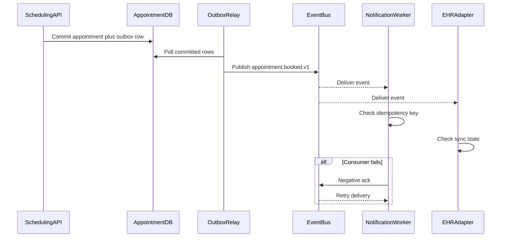

# Event Catalog

This catalog defines the event contracts that coordinate scheduling, reminders, payments, EHR synchronization, and operational recovery.

## Contract Conventions
- Naming pattern: `<domain>.<aggregate>.<action>.v1`.
- Required metadata on every message: `event_id`, `tenant_id`, `aggregate_id`, `aggregate_type`, `occurred_at`, `correlation_id`, `causation_id`, `producer`, `schema_version`, `phi_classification`.
- Delivery semantics: at-least-once with producer outbox and consumer idempotency keyed by `event_id`.
- Ordering guarantee: in-order per aggregate key such as `appointment_id`, `provider_id`, or `payment_intent_id`.
- PHI rule: event payloads may contain identifiers and operational status, but free-text clinical content must remain in the source service and be referenced indirectly.

## Domain Events
| Event Name | Trigger | Payload Highlights | Typical Consumers |
|---|---|---|---|
| `availability.slot_published.v1` | Slots generated or regenerated from a calendar template | `provider_id, slot_id, start_time, end_time, visit_types, slot_version` | search cache, analytics |
| `provider.calendar_exception_added.v1` | Provider leave, closure, or emergency block created | `provider_id, exception_type, date_from, date_to, affected_slot_count` | rebooking workflow, notifications |
| `eligibility.coverage_verified.v1` | Clearinghouse or manual eligibility response completed | `patient_id, coverage_id, eligible, copay_amount_cents, valid_until, manual_review` | booking policy, readiness dashboard |
| `payment.intent_authorized.v1` | Copay authorization approved | `payment_intent_id, appointment_id, amount_cents, processor_reference, expires_at` | booking workflow, finance ledger |
| `payment.intent_failed.v1` | Copay authorization failed | `appointment_id, reason_code, processor_reference, retryable` | portal UX, finance alerts |
| `appointment.booked.v1` | Appointment transaction committed | `appointment_id, patient_id, provider_id, slot_id, visit_type, confirmation_number, booking_channel` | notifications, EHR adapter, analytics |
| `appointment.rescheduled.v1` | Existing appointment moved to a new slot | `appointment_id, old_slot_id, new_slot_id, old_start_time, new_start_time, reason_code` | notifications, waitlist, EHR adapter |
| `appointment.cancelled.v1` | Appointment cancelled by patient, staff, or provider | `appointment_id, cancelled_by_role, reason_code, refund_policy_outcome` | refund workflow, notifications, reporting |
| `appointment.rebook_required.v1` | Provider schedule change invalidates future visit | `appointment_id, provider_id, patient_id, impact_reason, urgency_level` | staff worklist, outreach dashboard |
| `appointment.checked_in.v1` | Patient arrival completed | `appointment_id, location_id, check_in_method, copay_collected, readiness_flags` | provider queue, billing |
| `appointment.completed.v1` | Provider closes encounter | `appointment_id, actual_end_time, follow_up_recommended, follow_up_within_days` | EHR adapter, reporting |
| `appointment.no_show_marked.v1` | Grace period expires without arrival | `appointment_id, no_show_fee_applied, outreach_required` | billing, reminder suppression |
| `notification.delivery_failed.v1` | Delivery exhausted retries or was suppressed | `dispatch_id, appointment_id, channel, failure_reason, manual_outreach_required` | contact center worklist, observability |
| `ops.downtime_started.v1` | Platform enters downtime procedure | `tenant_id, clinic_ids, declared_by, started_at, write_scope` | dashboards, status communication |
| `ops.reconciliation_completed.v1` | Downtime queue replay reaches sign-off | `tenant_id, clinic_id, replayed_count, conflict_count, signed_off_by` | compliance exports, reporting |

## Publish and Consumption Sequence

## Consumer Expectations
- Notification workers must rehydrate current consent and quiet-hour settings before composing the message.
- EHR adapters must translate internal appointment status to FHIR `Appointment.status` and retry for up to 24 hours before manual intervention.
- Billing consumers may not capture or refund payments based solely on notification events; they require the appointment or payment aggregate events.
- Operations dashboards compute SLA breaches from `occurred_at`, not broker receive time.

## Operational SLOs
- P95 transaction-commit-to-event-publish latency is under 5 seconds for `appointment.*` and `provider.calendar_exception_added.v1` events.
- DLQ acknowledgement for production notifications and payment events is under 15 minutes.
- Critical event schemas remain backward compatible within major version `v1`; breaking changes require a new topic and consumer migration plan.
- Event replay tools must support replay by `appointment_id`, `provider_id`, `patient_id`, `correlation_id`, or incident window.

## Operational Policy Addendum

### Scheduling Conflict Policies
- Double-booking is prevented by the natural key `provider_id + location_id + slot_start + slot_end` plus optimistic locking on `slot_version` during booking and rescheduling.
- Reservation tokens shield a slot for up to 10 minutes during patient checkout, but the slot does not transition to `RESERVED` until the appointment transaction commits.
- Provider calendar updates caused by leave, clinic closure, overrun, or emergency blocks trigger immediate impact analysis; future appointments move to `REBOOK_REQUIRED` and create a staffed outreach task.
- Staff-assisted overrides may exceed normal template capacity only when a justification, approving actor, and override expiry are stored in the audit trail.

### Patient and Provider Workflow States
- Appointment lifecycle: `DRAFT -> PENDING_CONFIRMATION -> CONFIRMED -> CHECKED_IN -> IN_CONSULTATION -> COMPLETED`, with terminal states `CANCELLED`, `NO_SHOW`, `EXPIRED`, and `REBOOK_REQUIRED`.
- Slot lifecycle: `AVAILABLE -> RESERVED -> LOCKED_FOR_VISIT -> RELEASED`, with exceptional states `BLOCKED` for planned closures and `SUSPENDED` for compliance or credential issues.
- Invalid state transitions fail fast with deterministic error codes and do not publish downstream billing or notification events.
- Every transition records actor, channel, reason code, correlation id, timestamp, and source IP where available.

### Notification Guarantees
- Confirmation, reminder, cancellation, reschedule, emergency-closure, and waitlist-offer notifications are delivered through in-app, email, and SMS channels according to patient consent and clinic policy.
- Delivery is at-least-once with message deduplication keyed by `event_id + template_version + channel`; critical events retry for up to 24 hours before manual outreach is queued.
- Quiet hours suppress non-critical SMS and voice outreach, but life-safety or same-day operational notices may escalate to approved emergency templates.
- Notification content follows the minimum-necessary standard and excludes diagnosis, treatment details, or referral notes from SMS and push previews.

### Privacy Requirements
- PHI and billing artifacts are encrypted in transit and at rest, and non-production data must be de-identified before use outside regulated workflows.
- Role-based and attribute-based access controls restrict patient, scheduling, billing, and audit data to least-privilege views; privileged access requires MFA.
- Audit logs are immutable, exportable, and searchable by patient, provider, actor, action, and correlation id for compliance investigations.
- Downtime printouts, callback lists, and manual forms are treated as regulated records and must be secured, reconciled, and shredded per clinic policy after recovery.

### Downtime Fallback Procedures
- In degraded mode, staff retain read-only access to schedules while new booking, cancellation, and payment actions are captured in an ordered reconciliation queue.
- Clinics maintain a printable daily roster, manual check-in sheet, and downtime appointment intake form to continue operations during platform or integration outages.
- Recovery replays queued commands in timestamp order, revalidates slot conflicts and insurance status, syncs EHR and billing side effects, and notifies patients if outcomes changed.
- Incident closure requires backlog drain, reconciliation sign-off, communication to affected clinics, and a post-incident review with corrective actions.
