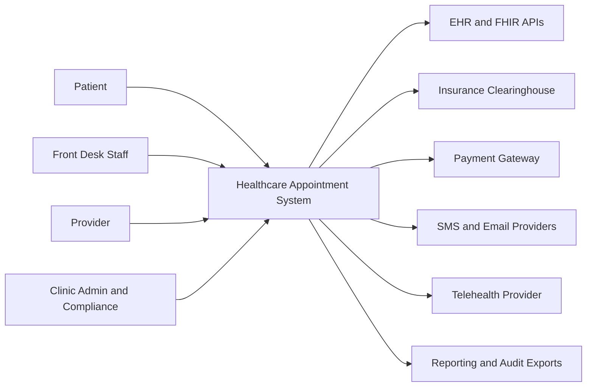

# System Context Diagram

The Healthcare Appointment System sits between patient-facing scheduling channels, clinic operations, and regulated healthcare integrations.

## Context Diagram

## External Actors and Systems
| Actor or System | Interaction with HAS | Data Exchanged | Constraints |
|---|---|---|---|
| Patient | Self-service booking, payment, intake, reminders, telehealth join | demographics, insurance, appointment selections, communication preferences | must see only own records and minimum-necessary data |
| Front Desk Staff | Staff-assisted booking, check-in, cancellation, downtime reconciliation | patient lookup, override reason, check-in readiness, manual notes | requires clinic-scoped RBAC and audited overrides |
| Provider | Schedule templates, exceptions, visit queue, completion and no-show actions | provider calendar, readiness flags, visit disposition | cannot view unrelated patient records |
| Clinic Admin and Compliance | Policy management, reporting, audit export, outage management | policy versions, utilization, PHI access audit, downtime status | MFA and purpose-of-use logging required |
| EHR and FHIR APIs | Appointment create or update, patient match, encounter linkage | FHIR Appointment, Patient, ServiceRequest, references | circuit breaker and retry queue required |
| Insurance Clearinghouse | Eligibility inquiry and response | X12 270 request, 271 response, benefit details | timeout falls back to manual verification |
| Payment Gateway | Tokenized copay authorization, capture, refund, void | payment token, processor reference, settlement status | PCI scope reduction and webhook verification |
| SMS and Email Providers | Confirmation, reminders, outage notices | destination token, template id, delivery receipts | no PHI in preview channels |
| Telehealth Provider | Session provisioning and launch links | appointment id, provider link, patient link, session status | BAA required before activation |
| Reporting and Audit Exports | Utilization, no-show, financial, compliance data | de-identified analytics or authorized PHI exports | export approvals and retention policy apply |

## Context Boundary Notes
- HAS owns the scheduling truth, reminder orchestration, payment readiness status, and downtime reconciliation queue.
- HAS does not own clinical documentation, prescribing, or claims adjudication, but it must synchronize relevant appointment state to those systems.
- Human actors enter through either patient-facing channels or privileged staff tools; both paths must apply the same booking policies.
- External integrations are optional per tenant, but the internal data model must support the absence of one or more integrations without corrupting appointment state.

## Operational Policy Addendum

### Scheduling Conflict Policies
- Double-booking is prevented by the natural key `provider_id + location_id + slot_start + slot_end` plus optimistic locking on `slot_version` during booking and rescheduling.
- Reservation tokens shield a slot for up to 10 minutes during patient checkout, but the slot does not transition to `RESERVED` until the appointment transaction commits.
- Provider calendar updates caused by leave, clinic closure, overrun, or emergency blocks trigger immediate impact analysis; future appointments move to `REBOOK_REQUIRED` and create a staffed outreach task.
- Staff-assisted overrides may exceed normal template capacity only when a justification, approving actor, and override expiry are stored in the audit trail.

### Patient and Provider Workflow States
- Appointment lifecycle: `DRAFT -> PENDING_CONFIRMATION -> CONFIRMED -> CHECKED_IN -> IN_CONSULTATION -> COMPLETED`, with terminal states `CANCELLED`, `NO_SHOW`, `EXPIRED`, and `REBOOK_REQUIRED`.
- Slot lifecycle: `AVAILABLE -> RESERVED -> LOCKED_FOR_VISIT -> RELEASED`, with exceptional states `BLOCKED` for planned closures and `SUSPENDED` for compliance or credential issues.
- Invalid state transitions fail fast with deterministic error codes and do not publish downstream billing or notification events.
- Every transition records actor, channel, reason code, correlation id, timestamp, and source IP where available.

### Notification Guarantees
- Confirmation, reminder, cancellation, reschedule, emergency-closure, and waitlist-offer notifications are delivered through in-app, email, and SMS channels according to patient consent and clinic policy.
- Delivery is at-least-once with message deduplication keyed by `event_id + template_version + channel`; critical events retry for up to 24 hours before manual outreach is queued.
- Quiet hours suppress non-critical SMS and voice outreach, but life-safety or same-day operational notices may escalate to approved emergency templates.
- Notification content follows the minimum-necessary standard and excludes diagnosis, treatment details, or referral notes from SMS and push previews.

### Privacy Requirements
- PHI and billing artifacts are encrypted in transit and at rest, and non-production data must be de-identified before use outside regulated workflows.
- Role-based and attribute-based access controls restrict patient, scheduling, billing, and audit data to least-privilege views; privileged access requires MFA.
- Audit logs are immutable, exportable, and searchable by patient, provider, actor, action, and correlation id for compliance investigations.
- Downtime printouts, callback lists, and manual forms are treated as regulated records and must be secured, reconciled, and shredded per clinic policy after recovery.

### Downtime Fallback Procedures
- In degraded mode, staff retain read-only access to schedules while new booking, cancellation, and payment actions are captured in an ordered reconciliation queue.
- Clinics maintain a printable daily roster, manual check-in sheet, and downtime appointment intake form to continue operations during platform or integration outages.
- Recovery replays queued commands in timestamp order, revalidates slot conflicts and insurance status, syncs EHR and billing side effects, and notifies patients if outcomes changed.
- Incident closure requires backlog drain, reconciliation sign-off, communication to affected clinics, and a post-incident review with corrective actions.
