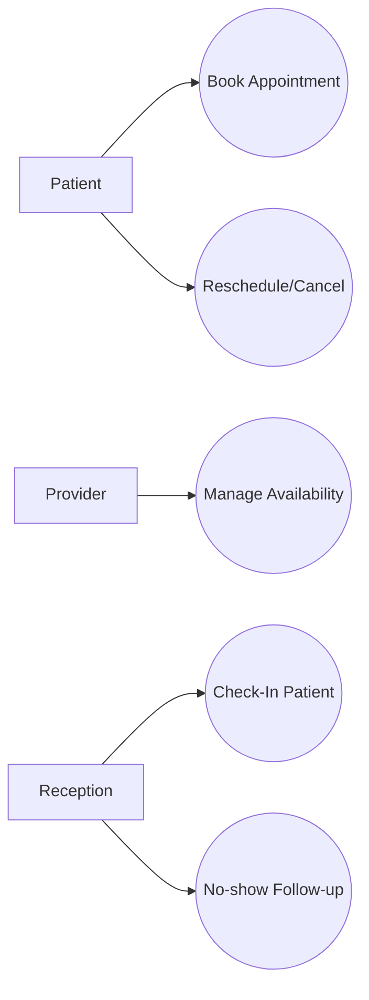

# Use Case Diagram

```mermaid
flowchart LR
  Patient --> U1((Book Appointment))
  Patient --> U2((Reschedule/Cancel))
  Provider --> U3((Manage Availability))
  Reception --> U4((Check-In Patient))
  Reception --> U5((No-show Follow-up))
```
