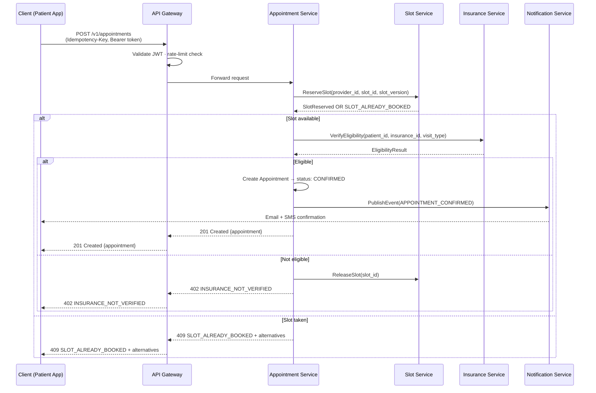

# API Design

## Overview

This document specifies the RESTful HTTP API for the Healthcare Appointment System. All communication uses HTTPS with JSON payloads. The API follows REST conventions with resource-oriented URLs, standard HTTP verbs, and a consistent error structure.

**Base URL:** `https://api.healthcare-appt.example.com`

---

## Authentication

All endpoints require a valid JWT Bearer token passed in the `Authorization` header.

```
Authorization: Bearer <token>
```

### Token Structure

**Header**
```json
{
  "alg": "RS256",
  "typ": "JWT",
  "kid": "key-2026-01-01"
}
```

**Payload**
```json
{
  "sub": "usr_01HXYZ123ABC",
  "iss": "https://auth.healthcare-appt.example.com",
  "aud": "healthcare-appt-api",
  "iat": 1716000000,
  "exp": 1716003600,
  "jti": "jti_01HXYZ123ABC",
  "roles": ["PATIENT"],
  "tenant_id": "tenant_01HXYZ",
  "clinic_ids": ["clinic_01HABC"],
  "mfa_verified": true
}
```

**Expiry:** Access tokens expire after **3 600 seconds (1 hour)**. Refresh tokens expire after **30 days**. Clients must refresh before expiry; expired tokens yield `401 UNAUTHORIZED`.

---

## Rate Limiting

Limits are enforced per token per endpoint tier. Every response carries the following headers:

| Header | Description |
|---|---|
| `X-RateLimit-Limit` | Maximum requests allowed in the current window |
| `X-RateLimit-Remaining` | Requests remaining in the current window |
| `X-RateLimit-Reset` | Unix timestamp when the window resets |
| `Retry-After` | Seconds to wait before retrying (present only on `429` responses) |

Default limits: **300 req/min** for authenticated callers; **30 req/min** for public endpoints. Admin tier: **600 req/min**.

---

## Pagination

All list endpoints use **cursor-based pagination**. Offset arithmetic is not supported.

### Request Parameters

| Parameter | Type | Default | Description |
|---|---|---|---|
| `limit` | integer | 20 | Items to return (max 100) |
| `cursor` | string | — | Opaque cursor from the previous response |

### Response Envelope

```json
{
  "data": [],
  "pagination": {
    "next_cursor": "cur_eyJpZCI6IjEyMyJ9",
    "prev_cursor": "cur_eyJpZCI6IjEwMCJ9",
    "total_count": 248,
    "has_more": true,
    "limit": 20
  }
}
```

`total_count` is a best-effort estimate and may lag by a few seconds on high-write collections.

---

## Filtering & Sorting

Filters are passed as query parameters. Multi-value filters use comma-separated values or repeated keys.

```
GET /v1/providers?specialty=CARDIOLOGY&accepting_new_patients=true
GET /v1/appointments?status=CONFIRMED,CHECKED_IN
```

Use `sort` and `order` to control ordering:

| Parameter | Values | Default |
|---|---|---|
| `sort` | Field name (`created_at`, `start_time`, `last_name`) | `created_at` |
| `order` | `asc`, `desc` | `desc` |

---

## Idempotency

All `POST` and `PATCH` requests **must** include an `Idempotency-Key` header containing a client-generated UUID v4. The server caches results for **24 hours**; duplicate requests within the window return the cached response with a `X-Idempotent-Replayed: true` header. A key reused with a different payload yields `409 DUPLICATE_REQUEST`.

```
Idempotency-Key: 550e8400-e29b-41d4-a716-446655440000
```

Omitting this header on a mutating request returns `400 VALIDATION_ERROR`.

---

## Error Format

```json
{
  "error": {
    "code": "SLOT_ALREADY_BOOKED",
    "message": "The requested slot has already been reserved by another patient.",
    "details": {
      "slot_id": "slot_01HXYZ001",
      "provider_id": "prv_01HXYZ123",
      "start_time": "2026-06-15T10:00:00Z"
    },
    "correlation_id": "req_01HXYZ123ABC",
    "timestamp": "2026-06-10T14:32:00Z"
  }
}
```

---

## Error Codes Reference

| Code | HTTP Status | Description |
|---|---|---|
| `SLOT_ALREADY_BOOKED` | 409 | The target slot was concurrently reserved by another booking. Response includes the top three alternative slots. |
| `INSURANCE_NOT_VERIFIED` | 402 | Patient insurance eligibility could not be confirmed for the requested visit type and date. |
| `OUTSIDE_BOOKING_WINDOW` | 422 | Booking falls outside the allowed scheduling window (too far ahead or same-day cut-off has passed). |
| `PROVIDER_UNAVAILABLE` | 423 | Provider is on leave, blocked, or otherwise unavailable for the requested slot. |
| `APPOINTMENT_NOT_CANCELLABLE` | 409 | Appointment is in a terminal or in-progress state that prevents cancellation. |
| `DUPLICATE_REQUEST` | 409 | An `Idempotency-Key` was reused with a different request payload within the 24-hour cache window. |
| `RATE_LIMIT_EXCEEDED` | 429 | Client has exceeded the allowed request rate. Inspect the `Retry-After` header. |
| `UNAUTHORIZED` | 401 | Missing, malformed, or expired JWT Bearer token. |
| `FORBIDDEN` | 403 | Authenticated principal lacks permission for this resource or action. |
| `VALIDATION_ERROR` | 400 | Request body or query parameters failed schema or business-rule validation. `details` lists each failing field. |
| `RESOURCE_NOT_FOUND` | 404 | The requested resource does not exist or the caller lacks visibility into it. |

---

## Appointment Booking Flow



---

## Endpoints

### Providers

#### `GET /v1/providers` — List Providers

Returns a paginated list of providers, filterable by specialty, clinic, availability, and insurance plan.

**Query Parameters**

| Parameter | Type | Required | Description |
|---|---|---|---|
| `specialty` | string | No | Medical specialty code (e.g., `CARDIOLOGY`, `DERMATOLOGY`, `ORTHOPEDICS`) |
| `clinic_id` | string | No | Restrict to providers belonging to this clinic |
| `accepting_new_patients` | boolean | No | `true` to show only providers accepting new patients |
| `date` | date (ISO 8601) | No | Return providers with at least one open slot on this date |
| `insurance_plan_id` | string | No | Return providers in-network for this insurance plan |
| `limit` | integer | No | Page size (default 20, max 100) |
| `cursor` | string | No | Pagination cursor from previous response |

**Response `200 OK`**
```json
{
  "data": [
    {
      "id": "prv_01HXYZ123",
      "npi": "1234567890",
      "first_name": "Priya",
      "last_name": "Sharma",
      "specialty": "CARDIOLOGY",
      "clinic_id": "clinic_01HABC",
      "accepting_new_patients": true,
      "insurance_plans": ["ins_01", "ins_02"],
      "next_available": "2026-06-12T09:00:00Z",
      "created_at": "2024-01-15T08:00:00Z"
    }
  ],
  "pagination": {
    "next_cursor": "cur_eyJpZCI6InBydf8wMSJ9",
    "prev_cursor": null,
    "total_count": 42,
    "has_more": true,
    "limit": 20
  }
}
```

**Errors:** `UNAUTHORIZED`, `VALIDATION_ERROR`

---

#### `GET /v1/providers/:id` — Get Provider

Returns the full profile for a single provider.

**Path Parameters**

| Parameter | Type | Description |
|---|---|---|
| `id` | string | Provider ID |

**Response `200 OK`**
```json
{
  "id": "prv_01HXYZ123",
  "npi": "1234567890",
  "first_name": "Priya",
  "last_name": "Sharma",
  "specialty": "CARDIOLOGY",
  "sub_specialty": "INTERVENTIONAL_CARDIOLOGY",
  "clinic_id": "clinic_01HABC",
  "accepting_new_patients": true,
  "languages": ["en", "hi"],
  "insurance_plans": ["ins_01", "ins_02"],
  "average_rating": 4.8,
  "total_reviews": 312,
  "next_available": "2026-06-12T09:00:00Z",
  "bio": "Board-certified cardiologist with 15 years of clinical experience.",
  "created_at": "2024-01-15T08:00:00Z",
  "updated_at": "2026-05-01T12:00:00Z"
}
```

**Errors:** `UNAUTHORIZED`, `RESOURCE_NOT_FOUND`

---

#### `POST /v1/providers` — Create Provider

Registers a new provider. Requires `ADMIN` or `CLINIC_ADMIN` role.

**Headers:** `Idempotency-Key: <uuid>`

**Request Body**
```json
{
  "npi": "9876543210",
  "first_name": "Carlos",
  "last_name": "Mendez",
  "specialty": "ORTHOPEDICS",
  "sub_specialty": "SPORTS_MEDICINE",
  "clinic_id": "clinic_01HABC",
  "accepting_new_patients": true,
  "languages": ["en", "es"],
  "insurance_plans": ["ins_01", "ins_03"],
  "bio": "Orthopedic surgeon specializing in knee and shoulder reconstruction."
}
```

**Response `201 Created`**
```json
{
  "id": "prv_01HNEW456",
  "npi": "9876543210",
  "first_name": "Carlos",
  "last_name": "Mendez",
  "specialty": "ORTHOPEDICS",
  "clinic_id": "clinic_01HABC",
  "accepting_new_patients": true,
  "created_at": "2026-06-10T10:00:00Z"
}
```

**Errors:** `UNAUTHORIZED`, `FORBIDDEN`, `VALIDATION_ERROR`, `DUPLICATE_REQUEST`

---

#### `PATCH /v1/providers/:id` — Update Provider

Partially updates a provider's profile. Only supplied fields are changed.

**Path Parameters**

| Parameter | Type | Description |
|---|---|---|
| `id` | string | Provider ID |

**Headers:** `Idempotency-Key: <uuid>`

**Request Body**
```json
{
  "accepting_new_patients": false,
  "bio": "Currently not accepting new patients — existing patients only.",
  "insurance_plans": ["ins_01"]
}
```

**Response `200 OK`**
```json
{
  "id": "prv_01HXYZ123",
  "accepting_new_patients": false,
  "updated_at": "2026-06-10T15:00:00Z"
}
```

**Errors:** `UNAUTHORIZED`, `FORBIDDEN`, `VALIDATION_ERROR`, `RESOURCE_NOT_FOUND`, `DUPLICATE_REQUEST`

---

#### `GET /v1/providers/:id/slots` — List Available Slots

Returns open appointment slots for a provider within a date range.

**Path Parameters**

| Parameter | Type | Description |
|---|---|---|
| `id` | string | Provider ID |

**Query Parameters**

| Parameter | Type | Required | Description |
|---|---|---|---|
| `date_from` | datetime (ISO 8601) | Yes | Start of the search window |
| `date_to` | datetime (ISO 8601) | Yes | End of the search window (max 60 days from `date_from`) |
| `visit_type` | string | No | `NEW_PATIENT`, `FOLLOW_UP`, `URGENT_CARE`, `TELEHEALTH` |
| `duration_minutes` | integer | No | Required slot duration in minutes |

**Response `200 OK`**
```json
{
  "provider_id": "prv_01HXYZ123",
  "slots": [
    {
      "slot_id": "slot_01HXYZ001",
      "start_time": "2026-06-15T09:00:00Z",
      "end_time": "2026-06-15T09:30:00Z",
      "duration_minutes": 30,
      "visit_types": ["FOLLOW_UP", "TELEHEALTH"],
      "location_id": "loc_01HABC",
      "telehealth_available": true,
      "slot_version": 3
    }
  ]
}
```

**Errors:** `UNAUTHORIZED`, `RESOURCE_NOT_FOUND`, `VALIDATION_ERROR`, `PROVIDER_UNAVAILABLE`

---

### Appointments

#### `GET /v1/appointments` — List Appointments

Returns appointments scoped to the caller: patients see their own; providers see their panel; admins see all.

**Query Parameters**

| Parameter | Type | Required | Description |
|---|---|---|---|
| `patient_id` | string | No | Filter by patient (admin/provider only) |
| `provider_id` | string | No | Filter by provider |
| `clinic_id` | string | No | Filter by clinic |
| `status` | string | No | Comma-separated: `CONFIRMED`, `CHECKED_IN`, `COMPLETED`, `CANCELLED`, `NO_SHOW` |
| `date_from` | date | No | Appointments on or after this date |
| `date_to` | date | No | Appointments on or before this date |
| `visit_type` | string | No | Filter by visit type |
| `sort` | string | No | `start_time` or `created_at` |
| `order` | string | No | `asc` or `desc` |
| `limit` | integer | No | Page size (default 20) |
| `cursor` | string | No | Pagination cursor |

**Response `200 OK`**
```json
{
  "data": [
    {
      "id": "appt_01HXYZ789",
      "patient_id": "pat_01HABC",
      "provider_id": "prv_01HXYZ123",
      "clinic_id": "clinic_01HABC",
      "slot_id": "slot_01HXYZ001",
      "start_time": "2026-06-15T09:00:00Z",
      "end_time": "2026-06-15T09:30:00Z",
      "visit_type": "FOLLOW_UP",
      "status": "CONFIRMED",
      "channel": "IN_PERSON",
      "confirmation_number": "APPT-2026-00789",
      "created_at": "2026-06-10T10:00:00Z"
    }
  ],
  "pagination": {
    "next_cursor": null,
    "prev_cursor": null,
    "total_count": 15,
    "has_more": false,
    "limit": 20
  }
}
```

**Errors:** `UNAUTHORIZED`, `FORBIDDEN`, `VALIDATION_ERROR`

---

#### `POST /v1/appointments` — Book Appointment

Creates a new appointment. Atomically reserves the slot and verifies insurance eligibility.

**Headers:** `Idempotency-Key: <uuid>`

**Request Body**
```json
{
  "patient_id": "pat_01HABC",
  "provider_id": "prv_01HXYZ123",
  "slot_id": "slot_01HXYZ001",
  "slot_version": 3,
  "visit_type": "FOLLOW_UP",
  "channel": "IN_PERSON",
  "insurance_coverage_id": "ins_cov_01HABC",
  "chief_complaint": "Follow-up for hypertension management.",
  "referral_id": "ref_01HABC",
  "notification_preferences": { "email": true, "sms": true, "push": false }
}
```

**Response `201 Created`**
```json
{
  "id": "appt_01HXYZ789",
  "patient_id": "pat_01HABC",
  "provider_id": "prv_01HXYZ123",
  "slot_id": "slot_01HXYZ001",
  "start_time": "2026-06-15T09:00:00Z",
  "end_time": "2026-06-15T09:30:00Z",
  "visit_type": "FOLLOW_UP",
  "status": "CONFIRMED",
  "channel": "IN_PERSON",
  "confirmation_number": "APPT-2026-00789",
  "created_at": "2026-06-10T10:00:00Z"
}
```

**Errors:** `UNAUTHORIZED`, `FORBIDDEN`, `VALIDATION_ERROR`, `SLOT_ALREADY_BOOKED`, `INSURANCE_NOT_VERIFIED`, `OUTSIDE_BOOKING_WINDOW`, `PROVIDER_UNAVAILABLE`, `DUPLICATE_REQUEST`

---

#### `GET /v1/appointments/:id` — Get Appointment

Returns full details of a single appointment.

**Path Parameters**

| Parameter | Type | Description |
|---|---|---|
| `id` | string | Appointment ID |

**Response `200 OK`**
```json
{
  "id": "appt_01HXYZ789",
  "patient_id": "pat_01HABC",
  "provider_id": "prv_01HXYZ123",
  "clinic_id": "clinic_01HABC",
  "location_id": "loc_01HABC",
  "slot_id": "slot_01HXYZ001",
  "start_time": "2026-06-15T09:00:00Z",
  "end_time": "2026-06-15T09:30:00Z",
  "visit_type": "FOLLOW_UP",
  "status": "CONFIRMED",
  "channel": "IN_PERSON",
  "confirmation_number": "APPT-2026-00789",
  "chief_complaint": "Follow-up for hypertension management.",
  "insurance_coverage_id": "ins_cov_01HABC",
  "insurance_verified": true,
  "referral_id": "ref_01HABC",
  "created_at": "2026-06-10T10:00:00Z",
  "updated_at": "2026-06-10T10:00:00Z"
}
```

**Errors:** `UNAUTHORIZED`, `FORBIDDEN`, `RESOURCE_NOT_FOUND`

---

#### `PATCH /v1/appointments/:id/reschedule` — Reschedule Appointment

Moves the appointment to a new slot. Releases the current slot and atomically reserves the new one.

**Path Parameters**

| Parameter | Type | Description |
|---|---|---|
| `id` | string | Appointment ID |

**Headers:** `Idempotency-Key: <uuid>`

**Request Body**
```json
{
  "new_slot_id": "slot_01HXYZ099",
  "slot_version": 1,
  "reason": "Patient requested an earlier appointment."
}
```

**Response `200 OK`**
```json
{
  "id": "appt_01HXYZ789",
  "status": "CONFIRMED",
  "start_time": "2026-06-17T14:00:00Z",
  "end_time": "2026-06-17T14:30:00Z",
  "updated_at": "2026-06-10T11:00:00Z"
}
```

**Errors:** `UNAUTHORIZED`, `FORBIDDEN`, `RESOURCE_NOT_FOUND`, `SLOT_ALREADY_BOOKED`, `OUTSIDE_BOOKING_WINDOW`, `PROVIDER_UNAVAILABLE`, `DUPLICATE_REQUEST`

---

#### `PATCH /v1/appointments/:id/cancel` — Cancel Appointment

Cancels the appointment, releases the slot, and sends a patient notification.

**Path Parameters**

| Parameter | Type | Description |
|---|---|---|
| `id` | string | Appointment ID |

**Headers:** `Idempotency-Key: <uuid>`

**Request Body**
```json
{
  "reason_code": "PATIENT_REQUEST",
  "reason_note": "Patient has recovered and no longer requires this visit."
}
```

**Response `200 OK`**
```json
{
  "id": "appt_01HXYZ789",
  "status": "CANCELLED",
  "cancelled_at": "2026-06-10T11:30:00Z",
  "cancelled_by": "usr_01HXYZ123ABC",
  "reason_code": "PATIENT_REQUEST"
}
```

**Errors:** `UNAUTHORIZED`, `FORBIDDEN`, `RESOURCE_NOT_FOUND`, `APPOINTMENT_NOT_CANCELLABLE`, `DUPLICATE_REQUEST`

---

#### `PATCH /v1/appointments/:id/check-in` — Check In Patient

Transitions the appointment to `CHECKED_IN`. Typically called by front-desk staff or kiosk.

**Path Parameters**

| Parameter | Type | Description |
|---|---|---|
| `id` | string | Appointment ID |

**Headers:** `Idempotency-Key: <uuid>`

**Request Body**
```json
{
  "check_in_method": "KIOSK",
  "location_id": "loc_01HABC",
  "copay_collected": true,
  "copay_amount_cents": 2500
}
```

**Response `200 OK`**
```json
{
  "id": "appt_01HXYZ789",
  "status": "CHECKED_IN",
  "checked_in_at": "2026-06-15T08:52:00Z"
}
```

**Errors:** `UNAUTHORIZED`, `FORBIDDEN`, `RESOURCE_NOT_FOUND`, `VALIDATION_ERROR`, `DUPLICATE_REQUEST`

---

#### `PATCH /v1/appointments/:id/complete` — Complete Appointment

Marks the appointment as `COMPLETED` after the clinical encounter concludes.

**Path Parameters**

| Parameter | Type | Description |
|---|---|---|
| `id` | string | Appointment ID |

**Headers:** `Idempotency-Key: <uuid>`

**Request Body**
```json
{
  "actual_end_time": "2026-06-15T09:28:00Z",
  "visit_notes_submitted": true,
  "follow_up_recommended": true,
  "follow_up_within_days": 30
}
```

**Response `200 OK`**
```json
{
  "id": "appt_01HXYZ789",
  "status": "COMPLETED",
  "completed_at": "2026-06-15T09:28:00Z",
  "follow_up_recommended": true,
  "follow_up_within_days": 30
}
```

**Errors:** `UNAUTHORIZED`, `FORBIDDEN`, `RESOURCE_NOT_FOUND`, `VALIDATION_ERROR`, `DUPLICATE_REQUEST`

---

### Patients

#### `GET /v1/patients` — List Patients

Returns patients accessible to the caller. Providers see their panel; admins see all.

**Query Parameters**

| Parameter | Type | Required | Description |
|---|---|---|---|
| `search` | string | No | Full-text search on name, date of birth, or MRN |
| `clinic_id` | string | No | Filter patients registered at this clinic |
| `provider_id` | string | No | Filter patients on a specific provider's panel |
| `sort` | string | No | `last_name`, `created_at` |
| `order` | string | No | `asc` or `desc` |
| `limit` | integer | No | Page size (default 20) |
| `cursor` | string | No | Pagination cursor |

**Response `200 OK`**
```json
{
  "data": [
    {
      "id": "pat_01HABC",
      "mrn": "MRN-2024-001234",
      "first_name": "Jordan",
      "last_name": "Lee",
      "date_of_birth": "1985-07-22",
      "gender": "NON_BINARY",
      "primary_phone": "+14155550101",
      "email": "jordan.lee@example.com",
      "primary_clinic_id": "clinic_01HABC",
      "created_at": "2024-03-01T09:00:00Z"
    }
  ],
  "pagination": {
    "next_cursor": null,
    "prev_cursor": null,
    "total_count": 1,
    "has_more": false,
    "limit": 20
  }
}
```

**Errors:** `UNAUTHORIZED`, `FORBIDDEN`, `VALIDATION_ERROR`

---

#### `POST /v1/patients` — Create Patient

Registers a new patient record via self-registration or staff intake.

**Headers:** `Idempotency-Key: <uuid>`

**Request Body**
```json
{
  "first_name": "Jordan",
  "last_name": "Lee",
  "date_of_birth": "1985-07-22",
  "gender": "NON_BINARY",
  "primary_phone": "+14155550101",
  "email": "jordan.lee@example.com",
  "address": {
    "line1": "456 Maple Ave",
    "city": "San Francisco",
    "state": "CA",
    "postal_code": "94107",
    "country": "US"
  },
  "emergency_contact": {
    "name": "Alex Lee",
    "relationship": "SPOUSE",
    "phone": "+14155550202"
  },
  "primary_clinic_id": "clinic_01HABC",
  "preferred_language": "en",
  "communication_consent": { "email": true, "sms": true, "phone": false }
}
```

**Response `201 Created`**
```json
{
  "id": "pat_01HABC",
  "mrn": "MRN-2024-001234",
  "first_name": "Jordan",
  "last_name": "Lee",
  "primary_clinic_id": "clinic_01HABC",
  "created_at": "2024-03-01T09:00:00Z"
}
```

**Errors:** `UNAUTHORIZED`, `VALIDATION_ERROR`, `DUPLICATE_REQUEST`

---

#### `GET /v1/patients/:id` — Get Patient

Returns the full patient profile.

**Path Parameters**

| Parameter | Type | Description |
|---|---|---|
| `id` | string | Patient ID |

**Response `200 OK`**
```json
{
  "id": "pat_01HABC",
  "mrn": "MRN-2024-001234",
  "first_name": "Jordan",
  "last_name": "Lee",
  "date_of_birth": "1985-07-22",
  "gender": "NON_BINARY",
  "primary_phone": "+14155550101",
  "email": "jordan.lee@example.com",
  "address": {
    "line1": "456 Maple Ave",
    "city": "San Francisco",
    "state": "CA",
    "postal_code": "94107",
    "country": "US"
  },
  "emergency_contact": { "name": "Alex Lee", "relationship": "SPOUSE", "phone": "+14155550202" },
  "primary_clinic_id": "clinic_01HABC",
  "preferred_language": "en",
  "active_insurance_count": 2,
  "created_at": "2024-03-01T09:00:00Z",
  "updated_at": "2026-04-10T14:00:00Z"
}
```

**Errors:** `UNAUTHORIZED`, `FORBIDDEN`, `RESOURCE_NOT_FOUND`

---

#### `PATCH /v1/patients/:id` — Update Patient

Partially updates mutable fields on a patient record.

**Path Parameters**

| Parameter | Type | Description |
|---|---|---|
| `id` | string | Patient ID |

**Headers:** `Idempotency-Key: <uuid>`

**Request Body**
```json
{
  "primary_phone": "+14155550303",
  "address": {
    "line1": "789 Oak Street",
    "city": "Oakland",
    "state": "CA",
    "postal_code": "94601",
    "country": "US"
  },
  "communication_consent": { "sms": false }
}
```

**Response `200 OK`**
```json
{
  "id": "pat_01HABC",
  "updated_at": "2026-06-10T12:00:00Z"
}
```

**Errors:** `UNAUTHORIZED`, `FORBIDDEN`, `VALIDATION_ERROR`, `RESOURCE_NOT_FOUND`, `DUPLICATE_REQUEST`

---

### Patient Insurance

#### `GET /v1/patients/:id/insurance` — List Patient Insurance

Returns all insurance coverage records attached to a patient.

**Path Parameters**

| Parameter | Type | Description |
|---|---|---|
| `id` | string | Patient ID |

**Response `200 OK`**
```json
{
  "data": [
    {
      "id": "ins_cov_01HABC",
      "patient_id": "pat_01HABC",
      "insurance_plan_id": "ins_01",
      "plan_name": "BlueCross BlueShield PPO",
      "member_id": "XYZ123456789",
      "group_number": "GRP-98765",
      "subscriber_name": "Jordan Lee",
      "relationship_to_subscriber": "SELF",
      "effective_date": "2026-01-01",
      "termination_date": null,
      "verified_at": "2026-06-01T08:00:00Z",
      "is_primary": true
    }
  ]
}
```

**Errors:** `UNAUTHORIZED`, `FORBIDDEN`, `RESOURCE_NOT_FOUND`

---

#### `POST /v1/patients/:id/insurance` — Add Patient Insurance

Adds a new insurance coverage record to a patient's profile.

**Path Parameters**

| Parameter | Type | Description |
|---|---|---|
| `id` | string | Patient ID |

**Headers:** `Idempotency-Key: <uuid>`

**Request Body**
```json
{
  "insurance_plan_id": "ins_02",
  "member_id": "MED987654321",
  "group_number": "GRP-11111",
  "subscriber_name": "Jordan Lee",
  "subscriber_date_of_birth": "1985-07-22",
  "relationship_to_subscriber": "SELF",
  "effective_date": "2026-01-01",
  "is_primary": false
}
```

**Response `201 Created`**
```json
{
  "id": "ins_cov_02HABC",
  "patient_id": "pat_01HABC",
  "insurance_plan_id": "ins_02",
  "member_id": "MED987654321",
  "is_primary": false,
  "created_at": "2026-06-10T12:30:00Z"
}
```

**Errors:** `UNAUTHORIZED`, `FORBIDDEN`, `VALIDATION_ERROR`, `RESOURCE_NOT_FOUND`, `DUPLICATE_REQUEST`

---

### Insurance

#### `POST /v1/insurance/verify` — Verify Insurance Eligibility

Performs a real-time eligibility check against the payer's clearinghouse for a given patient, coverage, and visit.

**Headers:** `Idempotency-Key: <uuid>`

**Request Body**
```json
{
  "patient_id": "pat_01HABC",
  "insurance_coverage_id": "ins_cov_01HABC",
  "provider_id": "prv_01HXYZ123",
  "visit_type": "FOLLOW_UP",
  "service_date": "2026-06-15"
}
```

**Response `200 OK`**
```json
{
  "eligible": true,
  "patient_id": "pat_01HABC",
  "insurance_coverage_id": "ins_cov_01HABC",
  "plan_name": "BlueCross BlueShield PPO",
  "copay_amount_cents": 2500,
  "deductible_remaining_cents": 75000,
  "out_of_pocket_max_cents": 350000,
  "out_of_pocket_used_cents": 42000,
  "requires_referral": false,
  "prior_auth_required": false,
  "checked_at": "2026-06-10T12:00:00Z",
  "valid_until": "2026-06-10T12:15:00Z"
}
```

**Errors:** `UNAUTHORIZED`, `FORBIDDEN`, `VALIDATION_ERROR`, `INSURANCE_NOT_VERIFIED`, `RESOURCE_NOT_FOUND`, `DUPLICATE_REQUEST`

---

### Referrals

#### `GET /v1/referrals` — List Referrals

Returns referrals visible to the caller.

**Query Parameters**

| Parameter | Type | Required | Description |
|---|---|---|---|
| `patient_id` | string | No | Filter by patient |
| `referring_provider_id` | string | No | Filter by referring provider |
| `receiving_provider_id` | string | No | Filter by receiving provider |
| `status` | string | No | `PENDING`, `ACCEPTED`, `EXPIRED`, `CANCELLED` |
| `limit` | integer | No | Page size |
| `cursor` | string | No | Pagination cursor |

**Response `200 OK`**
```json
{
  "data": [
    {
      "id": "ref_01HABC",
      "patient_id": "pat_01HABC",
      "referring_provider_id": "prv_01HXYZ123",
      "receiving_provider_id": "prv_01HDEF456",
      "specialty": "CARDIOLOGY",
      "diagnosis_code": "I10",
      "status": "ACCEPTED",
      "valid_until": "2026-09-10",
      "created_at": "2026-06-10T10:00:00Z"
    }
  ],
  "pagination": { "next_cursor": null, "prev_cursor": null, "total_count": 1, "has_more": false, "limit": 20 }
}
```

**Errors:** `UNAUTHORIZED`, `FORBIDDEN`, `VALIDATION_ERROR`

---

#### `POST /v1/referrals` — Create Referral

Issues a new referral from one provider to another for a patient.

**Headers:** `Idempotency-Key: <uuid>`

**Request Body**
```json
{
  "patient_id": "pat_01HABC",
  "referring_provider_id": "prv_01HXYZ123",
  "receiving_provider_id": "prv_01HDEF456",
  "specialty": "CARDIOLOGY",
  "diagnosis_code": "I10",
  "clinical_notes": "Uncontrolled hypertension. Refer to cardiology for further evaluation and management.",
  "urgency": "ROUTINE",
  "valid_until": "2026-09-10"
}
```

**Response `201 Created`**
```json
{
  "id": "ref_01HABC",
  "patient_id": "pat_01HABC",
  "status": "PENDING",
  "valid_until": "2026-09-10",
  "created_at": "2026-06-10T10:00:00Z"
}
```

**Errors:** `UNAUTHORIZED`, `FORBIDDEN`, `VALIDATION_ERROR`, `DUPLICATE_REQUEST`

---

#### `GET /v1/referrals/:id` — Get Referral

Returns full details of a single referral.

**Path Parameters**

| Parameter | Type | Description |
|---|---|---|
| `id` | string | Referral ID |

**Response `200 OK`**
```json
{
  "id": "ref_01HABC",
  "patient_id": "pat_01HABC",
  "referring_provider_id": "prv_01HXYZ123",
  "receiving_provider_id": "prv_01HDEF456",
  "specialty": "CARDIOLOGY",
  "diagnosis_code": "I10",
  "clinical_notes": "Uncontrolled hypertension. Refer to cardiology for further evaluation and management.",
  "urgency": "ROUTINE",
  "status": "ACCEPTED",
  "used_appointment_id": "appt_01HXYZ789",
  "valid_until": "2026-09-10",
  "created_at": "2026-06-10T10:00:00Z",
  "updated_at": "2026-06-10T10:30:00Z"
}
```

**Errors:** `UNAUTHORIZED`, `FORBIDDEN`, `RESOURCE_NOT_FOUND`

---

#### `PATCH /v1/referrals/:id/status` — Update Referral Status

Transitions a referral to a new status (e.g., accept, cancel, mark expired).

**Path Parameters**

| Parameter | Type | Description |
|---|---|---|
| `id` | string | Referral ID |

**Headers:** `Idempotency-Key: <uuid>`

**Request Body**
```json
{
  "status": "ACCEPTED",
  "note": "Accepted; appointment scheduled for 2026-06-15."
}
```

**Response `200 OK`**
```json
{
  "id": "ref_01HABC",
  "status": "ACCEPTED",
  "updated_at": "2026-06-10T10:30:00Z"
}
```

**Errors:** `UNAUTHORIZED`, `FORBIDDEN`, `VALIDATION_ERROR`, `RESOURCE_NOT_FOUND`, `DUPLICATE_REQUEST`

---

### Waitlists

#### `GET /v1/waitlists` — List Waitlist Entries

Returns waitlist entries for the authenticated user or clinic.

**Query Parameters**

| Parameter | Type | Required | Description |
|---|---|---|---|
| `patient_id` | string | No | Filter by patient |
| `provider_id` | string | No | Filter by provider |
| `clinic_id` | string | No | Filter by clinic |
| `status` | string | No | `WAITING`, `OFFERED`, `ACCEPTED`, `EXPIRED` |
| `limit` | integer | No | Page size |
| `cursor` | string | No | Pagination cursor |

**Response `200 OK`**
```json
{
  "data": [
    {
      "id": "wl_01HABC",
      "patient_id": "pat_01HABC",
      "provider_id": "prv_01HXYZ123",
      "clinic_id": "clinic_01HABC",
      "visit_type": "FOLLOW_UP",
      "earliest_date": "2026-06-10",
      "latest_date": "2026-06-30",
      "status": "WAITING",
      "position": 3,
      "created_at": "2026-06-05T09:00:00Z"
    }
  ],
  "pagination": { "next_cursor": null, "prev_cursor": null, "total_count": 1, "has_more": false, "limit": 20 }
}
```

**Errors:** `UNAUTHORIZED`, `FORBIDDEN`, `VALIDATION_ERROR`

---

#### `POST /v1/waitlists` — Add to Waitlist

Places a patient on a provider's waitlist for a specified date range and visit type.

**Headers:** `Idempotency-Key: <uuid>`

**Request Body**
```json
{
  "patient_id": "pat_01HABC",
  "provider_id": "prv_01HXYZ123",
  "clinic_id": "clinic_01HABC",
  "visit_type": "FOLLOW_UP",
  "earliest_date": "2026-06-10",
  "latest_date": "2026-06-30",
  "preferred_times": ["MORNING", "AFTERNOON"],
  "insurance_coverage_id": "ins_cov_01HABC"
}
```

**Response `201 Created`**
```json
{
  "id": "wl_01HABC",
  "patient_id": "pat_01HABC",
  "provider_id": "prv_01HXYZ123",
  "status": "WAITING",
  "position": 3,
  "created_at": "2026-06-05T09:00:00Z"
}
```

**Errors:** `UNAUTHORIZED`, `FORBIDDEN`, `VALIDATION_ERROR`, `DUPLICATE_REQUEST`

---

#### `DELETE /v1/waitlists/:id` — Remove from Waitlist

Removes a patient's waitlist entry.

**Path Parameters**

| Parameter | Type | Description |
|---|---|---|
| `id` | string | Waitlist entry ID |

**Response `204 No Content`**

No response body.

**Errors:** `UNAUTHORIZED`, `FORBIDDEN`, `RESOURCE_NOT_FOUND`

---

### Notifications

#### `GET /v1/notifications/preferences` — Get Notification Preferences

Returns the notification channel preferences for the authenticated user.

**Response `200 OK`**
```json
{
  "user_id": "usr_01HXYZ123ABC",
  "preferences": {
    "appointment_confirmed":     { "email": true,  "sms": true,  "push": true  },
    "appointment_reminder_24h":  { "email": true,  "sms": true,  "push": false },
    "appointment_reminder_1h":   { "email": false, "sms": true,  "push": true  },
    "appointment_cancelled":     { "email": true,  "sms": true,  "push": true  },
    "waitlist_offer":            { "email": true,  "sms": true,  "push": true  },
    "referral_update":           { "email": true,  "sms": false, "push": false }
  },
  "updated_at": "2026-04-01T10:00:00Z"
}
```

**Errors:** `UNAUTHORIZED`

---

#### `PATCH /v1/notifications/preferences` — Update Notification Preferences

Updates one or more notification event channel preferences for the authenticated user.

**Headers:** `Idempotency-Key: <uuid>`

**Request Body**
```json
{
  "appointment_reminder_24h": { "sms": false },
  "waitlist_offer":           { "push": false }
}
```

**Response `200 OK`**
```json
{
  "user_id": "usr_01HXYZ123ABC",
  "updated_at": "2026-06-10T13:00:00Z"
}
```

**Errors:** `UNAUTHORIZED`, `VALIDATION_ERROR`, `DUPLICATE_REQUEST`

---

### Admin — Provider Calendar

#### `GET /v1/admin/providers/:id/calendar` — Get Provider Calendar

Returns the provider's recurring weekly availability schedule.

**Path Parameters**

| Parameter | Type | Description |
|---|---|---|
| `id` | string | Provider ID |

**Response `200 OK`**
```json
{
  "provider_id": "prv_01HXYZ123",
  "timezone": "America/Los_Angeles",
  "effective_from": "2026-01-01",
  "version": 5,
  "schedule": [
    {
      "day_of_week": "MONDAY",
      "blocks": [
        {
          "start_time": "09:00",
          "end_time": "12:00",
          "visit_types": ["NEW_PATIENT", "FOLLOW_UP"],
          "slot_duration_minutes": 30,
          "location_id": "loc_01HABC"
        },
        {
          "start_time": "13:00",
          "end_time": "17:00",
          "visit_types": ["FOLLOW_UP", "TELEHEALTH"],
          "slot_duration_minutes": 20,
          "location_id": "loc_01HABC"
        }
      ]
    }
  ]
}
```

**Errors:** `UNAUTHORIZED`, `FORBIDDEN`, `RESOURCE_NOT_FOUND`

---

#### `PUT /v1/admin/providers/:id/calendar` — Replace Provider Calendar

Replaces the provider's entire recurring availability schedule and triggers slot regeneration from `effective_from`.

**Path Parameters**

| Parameter | Type | Description |
|---|---|---|
| `id` | string | Provider ID |

**Headers:** `Idempotency-Key: <uuid>`

**Request Body**
```json
{
  "timezone": "America/Los_Angeles",
  "effective_from": "2026-07-01",
  "schedule": [
    {
      "day_of_week": "MONDAY",
      "blocks": [
        {
          "start_time": "08:00",
          "end_time": "12:00",
          "visit_types": ["NEW_PATIENT", "FOLLOW_UP"],
          "slot_duration_minutes": 30,
          "location_id": "loc_01HABC"
        }
      ]
    },
    {
      "day_of_week": "WEDNESDAY",
      "blocks": [
        {
          "start_time": "13:00",
          "end_time": "18:00",
          "visit_types": ["TELEHEALTH"],
          "slot_duration_minutes": 20,
          "location_id": "loc_telehealth"
        }
      ]
    }
  ]
}
```

**Response `200 OK`**
```json
{
  "provider_id": "prv_01HXYZ123",
  "version": 6,
  "effective_from": "2026-07-01",
  "slots_regenerated": true,
  "updated_at": "2026-06-10T14:00:00Z"
}
```

**Errors:** `UNAUTHORIZED`, `FORBIDDEN`, `VALIDATION_ERROR`, `RESOURCE_NOT_FOUND`, `DUPLICATE_REQUEST`

---

#### `POST /v1/admin/providers/:id/calendar/exceptions` — Add Calendar Exception

Adds a one-off availability exception such as leave, clinic closure, or an emergency block.

**Path Parameters**

| Parameter | Type | Description |
|---|---|---|
| `id` | string | Provider ID |

**Headers:** `Idempotency-Key: <uuid>`

**Request Body**
```json
{
  "date_from": "2026-07-04",
  "date_to": "2026-07-08",
  "exception_type": "LEAVE",
  "reason": "Medical conference — AMIA Annual Symposium.",
  "notify_affected_patients": true,
  "reschedule_action": "MOVE_TO_WAITLIST"
}
```

**Response `201 Created`**
```json
{
  "id": "exc_01HABC",
  "provider_id": "prv_01HXYZ123",
  "date_from": "2026-07-04",
  "date_to": "2026-07-08",
  "exception_type": "LEAVE",
  "affected_appointments_count": 14,
  "created_at": "2026-06-10T14:30:00Z"
}
```

**Errors:** `UNAUTHORIZED`, `FORBIDDEN`, `VALIDATION_ERROR`, `RESOURCE_NOT_FOUND`, `DUPLICATE_REQUEST`

---

#### `DELETE /v1/admin/providers/:id/calendar/exceptions/:exception_id` — Delete Calendar Exception

Removes a calendar exception and restores the affected time blocks to available status.

**Path Parameters**

| Parameter | Type | Description |
|---|---|---|
| `id` | string | Provider ID |
| `exception_id` | string | Calendar exception ID |

**Response `204 No Content`**

No response body.

**Errors:** `UNAUTHORIZED`, `FORBIDDEN`, `RESOURCE_NOT_FOUND`
