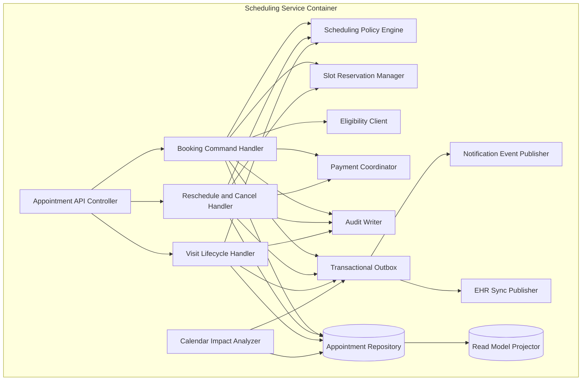

# C4 Component Diagram

This component view drills into the scheduling domain container that coordinates provider calendars, booking policy, visit lifecycle transitions, and regulated side effects.

## Component Contracts
| Component | Responsibility | Must Know | Must Not Know |
|---|---|---|---|
| Appointment API Controller | request validation, auth context, idempotency key parsing, HTTP error mapping | caller role, tenant, correlation metadata | payment processor or FHIR transport details |
| Booking Command Handler | orchestrate self-booking and staff-assisted booking transactions | patient, slot, policy, eligibility, payment outcomes | template generation algorithm internals |
| Reschedule and Cancel Handler | move appointments, release and reserve slots, apply cancellation fee and refund policy | current appointment state, replacement slot, fee policy | notification provider credentials |
| Visit Lifecycle Handler | process check-in, provider start, completion, and no-show actions | readiness gates, grace period, visit completion facts | search cache mechanics |
| Calendar Impact Analyzer | evaluate provider calendar changes against future appointments | templates, exceptions, future reservations | patient notification rendering |
| Scheduling Policy Engine | enforce booking windows, referral rules, cancellation policy, no-show and override gates | effective-dated tenant policies | persistence concerns |
| Slot Reservation Manager | lock slot rows, compare `slot_version`, maintain atomic reserve and release behavior | slot state, provider and location key | patient PHI beyond identifiers |
| Eligibility Client | invoke clearinghouse or manual verification adapters | coverage identifiers, provider NPI, service date | appointment transaction internals |
| Payment Coordinator | authorize, capture, void, refund, and reconcile copay flows | appointment billing context, processor token | schedule cache details |
| Audit Writer | append compliance evidence for reads, writes, overrides, and exports | actor, action, purpose, outcome | downstream consumer implementations |
| Transactional Outbox | persist durable integration intents alongside aggregate changes | aggregate id, event type, payload reference | transport retry policy |
| Read Model Projector | materialize provider queues and staff worklists | committed events and aggregate snapshots | write-side locking |

## Code-Level Module Boundaries
- `controllers/appointments`: HTTP surface for booking, reschedule, cancel, check-in, and completion.
- `application/commands`: command handlers and transaction orchestration.
- `domain/appointments`: aggregate, value objects, invariants, and state machine.
- `domain/policies`: cancellation, overbook, no-show, eligibility, and payment policies.
- `integrations`: eligibility, payments, notifications, FHIR, and downtime adapters.
- `infrastructure/persistence`: repositories, outbox, optimistic locking, and read models.

## Required Tests
- Contract tests for every public appointment API and calendar-impact event.
- Concurrency tests proving one winner for simultaneous booking or reschedule attempts.
- Mutation tests for policy and state-transition guards.
- Fault-injection tests for payment timeout, EHR lag, and outbox replay.

## Operational Policy Addendum

### Scheduling Conflict Policies
- Double-booking is prevented by the natural key `provider_id + location_id + slot_start + slot_end` plus optimistic locking on `slot_version` during booking and rescheduling.
- Reservation tokens shield a slot for up to 10 minutes during patient checkout, but the slot does not transition to `RESERVED` until the appointment transaction commits.
- Provider calendar updates caused by leave, clinic closure, overrun, or emergency blocks trigger immediate impact analysis; future appointments move to `REBOOK_REQUIRED` and create a staffed outreach task.
- Staff-assisted overrides may exceed normal template capacity only when a justification, approving actor, and override expiry are stored in the audit trail.

### Patient and Provider Workflow States
- Appointment lifecycle: `DRAFT -> PENDING_CONFIRMATION -> CONFIRMED -> CHECKED_IN -> IN_CONSULTATION -> COMPLETED`, with terminal states `CANCELLED`, `NO_SHOW`, `EXPIRED`, and `REBOOK_REQUIRED`.
- Slot lifecycle: `AVAILABLE -> RESERVED -> LOCKED_FOR_VISIT -> RELEASED`, with exceptional states `BLOCKED` for planned closures and `SUSPENDED` for compliance or credential issues.
- Invalid state transitions fail fast with deterministic error codes and do not publish downstream billing or notification events.
- Every transition records actor, channel, reason code, correlation id, timestamp, and source IP where available.

### Notification Guarantees
- Confirmation, reminder, cancellation, reschedule, emergency-closure, and waitlist-offer notifications are delivered through in-app, email, and SMS channels according to patient consent and clinic policy.
- Delivery is at-least-once with message deduplication keyed by `event_id + template_version + channel`; critical events retry for up to 24 hours before manual outreach is queued.
- Quiet hours suppress non-critical SMS and voice outreach, but life-safety or same-day operational notices may escalate to approved emergency templates.
- Notification content follows the minimum-necessary standard and excludes diagnosis, treatment details, or referral notes from SMS and push previews.

### Privacy Requirements
- PHI and billing artifacts are encrypted in transit and at rest, and non-production data must be de-identified before use outside regulated workflows.
- Role-based and attribute-based access controls restrict patient, scheduling, billing, and audit data to least-privilege views; privileged access requires MFA.
- Audit logs are immutable, exportable, and searchable by patient, provider, actor, action, and correlation id for compliance investigations.
- Downtime printouts, callback lists, and manual forms are treated as regulated records and must be secured, reconciled, and shredded per clinic policy after recovery.

### Downtime Fallback Procedures
- In degraded mode, staff retain read-only access to schedules while new booking, cancellation, and payment actions are captured in an ordered reconciliation queue.
- Clinics maintain a printable daily roster, manual check-in sheet, and downtime appointment intake form to continue operations during platform or integration outages.
- Recovery replays queued commands in timestamp order, revalidates slot conflicts and insurance status, syncs EHR and billing side effects, and notifies patients if outcomes changed.
- Incident closure requires backlog drain, reconciliation sign-off, communication to affected clinics, and a post-incident review with corrective actions.
