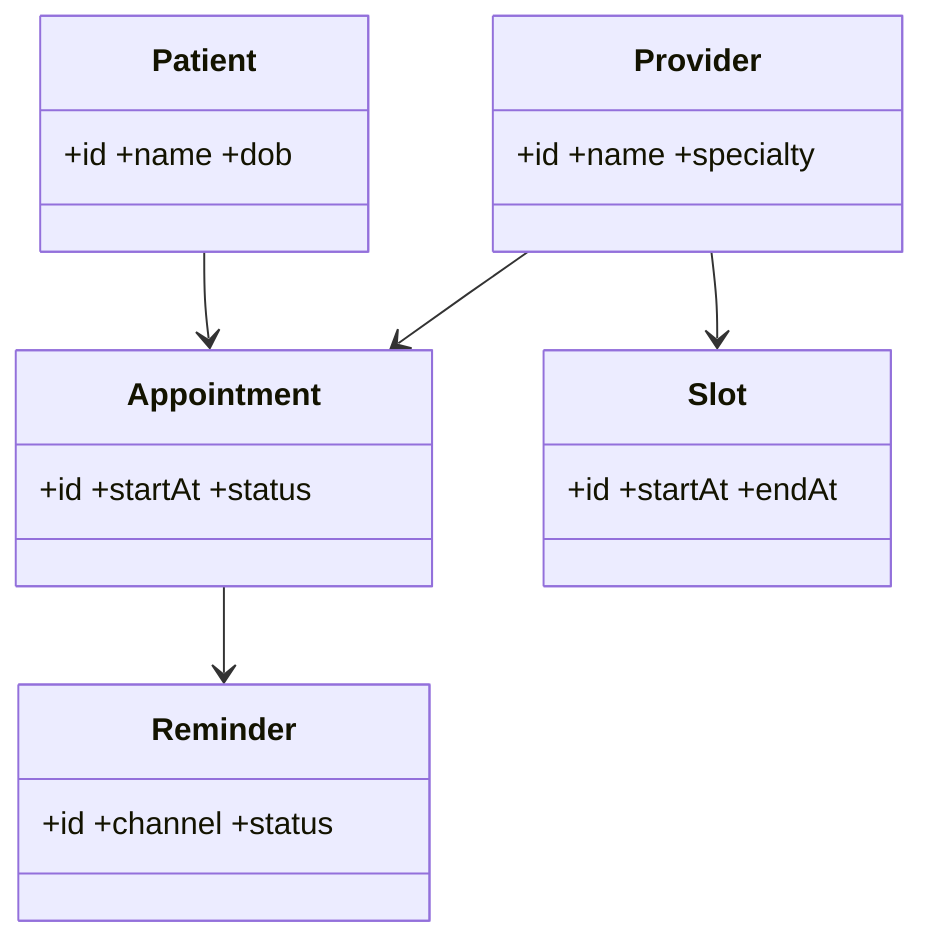

# Class Diagram

```mermaid
classDiagram
  class Patient {+id +name +dob}
  class Provider {+id +name +specialty}
  class Appointment {+id +startAt +status}
  class Slot {+id +startAt +endAt}
  class Reminder {+id +channel +status}
  Patient --> Appointment
  Provider --> Appointment
  Provider --> Slot
  Appointment --> Reminder
```
