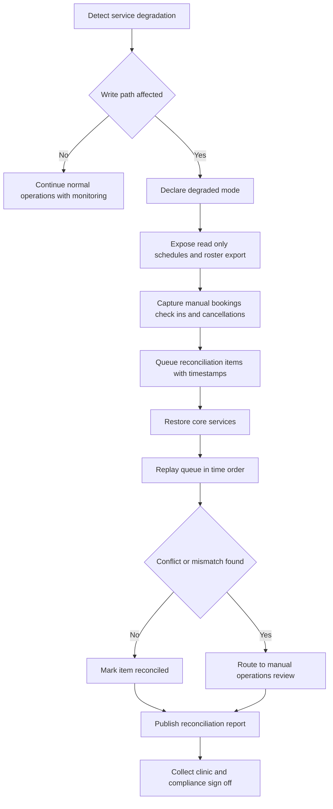

# Operations Edge Cases

These operational scenarios define how clinics continue serving patients when the scheduling platform or one of its dependencies degrades.

## Incident Scenarios
| Scenario | Immediate Risk | Required Response | Evidence Needed |
|---|---|---|---|
| Event bus backlog delays reminders | patients may miss same-day visits | page on-call, scale consumers, prioritize critical reminder topics | backlog metrics, affected appointment count |
| Database failover causes transient write errors | bookings and check-ins may be partially attempted | activate degraded mode for affected clinics, expose read-only schedule, queue manual actions | failover timestamps, retry status, queue depth |
| Payment gateway outage | copay collection cannot complete | allow policy-based payment deferral, keep appointment workflow active, route finance tasks after recovery | outage window, deferred payment list |
| Insurance clearinghouse latency spike | eligibility cannot complete in SLA | switch to manual verification mode for affected payers, notify staff, suppress misleading self-service promises | payer-specific response times, manual queue size |
| Messaging provider outage | confirmations and reminders fail | fail over to backup provider for critical categories, create manual outreach tasks for same-day visits | provider health check, undelivered dispatch count |
| EHR sync outage | appointment state diverges from clinical system | continue booking internally, queue FHIR sync jobs, display integration banner to staff | queued sync count, oldest event age |
| Clinic internet outage | front desk loses portal access | activate printed roster and paper intake, capture manual actions for replay | roster export id, paper form ids |

## Runbook Requirements
- Severity model distinguishes clinic-local outages from tenant-wide or platform-wide incidents.
- On-call triage checklist captures blast radius, data-integrity risk, patient-safety risk, workaround status, and communication owner.
- Every incident runbook includes clinic-facing instructions, support talking points, and explicit exit criteria.
- Operations dashboards must show backlog age for bookings, reminders, EHR sync, and payment reconciliation separately.

## Downtime Workflow

## Post-Incident Controls
- Perform a blameless postmortem within 2 business days for severity-1 or patient-impacting incidents.
- Verify that delayed reminders, manual bookings, deferred payments, and unsent cancellations were all reconciled.
- Attach sample audit records, queue snapshots, and communication artifacts to the incident record.
- Track corrective actions with owner, due date, and validation plan; unresolved actions keep the problem record open.

## Operational Acceptance Criteria
- Clinics can continue essential scheduling and check-in workflows during an outage using approved downtime materials.
- Recovery tooling identifies duplicates, slot conflicts, and finance mismatches before sign-off.
- Incident communication reaches clinic stakeholders within the tenant-defined cadence.

## Operational Policy Addendum

### Scheduling Conflict Policies
- Double-booking is prevented by the natural key `provider_id + location_id + slot_start + slot_end` plus optimistic locking on `slot_version` during booking and rescheduling.
- Reservation tokens shield a slot for up to 10 minutes during patient checkout, but the slot does not transition to `RESERVED` until the appointment transaction commits.
- Provider calendar updates caused by leave, clinic closure, overrun, or emergency blocks trigger immediate impact analysis; future appointments move to `REBOOK_REQUIRED` and create a staffed outreach task.
- Staff-assisted overrides may exceed normal template capacity only when a justification, approving actor, and override expiry are stored in the audit trail.

### Patient and Provider Workflow States
- Appointment lifecycle: `DRAFT -> PENDING_CONFIRMATION -> CONFIRMED -> CHECKED_IN -> IN_CONSULTATION -> COMPLETED`, with terminal states `CANCELLED`, `NO_SHOW`, `EXPIRED`, and `REBOOK_REQUIRED`.
- Slot lifecycle: `AVAILABLE -> RESERVED -> LOCKED_FOR_VISIT -> RELEASED`, with exceptional states `BLOCKED` for planned closures and `SUSPENDED` for compliance or credential issues.
- Invalid state transitions fail fast with deterministic error codes and do not publish downstream billing or notification events.
- Every transition records actor, channel, reason code, correlation id, timestamp, and source IP where available.

### Notification Guarantees
- Confirmation, reminder, cancellation, reschedule, emergency-closure, and waitlist-offer notifications are delivered through in-app, email, and SMS channels according to patient consent and clinic policy.
- Delivery is at-least-once with message deduplication keyed by `event_id + template_version + channel`; critical events retry for up to 24 hours before manual outreach is queued.
- Quiet hours suppress non-critical SMS and voice outreach, but life-safety or same-day operational notices may escalate to approved emergency templates.
- Notification content follows the minimum-necessary standard and excludes diagnosis, treatment details, or referral notes from SMS and push previews.

### Privacy Requirements
- PHI and billing artifacts are encrypted in transit and at rest, and non-production data must be de-identified before use outside regulated workflows.
- Role-based and attribute-based access controls restrict patient, scheduling, billing, and audit data to least-privilege views; privileged access requires MFA.
- Audit logs are immutable, exportable, and searchable by patient, provider, actor, action, and correlation id for compliance investigations.
- Downtime printouts, callback lists, and manual forms are treated as regulated records and must be secured, reconciled, and shredded per clinic policy after recovery.

### Downtime Fallback Procedures
- In degraded mode, staff retain read-only access to schedules while new booking, cancellation, and payment actions are captured in an ordered reconciliation queue.
- Clinics maintain a printable daily roster, manual check-in sheet, and downtime appointment intake form to continue operations during platform or integration outages.
- Recovery replays queued commands in timestamp order, revalidates slot conflicts and insurance status, syncs EHR and billing side effects, and notifies patients if outcomes changed.
- Incident closure requires backlog drain, reconciliation sign-off, communication to affected clinics, and a post-incident review with corrective actions.
