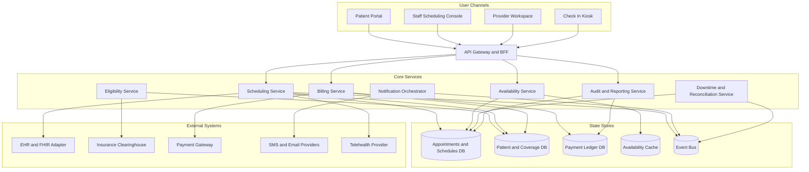

# Architecture Diagram

The high-level architecture separates patient channels, clinic operations, booking policy enforcement, regulated integrations, and observability so healthcare organizations can scale safely.

## Container and Integration View

## Responsibility Split
| Layer | Responsibility | Key Design Constraint |
|---|---|---|
| User Channels | Patient self-service, staff-assisted booking, provider schedule management, kiosk arrival capture | avoid direct access to PHI outside role-appropriate views |
| API Gateway and BFF | authentication, authorization, rate limits, request shaping, channel-specific responses | must propagate tenant and correlation metadata |
| Scheduling Service | appointment lifecycle, slot reservation, schedule exceptions, EHR sync orchestration | strong consistency for slot reservation |
| Availability Service | slot generation, caching, template and exception application | eventual consistency acceptable only for search, never for booking commit |
| Eligibility Service | payer lookups, referral and prior-auth validation, manual verification queue | external SLA variability requires fallback mode |
| Billing Service | copay estimates, authorization, capture, refund, finance reconciliation | tokenized payment only |
| Notification Orchestrator | reminders, confirmations, cancellations, emergency outreach, delivery tracking | must re-check consent before send |
| Audit and Reporting Service | immutable audit, operational metrics, exports, incident evidence | append-only storage for regulated events |
| Downtime and Reconciliation Service | degraded-mode queue, replay ordering, conflict resolution, sign-off workflow | must preserve manual action chronology |

## High-Level Interaction Principles
- All state-changing workflows publish events through a transactional outbox so notifications, analytics, and integrations observe the same committed truth.
- Strong consistency is required inside booking, reschedule, cancel, and check-in transactions; read models and reminders may update asynchronously.
- Integration adapters are isolated from core domain services so FHIR, X12, payment, or messaging provider changes do not leak transport details into booking logic.
- Privacy boundaries are enforced at service edges, database roles, and export pipelines.

## Operational Policy Addendum

### Scheduling Conflict Policies
- Double-booking is prevented by the natural key `provider_id + location_id + slot_start + slot_end` plus optimistic locking on `slot_version` during booking and rescheduling.
- Reservation tokens shield a slot for up to 10 minutes during patient checkout, but the slot does not transition to `RESERVED` until the appointment transaction commits.
- Provider calendar updates caused by leave, clinic closure, overrun, or emergency blocks trigger immediate impact analysis; future appointments move to `REBOOK_REQUIRED` and create a staffed outreach task.
- Staff-assisted overrides may exceed normal template capacity only when a justification, approving actor, and override expiry are stored in the audit trail.

### Patient and Provider Workflow States
- Appointment lifecycle: `DRAFT -> PENDING_CONFIRMATION -> CONFIRMED -> CHECKED_IN -> IN_CONSULTATION -> COMPLETED`, with terminal states `CANCELLED`, `NO_SHOW`, `EXPIRED`, and `REBOOK_REQUIRED`.
- Slot lifecycle: `AVAILABLE -> RESERVED -> LOCKED_FOR_VISIT -> RELEASED`, with exceptional states `BLOCKED` for planned closures and `SUSPENDED` for compliance or credential issues.
- Invalid state transitions fail fast with deterministic error codes and do not publish downstream billing or notification events.
- Every transition records actor, channel, reason code, correlation id, timestamp, and source IP where available.

### Notification Guarantees
- Confirmation, reminder, cancellation, reschedule, emergency-closure, and waitlist-offer notifications are delivered through in-app, email, and SMS channels according to patient consent and clinic policy.
- Delivery is at-least-once with message deduplication keyed by `event_id + template_version + channel`; critical events retry for up to 24 hours before manual outreach is queued.
- Quiet hours suppress non-critical SMS and voice outreach, but life-safety or same-day operational notices may escalate to approved emergency templates.
- Notification content follows the minimum-necessary standard and excludes diagnosis, treatment details, or referral notes from SMS and push previews.

### Privacy Requirements
- PHI and billing artifacts are encrypted in transit and at rest, and non-production data must be de-identified before use outside regulated workflows.
- Role-based and attribute-based access controls restrict patient, scheduling, billing, and audit data to least-privilege views; privileged access requires MFA.
- Audit logs are immutable, exportable, and searchable by patient, provider, actor, action, and correlation id for compliance investigations.
- Downtime printouts, callback lists, and manual forms are treated as regulated records and must be secured, reconciled, and shredded per clinic policy after recovery.

### Downtime Fallback Procedures
- In degraded mode, staff retain read-only access to schedules while new booking, cancellation, and payment actions are captured in an ordered reconciliation queue.
- Clinics maintain a printable daily roster, manual check-in sheet, and downtime appointment intake form to continue operations during platform or integration outages.
- Recovery replays queued commands in timestamp order, revalidates slot conflicts and insurance status, syncs EHR and billing side effects, and notifies patients if outcomes changed.
- Incident closure requires backlog drain, reconciliation sign-off, communication to affected clinics, and a post-incident review with corrective actions.
