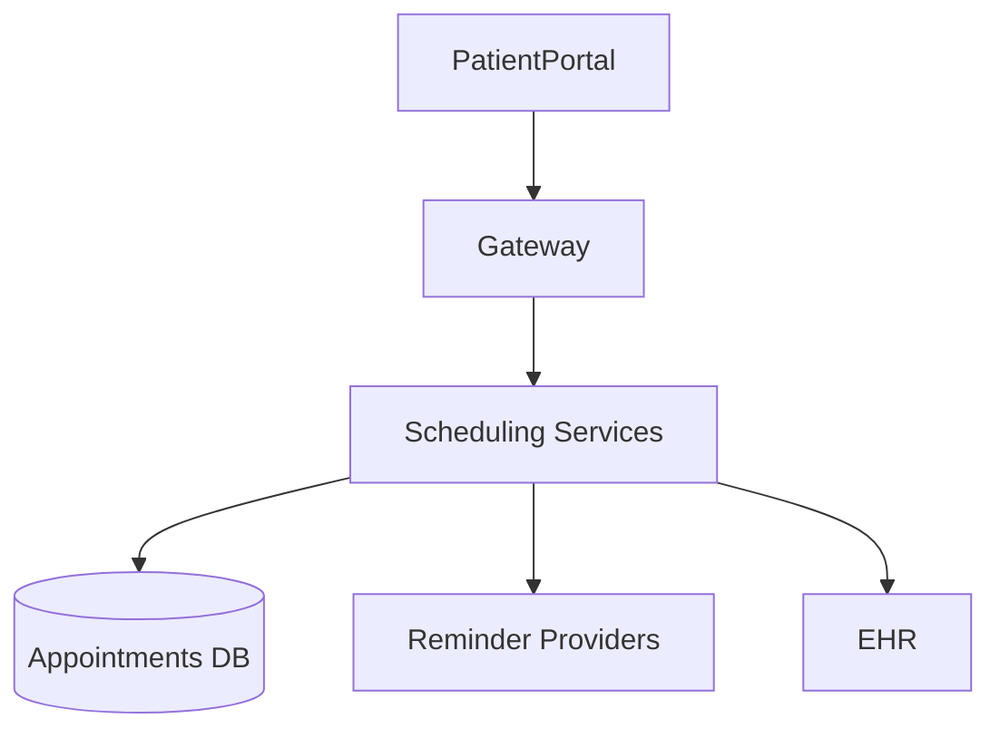

# Architecture Diagram

```mermaid
flowchart TB
  PatientPortal --> Gateway --> Core[Scheduling Services]
  Core --> DB[(Appointments DB)]
  Core --> Reminder[Reminder Providers]
  Core --> EHR
```
