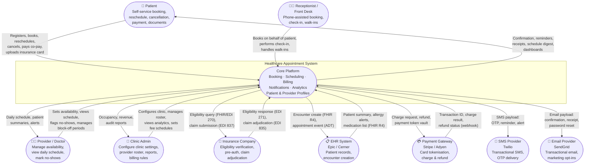
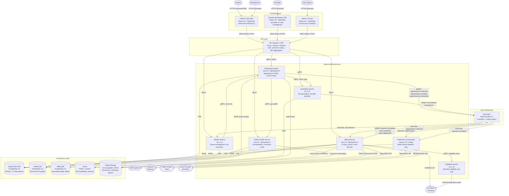

# Healthcare Appointment System — C4 Architecture: Context & Container Views

**Document Version:** 1.0  
**Last Updated:** 2025-07-01  
**Authors:** Architecture Team  
**Standard:** C4 Model (https://c4model.com) — Level 1 (Context) and Level 2 (Container)

---

## Table of Contents

1. [C1 — System Context Diagram](#c1--system-context-diagram)
2. [C2 — Container Diagram](#c2--container-diagram)
3. [Container Responsibilities](#container-responsibilities)
4. [Technology Choices and Rationale](#technology-choices-and-rationale)
5. [Cross-Cutting Concerns](#cross-cutting-concerns)
6. [Deployment Topology Summary](#deployment-topology-summary)

---

## C1 — System Context Diagram

The C1 diagram shows the **Healthcare Appointment System (HAS)** as a single black-box,
with all human and software actors that interact with it. This is the entry-point for
communicating architecture to non-technical stakeholders.

### Context Boundary Description

The HAS boundary encompasses all functionality required to enable a healthcare organisation
to manage patient appointments end-to-end: discovery of provider availability, booking,
reminders, check-in, billing, insurance verification, and post-visit analytics. The system
does **not** provide clinical decision support, prescriptions, or inpatient care management —
those concerns remain in the EHR system.

---

## C2 — Container Diagram

The C2 diagram decomposes the HAS black-box into its deployable containers. Each container
is an independently deployable unit with a clear boundary, technology, and API surface.

---

## Container Responsibilities

| Container | Technology | Responsibility | Exposed API | Depends On |
|---|---|---|---|---|
| **Patient Portal SPA** | React 18, TypeScript, Vite, TailwindCSS | Patient self-service: search providers, book/reschedule/cancel appointments, view history, upload documents, pay co-pay | Served as static assets via CDN | API Gateway + BFF |
| **Provider Workspace SPA** | React 18, TypeScript, Vite, TanStack Query | Provider daily schedule view, availability template editor, block-off management, no-show flagging, patient card preview | Served as static assets via CDN | API Gateway + BFF |
| **Admin Console** | React 18, TypeScript, Recharts, AG-Grid | Clinic configuration, provider roster management, fee schedules, billing rules, occupancy dashboards, audit log viewer | Served as static assets via CDN | API Gateway + BFF |
| **API Gateway + BFF** | Kong 3.x (gateway), Node.js 20 / Express (BFF) | JWT validation, rate limiting (per-IP + per-user), request routing, BFF response aggregation for portal pages, mTLS to upstream services | REST/JSON over HTTPS :443 | All backend services |
| **Scheduling Service** | Java 21, Spring Boot 3.3, Hibernate, Flyway | Appointment lifecycle (create, update, cancel, no-show), conflict detection, recurring appointment templates, waitlist integration | gRPC + REST :8080 | Availability Service, Patient Profile Service, Appointment DB, Kafka, Cache |
| **Availability Service** | Go 1.22, gRPC, Redis | Real-time slot generation from provider templates, provider calendar CRUD, slot locking during booking (2-min optimistic lock), holiday calendar | gRPC :9090 | Provider DB (via shared PostgreSQL schema), Cache |
| **Notification Orchestrator** | Node.js 20, Fastify, BullMQ | Consumes appointment and billing events from Kafka; routes to correct channel (SMS/Email); handles retry backoff; tracks delivery receipts; respects patient notification preferences | Internal Kafka consumer | Kafka, Twilio, SendGrid, Appointment DB |
| **Billing Service** | Java 21, Spring Boot 3.3, jOOQ | Co-pay calculation, invoice generation, payment gateway integration, insurance eligibility orchestration, EDI claim construction and submission, ERA processing, refund workflow | REST :8082 | Eligibility Service, Payment Gateway, EHR System, Insurance EDI endpoint, Billing DB, Kafka |
| **Patient Profile Service** | Java 21, Spring Boot 3.3, Hibernate | Patient demographics CRUD, insurance card management (images in S3), consent records, GDPR/CCPA erasure, linked family accounts | gRPC + REST :8083 | Patient DB, Object Storage |
| **Eligibility Service** | Go 1.22, gRPC | Real-time insurance eligibility checks via FHIR R4 and X12 EDI 270/271, pre-authorisation status queries, result caching (TTL 4 hours), payer connectivity management | gRPC :9091 | Insurance Company (external), Cache |
| **Waitlist Service** | Go 1.22, gRPC | Ordered waitlist per provider+slot-type, automatic slot promotion on cancellation, 15-minute acceptance window, position broadcasting via SSE | gRPC :9092 | Scheduling Service, Kafka, Appointment DB |
| **Event Bus (Kafka)** | Apache Kafka 3.7, 3 brokers, Kraft mode | Durable async event streaming; topics: `appointment.*`, `billing.*`, `slot.*`, `notification.*`; 7-day retention; consumer-group offset management | Kafka protocol :9092 (internal) | — |
| **Appointment DB** | PostgreSQL 16, 1 primary + 2 read replicas, PgBouncer | Stores appointment records, status history, visit types, provider-patient links; partitioned by `appointment_date` (monthly); logical replication to Analytics | TCP :5432 | — |
| **Patient DB** | PostgreSQL 16, row-level security enabled, column encryption (pgcrypto) | Stores patient demographics, insurance details (encrypted), consent flags, linked accounts; strict RBAC at DB level | TCP :5432 (service-only) | — |
| **Cache** | Redis 7 Cluster (3 shards × 2 replicas) | Slot availability bitmap cache (30-second TTL), session tokens (15-min TTL), eligibility results (4-hour TTL), rate-limit counters, distributed locks for slot booking | Redis protocol :6379 | — |
| **Object Storage** | MinIO (S3-compatible) / AWS S3 in cloud | Insurance card images, invoice PDFs, EOB documents, exported reports, immutable audit log archives; lifecycle policy: 30-day hot, 1-year warm, 7-year cold (Glacier) | S3 API :443 | — |

---

## Technology Choices and Rationale

### Decision 1: Java / Spring Boot for Domain-Heavy Services (Scheduling, Billing, Patient Profile)

**Decision:** Use Java 21 with Spring Boot 3.3 and virtual threads for the Scheduling, Billing, and
Patient Profile services.

**Rationale:** These services contain the most complex business logic in the system — appointment
conflict resolution, insurance claim lifecycle, and HIPAA-compliant data access. The Spring
ecosystem (Spring Security, Spring Data, Hibernate, Flyway) provides mature, battle-tested
libraries for exactly these concerns. Java 21 virtual threads (Project Loom) eliminate the
blocking I/O performance concern historically associated with Java, making it suitable for
high-concurrency workloads without the complexity of reactive programming. The rich tooling
for JVM observability (JFR, Micrometer) aligns with our observability strategy.

---

### Decision 2: Go for Latency-Sensitive, High-Throughput Services (Availability, Eligibility, Waitlist)

**Decision:** Use Go 1.22 for the Availability, Eligibility, and Waitlist services.

**Rationale:** These services handle the hottest read paths in the system. Availability checks
run for every slot-search interaction (potentially 40,000+ times/day) and must return in
under 50 ms p99. Go's compiled binaries, low GC pause times, and native goroutine concurrency
make it ideal. Small binary sizes reduce container image footprint and cold-start latency in
Kubernetes. The gRPC-native ecosystem in Go (protobuf codegen, grpc-go) is mature and
well-supported.

---

### Decision 3: React 18 (SPA) for All Frontends

**Decision:** All three frontends (Patient Portal, Provider Workspace, Admin Console) are
React 18 SPAs with TypeScript, served as static assets from a CDN.

**Rationale:** React 18 with concurrent rendering provides the responsiveness required for
real-time slot-picker UIs (optimistic updates, transitions). TypeScript eliminates an entire
class of runtime bugs at the expense of build-time overhead, which is acceptable. Serving
static assets from a CDN (CloudFront / Fastly) decouples deployment of frontend from backend
and achieves near-zero latency for initial asset delivery. TanStack Query handles server-state
caching and revalidation without Redux overhead for these highly data-driven dashboards.

---

### Decision 4: Apache Kafka as the Event Bus

**Decision:** Use Apache Kafka 3.7 (Kraft mode, no ZooKeeper) as the central event streaming
platform rather than RabbitMQ or AWS SNS/SQS.

**Rationale:** HAS produces durable, ordered event streams (appointment state transitions,
payment events) that multiple consumers need independently and at different speeds. Kafka's
log-based architecture with consumer groups allows the Notification Orchestrator, Billing
Service, and Waitlist Service to each consume the same `appointment.confirmed` event at their
own pace without message loss. 7-day retention enables event replay for debugging and
backfill. At the projected peak of ~600 events/min, a 3-broker Kafka cluster is cost-effective
and operationally simpler than managing separate queues per consumer.

---

### Decision 5: PostgreSQL 16 for All Primary Data Stores

**Decision:** Use PostgreSQL 16 for all three primary databases (Appointment, Patient, Billing)
instead of separate specialised databases.

**Rationale:** The HAS data model is relational (appointments relate to patients, providers, slots,
invoices, claims). PostgreSQL's ACID guarantees are non-negotiable for appointment booking (double-
booking prevention requires serialisable transactions) and billing (ledger immutability). PostgreSQL
16's logical replication, row-level security, and `pgcrypto` extension for column-level encryption
satisfy HIPAA technical safeguard requirements out of the box. Running one engine reduces
operational burden (single DBA skill set, unified backup strategy, one monitoring integration).
Separate database instances enforce service ownership without introducing a polyglot penalty.

---

### Decision 6: Redis 7 Cluster for Caching and Distributed Locking

**Decision:** Use Redis 7 Cluster (3 shards) for slot availability caching, session management,
and distributed slot-booking locks.

**Rationale:** Slot availability is read 5–10× more frequently than it is written. A cache-aside
pattern with a 30-second TTL on Redis reduces Availability Service DB reads by ~85%, keeping
slot-search latency under 20 ms p99. Redis `SET NX EX` (SETNX) provides atomic distributed
locking, preventing two concurrent users from booking the same slot during the brief booking-
confirmation window. Redis Cluster (not Sentinel) is chosen for automatic sharding as booking
volume grows to multiple clinics without re-architecting.

---

### Decision 7: Kong as the API Gateway

**Decision:** Use Kong Gateway (open-source) fronting a Node.js BFF layer rather than a
fully custom gateway or a managed cloud gateway (AWS API Gateway).

**Rationale:** Kong provides production-grade plugins for JWT validation (kong-plugin-jwt),
rate limiting (sliding window per consumer), request logging, and mTLS upstream enforcement
without writing gateway logic from scratch. The Node.js BFF sits behind Kong and handles
response aggregation for complex portal pages (e.g., the appointment booking page needs slot
availability + patient profile + recent visits in one round trip). Keeping BFF aggregation in
Node.js (not Kong Lua plugins) allows frontend teams to own the BFF and evolve it without a
gateway deployment cycle.

---

### Decision 8: HL7 FHIR R4 for EHR and Insurance Integration

**Decision:** Adopt HL7 FHIR R4 as the primary interoperability standard for EHR and insurance
integrations, supplemented by X12 EDI 837/835/270/271 for legacy payer batch workflows.

**Rationale:** FHIR R4 is now mandated for CMS interoperability rules (ONC 21st Century Cures Act).
Epic, Cerner, and Oracle Health all expose SMART on FHIR R4 APIs. Using FHIR for encounter
creation and patient summary retrieval future-proofs the integration as EHRs deprecate HL7 v2
interfaces. X12 EDI is retained for claim submission and adjudication because the majority of US
payers still require it for production billing. The Billing Service maintains both FHIR and EDI
translation layers, isolated behind a `PayerGatewayPort` interface to allow future payer-specific
adapters without changing core billing logic.

---

### Decision 9: mTLS for All Internal Service-to-Service Communication

**Decision:** Enforce mutual TLS (mTLS) for all service-to-service communication within the
cluster using Istio service mesh with SPIFFE/SPIRE certificates.

**Rationale:** HAS handles PHI on every internal service call (patient IDs flow through scheduling,
billing, and notification services). Relying solely on network-level isolation (VPC/namespace) is
insufficient under the HIPAA Security Rule technical safeguard requirements. mTLS with
SPIFFE-issued certificates ensures both encryption in transit and cryptographic identity
authentication between services, eliminating the risk of a compromised internal service
impersonating another. Certificate rotation is automated (24-hour TTL), eliminating long-lived
shared secrets.

---

### Decision 10: S3-Compatible Object Storage for Documents and Audit Logs

**Decision:** Use S3-compatible object storage (MinIO on-prem / AWS S3 in cloud) for all
binary assets and audit logs rather than storing in PostgreSQL `bytea` columns or a dedicated
document DB.

**Rationale:** Insurance card images, invoice PDFs, and audit log archives are write-once /
read-rarely blobs with very different access patterns from structured transactional data. Storing
them in S3 with pre-signed URLs avoids bloating PostgreSQL tablespaces and keeps backup windows
predictable. S3 lifecycle policies enforce the HIPAA 7-year retention requirement automatically
with tiered storage cost reduction (S3 Intelligent-Tiering / Glacier). Object-level ACLs with
pre-signed time-limited URLs (15-minute TTL) enforce access control without a file-serving
microservice.

---

## Cross-Cutting Concerns

### Security

**Authentication & Authorisation**  
- All human users authenticate via OpenID Connect (OIDC) backed by an identity provider
  (Keycloak / Auth0). Patients use OAuth 2.0 PKCE flow. Staff use authorisation-code flow
  with hardware MFA enforced at the IdP.  
- JWT access tokens (15-minute TTL) carry `role`, `clinic_id`, and `sub` (user ID) claims.
  Refresh tokens (8-hour TTL) are rotated on each use and stored HTTP-only / SameSite=Strict.  
- Kong validates JWT signature and expiry on every inbound request. Services re-validate
  `clinic_id` scoping to prevent cross-clinic data access.  
- RBAC roles: `patient`, `provider`, `receptionist`, `clinic_admin`, `billing_staff`,
  `super_admin`. Fine-grained permissions are enforced at the service layer, not just the gateway.

**Data Protection**  
- PHI fields in PostgreSQL encrypted with `pgcrypto` (AES-256). Encryption keys managed by
  HashiCorp Vault; services request a short-lived data key per request.  
- All TLS certificates: minimum TLS 1.3, ECDHE cipher suites only.  
- PII tokenisation: patient names and contact details are tokenised in analytics exports;
  raw data never leaves the PHI boundary for reporting purposes.  
- Automated secret rotation: database credentials, API keys, and JWT signing keys rotated
  every 30 days via Vault dynamic secrets.

**HIPAA Technical Safeguards Compliance**  
- Access controls: RBAC + attribute-based (clinic scoping)  
- Audit controls: every create/update/delete on PHI resources emits an immutable audit event  
- Transmission security: TLS 1.3 end-to-end, mTLS internally  
- Integrity: HMAC-SHA256 on all Kafka messages; S3 object integrity via SHA-256 checksums

---

### Observability

**Structured Logging**  
- All services emit JSON-structured logs with fields: `trace_id`, `span_id`, `service`,
  `level`, `message`, `http.method`, `http.status_code`, `user_id` (hashed), `clinic_id`,
  `duration_ms`.  
- Logs are shipped to a central SIEM (Elastic / Splunk) via Fluent Bit DaemonSet.  
- PHI is **never** logged in plaintext; all log entries containing patient data use a
  pseudonymous `appointment_id` or hashed `patient_id`.

**Metrics**  
- Prometheus scrapes `/metrics` from all services (Spring Boot Actuator, Go `promhttp`).  
- Key SLIs tracked per service: request rate, error rate (4xx/5xx), latency p50/p95/p99,
  Kafka consumer lag, cache hit ratio, DB connection pool saturation.  
- Grafana dashboards: per-service health, booking funnel conversion, notification delivery
  rate, billing claim acceptance rate.

**Distributed Tracing**  
- OpenTelemetry SDK instrumented in all services (Java auto-instrumentation agent, Go manual).  
- Trace context propagated via W3C `traceparent` header across HTTP and Kafka (message headers).  
- Traces exported to Jaeger / Tempo; sampled at 10% in production, 100% for error traces.

**Alerting**  
- SLO-based alerts: >1% error rate on Scheduling Service → P1 alert (PagerDuty).  
- Business alerts: notification delivery failure rate >5% → P2; claim rejection rate >10% → P1.  
- Kafka consumer lag >10,000 for Notification Orchestrator → P2 alert.

---

### Resilience

**Circuit Breaking**  
- All synchronous downstream calls (Scheduling → Availability, Billing → Eligibility,
  Billing → Payment Gateway) wrapped with Resilience4j circuit breakers (Java) and
  `go-resilience` (Go).  
- Thresholds: open after 50% failure rate over 10-second sliding window; half-open probe
  every 30 seconds.

**Retry and Backoff**  
- Idempotent operations retried with exponential backoff + jitter (initial 100 ms, max 5 s,
  max 3 retries). Non-idempotent operations (payment charge) are **not** retried automatically;
  they require explicit re-authorisation from the client.  
- Kafka consumer failures trigger dead-letter topic routing after 3 consecutive failures;
  dead-letter events are quarantined and alerted for manual review within 1 hour.

**Availability Targets**  
- Booking flow (Patient Portal → API Gateway → Scheduling → Availability): **99.9% monthly uptime**.  
- Notification delivery (Kafka → Notification Orchestrator → Twilio/SendGrid): **99.5% monthly**.  
- Billing and claim submission: **99.5% monthly** (batch tolerance acceptable for EDI).  
- Read replicas on all PostgreSQL instances ensure analytics and reporting queries do not
  contend with booking transactions.

**Graceful Degradation**  
- If the Eligibility Service is unavailable: Billing Service proceeds with appointment booking
  and flags the appointment for manual eligibility verification within 24 hours.  
- If the Notification Orchestrator is delayed: appointments are still confirmed; notifications
  are durably queued in Kafka and delivered when the service recovers (within SLA window).  
- If Payment Gateway is unreachable: co-pay collection is deferred; appointment is confirmed
  with a "payment pending" status; patient receives a secure payment link via email within 5 minutes.

---

## Deployment Topology Summary

| Layer | Technology | Replicas (Production) | Scaling Strategy |
|---|---|---|---|
| Frontend CDN | CloudFront / Fastly | Global edge PoPs | Static, no scaling needed |
| API Gateway | Kong 3.x (K8s Ingress) | 3 pods minimum | HPA on request rate |
| Scheduling Service | Spring Boot (K8s) | 3–10 pods | HPA on CPU + Kafka lag |
| Availability Service | Go (K8s) | 3–8 pods | HPA on request rate |
| Notification Orchestrator | Node.js (K8s) | 2–6 pods | HPA on Kafka consumer lag |
| Billing Service | Spring Boot (K8s) | 2–6 pods | HPA on CPU + queue depth |
| Patient Profile Service | Spring Boot (K8s) | 2–4 pods | HPA on request rate |
| Eligibility Service | Go (K8s) | 2–4 pods | HPA on request rate |
| Waitlist Service | Go (K8s) | 2–4 pods | HPA on queue depth |
| Kafka | 3 brokers (StatefulSet) | 3 fixed | Manual scale + partition expansion |
| PostgreSQL (each DB) | 1 primary + 2 replicas | 3 fixed nodes | Vertical + read replica expansion |
| Redis Cluster | 3 shards × 2 replicas | 6 fixed nodes | Horizontal shard addition |
| Object Storage | MinIO / S3 | Managed / distributed | Auto-scaling (managed service) |

All Kubernetes workloads deployed to a dedicated `has-prod` namespace with:
- Network Policies restricting cross-namespace traffic
- Pod Disruption Budgets ensuring minimum availability during node drains
- Resource Requests/Limits set for predictable scheduling and OOM prevention
- Secrets injected via Vault Agent Sidecar (never baked into container images)
