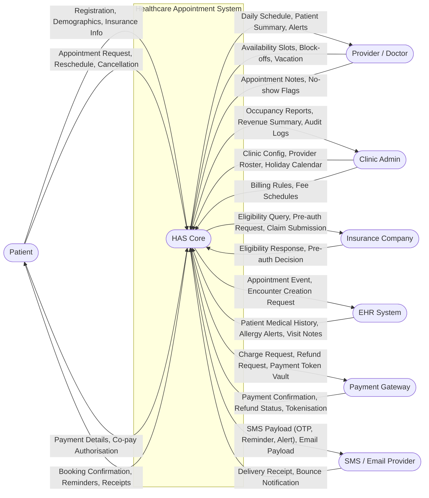
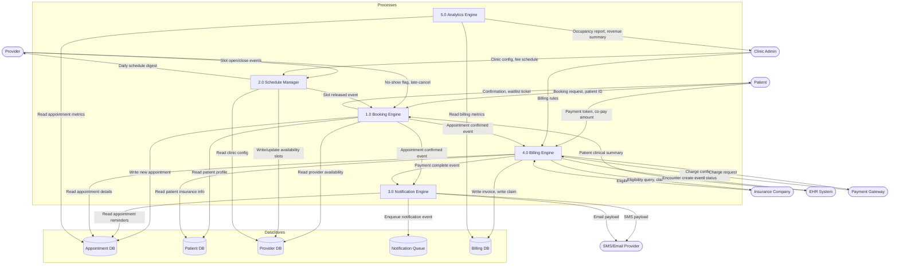
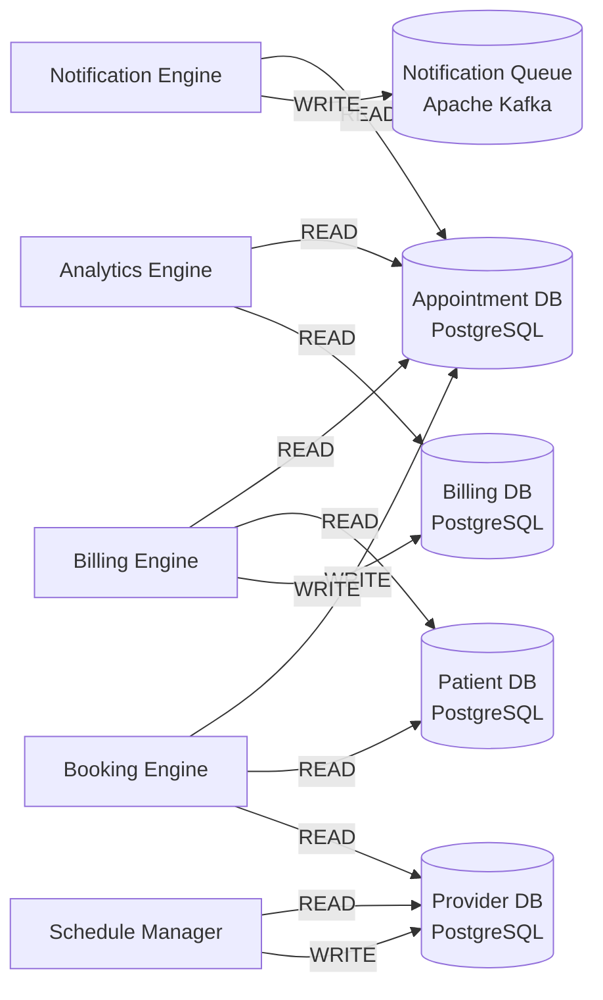

# Healthcare Appointment System — Data Flow Diagrams

**Document Version:** 1.0  
**Last Updated:** 2025-07-01  
**Authors:** Architecture Team  
**Scope:** End-to-end data flows for the Healthcare Appointment System (HAS), covering  
patient-facing booking, provider schedule management, billing, notifications, and analytics.

---

## Table of Contents

1. [L0 — Context Data Flow Diagram](#l0--context-data-flow-diagram)
2. [L1 — Internal Process Data Flow Diagram](#l1--internal-process-data-flow-diagram)
3. [Data Store Access Flow](#data-store-access-flow)
4. [Data Flow Inventory](#data-flow-inventory)
5. [Data Classification Notes](#data-classification-notes)

---

## L0 — Context Data Flow Diagram

The L0 diagram treats the entire Healthcare Appointment System as a single process bubble.
All external entities that exchange data with the system are shown, along with labeled
directional flows representing what data crosses each boundary.

### L0 Boundary Notes

| External Entity | Interaction Type | Integration Standard |
|---|---|---|
| Patient | Web/Mobile UI, Self-service | HTTPS REST, OAuth 2.0 PKCE |
| Provider / Doctor | Workspace SPA, Mobile app | HTTPS REST, OAuth 2.0 |
| Clinic Admin | Admin Console | HTTPS REST, Role-based JWT |
| Insurance Company | Real-time eligibility, claim batch | X12 EDI 270/271, HL7 FHIR R4 |
| EHR System | Event-driven ADT feeds | HL7 FHIR R4, SMART on FHIR |
| Payment Gateway | Tokenised card processing | PCI-DSS compliant REST, TLS 1.3 |
| SMS/Email Provider | Transactional messaging | REST webhooks, SMTP relay |

---

## L1 — Internal Process Data Flow Diagram

The L1 diagram decomposes the HAS core into five major internal processes and five
persistent data stores. Each process handles a distinct domain bounded context.

### Process Responsibilities

| Process | Primary Responsibility | Key Inputs | Key Outputs |
|---|---|---|---|
| 1.0 Booking Engine | Slot selection, conflict detection, waitlist | Booking request, slot availability, patient profile | Confirmed appointment, waitlist ticket |
| 2.0 Schedule Manager | Availability CRUD, recurring templates, holiday blocks | Provider slot events, clinic config | Updated availability, daily digest |
| 3.0 Notification Engine | Multi-channel notification dispatch, retry logic | Appointment events, payment events | SMS/Email payloads, delivery receipts |
| 4.0 Billing Engine | Co-pay collection, insurance eligibility, claim lifecycle | Payment tokens, eligibility responses, appointment details | Invoices, claim files, receipts |
| 5.0 Analytics Engine | Reporting, KPI aggregation, no-show prediction | Appointment history, billing metrics | Dashboards, scheduled reports |

---

## Data Store Access Flow

This flowchart shows precisely which processes perform READ vs WRITE operations against
each data store. Use this view to assess data ownership and potential contention hotspots.

### Data Store Ownership Matrix

| Data Store | Primary Owner | Secondary Readers | Write Frequency | Read Frequency |
|---|---|---|---|---|
| Appointment DB | Booking Engine | Notification Engine, Billing Engine, Analytics Engine | ~500 writes/min peak | ~2000 reads/min peak |
| Patient DB | Patient Profile Service | Booking Engine, Billing Engine | ~50 writes/min | ~1500 reads/min |
| Provider DB | Schedule Manager | Booking Engine | ~200 writes/min | ~1800 reads/min |
| Notification Queue | Notification Engine | — | ~600 events/min | ~600 events/min |
| Billing DB | Billing Engine | Analytics Engine | ~100 writes/min | ~400 reads/min |

---

## Data Flow Inventory

The table below catalogs every significant data flow in the system with volume estimates
and protocol details to support capacity planning and security classification reviews.

| # | Flow Name | From | To | Data Elements | Volume Estimate | Protocol |
|---|---|---|---|---|---|---|
| F-01 | Patient Self-Registration | Patient (Browser/Mobile) | Booking Engine | First name, last name, DOB, gender, phone, email, address, emergency contact | ~2,000 req/day | HTTPS POST, OAuth 2.0 PKCE |
| F-02 | Insurance Eligibility Query | Billing Engine | Insurance Company | Member ID, subscriber DOB, service date, NPI, procedure codes | ~4,000 req/day | HL7 FHIR R4 / X12 EDI 270 over HTTPS |
| F-03 | Eligibility Response | Insurance Company | Billing Engine | Coverage status, deductible remaining, co-pay amounts, pre-auth flags | ~4,000 resp/day | HL7 FHIR R4 / X12 EDI 271 |
| F-04 | Appointment Booking Request | Patient | Booking Engine | Patient ID, provider NPI, preferred date/time, visit type, chief complaint | ~8,000 req/day | HTTPS POST REST/JSON |
| F-05 | Slot Availability Read | Booking Engine | Provider DB (via Availability Service) | Provider NPI, date range, visit type, duration | ~40,000 req/day | gRPC (internal), Redis cache hit-first |
| F-06 | Appointment Confirmation | Booking Engine | Patient | Appointment ID, provider name, date/time, location, prep instructions, cancellation link | ~8,000 events/day | Kafka event → Notification Engine → SMTP / Twilio SMS |
| F-07 | Provider Daily Schedule Push | Schedule Manager | Provider (Workspace SPA) | Appointment list (ID, patient name, visit type, time), slot gaps, flags | ~500 req/day | HTTPS GET with SSE for live updates |
| F-08 | 24-Hour Appointment Reminder | Notification Engine | Patient | Appointment details, directions link, cancellation/reschedule link | ~7,500 msgs/day | SMTP relay + SMS API (Twilio) |
| F-09 | Payment Tokenisation | Patient | Payment Gateway | Card number, expiry, CVV (raw, single-use) | ~5,000 req/day | PCI-DSS HTTPS, TLS 1.3, no storage in HAS |
| F-10 | Co-pay Charge Request | Billing Engine | Payment Gateway | Payment token, amount in cents, currency, appointment reference | ~5,000 req/day | HTTPS REST (Stripe/Adyen API) |
| F-11 | Charge Confirmation | Payment Gateway | Billing Engine | Transaction ID, amount, timestamp, last-4 digits, status code | ~5,000 resp/day | HTTPS webhook, HMAC signature verified |
| F-12 | EHR Encounter Create | Billing Engine | EHR System | Patient MRN, provider NPI, appointment date, visit type, ICD-10 codes, CPT codes | ~4,000 req/day | HL7 FHIR R4 Encounter resource POST |
| F-13 | Patient Medical Summary Pull | EHR System | Booking Engine | Allergies, active medications, chronic conditions, last-visit summary | ~3,000 req/day | SMART on FHIR OAuth2, R4 Patient/$everything |
| F-14 | Claim Batch Submission | Billing Engine | Insurance Company | CMS-1500 data: provider info, patient info, service lines, diagnoses | ~2,000 claims/day | X12 EDI 837P batch SFTP / AS2 |
| F-15 | Claim Adjudication Response | Insurance Company | Billing Engine | Claim ID, paid amount, adjustment reasons, denial codes, ERA | ~1,800 resp/day | X12 EDI 835 ERA batch SFTP / AS2 |
| F-16 | No-Show Flag Event | Provider | Booking Engine | Appointment ID, provider ID, no-show timestamp, notes | ~400 events/day | HTTPS PATCH, Kafka event published |
| F-17 | Waitlist Promotion | Booking Engine (Waitlist Service) | Patient | Slot details, acceptance deadline (15 min), accept/decline link | ~600 msgs/day | SMS + Email via Notification Engine |
| F-18 | Analytics Aggregation | Analytics Engine | Appointment DB + Billing DB | Appointment counts, no-show rates, revenue per provider, slot utilisation | Batch nightly + streaming | Apache Kafka Streams → ClickHouse |
| F-19 | Audit Log Write | All Services | Audit Log Store (S3) | Actor, action, resource ID, old value, new value, timestamp, IP | ~50,000 events/day | Async write via Kafka, S3 sink connector |
| F-20 | Refund Request | Billing Engine | Payment Gateway | Original transaction ID, refund amount, reason code | ~200 req/day | HTTPS REST, idempotency key enforced |

---

## Data Classification Notes

All data flows in the HAS system carry data classified under one or more of the following
categories. Every service must handle data according to its highest applicable classification.

| Classification | Examples in HAS | Handling Requirements |
|---|---|---|
| **PHI (HIPAA)** | Patient name + DOB + appointment details, diagnosis codes, insurance member ID | Encrypted at rest (AES-256), encrypted in transit (TLS 1.3), access logged, minimum necessary principle |
| **PCI-DSS** | Card numbers, CVV, payment tokens | Never stored in HAS; tokenised at the gateway boundary; no logging of raw values |
| **PII** | Email, phone, home address, name alone | Encrypted at rest, masked in logs, GDPR/CCPA right-to-erasure supported |
| **Operational** | Slot availability, appointment status flags | Standard encryption; internal use only |
| **Audit** | All write/delete actions, auth events | Immutable append-only storage, 7-year retention per HIPAA |

> **Note:** Any data flow that crosses a trust boundary (external entity ↔ HAS) must pass through  
> the API Gateway which enforces TLS termination, JWT validation, and rate limiting before  
> forwarding to internal services. Internal service-to-service calls use mutual TLS (mTLS) with  
> short-lived certificates rotated by the service mesh (Istio/Linkerd).
