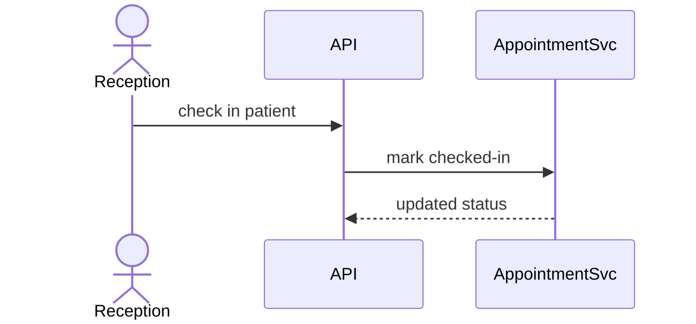

# System Sequence Diagram

```mermaid
sequenceDiagram
  actor Reception
  participant API
  participant AppointmentSvc
  Reception->>API: check in patient
  API->>AppointmentSvc: mark checked-in
  AppointmentSvc-->>API: updated status
```
