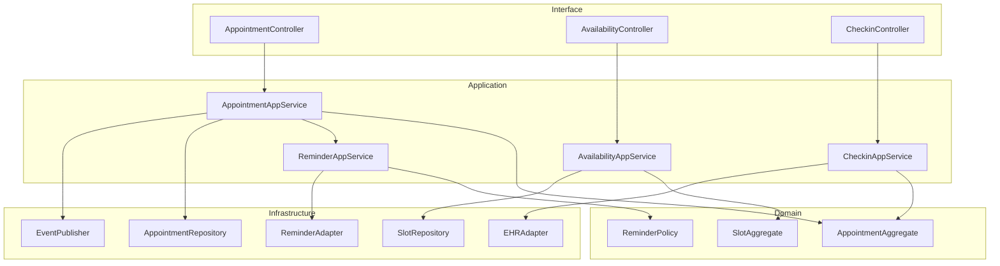
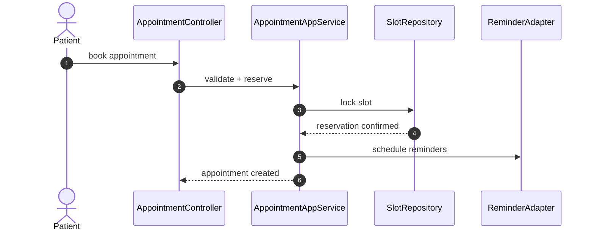

# C4 Code Diagram

This implementation view maps appointment scheduling code modules, dependencies, and the runtime booking path.

## Code-Level Structure

## Critical Runtime Sequence: Book Appointment

## Notes
- Keep slot reservation transactional to avoid double-booking.
- Persist reminder scheduling metadata for reconciliation and retries.
