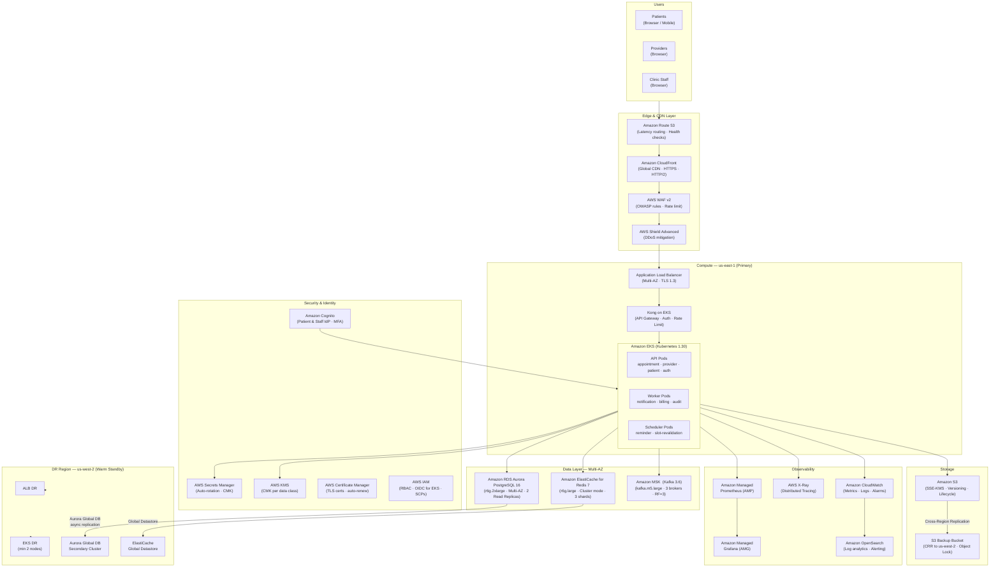

# Cloud Architecture

> **Scope:** AWS managed service selections, multi-AZ configuration, auto-scaling, backup, DR, cost optimization, and security baseline for the Healthcare Appointment System.  
> **Last reviewed:** 2025-Q3 | **Owner:** Cloud Architecture  
> **Compliance tags:** HIPAA §164.312, HITRUST CSF, SOC 2 Type II

---

## 1. AWS Cloud Services Topology



---

## 2. Managed Service Selections & Rationale

| Service Category       | AWS Service                         | Version / Tier             | Rationale                                                                                                       |
|------------------------|-------------------------------------|----------------------------|-----------------------------------------------------------------------------------------------------------------|
| **Relational DB**      | Amazon RDS Aurora PostgreSQL        | PostgreSQL 16, r6g.2xlarge | HIPAA-eligible, automatic failover < 30s, Aurora Global DB for cross-region DR, storage auto-scaling to 128 TiB |
| **Cache / Session**    | Amazon ElastiCache for Redis        | Redis 7, r6g.large         | Cluster mode for horizontal scale, HIPAA-eligible, encryption in transit+at rest, automatic failover            |
| **Event Streaming**    | Amazon MSK (Managed Kafka)          | Kafka 3.6, m5.large        | Fully managed brokers, automatic patching, MSK Connect for EHR integrations, HIPAA-eligible                     |
| **Container Orchestration** | Amazon EKS                    | Kubernetes 1.30            | AWS-managed control plane, IRSA for pod-level IAM, managed node groups, EKS Anywhere compatibility              |
| **Load Balancing**     | Application Load Balancer (ALB)     | —                          | Native WAF integration, HTTP/2, WebSocket, multi-AZ, Target Group weighting for blue/green                      |
| **CDN**                | Amazon CloudFront                   | —                          | Global PoP network, Lambda@Edge for auth edge logic, TLS 1.3, HIPAA-eligible                                    |
| **WAF**                | AWS WAF v2                          | —                          | Managed OWASP rule groups, rate limiting, bot detection, IP reputation lists                                     |
| **Secrets**            | AWS Secrets Manager                 | —                          | Automatic rotation, CMK encryption, VPC endpoint support, native EKS CSI driver integration                     |
| **Encryption Keys**    | AWS KMS                             | CMK (multi-region)         | FIPS 140-2 Level 3, automatic key rotation, CloudTrail auditing of all key usage                                 |
| **Object Storage**     | Amazon S3                           | —                          | SSE-KMS encryption, Object Lock (WORM for audit logs), lifecycle policies, CRR to DR region                     |
| **Identity**           | Amazon Cognito                      | —                          | HIPAA-eligible, OIDC/OAuth 2.0, MFA enforcement, custom flows via Lambda triggers                               |
| **Metrics**            | Amazon Managed Prometheus (AMP)     | —                          | Fully managed, multi-AZ, Prometheus-compatible, no operational overhead for storage                              |
| **Dashboards**         | Amazon Managed Grafana (AMG)        | —                          | SSO via IAM Identity Center, HIPAA-eligible, 150+ pre-built dashboards                                         |
| **Distributed Tracing**| AWS X-Ray                           | —                          | Native EKS + Lambda integration, service map, trace sampling, HIPAA-eligible                                    |
| **Log Analytics**      | Amazon OpenSearch Service           | OpenSearch 2.x             | Full-text search, anomaly detection, dashboards, 30-day hot + 1-year cold with UltraWarm                        |
| **DNS**                | Amazon Route 53                     | —                          | Latency-based routing, health-check-driven failover, DNSSEC, private hosted zones                               |

---

## 3. Multi-AZ Configuration Details

All production data-tier resources span three Availability Zones (us-east-1a, us-east-1b, us-east-1c).

### 3.1 RDS Aurora PostgreSQL

| Parameter                    | Value                                                        |
|------------------------------|--------------------------------------------------------------|
| **Cluster type**             | Aurora (Multi-Master disabled; writer + readers)            |
| **Writer instance**          | `db.r6g.2xlarge` — AZ-a                                     |
| **Reader instance 1**        | `db.r6g.xlarge` — AZ-b (serves read traffic)               |
| **Reader instance 2**        | `db.r6g.xlarge` — AZ-c (auto-promotion failover target)     |
| **Storage**                  | Aurora storage — auto-scaling, 6-way replication across AZs |
| **Failover SLA**             | < 30 seconds (automatic, DNS CNAME flip)                    |
| **Encryption**               | KMS CMK `healthcare/rds` (key ID logged in CloudTrail)      |
| **Parameter group**          | `aurora-postgresql16` with `ssl=1`, `log_connections=1`     |
| **Enhanced Monitoring**      | Enabled — 5-second granularity, 30-day retention            |
| **Performance Insights**     | Enabled — 7-day retention (free tier)                       |
| **Automated backups**        | 35-day retention, continuous backup to S3                   |

### 3.2 ElastiCache Redis Cluster Mode

| Parameter                    | Value                                                        |
|------------------------------|--------------------------------------------------------------|
| **Cluster mode**             | Enabled — 3 shards                                          |
| **Replicas per shard**       | 1 (total 6 nodes across 3 AZs)                              |
| **Node type**                | `cache.r6g.large`                                            |
| **Failover**                 | Automatic — < 60 seconds, DNS failover                      |
| **Encryption in transit**    | TLS 1.2+ enforced                                            |
| **Encryption at rest**       | KMS CMK `healthcare/redis`                                   |
| **AUTH token**               | Required — 64-char token rotated via Secrets Manager        |
| **Eviction policy**          | `allkeys-lru` (session data) / `noeviction` (slot locks)    |
| **Backup**                   | Daily snapshot — 7-day retention                            |

### 3.3 MSK Kafka Multi-AZ

| Parameter                    | Value                                                        |
|------------------------------|--------------------------------------------------------------|
| **Broker count**             | 3 (one per AZ)                                              |
| **Broker instance**          | `kafka.m5.large`                                             |
| **Replication factor**       | 3                                                            |
| **Min in-sync replicas**     | 2 (producer `acks=all` required)                            |
| **Encryption in transit**    | TLS 1.2 (plaintext disabled)                                 |
| **Encryption at rest**       | KMS CMK `healthcare/kafka`                                   |
| **Authentication**           | mTLS (client certificates from ACM PCA)                     |
| **Log retention**            | 7 days (compacted topics: indefinite)                        |
| **Monitoring**               | MSK Open Monitoring → AMP                                    |

---

## 4. Auto-Scaling Policies

### 4.1 EKS — Horizontal Pod Autoscaler (HPA)

| Service                | Min Replicas | Max Replicas | Scale-Out Trigger                        | Scale-In Trigger                        | Stabilization Window |
|------------------------|--------------|--------------|------------------------------------------|-----------------------------------------|----------------------|
| `appointment-api`      | 3            | 20           | CPU > 70% OR p99 latency > 800ms        | CPU < 30% AND p99 latency < 200ms      | Scale-out: 60s · Scale-in: 300s |
| `provider-api`         | 3            | 15           | CPU > 70%                                | CPU < 30%                               | 60s / 300s           |
| `patient-api`          | 2            | 10           | CPU > 70%                                | CPU < 30%                               | 60s / 300s           |
| `auth-api`             | 2            | 10           | CPU > 60% OR RPS > 500                   | CPU < 25%                               | 30s / 300s           |
| `notification-worker`  | 2            | 10           | Kafka consumer lag > 1,000 messages      | Kafka lag < 100 messages                | 60s / 600s           |
| `billing-worker`       | 2            | 8            | Kafka consumer lag > 500 messages        | Kafka lag < 50 messages                 | 60s / 600s           |

### 4.2 EKS — Cluster Autoscaler (Karpenter)

| Node Group        | Instance Family          | Min Nodes | Max Nodes | Scale-Out Trigger               | Scale-In Trigger             |
|-------------------|--------------------------|-----------|-----------|---------------------------------|------------------------------|
| `api-nodegroup`   | `c6g.xlarge`, `c6g.2xl`  | 3         | 20        | Pending pods > 0                | Node utilization < 40% for 10 min |
| `data-nodegroup`  | `r6g.xlarge`, `r6g.2xl`  | 2         | 10        | Pending pods > 0                | Node utilization < 40% for 10 min |
| `spot-nodegroup`  | `c6g.*` (Spot)           | 0         | 10        | Non-critical workload scheduled | Node utilization < 30%       |

> **Note:** Spot instances are used only for non-critical worker pods (audit, analytics batch jobs). API pods, scheduler pods, and database nodes run exclusively on On-Demand instances.

### 4.3 RDS Aurora — Auto Scaling (Read Replicas)

| Policy Name               | Metric                         | Target Value | Min Replicas | Max Replicas |
|---------------------------|--------------------------------|--------------|--------------|--------------|
| `aurora-read-replica-asg` | `RDSReaderAverageCPUUtilization` | 70%        | 1            | 5            |

---

## 5. Backup & Disaster Recovery

### 5.1 RTO / RPO Targets

| Failure Scenario                    | RTO Target   | RPO Target   | Recovery Method                                |
|-------------------------------------|--------------|--------------|------------------------------------------------|
| Single AZ failure                   | < 30 seconds | 0 (synchronous replication) | Automatic AZ failover (RDS, ElastiCache, MSK) |
| Full region failure                 | < 30 minutes | < 1 minute   | Aurora Global DB promotion + Route 53 failover |
| Data corruption (accidental delete) | < 2 hours    | < 15 minutes | Aurora point-in-time restore                   |
| S3 object accidental delete         | < 1 hour     | 0 (versioning) | S3 versioned restore                          |
| Kafka topic corruption              | < 4 hours    | < 1 minute   | MSK restore from MirrorMaker replica           |

### 5.2 Backup Schedules

| Resource                | Backup Type               | Frequency      | Retention      | Storage Location                    |
|-------------------------|---------------------------|----------------|----------------|-------------------------------------|
| RDS Aurora              | Automated backup          | Continuous     | 35 days        | S3 (same region, SSE-KMS)           |
| RDS Aurora              | Manual snapshot (pre-deploy) | Per deployment | 90 days     | S3 (same + DR region)               |
| ElastiCache Redis       | Automatic snapshot        | Daily (02:00 UTC) | 7 days      | S3 (same region, SSE-KMS)           |
| MSK Kafka               | Log segment backup        | Continuous     | 7 days         | S3 (same region via MSK Connect)    |
| S3 Application Data     | Versioning + CRR          | Real-time      | 1 year (cold)  | S3 DR bucket (us-west-2)            |
| EKS etcd                | EKS managed backup        | Every 6 hours  | 7 days         | S3 (AWS-managed)                    |
| Secrets Manager         | Cross-region replication  | Real-time      | N/A            | Secrets Manager DR region           |
| CloudTrail Logs         | S3 Object Lock (WORM)     | Continuous     | 7 years        | S3 Glacier Deep Archive             |

### 5.3 Cross-Region Replication Configuration

```
Primary: us-east-1
    ├── RDS Aurora ──────── Aurora Global DB ──────────► DR: us-west-2 (RPO < 1 min)
    ├── ElastiCache Redis ── Global Datastore ──────────► DR: us-west-2 (RPO < 1 min)
    ├── MSK Kafka ────────── MirrorMaker 2.0 ───────────► DR: us-west-2 (RPO < 1 min)
    └── S3 Buckets ────────── CRR Rules ────────────────► DR: us-west-2 (RPO near-zero)
```

---

## 6. Cost Optimization Strategies

### 6.1 Compute Optimization

| Strategy                         | Implementation                                                               | Estimated Saving |
|----------------------------------|------------------------------------------------------------------------------|------------------|
| **Spot instances for batch**     | Worker pods (non-critical) use Spot via Karpenter with Spot interruption handler | 60–70% on batch compute |
| **Graviton3 instances**          | All EKS nodes and RDS/ElastiCache on `c6g`/`r6g` (ARM-based)               | 20% vs. x86     |
| **Savings Plans**                | 1-year Compute Savings Plan covering baseline EKS node usage                | 30–40% on On-Demand |
| **Right-sizing via CUR**         | Monthly AWS Cost & Usage Report → Compute Optimizer recommendations review   | 10–20%           |

### 6.2 Storage & Data Transfer Optimization

| Strategy                         | Implementation                                                               | Estimated Saving |
|----------------------------------|------------------------------------------------------------------------------|------------------|
| **S3 Intelligent-Tiering**       | All S3 buckets (except WORM audit logs) use Intelligent-Tiering             | 40–60% on cold objects |
| **Aurora storage auto-scaling**  | No over-provisioning; billed for actual I/O + storage used                  | Pay-per-use model |
| **CloudFront cache hit ratio**   | Target > 80% cache hit; caches patient-facing static assets + API responses | Reduce ALB + EKS load |
| **VPC Endpoints for S3/KMS**     | Avoid data transfer charges for S3 and KMS traffic via internet NAT         | Eliminates NAT GW data fees |

### 6.3 Tagging Policy (Cost Allocation)

All resources are tagged with the following mandatory tags for cost attribution:

| Tag Key             | Example Value           | Purpose                              |
|---------------------|-------------------------|--------------------------------------|
| `Project`           | `healthcare-appt`       | Project-level cost grouping          |
| `Environment`       | `prod` / `staging`      | Environment-level cost split         |
| `Team`              | `platform-eng`          | Team-level chargeback                |
| `CostCenter`        | `CC-1042`               | Finance cost center allocation       |
| `DataClassification`| `phi` / `internal`      | Compliance tracking                  |

---

## 7. Security Baseline

### 7.1 Encryption Key Hierarchy

| KMS Key Alias               | Key Type     | Used By                                           | Rotation     |
|-----------------------------|--------------|---------------------------------------------------|--------------|
| `healthcare/rds`            | CMK (AES-256)| RDS Aurora storage encryption                     | Annual (auto)|
| `healthcare/redis`          | CMK (AES-256)| ElastiCache at-rest encryption                    | Annual (auto)|
| `healthcare/kafka`          | CMK (AES-256)| MSK log encryption                               | Annual (auto)|
| `healthcare/s3-phi`         | CMK (AES-256)| S3 buckets containing PHI/PII                    | Annual (auto)|
| `healthcare/s3-logs`        | CMK (AES-256)| S3 audit log buckets (Object Lock)               | Annual (auto)|
| `healthcare/secrets`        | CMK (AES-256)| Secrets Manager encryption                       | Annual (auto)|
| `healthcare/ebs`            | CMK (AES-256)| EKS node EBS volumes                            | Annual (auto)|

### 7.2 IAM Roles (IRSA — IAM Roles for Service Accounts)

| EKS Service Account         | IAM Role                              | Permissions Scope                                       |
|-----------------------------|---------------------------------------|---------------------------------------------------------|
| `appointment-api-sa`        | `role/appointment-api-prod`           | S3 read (documents), Secrets Manager read, X-Ray write  |
| `provider-api-sa`           | `role/provider-api-prod`              | S3 read, Secrets Manager read, X-Ray write              |
| `notification-worker-sa`    | `role/notification-worker-prod`       | SES send, SNS publish, Secrets Manager read             |
| `billing-worker-sa`         | `role/billing-worker-prod`            | Secrets Manager read (payment credentials), S3 write    |
| `audit-worker-sa`           | `role/audit-worker-prod`              | S3 write (audit bucket only), CloudWatch Logs write     |
| `cluster-autoscaler-sa`     | `role/eks-cluster-autoscaler`         | EC2 describe/modify autoscaling groups only             |

### 7.3 VPC Endpoints (No Internet Traversal for AWS APIs)

| Service                  | Endpoint Type | Endpoint Name                            |
|--------------------------|---------------|------------------------------------------|
| Amazon S3                | Gateway       | `vpce-s3-prod`                           |
| AWS Secrets Manager      | Interface     | `vpce-secretsmanager-prod`               |
| AWS KMS                  | Interface     | `vpce-kms-prod`                          |
| Amazon ECR (API)         | Interface     | `vpce-ecr-api-prod`                      |
| Amazon ECR (Docker)      | Interface     | `vpce-ecr-dkr-prod`                      |
| Amazon CloudWatch        | Interface     | `vpce-cloudwatch-prod`                   |
| AWS X-Ray                | Interface     | `vpce-xray-prod`                         |
| AWS STS                  | Interface     | `vpce-sts-prod`                          |

### 7.4 Service Control Policies (SCPs) — AWS Organizations

| SCP Policy                    | Rule                                                                          |
|-------------------------------|-------------------------------------------------------------------------------|
| `DenyPublicS3`                | Deny `s3:PutBucketPublicAccessBlock` with `BlockPublicAcls=false`            |
| `DenyUnencryptedS3Uploads`    | Deny `s3:PutObject` without `ServerSideEncryptionConfiguration`               |
| `RequireIMDSv2`               | Deny EC2 launches with `HttpTokens=optional` (force IMDSv2)                  |
| `DenyRootAccountUsage`        | Deny all actions by root account except break-glass                          |
| `EnforceRegions`              | Deny resource creation outside `us-east-1` and `us-west-2`                  |

---

## 8. Monitoring & Alerting Setup

### 8.1 CloudWatch Alarms — Critical (P1)

| Alarm Name                          | Metric                                    | Threshold          | Action                          |
|-------------------------------------|-------------------------------------------|--------------------|---------------------------------|
| `alb-5xx-error-rate-critical`       | ALB `HTTPCode_ELB_5XX_Count`             | > 1% over 5 min    | PagerDuty P1                    |
| `rds-cpu-critical`                  | RDS `CPUUtilization`                      | > 90% for 5 min    | PagerDuty P1 + scale read replica|
| `rds-storage-critical`              | RDS `FreeStorageSpace`                    | < 10 GiB           | PagerDuty P1                    |
| `rds-replica-lag-critical`          | RDS `AuroraReplicaLag`                    | > 30 seconds       | PagerDuty P1                    |
| `redis-memory-critical`             | ElastiCache `DatabaseMemoryUsagePercentage` | > 90%            | PagerDuty P1                    |
| `kafka-consumer-lag-critical`       | MSK `kafka_consumer_lag`                  | > 10,000 messages  | PagerDuty P1                    |
| `eks-node-not-ready`                | Custom: EKS node count                    | < min expected     | PagerDuty P1                    |

### 8.2 CloudWatch Alarms — Warning (P2)

| Alarm Name                          | Metric                                    | Threshold          | Action                          |
|-------------------------------------|-------------------------------------------|--------------------|---------------------------------|
| `alb-4xx-error-rate-warn`           | ALB `HTTPCode_Target_4XX_Count`           | > 5% over 10 min   | Slack #alerts + JIRA            |
| `rds-cpu-warn`                      | RDS `CPUUtilization`                      | > 70% for 10 min   | Slack #alerts                   |
| `api-p99-latency-warn`              | Custom: API p99 response time             | > 1 second         | Slack #alerts                   |
| `kafka-consumer-lag-warn`           | MSK `kafka_consumer_lag`                  | > 1,000 messages   | Slack #alerts                   |
| `secrets-rotation-overdue`          | Secrets Manager rotation status           | Not rotated in 35d | JIRA + email                    |

### 8.3 SLO Dashboard (Grafana)

| SLO Name                        | Target    | Error Budget (30d) | Measurement Window |
|---------------------------------|-----------|--------------------|-------------------|
| Appointment Booking Availability| 99.9%     | 43.2 minutes       | Rolling 30 days   |
| API Response Time (p99 < 500ms) | 99.5%     | 3.6 hours          | Rolling 30 days   |
| Notification Delivery Success   | 99.5%     | 3.6 hours          | Rolling 30 days   |
| DR Failover RTO (< 30 min)      | 99.9%     | Quarterly test     | Per incident      |

### 8.4 X-Ray Tracing Configuration

```yaml
sampling_rules:
  - description: "High-traffic appointment booking — 10% sample"
    service_name: "appointment-api"
    http_method: "POST"
    url_path: "/api/v1/appointments"
    fixed_rate: 0.10
    reservoir_size: 5

  - description: "Auth endpoint — full trace for debugging"
    service_name: "auth-api"
    fixed_rate: 1.0
    reservoir_size: 10

  - description: "Default — 5% for all other services"
    fixed_rate: 0.05
    reservoir_size: 2
```
