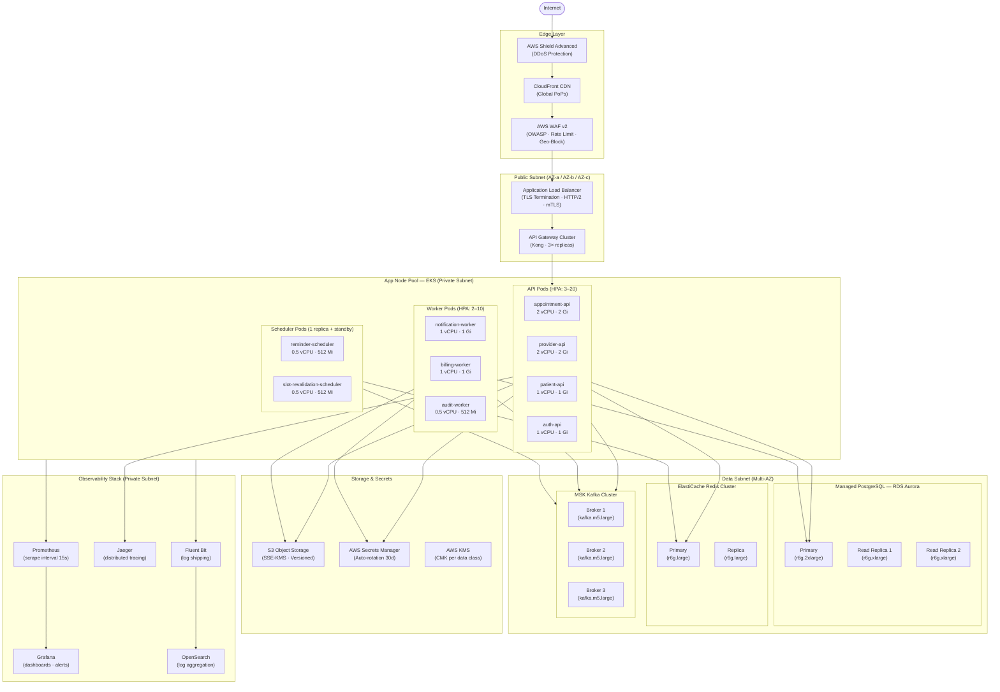
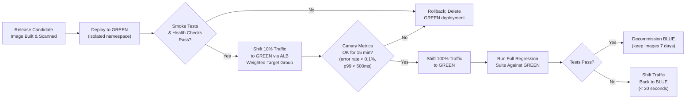

# Deployment Diagram

> **Scope:** Production-grade deployment topology for the Healthcare Appointment System.  
> **Last reviewed:** 2025-Q3 | **Owner:** Platform Engineering  
> **Compliance tags:** HIPAA §164.312, SOC 2 Type II, ISO 27001 A.12

---

## 1. Production Deployment Topology



---

## 2. Environment Strategy

| Attribute                    | Development                             | Staging                                   | Production                                      |
|------------------------------|-----------------------------------------|-------------------------------------------|-------------------------------------------------|
| **Purpose**                  | Feature development, unit tests         | Integration, load, chaos testing          | Live patient traffic                            |
| **Scale**                    | 1 replica per service                   | 2 replicas per service                    | HPA min/max per service (see §4)                |
| **Database**                 | RDS `db.t4g.medium`, 1 AZ              | RDS `db.r6g.large`, 2 AZ, 1 read replica | RDS Aurora `r6g.2xlarge`, 3 AZ, 2 read replicas|
| **Redis**                    | Single-node `cache.t4g.medium`          | Cluster mode, 2 shards                   | Cluster mode, 3 shards, 1 replica per shard     |
| **Kafka**                    | Local Kafka in Docker                   | MSK `kafka.t3.small`, 2 brokers          | MSK `kafka.m5.large`, 3 brokers, RF=3           |
| **Data**                     | Synthetic only (no PHI)                 | Anonymised production clone              | Live PHI — full HIPAA controls active           |
| **Secrets**                  | `.env` files (git-ignored)              | Secrets Manager (dev namespace)          | Secrets Manager (prod namespace, CMK-encrypted) |
| **Observability**            | Local Prometheus + Grafana              | Full stack, 7-day retention              | Full stack, 90-day hot + 1-year cold            |
| **DR testing**               | N/A                                     | Monthly failover drills                  | Quarterly cross-region failover exercise        |
| **Feature flags**            | All flags enabled for testing           | Mirror prod flag state                   | LaunchDarkly-controlled rollout                 |

---

## 3. Kubernetes Resource Specifications

### 3.1 Deployments

| Deployment                 | Replicas (min/max) | CPU Request/Limit      | Memory Request/Limit   | Strategy        |
|----------------------------|--------------------|------------------------|------------------------|-----------------|
| `appointment-api`          | 3 / 20             | 1000m / 2000m          | 1Gi / 2Gi              | RollingUpdate   |
| `provider-api`             | 3 / 15             | 1000m / 2000m          | 1Gi / 2Gi              | RollingUpdate   |
| `patient-api`              | 2 / 10             | 500m / 1000m           | 512Mi / 1Gi            | RollingUpdate   |
| `auth-api`                 | 2 / 10             | 500m / 1000m           | 512Mi / 1Gi            | RollingUpdate   |
| `notification-worker`      | 2 / 10             | 500m / 1000m           | 512Mi / 1Gi            | RollingUpdate   |
| `billing-worker`           | 2 / 8              | 500m / 1000m           | 512Mi / 1Gi            | RollingUpdate   |
| `audit-worker`             | 1 / 4              | 250m / 500m            | 256Mi / 512Mi          | RollingUpdate   |
| `reminder-scheduler`       | 1 / 1 + standby    | 250m / 500m            | 256Mi / 512Mi          | Recreate        |
| `slot-revalidation-sched`  | 1 / 1 + standby    | 250m / 500m            | 256Mi / 512Mi          | Recreate        |

### 3.2 Services

| Service                    | Type          | Port  | Target Port | Protocol |
|----------------------------|---------------|-------|-------------|----------|
| `appointment-api-svc`      | ClusterIP     | 80    | 8080        | TCP      |
| `provider-api-svc`         | ClusterIP     | 80    | 8080        | TCP      |
| `patient-api-svc`          | ClusterIP     | 80    | 8080        | TCP      |
| `auth-api-svc`             | ClusterIP     | 80    | 8080        | TCP      |
| `notification-worker-svc`  | ClusterIP     | 80    | 8081        | TCP      |
| `billing-worker-svc`       | ClusterIP     | 80    | 8081        | TCP      |
| `metrics-svc`              | ClusterIP     | 9090  | 9090        | TCP      |

### 3.3 Horizontal Pod Autoscaler (HPA) Configuration

| HPA Name                      | Target Deployment        | Min | Max | CPU Threshold | Memory Threshold | Custom Metric                        |
|-------------------------------|--------------------------|-----|-----|---------------|------------------|--------------------------------------|
| `appointment-api-hpa`         | `appointment-api`        | 3   | 20  | 70%           | 80%              | `http_requests_per_second > 500`     |
| `provider-api-hpa`            | `provider-api`           | 3   | 15  | 70%           | 80%              | —                                    |
| `patient-api-hpa`             | `patient-api`            | 2   | 10  | 70%           | 80%              | —                                    |
| `auth-api-hpa`                | `auth-api`               | 2   | 10  | 60%           | 75%              | —                                    |
| `notification-worker-hpa`     | `notification-worker`    | 2   | 10  | 60%           | —                | `kafka_consumer_lag > 1000`          |
| `billing-worker-hpa`          | `billing-worker`         | 2   | 8   | 60%           | —                | `kafka_consumer_lag > 500`           |

---

## 4. Health Check & Readiness Probe Configuration

```yaml
# Applies to all API pods — example for appointment-api
livenessProbe:
  httpGet:
    path: /health/live
    port: 8080
    scheme: HTTP
  initialDelaySeconds: 30
  periodSeconds: 15
  timeoutSeconds: 5
  failureThreshold: 3
  successThreshold: 1

readinessProbe:
  httpGet:
    path: /health/ready
    port: 8080
    scheme: HTTP
  initialDelaySeconds: 10
  periodSeconds: 10
  timeoutSeconds: 3
  failureThreshold: 3
  successThreshold: 1

startupProbe:
  httpGet:
    path: /health/startup
    port: 8080
    scheme: HTTP
  failureThreshold: 30
  periodSeconds: 5
```

### Health Endpoint Contract

| Endpoint           | Returns 200 When                                                     | Returns 503 When                                       |
|--------------------|----------------------------------------------------------------------|--------------------------------------------------------|
| `/health/live`     | Process is running, no deadlock detected                             | JVM/process hung, OOM condition                        |
| `/health/ready`    | DB connection pool healthy, Redis reachable, Kafka consumer active   | Any critical dependency unreachable                    |
| `/health/startup`  | Application bootstrap complete (migrations run, caches warm)         | Startup incomplete within `failureThreshold × period`  |

---

## 5. Pod Disruption Budget & Resource Quotas

### 5.1 Pod Disruption Budgets (PDB)

```yaml
# appointment-api PDB
apiVersion: policy/v1
kind: PodDisruptionBudget
metadata:
  name: appointment-api-pdb
  namespace: healthcare-prod
spec:
  minAvailable: 2          # At least 2 replicas must remain available during voluntary disruptions
  selector:
    matchLabels:
      app: appointment-api
```

| PDB Name                    | Min Available | Applies To                              |
|-----------------------------|---------------|-----------------------------------------|
| `appointment-api-pdb`       | 2             | `appointment-api`                       |
| `provider-api-pdb`          | 2             | `provider-api`                          |
| `auth-api-pdb`              | 1             | `auth-api`                              |
| `notification-worker-pdb`   | 1             | `notification-worker`                   |

### 5.2 Namespace Resource Quotas

```yaml
apiVersion: v1
kind: ResourceQuota
metadata:
  name: healthcare-prod-quota
  namespace: healthcare-prod
spec:
  hard:
    requests.cpu: "80"
    requests.memory: "160Gi"
    limits.cpu: "160"
    limits.memory: "320Gi"
    pods: "200"
    services: "50"
    persistentvolumeclaims: "20"
```

### 5.3 LimitRange (Default per Container)

```yaml
apiVersion: v1
kind: LimitRange
metadata:
  name: healthcare-prod-limits
  namespace: healthcare-prod
spec:
  limits:
  - type: Container
    default:
      cpu: "500m"
      memory: "512Mi"
    defaultRequest:
      cpu: "250m"
      memory: "256Mi"
    max:
      cpu: "2"
      memory: "4Gi"
```

---

## 6. Blue/Green Deployment Procedure



### Step-by-Step Procedure

1. **Build & scan** — CI pipeline builds Docker image, runs Trivy vulnerability scan; blocks if CRITICAL CVEs found.
2. **Deploy GREEN** — Apply manifests to `healthcare-prod-green` namespace; do not alter ALB target group weights.
3. **Green smoke test** — Run smoke test suite against internal green service endpoint (`kubectl port-forward`).
4. **10% canary shift** — Update ALB weighted target group: `BLUE=90, GREEN=10`.
5. **Monitor canary window** — Observe Grafana dashboards for 15 minutes: error rate, p99 latency, Kafka lag, DB connection pool saturation.
6. **Full traffic shift** — Update ALB weights: `BLUE=0, GREEN=100`.
7. **Post-deploy validation** — Run full integration test suite. Check PagerDuty for any triggered alerts.
8. **Retire BLUE** — Scale BLUE deployment to zero. Retain namespace and images for 7 days to support rollback.

---

## 7. Rollback Procedure

### 7.1 Automated Rollback Triggers

Rollback is automatically initiated by the CD pipeline if any of the following thresholds are breached within the 15-minute canary window:

| Metric                          | Threshold        | Action                              |
|---------------------------------|------------------|-------------------------------------|
| HTTP 5xx error rate             | > 1% over 5 min  | Auto shift traffic to BLUE          |
| p99 API response latency        | > 2 seconds      | Auto shift traffic to BLUE          |
| Kafka consumer lag              | > 5,000 messages | Auto shift traffic to BLUE          |
| Pod crash loop (any API pod)    | 3 restarts/5min  | Auto shift traffic to BLUE          |

### 7.2 Manual Rollback Commands

```bash
# 1. Immediately shift all traffic back to BLUE namespace
kubectl patch service appointment-api-svc \
  --namespace healthcare-prod \
  --type='json' \
  -p='[{"op":"replace","path":"/spec/selector/deployment-slot","value":"blue"}]'

# 2. Confirm rollback by checking pod selector and endpoints
kubectl get endpoints appointment-api-svc -n healthcare-prod

# 3. Scale GREEN deployment to zero (prevents wasted resources and confusion)
kubectl scale deployment appointment-api \
  --namespace healthcare-prod-green \
  --replicas=0

# 4. Tag failed release in the deployment registry
kubectl annotate deployment appointment-api \
  --namespace healthcare-prod-green \
  deployment.healthcare.io/status="rollback" \
  deployment.healthcare.io/rollback-reason="canary-threshold-breach"

# 5. Page on-call engineer via PagerDuty
curl -X POST https://events.pagerduty.com/v2/enqueue \
  -H "Content-Type: application/json" \
  -d '{"routing_key": "$PD_ROUTING_KEY", "event_action": "trigger", "payload": {"summary": "Deployment rollback executed", "severity": "warning"}}'
```

### 7.3 Database Migration Rollback

All schema migrations MUST be backward-compatible (expand-contract pattern). If a breaking migration is accidentally deployed:

```bash
# List applied migrations
kubectl exec -n healthcare-prod deploy/appointment-api -- \
  flyway -url=$DB_URL -user=$DB_USER info

# Rollback last migration (only if undo script exists)
kubectl exec -n healthcare-prod deploy/appointment-api -- \
  flyway -url=$DB_URL -user=$DB_USER undo

# Force application to previous image (last known good)
kubectl set image deployment/appointment-api \
  appointment-api=<ecr-repo>/appointment-api:<previous-tag> \
  -n healthcare-prod

# Verify rollout completes
kubectl rollout status deployment/appointment-api -n healthcare-prod
```

---

## 8. Deployment Checklist (Pre/Post)

### Pre-Deployment
- [ ] Docker image scanned — zero CRITICAL CVEs
- [ ] All unit, integration, and contract tests pass in CI
- [ ] Database migrations reviewed (backward-compatible)
- [ ] Feature flags configured for phased rollout
- [ ] On-call engineer confirmed available
- [ ] Change advisory board (CAB) approval logged

### Post-Deployment
- [ ] All health check endpoints return 200 on GREEN
- [ ] Canary metrics within thresholds for 15+ minutes
- [ ] Smoke test suite passes on production GREEN
- [ ] PagerDuty shows no new critical incidents
- [ ] Grafana SLO dashboard shows ≥ 99.9% success rate
- [ ] Deployment logged in change management system (e.g., ServiceNow)

