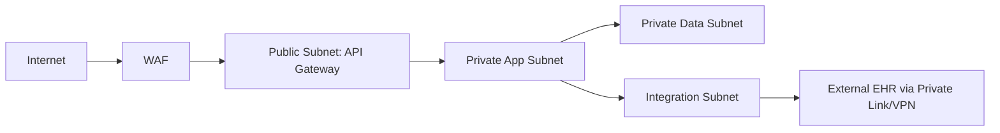

# Network Infrastructure

## Segmented Network Design

## Connectivity Rules
- Only API Gateway is internet-facing.
- App subnet can reach data subnet on allow-listed ports only.
- Outbound calls to payment/notification providers traverse NAT with egress policy enforcement.
- Admin access requires bastion + MFA + short-lived credentials.

## Network Security Controls
- WAF rules for OWASP top risks and bot mitigation.
- Layer-7 rate limits by tenant and endpoint risk class.
- IDS/IPS monitoring with alert-to-incident automation.

## DR Networking
- Warm standby VPC with pre-provisioned peering and route templates.
- DNS failover with health checks and 60-second TTL.

## Operational Policy Addendum

### Scheduling Conflict Policies
- Double-booking is prevented through atomic slot reservation (`provider_id + location_id + slot_start`) with optimistic locking (`slot_version`) and idempotency keys per booking command.
- If concurrent requests target one slot, the first committed reservation succeeds; later requests return `409 SLOT_ALREADY_BOOKED` and include the top three alternatives.
- Provider calendar updates (leave, clinic closure, emergency blocks) trigger revalidation and move impacted appointments to `REBOOK_REQUIRED`.
- Any unresolved conflict older than 15 minutes creates an operations incident and outreach task.

### Patient/Provider Workflow States
- Patient lifecycle: `DRAFT -> PENDING_CONFIRMATION -> CONFIRMED -> CHECKED_IN -> IN_CONSULTATION -> COMPLETED` with terminal states `CANCELLED`, `NO_SHOW`, `EXPIRED`.
- Provider slot lifecycle: `AVAILABLE -> RESERVED -> LOCKED_FOR_VISIT -> RELEASED`; exceptional states are `BLOCKED` and `SUSPENDED`.
- Every state transition records actor, timestamp, reason code, and correlation id in immutable audit logs.
- Invalid transitions are rejected and never mutate billing, notification, or reporting projections.

### Notification Guarantees
- Channel order is configurable (in-app, email, SMS if consented). Delivery is at-least-once; consumers enforce idempotency using message keys.
- Critical events (`CONFIRMED`, `RESCHEDULED`, `CANCELLED`, `REBOOK_REQUIRED`) retry with exponential backoff for 24 hours.
- Failed deliveries create `NOTIFICATION_ATTENTION_REQUIRED` tasks for manual outreach.
- Template versions are pinned to event schema versions for deterministic rendering and compliance review.

### Privacy Requirements
- PHI/PII encryption: TLS 1.2+ in transit, AES-256 at rest, and customer-managed key support for regulated tenants.
- Access control: least privilege RBAC/ABAC, MFA for privileged roles, and just-in-time elevation for production support.
- Auditability: all create/read/update/export actions on clinical or billing data are logged with actor, purpose, and source IP.
- Data minimization is mandatory for analytics exports, notifications, and non-production datasets.

### Downtime Fallback Procedures
- In degraded mode, read operations remain available while write commands are queued with ordering guarantees.
- Clinics operate from offline rosters and manual check-in forms, then reconcile after recovery.
- Recovery pipeline replays commands, revalidates slot conflicts, and issues reconciliation notifications.
- Incident closure requires backlog drain, consistency checks, and a postmortem with corrective actions.
