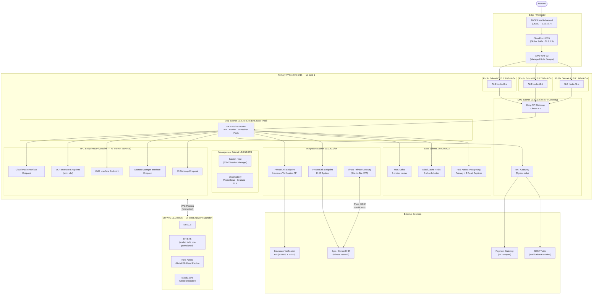
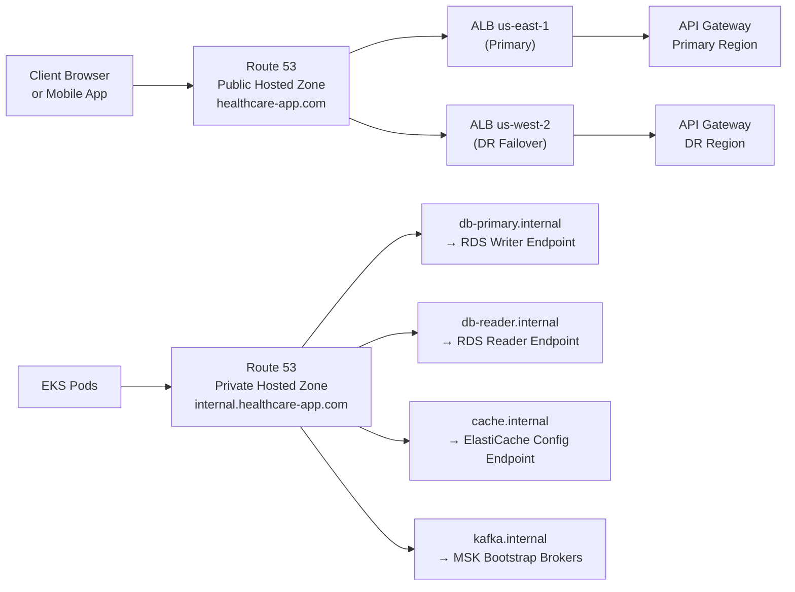

# Network Infrastructure

> **Scope:** VPC topology, security controls, connectivity, and DR networking for the Healthcare Appointment System.  
> **Last reviewed:** 2025-Q3 | **Owner:** Network Security Engineering  
> **Compliance tags:** HIPAA §164.312(e), NIST SP 800-53 SC-7, PCI DSS Req 1

---

## 1. VPC Network Topology



---

## 2. Security Group Rules

### 2.1 ALB Security Group (`sg-alb-prod`)

| Direction | Source / Destination       | Port(s)    | Protocol | Description                                        |
|-----------|----------------------------|------------|----------|----------------------------------------------------|
| Inbound   | `0.0.0.0/0`                | 443        | TCP      | HTTPS from internet (TLS terminated at ALB)         |
| Inbound   | `0.0.0.0/0`                | 80         | TCP      | HTTP → 301 redirect to HTTPS                        |
| Outbound  | `sg-apigw-prod`            | 8443       | TCP      | Forward to API Gateway cluster                      |
| Outbound  | All                        | All        | All      | Deny (implicit)                                    |

### 2.2 API Gateway Security Group (`sg-apigw-prod`)

| Direction | Source / Destination       | Port(s)    | Protocol | Description                                        |
|-----------|----------------------------|------------|----------|----------------------------------------------------|
| Inbound   | `sg-alb-prod`              | 8443       | TCP      | Traffic from ALB only                              |
| Inbound   | `sg-mgmt-prod`             | 22, 8001   | TCP      | Admin access (bastion) and Kong Admin API          |
| Outbound  | `sg-app-prod`              | 8080       | TCP      | Forward to EKS API pods                            |
| Outbound  | All                        | All        | All      | Deny (implicit)                                    |

### 2.3 EKS Node Security Group (`sg-app-prod`)

| Direction | Source / Destination       | Port(s)    | Protocol | Description                                        |
|-----------|----------------------------|------------|----------|----------------------------------------------------|
| Inbound   | `sg-apigw-prod`            | 8080       | TCP      | Inbound from API Gateway                           |
| Inbound   | `sg-app-prod`              | All        | All      | Pod-to-pod intra-cluster communication             |
| Outbound  | `sg-data-prod`             | 5432       | TCP      | PostgreSQL                                         |
| Outbound  | `sg-data-prod`             | 6379       | TCP      | Redis                                              |
| Outbound  | `sg-data-prod`             | 9092, 9094 | TCP      | Kafka (plaintext/TLS)                              |
| Outbound  | `sg-integration-prod`      | 443        | TCP      | EHR PrivateLink, Insurance API                     |
| Outbound  | `0.0.0.0/0` (via NAT)      | 443        | TCP      | Notification providers, payment gateway            |
| Outbound  | VPC Endpoints              | 443        | TCP      | S3, Secrets Manager, KMS, ECR, CloudWatch          |

### 2.4 Data Subnet Security Group (`sg-data-prod`)

| Direction | Source / Destination       | Port(s)    | Protocol | Description                                        |
|-----------|----------------------------|------------|----------|----------------------------------------------------|
| Inbound   | `sg-app-prod`              | 5432       | TCP      | PostgreSQL from EKS nodes only                     |
| Inbound   | `sg-app-prod`              | 6379       | TCP      | Redis from EKS nodes only                          |
| Inbound   | `sg-app-prod`              | 9092, 9094 | TCP      | Kafka from EKS nodes only                          |
| Inbound   | `sg-mgmt-prod`             | 5432       | TCP      | DBA access via bastion (just-in-time only)         |
| Outbound  | All                        | All        | All      | Deny (implicit)                                    |

### 2.5 Management Security Group (`sg-mgmt-prod`)

| Direction | Source / Destination       | Port(s)    | Protocol | Description                                        |
|-----------|----------------------------|------------|----------|----------------------------------------------------|
| Inbound   | Corporate IP ranges only   | 443        | TCP      | SSM Session Manager (no SSH port open)             |
| Outbound  | `sg-data-prod`             | 5432       | TCP      | DBA access (requires JIT approval + MFA)           |
| Outbound  | `sg-app-prod`              | 443, 9090  | TCP      | Metrics scrape and health checks                   |

---

## 3. Network ACL Rules

### 3.1 Public Subnet NACL (`nacl-public-prod`)

| Rule # | Type      | Protocol | Port Range  | Source / Destination | Action |
|--------|-----------|----------|-------------|----------------------|--------|
| 100    | Inbound   | TCP      | 443         | `0.0.0.0/0`          | ALLOW  |
| 110    | Inbound   | TCP      | 80          | `0.0.0.0/0`          | ALLOW  |
| 120    | Inbound   | TCP      | 1024–65535  | `0.0.0.0/0`          | ALLOW  |
| 200    | Outbound  | TCP      | 8443        | `10.0.10.0/24`       | ALLOW  |
| 210    | Outbound  | TCP      | 1024–65535  | `0.0.0.0/0`          | ALLOW  |
| 32766  | Inbound   | All      | All         | `0.0.0.0/0`          | DENY   |
| 32767  | Outbound  | All      | All         | `0.0.0.0/0`          | DENY   |

### 3.2 App Subnet NACL (`nacl-app-prod`)

| Rule # | Type      | Protocol | Port Range  | Source / Destination | Action |
|--------|-----------|----------|-------------|----------------------|--------|
| 100    | Inbound   | TCP      | 8080        | `10.0.10.0/24`       | ALLOW  |
| 110    | Inbound   | TCP      | 1024–65535  | `10.0.0.0/16`        | ALLOW  |
| 200    | Outbound  | TCP      | 5432        | `10.0.30.0/23`       | ALLOW  |
| 210    | Outbound  | TCP      | 6379        | `10.0.30.0/23`       | ALLOW  |
| 220    | Outbound  | TCP      | 9092, 9094  | `10.0.30.0/23`       | ALLOW  |
| 230    | Outbound  | TCP      | 443         | `10.0.40.0/24`       | ALLOW  |
| 240    | Outbound  | TCP      | 443         | `0.0.0.0/0`          | ALLOW  |
| 250    | Outbound  | TCP      | 1024–65535  | `10.0.0.0/16`        | ALLOW  |
| 32766  | Inbound   | All      | All         | `0.0.0.0/0`          | DENY   |
| 32767  | Outbound  | All      | All         | `0.0.0.0/0`          | DENY   |

### 3.3 Data Subnet NACL (`nacl-data-prod`)

| Rule # | Type      | Protocol | Port Range  | Source / Destination | Action |
|--------|-----------|----------|-------------|----------------------|--------|
| 100    | Inbound   | TCP      | 5432        | `10.0.20.0/22`       | ALLOW  |
| 110    | Inbound   | TCP      | 6379        | `10.0.20.0/22`       | ALLOW  |
| 120    | Inbound   | TCP      | 9092, 9094  | `10.0.20.0/22`       | ALLOW  |
| 130    | Inbound   | TCP      | 1024–65535  | `10.0.20.0/22`       | ALLOW  |
| 200    | Outbound  | TCP      | 1024–65535  | `10.0.20.0/22`       | ALLOW  |
| 32766  | Inbound   | All      | All         | `0.0.0.0/0`          | DENY   |
| 32767  | Outbound  | All      | All         | `0.0.0.0/0`          | DENY   |

---

## 4. VPN & PrivateLink Configuration

### 4.1 Site-to-Site VPN — EHR System (Epic/Cerner)

| Parameter                | Value                                           |
|--------------------------|-------------------------------------------------|
| **Tunnel type**          | IPsec IKEv2                                     |
| **Encryption**           | AES-256-GCM                                     |
| **Integrity**            | SHA-384                                         |
| **DH Group**             | Group 20 (384-bit elliptic curve)               |
| **Rekey interval**       | Phase 1: 8 hours · Phase 2: 1 hour              |
| **Tunnel count**         | 2 (active/active for HA)                        |
| **BGP ASN — AWS side**   | 64512                                           |
| **BGP ASN — EHR side**   | 64513                                           |
| **Advertised routes**    | `10.0.20.0/22` (App subnet only)                |
| **Dead Peer Detection**  | Enabled — 30s interval, 5 retries               |
| **Monitoring**           | CloudWatch VPN metrics — tunnel state alerts    |

### 4.2 AWS PrivateLink — Insurance Verification API

| Parameter                | Value                                           |
|--------------------------|-------------------------------------------------|
| **Endpoint type**        | Interface Endpoint                              |
| **Service name**         | `com.amazonaws.vpce.us-east-1.insurance-verify` |
| **Subnets**              | Integration subnet (10.0.40.0/24), 3 AZs       |
| **Security group**       | `sg-integration-prod` (port 443 only)           |
| **Private DNS**          | Enabled — resolves to private IP within VPC     |
| **mTLS**                 | Client certificate from internal PKI (90-day)   |
| **Certificate pinning**  | Enabled — SHA-256 SPKI pin stored in Secrets Manager |

---

## 5. DNS Architecture & Health Checks



### DNS Configuration

| Record                            | Type    | TTL   | Target                              | Routing Policy              |
|-----------------------------------|---------|-------|-------------------------------------|-----------------------------|
| `healthcare-app.com`              | A       | 60s   | ALB us-east-1                       | Failover — PRIMARY          |
| `healthcare-app.com`              | A       | 60s   | ALB us-west-2                       | Failover — SECONDARY        |
| `api.healthcare-app.com`          | CNAME   | 60s   | ALB DNS name                        | Latency-based               |
| `db-primary.internal`             | CNAME   | 30s   | RDS cluster writer endpoint         | Simple                      |
| `db-reader.internal`              | CNAME   | 30s   | RDS cluster reader endpoint         | Simple                      |
| `cache.internal`                  | CNAME   | 30s   | ElastiCache config endpoint         | Simple                      |

### Route 53 Health Check Configuration

| Health Check Name            | Target                            | Protocol | Interval | Threshold | Alarm Action                      |
|------------------------------|-----------------------------------|----------|----------|-----------|-----------------------------------|
| `hc-primary-alb`             | `api.healthcare-app.com:443/health` | HTTPS  | 10s      | 3 fails   | Failover to DR region             |
| `hc-dr-alb`                  | `api.dr.healthcare-app.com:443/health` | HTTPS | 30s    | 3 fails   | Alert only                        |
| `hc-appointment-api`         | `/health/ready` on ALB            | HTTPS    | 10s      | 2 fails   | Page on-call                      |

---

## 6. Disaster Recovery Networking

### 6.1 DR VPC Configuration (us-west-2 — Warm Standby)

| Component            | Primary (us-east-1)                 | DR (us-west-2)                        | Sync Method                         |
|----------------------|-------------------------------------|---------------------------------------|-------------------------------------|
| VPC CIDR             | `10.0.0.0/16`                       | `10.1.0.0/16`                         | —                                   |
| EKS cluster          | Active — full scale                 | Active — minimal scale (2 nodes)      | Helm charts in Git                  |
| RDS Aurora           | Primary + 2 read replicas           | Aurora Global DB secondary            | Async replication (RPO < 1 min)     |
| ElastiCache Redis    | 3-shard cluster                     | Global Datastore secondary            | Async replication                   |
| MSK Kafka            | 3-broker cluster                    | MirrorMaker 2.0 replica               | Continuous mirror (RPO < 1 min)     |
| S3 Object Storage    | Source bucket                       | CRR destination bucket                | Cross-Region Replication            |
| Route 53             | Primary failover record             | Secondary failover record             | Health-check-driven DNS failover    |

### 6.2 VPC Peering & Transit Gateway

```
Primary VPC (us-east-1)  <──── VPC Peering (encrypted) ────>  DR VPC (us-west-2)
        │                                                              │
        └── Transit Gateway (us-east-1) ── VPN Attachment ── EHR On-Premises
```

- All peering traffic encrypted in transit using AWS's default AES-256-GCM at the hypervisor layer.
- Route tables updated to forward `10.1.0.0/16` via peering connection; DR routes are pre-installed and dormant until failover.
- Transit Gateway enables hub-and-spoke connectivity; spoke attachments for VPN, Direct Connect, and additional service VPCs.

### 6.3 Failover Runbook (Network Layer)

```bash
# Step 1: Confirm primary region health check failure (Route 53)
aws route53 get-health-check-status --health-check-id <hc-primary-alb-id>

# Step 2: Update Route 53 failover record to point to DR ALB
aws route53 change-resource-record-sets \
  --hosted-zone-id <zone-id> \
  --change-batch '{"Changes":[{"Action":"UPSERT","ResourceRecordSet":{"Name":"api.healthcare-app.com","Type":"A","Failover":"PRIMARY","HealthCheckId":"<hc-dr-alb-id>","AliasTarget":{"DNSName":"<dr-alb-dns>","EvaluateTargetHealth":true,"HostedZoneId":"<alb-hz>"}}}]}'

# Step 3: Scale up DR EKS node group
aws eks update-nodegroup-config \
  --cluster-name healthcare-dr \
  --nodegroup-name app-nodegroup \
  --scaling-config minSize=3,maxSize=20,desiredSize=6 \
  --region us-west-2

# Step 4: Promote Aurora Global DB secondary to standalone (breaks replication)
aws rds failover-global-cluster \
  --global-cluster-identifier healthcare-global-db \
  --target-db-cluster-identifier healthcare-dr-cluster
```

---

## 7. WAF Rule Groups

### 7.1 Managed Rule Groups (AWS)

| Rule Group                               | Priority | Action      | Purpose                                                  |
|------------------------------------------|----------|-------------|----------------------------------------------------------|
| `AWSManagedRulesCommonRuleSet`           | 1        | Block       | OWASP Top 10 protections (SQLi, XSS, LFI, RFI, etc.)    |
| `AWSManagedRulesKnownBadInputsRuleSet`   | 2        | Block       | Log4Shell, Spring4Shell, SSRF patterns                   |
| `AWSManagedRulesAmazonIpReputationList`  | 3        | Block       | AWS threat intelligence — known malicious IPs            |
| `AWSManagedRulesBotControlRuleSet`       | 4        | Count/Block | Bot detection with browser fingerprinting                |
| `AWSManagedRulesSQLiRuleSet`             | 5        | Block       | Additional SQL injection coverage                        |

### 7.2 Custom Rule Groups

| Rule Name                        | Priority | Condition                                           | Action       | Description                                         |
|----------------------------------|----------|-----------------------------------------------------|--------------|-----------------------------------------------------|
| `RateLimitPerIPGlobal`           | 10       | > 2,000 req/5 min per IP                            | Block 5 min  | Global rate limit per IP address                    |
| `RateLimitBookingEndpoint`       | 11       | > 50 req/min per IP on `POST /appointments`         | Block 10 min | Booking endpoint abuse prevention                   |
| `RateLimitAuthEndpoint`          | 12       | > 20 req/min per IP on `/auth/login`                | Block 15 min | Brute-force login protection                        |
| `GeoBlockHighRiskCountries`      | 20       | Source country in deny-list (configurable)          | Block        | OFAC/HIPAA geographic restriction                   |
| `BlockMaliciousUserAgents`       | 30       | User-Agent matches known scanner patterns           | Block        | Scanner/reconnaissance tool blocking                |
| `RequireContentTypeOnPOST`       | 40       | POST without `Content-Type: application/json`       | Block        | Prevents raw HTTP abuse                             |
| `PHIPatternDetection`            | 50       | SSN or credit card pattern in URI/query string      | Block + Alert| Accidental PHI exposure in URL prevention           |

### 7.3 Rate Limiting Policy

| Tier                 | Endpoint Class          | Limit                     | Window   | Burst Allowance |
|----------------------|-------------------------|---------------------------|----------|-----------------|
| Public unauthenticated | All endpoints          | 100 req/min per IP        | 1 min    | 2× for 30s      |
| Authenticated patient  | Read endpoints         | 500 req/min per token     | 1 min    | 3× for 15s      |
| Authenticated patient  | Write endpoints        | 60 req/min per token      | 1 min    | None            |
| Provider portal        | All endpoints          | 1,000 req/min per token   | 1 min    | 2× for 30s      |
| Admin                  | All endpoints          | 2,000 req/min per token   | 1 min    | None            |

---

## 8. IDS/IPS Configuration & Alert Routing

### 8.1 AWS Network Firewall (IDS/IPS)

Deployed in the DMZ subnet in front of the API Gateway, inspecting all inbound traffic post-WAF:

| Inspection Rule                     | Action    | Description                                                     |
|-------------------------------------|-----------|-----------------------------------------------------------------|
| Suricata: `emerging-threats.rules`  | Alert     | Known exploit patterns, CVE-specific signatures                  |
| Suricata: `botnet-cnc.rules`        | Drop      | Command-and-control traffic patterns                             |
| Custom: `hl7-protocol-anomaly`      | Alert     | Malformed HL7/FHIR payloads in integration traffic               |
| Custom: `sql-injection-deep`        | Drop      | Deep SQL injection patterns (complements WAF)                    |
| Custom: `data-exfiltration-volume`  | Alert     | Abnormally large response payloads (> 10 MB on sensitive endpoints) |

### 8.2 GuardDuty — Threat Detection

| Threat Finding                    | Severity | Alert Destination         | Auto-Response                                   |
|-----------------------------------|----------|---------------------------|-------------------------------------------------|
| `UnauthorizedAccess:IAMUser`      | HIGH     | PagerDuty P1              | Quarantine IAM credentials via Lambda           |
| `Behavior:EC2/NetworkPortProbe`   | MEDIUM   | PagerDuty P2              | Add source IP to WAF IP block list              |
| `CryptoCurrency:EC2/BitcoinTool`  | HIGH     | PagerDuty P1              | Isolate EC2 instance (remove from security group)|
| `Exfiltration:S3/ObjectRead`      | HIGH     | PagerDuty P1 + CISO email | Revoke S3 bucket policy, page security team     |
| `Policy:S3/BucketPublicAccess`    | HIGH     | PagerDuty P1              | Lambda auto-remediates: re-applies block policy  |

### 8.3 Alert Routing Matrix

```
GuardDuty Finding ─────────────────────────────┐
AWS Network Firewall Alert ────────────────────┤
WAF Block Event ───────────────────────────────┤──► CloudWatch Logs
CloudTrail Anomaly (via Security Hub) ─────────┘        │
                                                         ▼
                                                  EventBridge Rule
                                                  (severity filter)
                                                         │
                                          ┌──────────────┼──────────────┐
                                          ▼              ▼              ▼
                                       HIGH            MEDIUM          LOW
                                          │              │              │
                                          ▼              ▼              ▼
                                    PagerDuty P1   PagerDuty P2   Slack #security
                                    + CISO email   + on-call      + JIRA ticket
                                    + IR runbook   + Slack alert
                                      trigger
```
