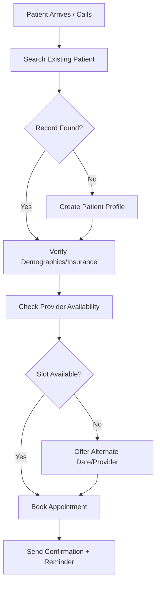
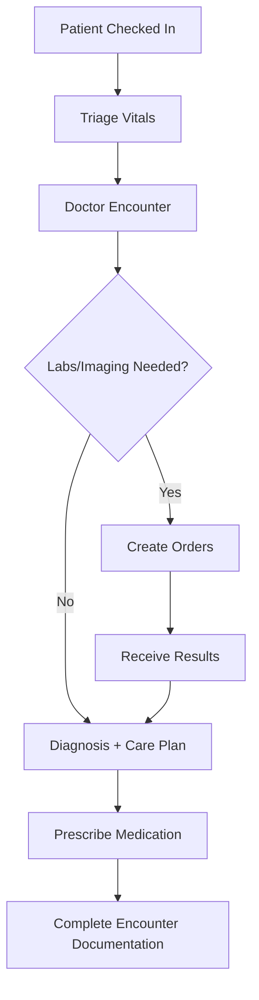
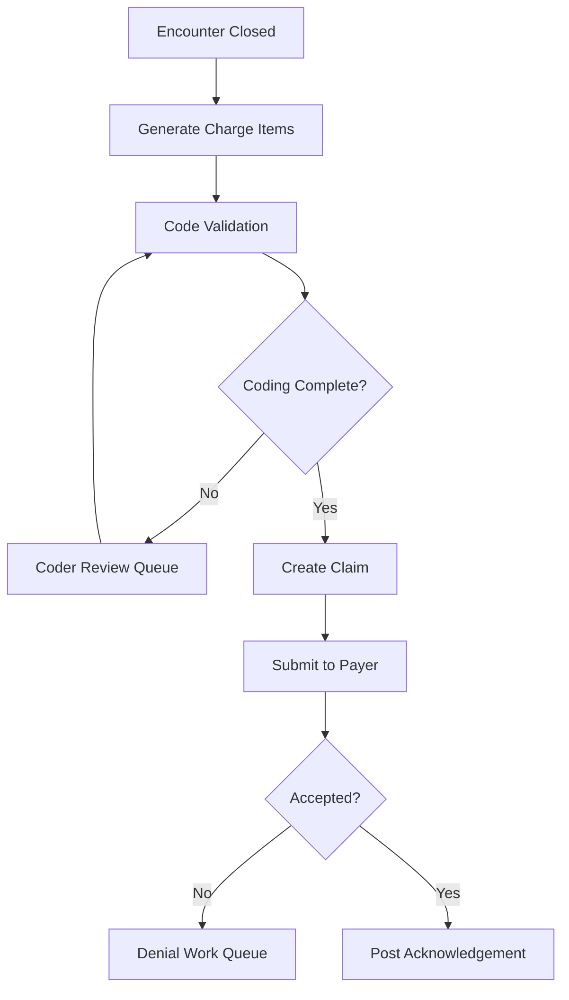

# Activity Diagrams

## Patient Registration and Appointment

```mermaid
flowchart TD
    A[Patient Arrives / Calls] --> B[Search Existing Patient]
    B --> C{Record Found?}
    C -- No --> D[Create Patient Profile]
    C -- Yes --> E[Verify Demographics/Insurance]
    D --> E
    E --> F[Check Provider Availability]
    F --> G{Slot Available?}
    G -- No --> H[Offer Alternate Date/Provider]
    G -- Yes --> I[Book Appointment]
    H --> I
    I --> J[Send Confirmation + Reminder]
```

## Encounter and Orders

```mermaid
flowchart TD
    A[Patient Checked In] --> B[Triage Vitals]
    B --> C[Doctor Encounter]
    C --> D{Labs/Imaging Needed?}
    D -- No --> E[Diagnosis + Care Plan]
    D -- Yes --> F[Create Orders]
    F --> G[Receive Results]
    G --> E
    E --> H[Prescribe Medication]
    H --> I[Complete Encounter Documentation]
```

## Claim Submission

```mermaid
flowchart TD
    A[Encounter Closed] --> B[Generate Charge Items]
    B --> C[Code Validation]
    C --> D{Coding Complete?}
    D -- No --> E[Coder Review Queue]
    E --> C
    D -- Yes --> F[Create Claim]
    F --> G[Submit to Payer]
    G --> H{Accepted?}
    H -- No --> I[Denial Work Queue]
    H -- Yes --> J[Post Acknowledgement]
```
