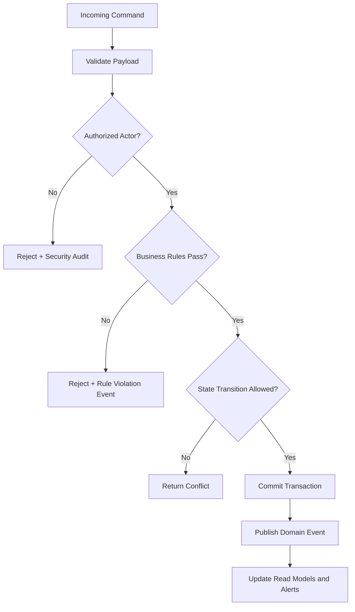
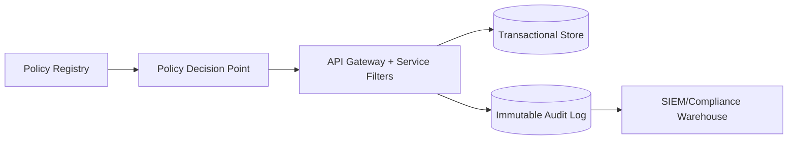

# Business Rules

This document defines enforceable policy rules for **Hospital Information System** so command processing, asynchronous jobs, and operational actions behave consistently under normal and exceptional conditions.

## Context
- Domain focus: hospital information workflows.
- Rule categories: lifecycle transitions, authorization, compliance, and resilience.
- Enforcement points: APIs, workflow/state engines, background processors, and administrative consoles.

## Enforceable Rules
1. Every state-changing command must pass authentication, authorization, and schema validation before processing.
2. Lifecycle transitions must follow the configured state graph; invalid transitions are rejected with explicit reason codes.
3. High-impact operations (financial, security, or regulated data actions) require additional approval evidence.
4. Manual overrides must include approver identity, rationale, and expiration timestamp.
5. Retries and compensations must be idempotent and must not create duplicate business effects.

## Rule Evaluation Pipeline

## Exception and Override Handling
- Overrides are restricted to approved exception classes and require dual logging (business + security audit).
- Override windows automatically expire and trigger follow-up verification tasks.
- Repeated override patterns are reviewed for policy redesign and automation improvements.

---

## Implementation-Ready Rule Semantics
### Rule Authoring Standard
| Field | Requirement | Example |
|---|---|---|
| `rule_id` | Stable immutable identifier | `BR-CLIN-014` |
| `policy_version` | SemVer and effective window | `3.2.0 (2026-04-01)` |
| `decision_mode` | `hard_stop`, `soft_warn`, `allow_with_justification` | `allow_with_justification` |
| `evidence_fields` | Required fields to audit decision | `actor_id, patient_id, purpose_of_use` |

### Enforcement Topology

### Non-Negotiable Control Tests
- Block deploy when policy tests for BR-01..BR-05 regress.
- Daily drift detection compares effective policies in runtime against signed registry bundle.
- Monthly sample audit confirms evidence completeness for high-risk operations.

## File-Specific Implementation Boundaries
This artifact is implementation-focused on **policy enforcement semantics, decision modes, and audit evidence requirements**. The boundaries below are specific to `analysis/business-rules.md` and are intentionally not reused as generic filler text.

| Boundary Slice | In Scope for this File | Out of Scope for this File | Implementation Consequence |
|---|---|---|---|
| Intake & Identity Analysis | Entry validation checkpoints and mismatch heuristics | UI widget design details | Data-quality metrics and EMPI false-positive rate |
| Clinical Flow Analysis | Encounter/order sequence timing and critical path dependencies | Persistence implementation details | Throughput, wait-time, and bottleneck reporting |
| Governance Analysis | Rule conformance and audit evidence completeness | Runtime policy engine internals | Compliance scorecards and control effectiveness trends |

## Business Rules to API/Data/Operational Controls (File-Specific)
| Rule Focus | API Enforcement Touchpoint | Data Model/Contract Tie-In | Operational Control |
|---|---|---|---|
| Preconditions for `business-rules` workflows must be validated before state mutation. | `GET /v1/analytics/operational-checkpoints` with explicit error taxonomy and correlation IDs. | `workflow_checkpoints, rule_decisions, observability_snapshots` with strict timestamp, actor, and tenant context fields. | Alert on rule-violation rate and route to owner with SLA-backed response. |
| Mutations must be replay-safe and duplicate-proof. | Idempotency checks on mutation endpoints and async consumers. | Uniqueness keys + immutable evidence rows for side-effect tracking. | Replay runbook with pre/post reconciliation and sign-off checklist. |
| Access to sensitive operations must include least-privilege and evidence. | AuthN/AuthZ middleware + policy decision point reason codes. | Audit/event envelopes include policy version and decision outcome. | Quarterly control review and continuous SIEM correlation for anomalies. |

## Interoperability Assumptions for `business-rules.md`
- Contract versions are explicitly pinned; backward compatibility is managed per versioned API/event schema.
- External dependencies are treated as failure-prone; timeout/retry budgets and fallback states are documented in this file's scenarios.
- Observability correlation (`tenant_id`, `actor_id`, `correlation_id`) is required for all critical-path operations in this document scope.

## Compliance and Security Posture for this Artifact
- Evidence produced by this workflow/design artifact is audit-consumable (who/what/when/why) and linked to incident/postmortem records.
- Sensitive data exposure is minimized using role-scoped access and redaction guidance relevant to `business-rules.md`.
- Operational controls for this file include detection, containment, recovery, and verification steps with named ownership.
