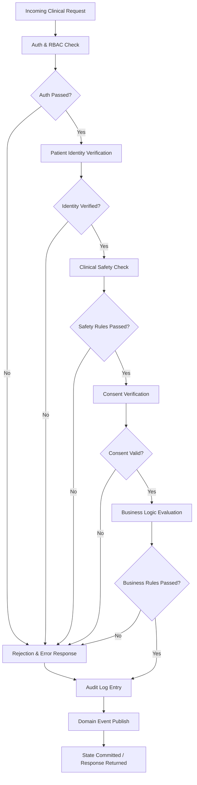

# Business Rules — Hospital Information System

---

| Field   | Value                                    |
|---------|------------------------------------------|
| Version | 1.0                                      |
| Status  | Approved                                 |
| Date    | 2025-07-14                               |
| Owner   | Clinical Informatics & Compliance Team   |

---

## Table of Contents

1. [Overview](#1-overview)
2. [Rule Evaluation Pipeline](#rule-evaluation-pipeline)
3. [Enforceable Rules](#enforceable-rules)
   - [BR-01 — Patient Identity Uniqueness](#br-01--patient-identity-uniqueness)
   - [BR-02 — Appointment Conflict Prevention](#br-02--appointment-conflict-prevention)
   - [BR-03 — Bed Allocation Rules](#br-03--bed-allocation-rules)
   - [BR-04 — Medication Safety — Allergy Check](#br-04--medication-safety--allergy-check)
   - [BR-05 — Prescription Authorization](#br-05--prescription-authorization)
   - [BR-06 — Lab Order Validation](#br-06--lab-order-validation)
   - [BR-07 — Clinical Note Sign-off](#br-07--clinical-note-sign-off)
   - [BR-08 — Discharge Clearance](#br-08--discharge-clearance)
   - [BR-09 — Insurance Pre-authorization](#br-09--insurance-pre-authorization)
   - [BR-10 — Billing Validation](#br-10--billing-validation)
   - [BR-11 — HIPAA Access Audit](#br-11--hipaa-access-audit)
   - [BR-12 — Consent Verification](#br-12--consent-verification)
   - [BR-13 — Critical Lab Value Alert](#br-13--critical-lab-value-alert)
   - [BR-14 — Controlled Substance Tracking](#br-14--controlled-substance-tracking)
   - [BR-15 — Surgery Safety Checklist](#br-15--surgery-safety-checklist)
4. [Exception and Override Handling](#exception-and-override-handling)
5. [Traceability Table](#5-traceability-table)

---

## Overview

Business rules in a Hospital Information System (HIS) represent the authoritative, codified expression of clinical policy, regulatory obligation, and institutional governance. These rules govern how the system responds to every significant event — from patient registration and scheduling through medication dispensing, surgical procedures, and final billing. Unlike software constraints that enforce data integrity alone, clinical business rules encode patient safety obligations derived from evidence-based medicine, accreditation standards (Joint Commission, NABH), and federal regulations including HIPAA Privacy and Security Rules (45 CFR Part 164), HL7 FHIR R4 interoperability requirements, and Centers for Medicare & Medicaid Services (CMS) Conditions of Participation. Each rule in this document has a direct regulatory or clinical safety lineage and is subject to periodic review by the Clinical Informatics & Compliance Team.

Enforcement of these rules occurs at multiple layers within the system architecture. At the API gateway layer, RBAC and ABAC policies screen incoming requests against role-to-permission mappings before any domain logic executes. Within domain services — PatientService, PharmacyService, LabService, BillingService, and others — business rule engines evaluate context-specific logic including allergy cross-reactivity, scheduling conflicts, and consent status. At the data layer, database-level constraints and triggers act as a last line of defence against invalid state transitions that might bypass application-level checks. Immutable audit logs capture the decision trace for every rule evaluation, forming the evidentiary record required by HIPAA §164.312(b) and enabling post-hoc compliance review, incident investigation, and quality-improvement analysis.

The relationship between clinical rules and system enforcement is intentional and bidirectional: clinical governance bodies author the policy intent, and the Clinical Informatics team translates that intent into machine-executable rule logic embedded in services and evaluated at runtime. This document serves as the single source of truth bridging the two concerns. All rule changes must pass through a change-control review that includes a clinical champion, a compliance officer, and an engineering lead before promotion to the production rule registry. Versioning follows semantic versioning conventions, and prior rule versions are retained in the policy archive for a minimum of six years in compliance with HIPAA retention requirements.

---

## Rule Evaluation Pipeline

Every clinical request — whether an order, a registration action, a scheduling event, or a billing submission — passes through a deterministic evaluation chain before any state mutation is committed. The pipeline is designed to fail fast at the earliest possible checkpoint, minimising unnecessary processing and ensuring that rejection reasons are specific, auditable, and actionable. Each stage in the pipeline produces a structured decision record that is appended to the immutable audit log regardless of outcome. The pipeline is synchronous for interactive requests and may be invoked asynchronously for batch operations such as overnight billing validation or pre-authorisation queue processing.



**Stage descriptions:**

| Stage | Responsibility | Failure Mode |
|---|---|---|
| Auth & RBAC Check | Validates JWT/session token, verifies role-permission mapping | 401 Unauthorized / 403 Forbidden |
| Patient Identity Verification | Confirms MRN exists, EMPI match confidence ≥ threshold | 404 Not Found / 409 Identity Conflict |
| Clinical Safety Check | Allergy, drug interaction, critical value, and WHO checklist gates | 422 Clinical Safety Violation |
| Consent Verification | Confirms written consent is current and not revoked | 451 Consent Required |
| Business Logic Evaluation | Domain-specific rules (scheduling, billing, lab ordering, etc.) | 422 Business Rule Violation |
| Audit Log Entry | Persists decision record to immutable log; runs regardless of outcome | Internal error logged; request NOT blocked |
| Domain Event Publish | Publishes outcome event to event bus for downstream consumers | Async retry; request not blocked on publish failure |

---

## Enforceable Rules

The following 15 rules are classified as **enforceable** — they are evaluated at runtime by designated enforcer services and will block or gate the requested action when violated. Each rule carries a decision mode: `hard_stop` (system blocks unconditionally), `override_with_reason` (authorised override with documented rationale is accepted), or `alert_only` (action proceeds but a compliance alert is raised). Rules marked `hard_stop` cannot be bypassed under any operational circumstance short of an emergency break-glass procedure (see Section 4).

---

### BR-01 — Patient Identity Uniqueness

**Category:** Master Data Management
**Enforcer:** PatientService / EMPI Engine
**Decision Mode:** `hard_stop`

Every patient in the HIS must be represented by exactly one master record. Duplicate patient records introduce severe patient safety risks including medication errors, missed allergies, and fragmented clinical history. The Enterprise Master Patient Index (EMPI) uses probabilistic matching algorithms across demographic fields (name, date of birth, sex, address, national identifier) to detect potential duplicates before a new record is created. When the matching confidence score meets or exceeds the configured threshold, the record creation is halted and routed to the Patient Identity Management team for manual adjudication.

**Rule Logic:**
```
FUNCTION validatePatientIdentity(patientData):
  // Step 1: MRN uniqueness
  IF EXISTS patient WHERE mrn = patientData.mrn AND facility_id = patientData.facility_id:
    RAISE DuplicateMRNException("MRN already in use for this facility")

  // Step 2: National ID checksum validation
  IF patientData.national_id IS NOT NULL:
    IF NOT luhn_check(patientData.national_id):
      RAISE InvalidNationalIDException("National ID failed checksum validation")

  // Step 3: EMPI probabilistic match
  candidates = empi.findCandidates(patientData, threshold=0.90)
  IF candidates.maxScore >= 0.90:
    route_to_manual_review(patientData, candidates)
    RAISE DuplicatePatientCandidateException("Potential duplicate — routed to manual review")

  RETURN ALLOW
```

**Exceptions:**
- Temporary MRNs assigned to unidentified emergency patients (John/Jane Doe) are exempt from national ID validation until patient identity is established.
- Retroactive EMPI merge of confirmed duplicates follows the Patient Merge Protocol and requires dual sign-off by Patient Identity Management and the attending physician of record.

---

### BR-02 — Appointment Conflict Prevention

**Category:** Scheduling
**Enforcer:** SchedulingService / Calendar Engine
**Decision Mode:** `hard_stop`

Double-booking a physician or a patient creates operational chaos, degrades patient experience, and can compromise care quality through rushed consultations. The scheduling engine maintains an immutable time-slot ledger per provider and per patient, and enforces minimum buffer intervals to allow for documentation and transition time. Operating room block schedules carry elevated priority; elective procedure slots cannot be created within a reserved OR block without explicit block-release authorisation from the OR manager.

**Rule Logic:**
```
FUNCTION validateAppointment(appointment):
  slotStart = appointment.start_time
  slotEnd   = appointment.end_time
  BUFFER    = 5 minutes

  // Doctor conflict check
  doctorSlots = getSlots(doctor_id=appointment.doctor_id,
                         window=[slotStart - BUFFER, slotEnd + BUFFER])
  IF doctorSlots.any(active):
    RAISE SchedulingConflictException("Provider has overlapping appointment within buffer window")

  // Patient conflict check
  patientSlots = getSlots(patient_id=appointment.patient_id,
                          window=[slotStart, slotEnd])
  IF patientSlots.any(active):
    RAISE SchedulingConflictException("Patient already has an appointment in this time slot")

  // OR block priority check
  IF appointment.resource_type == "OPERATING_ROOM":
    block = getORBlock(room_id=appointment.room_id, time=slotStart)
    IF block EXISTS AND block.status == "RESERVED" AND appointment.priority != "BLOCK_RELEASE":
      RAISE ORBlockReservedException("Operating room is in reserved block; requires block-release authorisation")

  RETURN ALLOW
```

**Exceptions:**
- Overlapping telemedicine consultations for different conditions may be permitted with explicit patient consent documented in the scheduling record.
- Emergency surgical cases override OR block scheduling with automatic escalation notification to the OR manager.

---

### BR-03 — Bed Allocation Rules

**Category:** Capacity Management
**Enforcer:** BedManagementService
**Decision Mode:** `hard_stop` (over 100%); `override_with_reason` (95–99%)

Bed allocation is a fundamental patient safety control. Assigning two patients to the same bed is categorically prohibited. Ward capacity thresholds are enforced to preserve care quality and nursing ratios; a soft-limit alert at 95% allows nurse managers to take proactive action such as expediting pending discharges or activating surge capacity plans. Isolation bed designations are a patient safety and infection-control requirement — they must not be reallocated to non-isolated patients without an Infection Control Officer (ICO) override.

**Rule Logic:**
```
FUNCTION allocateBed(admission):
  bed = getBed(bed_id=admission.bed_id)

  IF bed.status != "AVAILABLE":
    RAISE BedNotAvailableException("Bed is not in AVAILABLE status (current: " + bed.status + ")")

  ward = getWard(ward_id=bed.ward_id)
  occupancyRate = ward.current_occupied / ward.total_capacity

  IF occupancyRate >= 1.00:
    RAISE WardAtCapacityException("Ward is at 100% capacity — hard stop on admission")

  IF occupancyRate >= 0.95:
    EMIT WardCapacityAlert(ward_id=ward.id, rate=occupancyRate)
    // Proceed with soft warning; nurse manager notified

  IF bed.type == "ISOLATION" AND admission.infection_status NOT IN ["CONFIRMED", "PENDING_ISOLATION"]:
    RAISE IsolationBedReservedException("Isolation beds are reserved for confirmed or suspected infection cases")

  IF admission.infection_status IN ["CONFIRMED", "PENDING_ISOLATION"] AND bed.type != "ISOLATION":
    RAISE IsolationRequiredException("Patient with active infection must be assigned to isolation bed")

  RETURN ALLOW
```

**Exceptions:**
- During declared mass-casualty incidents, surge capacity protocols supersede the 95% soft limit, with mandatory escalation to hospital administration.

---

### BR-04 — Medication Safety — Allergy Check

**Category:** Clinical Safety — Pharmacy
**Enforcer:** PharmacyService / ClinicalDecisionSupport
**Decision Mode:** `hard_stop` (life_threatening); `override_with_reason` (severe)

Allergy checking is one of the highest-priority patient safety checks in medication management. The system maintains a complete allergy and adverse drug reaction (ADR) profile for each patient, cross-referenced against a curated drug-allergy and drug-cross-reactivity knowledge base. The cross-reactivity matrix captures structurally similar drug classes where allergy to one agent implies a meaningful risk with related agents (e.g., penicillin allergy and cephalosporin cross-reactivity). Severity classification drives the enforcement mode: life-threatening reactions are an unconditional hard stop; severe reactions require pharmacist override with documented clinical rationale.

**Rule Logic:**
```
FUNCTION checkMedicationAllergy(patientId, medication):
  allergies = getAllergies(patient_id=patientId, status="ACTIVE")

  FOR EACH allergy IN allergies:
    // Direct allergy match
    IF medication.drug_code == allergy.drug_code OR
       medication.drug_class == allergy.drug_class:
      IF allergy.severity == "LIFE_THREATENING":
        RAISE AllergyHardStopException("Life-threatening allergy on record — dispensing blocked")
      IF allergy.severity == "SEVERE":
        REQUIRE pharmacist_override(reason, override_id)
        LOG override_event(actor, patient, medication, allergy, reason)
        RETURN ALLOW_WITH_OVERRIDE

    // Cross-reactivity matrix check
    crossReactive = crossReactivityMatrix.lookup(allergy.drug_class, medication.drug_class)
    IF crossReactive.risk_level IN ["HIGH", "MODERATE"]:
      IF allergy.severity == "LIFE_THREATENING":
        RAISE CrossReactivityHardStopException("Cross-reactive agent — life-threatening allergy class")
      EMIT CrossReactivityAlert(level=crossReactive.risk_level)

  RETURN ALLOW
```

**Exceptions:**
- Desensitisation protocols ordered by an allergist override the hard-stop mechanism with dual sign-off (allergist + CMO) documented in the protocol order.

---

### BR-05 — Prescription Authorization

**Category:** Clinical Authorisation — Pharmacy
**Enforcer:** PharmacyService / LicensingService
**Decision Mode:** `hard_stop`

Prescribing authority is a legally regulated capability. Only licensed physicians, and in some jurisdictions advanced practice nurses and physician assistants within their scope of practice, may generate legally valid prescriptions. The system validates the prescriber's active medical license against the state licensing board integration before allowing prescription creation. Controlled substances carry additional federal regulatory requirements under the Controlled Substances Act; DEA registration must be verified and the specific Schedule restriction respected for expiry windows.

**Rule Logic:**
```
FUNCTION authorisePrescription(prescriber, prescription):
  // License validation
  license = getLicense(provider_id=prescriber.id)
  IF license IS NULL OR license.status != "ACTIVE":
    RAISE UnlicensedPrescriberException("Provider does not hold an active prescribing license")
  IF license.expiry_date < TODAY:
    RAISE ExpiredLicenseException("Provider license has expired")

  // Role check
  IF prescriber.role NOT IN ["DOCTOR", "NP_PRESCRIBING", "PA_PRESCRIBING"]:
    RAISE UnauthorisedRoleException("Role does not have prescribing authority")

  // Controlled substance DEA check
  IF prescription.dea_schedule IN ["II", "III", "IV", "V"]:
    dea = getDEARegistration(provider_id=prescriber.id)
    IF dea IS NULL OR dea.status != "ACTIVE":
      RAISE DEARegistrationRequiredException("DEA registration required for Schedule " + prescription.dea_schedule)

  // Expiry window enforcement
  IF prescription.dea_schedule == "II":
    prescription.expiry_date = prescription.created_at + 30 days
  ELSE:
    prescription.expiry_date = prescription.created_at + 180 days

  RETURN ALLOW
```

**Exceptions:**
- Verbal orders in emergency situations are permissible but must be countersigned by the ordering physician within 24 hours per Joint Commission standard RC.02.01.01.
- Prescriptions created under standing order protocols must reference the approved protocol ID and authorising committee resolution number.

---

### BR-06 — Lab Order Validation

**Category:** Clinical Ordering — Laboratory
**Enforcer:** LaboratoryService / ClinicalDecisionSupport
**Decision Mode:** `hard_stop` (license/LOINC); `override_with_reason` (duplicate)

Laboratory orders must be clinically justified, technically valid, and appropriate for the patient's demographic profile. Requiring LOINC codes standardises order semantics and enables downstream interoperability with reference lab systems, public health reporting interfaces, and the HL7 FHIR DiagnosticReport resource. Age- and sex-specific validity rules prevent clinically nonsensical orders and reduce unnecessary testing, which has both cost and patient experience implications. Duplicate order detection prompts the ordering clinician to confirm clinical necessity rather than creating reflexive repeat orders.

**Rule Logic:**
```
FUNCTION validateLabOrder(order, patient):
  // Ordering provider license
  license = getLicense(provider_id=order.ordering_physician_id)
  IF license IS NULL OR license.status != "ACTIVE":
    RAISE UnlicensedOrderException("Ordering physician does not hold an active license")

  // LOINC code required
  IF order.loinc_code IS NULL OR NOT isValidLOINC(order.loinc_code):
    RAISE InvalidLOINCException("All lab orders require a valid LOINC code")

  // Age/sex specific validation
  testSpec = getTestSpec(loinc_code=order.loinc_code)
  IF testSpec.min_age IS NOT NULL AND patient.age < testSpec.min_age:
    RAISE AgeRestrictionException("Test not indicated for patient age " + patient.age)
  IF testSpec.sex_restriction IS NOT NULL AND patient.sex != testSpec.sex_restriction:
    RAISE SexRestrictionException("Test restricted to " + testSpec.sex_restriction + " patients")

  // Duplicate order check (24-hour window)
  recentOrders = getOrders(patient_id=patient.id, loinc_code=order.loinc_code,
                           since=NOW - 24h, status=["ACTIVE","COMPLETED"])
  IF recentOrders.count > 0:
    REQUIRE clinical_justification(text, min_length=20)

  RETURN ALLOW
```

**Exceptions:**
- Serial monitoring orders (e.g., Q4h troponin for NSTEMI rule-out, serial lactate in sepsis management) are exempt from the 24-hour duplicate check when the ordering template specifies a recognised serial protocol code.
- Reference lab orders for send-out tests follow individual lab-agreement terms which may supersede internal LOINC mapping requirements.

---

### BR-07 — Clinical Note Sign-off

**Category:** Documentation Compliance
**Enforcer:** ClinicalDocumentationService / ComplianceScheduler
**Decision Mode:** `alert_only` (initial breach); compliance escalation at 48 h

Clinical notes are the legal and clinical record of care. Unsigned notes may not be used as the basis for clinical decision-making by other providers, cannot be billed against, and do not satisfy Joint Commission documentation standards. The system automatically tracks sign-off status and triggers escalating notifications to ensure timely completion. Resident notes carry an additional supervisory co-signature requirement reflecting the training relationship and attendant accountability structure.

**Rule Logic:**
```
FUNCTION enforceNoteSignOff(note):
  hoursElapsed = (NOW - note.created_at).hours

  // Primary sign-off deadline
  IF note.status == "UNSIGNED" AND hoursElapsed >= 24:
    EMIT ComplianceAlert(note_id=note.id, actor=note.author,
                         type="UNSIGNED_NOTE_24H", severity="MEDIUM")
    notification.send(to=note.author, channel=["APP","EMAIL"], urgency="HIGH")

  // Resident co-signature deadline
  IF note.author.role == "RESIDENT":
    IF note.cosignature_status == "PENDING" AND hoursElapsed >= 48:
      EMIT ComplianceAlert(note_id=note.id, actor=note.attending,
                           type="COSIGNATURE_OVERDUE_48H", severity="HIGH")
      notification.send(to=note.attending, channel=["APP","EMAIL","PAGER"], urgency="URGENT")
      notification.send(to=note.attending.department_chief, channel=["EMAIL"])

  // Hard block on billing for unsigned notes
  IF note.status == "UNSIGNED":
    BLOCK billing_submission WHERE encounter_id = note.encounter_id

  RETURN NOTE_STATUS
```

**Exceptions:**
- Notes created on behalf of a deceased or incapacitated provider may be authenticated by the designated successor with Medical Records approval.
- Automatic sign-off via voice recognition attestation is accepted when the EHR vendor's attestation module meets Joint Commission authentication standards.

---

### BR-08 — Discharge Clearance

**Category:** Patient Flow — Discharge
**Enforcer:** DischargeService / ClinicalWorkflowEngine
**Decision Mode:** `hard_stop` (missing elements block discharge order activation)

Premature discharge without clinical reconciliation creates adverse event risk. Unreviewed critical lab results, unresolved medication discrepancies, and absent discharge summaries are among the leading contributors to post-discharge complications and preventable readmissions. The discharge clearance rule implements a structured gate that ensures all required clinical and administrative elements are complete before the system activates the discharge order and initiates downstream processes such as bed release and transport coordination.

**Rule Logic:**
```
FUNCTION validateDischargeReadiness(encounter):
  clearance = DischargeChecklist()

  // Medication reconciliation
  pendingMedOrders = getMedOrders(encounter_id=encounter.id, status="ACTIVE")
  IF pendingMedOrders.count > 0:
    clearance.fail("PENDING_MEDICATION_ORDERS", count=pendingMedOrders.count)

  // Discharge summary
  dischargeSummary = getDocument(encounter_id=encounter.id, type="DISCHARGE_SUMMARY")
  IF dischargeSummary IS NULL OR dischargeSummary.status != "SIGNED":
    clearance.fail("DISCHARGE_SUMMARY_MISSING_OR_UNSIGNED")

  // Outstanding lab results
  pendingLabs = getLabResults(encounter_id=encounter.id, status=["PENDING","IN_PROGRESS"])
  IF pendingLabs.any(criticality="CRITICAL"):
    clearance.fail("CRITICAL_LAB_RESULTS_PENDING")

  // Pending consults
  pendingConsults = getConsults(encounter_id=encounter.id, status="PENDING")
  IF pendingConsults.count > 0:
    clearance.fail("UNACKNOWLEDGED_CONSULTS", count=pendingConsults.count)

  // Diagnosis coding
  diagnoses = getDiagnoses(encounter_id=encounter.id)
  IF NOT diagnoses.has_primary_icd10():
    clearance.fail("FINAL_DIAGNOSIS_CODE_MISSING")

  IF clearance.hasFailed():
    RAISE DischargeBlockedException(clearance.failures)

  RETURN ALLOW
```

**Exceptions:**
- Patients who leave against medical advice (AMA) trigger an AMA documentation workflow; full discharge clearance is suspended in favour of the AMA protocol.
- Deceased patients follow the post-mortem documentation pathway, which has separate completion requirements administered by Medical Records.

---

### BR-09 — Insurance Pre-authorization

**Category:** Revenue Cycle — Pre-authorisation
**Enforcer:** RCMService / PriorAuthEngine
**Decision Mode:** `hard_stop` (elective); `alert_only` (emergency with retroactive requirement)

Failure to obtain required insurance pre-authorisation before a procedure results in claim denial, potential write-off, and patient financial liability. The pre-auth engine maintains a payer-specific required-authorisation list, supplemented by a charge threshold rule for procedures above the $500 cost threshold. Emergency procedures are exempt from the pre-auth gate to avoid clinical delay, but the system automatically generates a retroactive authorisation task with a 48-hour SLA to protect reimbursement.

**Rule Logic:**
```
FUNCTION validatePreAuthorisation(procedure, encounter):
  payer = getActivePayer(patient_id=encounter.patient_id)

  requiresAuth = preAuthList.contains(procedure.cpt_code, payer.payer_id) OR
                 procedure.estimated_cost > 500.00

  IF NOT requiresAuth:
    RETURN ALLOW

  // Emergency bypass
  IF encounter.encounter_type == "EMERGENCY":
    createRetroAuthTask(procedure, encounter, sla_hours=48)
    EMIT EmergencyProcedureNoAuthAlert(procedure_id=procedure.id, payer_id=payer.payer_id)
    RETURN ALLOW_EMERGENCY

  // Check for approved auth
  auth = getPreAuth(procedure.cpt_code, payer.payer_id, patient_id=encounter.patient_id,
                    status="APPROVED", valid_on=procedure.scheduled_date)
  IF auth IS NULL:
    RAISE PreAuthRequiredException("Procedure requires payer pre-authorisation before scheduling",
                                   cpt_code=procedure.cpt_code, payer=payer.name)

  IF auth.expiry_date < procedure.scheduled_date:
    RAISE PreAuthExpiredException("Pre-authorisation has expired; renewal required")

  RETURN ALLOW
```

**Exceptions:**
- In-network procedures for payers with blanket authorisation agreements (documented in the payer contract registry) are exempt.
- Retroactive auth requests not resolved within 48 hours are automatically escalated to the Revenue Cycle Manager with the claim at-risk flag.

---

### BR-10 — Billing Validation

**Category:** Revenue Cycle — Billing
**Enforcer:** BillingService / CodeValidationEngine
**Decision Mode:** `hard_stop`

Billing accuracy is both a revenue protection and a compliance imperative. Incorrect CPT or ICD-10 coding exposes the organisation to CMS audit findings, False Claims Act liability, and OIG scrutiny. The billing validation rule enforces a multi-layered check before any charge can be posted to the payer claim. Evaluation and Management (E&M) level validation cross-references the documented complexity elements against the reported E&M code to guard against upcoding. The 30-day post-discharge billing window enforces the organisation's charge-lag policy and prevents late charges from disrupting closed billing periods.

**Rule Logic:**
```
FUNCTION validateBillingCharge(charge):
  encounter = getEncounter(encounter_id=charge.encounter_id)

  // Encounter linkage
  IF encounter IS NULL OR encounter.status NOT IN ["ACTIVE","DISCHARGED_BILLING_OPEN"]:
    RAISE InvalidEncounterException("Charge must link to an active or billing-open encounter")

  // CPT code validation
  IF NOT cmsFeeschedule.isValid(charge.cpt_code, service_date=charge.service_date):
    RAISE InvalidCPTCodeException("CPT code not found in CMS fee schedule for service date")

  // ICD-10 diagnosis linkage
  diagnosis = getDiagnosis(encounter_id=encounter.id, icd10_code=charge.icd10_code)
  IF diagnosis IS NULL:
    RAISE DiagnosisNotInEncounterException("ICD-10 code does not appear in encounter diagnosis list")

  // E&M level complexity check
  IF charge.cpt_code IN EM_CODES:
    documentedComplexity = encounter.getDocumentedEMComplexity()
    IF EM_LEVEL_MAP[charge.cpt_code] > documentedComplexity:
      RAISE EMUpcodeException("Reported E&M level exceeds documented complexity")

  // Charge-lag window
  IF encounter.status == "DISCHARGED":
    daysSinceDischarge = (TODAY - encounter.discharge_date).days
    IF daysSinceDischarge > 30:
      RAISE ChargelagViolationException("Cannot post charge to encounter discharged >30 days ago")

  RETURN ALLOW
```

**Exceptions:**
- Late-charge exceptions requiring posting beyond the 30-day window require Revenue Cycle Director approval with documented extenuating circumstances logged in the charge exception register.

---

### BR-11 — HIPAA Access Audit

**Category:** Security & Privacy — Compliance
**Enforcer:** AuditService / PHIAccessInterceptor
**Decision Mode:** `hard_stop` (if audit subsystem is unavailable, PHI access is blocked per fail-secure policy)

HIPAA Security Rule §164.312(b) mandates audit controls that record and examine activity in information systems containing PHI. The HIS implements a comprehensive PHI access interceptor at the service mesh layer, ensuring that every read, write, update, or delete operation on patient-identifiable data produces an immutable audit record. The audit record must capture sufficient context to support forensic investigation, breach notification assessment, and the minimum-necessary access principle audit required by the Privacy Rule.

**Rule Logic:**
```
FUNCTION auditPHIAccess(request, response):
  // Fail-secure: if audit subsystem unavailable, block request
  IF NOT auditService.isHealthy():
    RAISE AuditSubsystemUnavailableException("PHI access blocked — audit subsystem is not available")

  auditRecord = {
    actor_id:       request.authenticated_user.id,
    actor_role:     request.authenticated_user.role,
    patient_id:     request.patient_id,
    resource_type:  request.resource_type,      // e.g. "MedicationOrder", "LabResult"
    resource_id:    request.resource_id,
    action:         request.http_method,         // READ / WRITE / UPDATE / DELETE
    purpose_code:   request.purpose_of_use,      // TPO / RESEARCH / LEGAL / EMERGENCY
    timestamp:      NOW (UTC),
    ip_address:     request.client_ip,
    session_id:     request.session_id,
    outcome:        response.status_code
  }

  auditService.persist(auditRecord, retention_years=6)
  IF request.purpose_of_use == "RESEARCH":
    irbService.logDataAccess(auditRecord)

  RETURN PROCEED
```

**Exceptions:**
- System-generated batch processes (e.g., overnight HL7 feed to HIE) use a service-account actor_id and must have a registered service-account purpose code.
- Audit log retention of 6 years applies uniformly; records pertaining to minors must be retained until the patient reaches age 21 or 6 years post-access, whichever is later.

---

### BR-12 — Consent Verification

**Category:** Patient Rights — Consent Management
**Enforcer:** ConsentService / ClinicalProcedureGateway
**Decision Mode:** `hard_stop`

Informed consent is a cornerstone of medical ethics and a legal prerequisite for invasive procedures, experimental treatment, and the use of patient data beyond routine treatment, payment, and operations (TPO). The consent service maintains a longitudinal consent registry for each patient, tracking the scope, version, execution date, and revocation status of each consent document. Revocable consent types (research participation, data sharing) are checked at the time of the action, not just at enrolment, to respect the patient's ongoing right to withdraw.

**Rule Logic:**
```
FUNCTION verifyConsent(patient, procedure):
  consentMap = {
    "SURGICAL_PROCEDURE":    "SURGICAL_CONSENT",
    "ANESTHESIA":            "ANESTHESIA_CONSENT",
    "BLOOD_TRANSFUSION":     "BLOOD_PRODUCT_CONSENT",
    "EXPERIMENTAL_TREATMENT":"RESEARCH_CONSENT",
    "RESEARCH_PARTICIPATION":"RESEARCH_CONSENT",
    "DATA_SHARING_THIRD_PARTY":"DATA_SHARING_CONSENT"
  }

  requiredConsentType = consentMap.get(procedure.type)
  IF requiredConsentType IS NULL:
    RETURN ALLOW  // No consent gate for this procedure type

  consent = getConsent(patient_id=patient.id,
                        consent_type=requiredConsentType,
                        status="ACTIVE",
                        not_revoked=TRUE)
  IF consent IS NULL:
    RAISE ConsentNotFoundException("Required consent not on file: " + requiredConsentType)

  IF consent.version < consentLibrary.current_version(requiredConsentType):
    RAISE ConsentOutdatedException("Consent document is outdated; patient must re-sign current version")

  IF consent.scope DOES NOT COVER procedure.sub_type:
    RAISE ConsentScopeMismatchException("Consent scope does not cover the specific procedure variant")

  RETURN ALLOW
```

**Exceptions:**
- Emergency consent doctrine applies when the patient is incapacitated and a life-threatening condition exists; the attending must document the emergency consent justification in the encounter note.
- Implied consent for routine clinical care (vital signs, routine venipuncture) does not require a formal written consent document.

---

### BR-13 — Critical Lab Value Alert

**Category:** Clinical Safety — Laboratory
**Enforcer:** LaboratoryService / AlertRoutingService
**Decision Mode:** `hard_stop` on acknowledgement gate (result cannot be filed as "reviewed" until acknowledged)

Critical lab values represent immediately life-threatening physiological derangements. The timely communication of these results to the responsible clinician is mandated by CLIA regulations, Joint Commission NPSG.02.03.01, and institutional policy. The alert routing service implements a two-tier escalation: primary notification to the ordering physician followed by escalation to the attending if no acknowledgement is received within 30 minutes. All notification attempts and acknowledgements are documented in the patient's longitudinal care record.

**Rule Logic:**
```
FUNCTION handleCriticalLabValue(result):
  criticalRanges = getCriticalRangeDefinitions(loinc_code=result.loinc_code)
  isCritical = criticalRanges.evaluate(result.value, result.units)

  IF NOT isCritical:
    RETURN NORMAL_RESULT_FLOW

  alertRecord = createCriticalAlert(result, created_at=NOW)

  // Tier 1: Notify ordering physician
  notification.send(to=result.ordering_physician_id,
                    channel=["APP","PAGER","PHONE"], urgency="CRITICAL",
                    message=formatCriticalAlert(result))
  scheduleEscalation(alert_id=alertRecord.id, delay_minutes=30)

  // Tier 2 escalation (if no ack in 30 min)
  ON escalation_trigger(alert_id=alertRecord.id):
    IF alertRecord.acknowledgement_status == "PENDING":
      attending = getAttending(patient_id=result.patient_id)
      notification.send(to=attending.id,
                        channel=["APP","PAGER","PHONE"], urgency="CRITICAL")
      documentEscalation(alert_id=alertRecord.id, escalated_to=attending.id)

  // Block result status transition until acknowledged
  result.status = "CRITICAL_PENDING_ACK"
  result.canTransitionTo("REVIEWED") REQUIRES alertRecord.acknowledgement_status == "ACKNOWLEDGED"

  RETURN CRITICAL_ALERT_ISSUED
```

**Exceptions:**
- If the ordering physician is unavailable (on leave, no longer employed), the alert routes directly to the patient's covering provider as identified in the on-call schedule.

---

### BR-14 — Controlled Substance Tracking

**Category:** Regulatory Compliance — Pharmacy / DEA
**Enforcer:** PharmacyService / ControlledSubstanceTracker
**Decision Mode:** `hard_stop`

DEA Schedule II controlled substances (e.g., opioids, amphetamines) are subject to the highest level of regulatory scrutiny under the Controlled Substances Act. Dual sign-off requirements reduce the risk of diversion; perpetual inventory tracking enables real-time reconciliation; and mandatory chain-of-custody documentation creates an auditable record suitable for DEA inspection, state pharmacy board review, and internal diversion investigation. Discrepancy reporting thresholds are deliberately strict to surface potential diversion before patterns become entrenched.

**Rule Logic:**
```
FUNCTION dispenseControlledSubstance(dispensingEvent):
  drug = getDrug(drug_id=dispensingEvent.drug_id)

  IF drug.dea_schedule NOT IN ["II", "III", "IV", "V"]:
    RETURN STANDARD_DISPENSING_FLOW

  // Schedule II: mandatory dual sign-off
  IF drug.dea_schedule == "II":
    IF dispensingEvent.pharmacist_signature IS NULL:
      RAISE DualSignOffRequiredException("Pharmacist signature required for Schedule II dispensing")
    IF dispensingEvent.nurse_signature IS NULL:
      RAISE DualSignOffRequiredException("Nurse witness signature required for Schedule II dispensing")

  // Perpetual inventory update
  inventory = getInventory(drug_id=drug.id, unit=dispensingEvent.dispensing_unit)
  inventory.decrement(dispensingEvent.quantity)
  logChainOfCustody(drug_id=drug.id, from_actor=dispensingEvent.pharmacist_id,
                    to_actor=dispensingEvent.nurse_id, quantity=dispensingEvent.quantity,
                    timestamp=NOW, patient_id=dispensingEvent.patient_id)

  // Shift reconciliation check
  shiftInventory = getShiftInventory(drug_id=drug.id, shift=getCurrentShift())
  discrepancy = shiftInventory.expected_count - shiftInventory.physical_count
  IF ABS(discrepancy) > 1:
    EMIT ControlledSubstanceDiscrepancyAlert(drug_id=drug.id, discrepancy=discrepancy,
                                              reported_at=NOW)
    notify(pharmacy_director, compliance_officer, channel=["EMAIL","APP"], urgency="HIGH")

  RETURN ALLOW
```

**Exceptions:**
- Automated dispensing cabinet (ADC) override access for emergency situations (e.g., code blue) triggers an immediate reconciliation task and mandatory review by the Pharmacy Director within 2 hours.
- Wastage of partially used controlled substance vials requires dual witness signature and documentation of volume wasted.

---

### BR-15 — Surgery Safety Checklist

**Category:** Clinical Safety — Perioperative
**Enforcer:** PerioperativeService / SurgicalSafetyEngine
**Decision Mode:** `hard_stop` (Time Out must be completed before incision proceeds)

The WHO Surgical Safety Checklist has been demonstrated to reduce surgical mortality and complication rates by over 30% in landmark studies. The three-phase checklist structure — Sign In, Time Out, Sign Out — maps to critical perioperative risk windows. The Time Out phase, performed immediately before the first incision, is the single most critical checkpoint: wrong-site surgery, wrong-patient surgery, and wrong-procedure surgery are all preventable through correct execution. The system enforces electronic completion and locks the surgical case record to prevent circumvention.

**Rule Logic:**
```
FUNCTION enforceSurgicalSafetyChecklist(surgicalCase, phase):
  checklist = getChecklist(case_id=surgicalCase.id, phase=phase)

  checklistRequirements = {
    "SIGN_IN": ["patient_identity_confirmed", "site_marked", "anesthesia_check_complete",
                "pulse_oximeter_present", "known_allergies_reviewed",
                "difficult_airway_risk_assessed", "blood_loss_risk_assessed"],
    "TIME_OUT": ["all_team_introduced", "patient_name_confirmed", "procedure_confirmed",
                  "surgical_site_confirmed", "implants_available", "antibiotic_prophylaxis_confirmed",
                  "imaging_displayed"],
    "SIGN_OUT": ["procedure_recorded", "instrument_count_correct", "specimen_labelled",
                  "equipment_issues_noted", "recovery_plan_communicated"]
  }

  FOR EACH item IN checklistRequirements[phase]:
    IF checklist.getItem(item).status != "CONFIRMED":
      IF phase == "TIME_OUT":
        RAISE TimeOutIncompleteException("TIME OUT not complete — surgery cannot proceed. Item: " + item)
      ELSE:
        EMIT ChecklistIncompleteWarning(case_id=surgicalCase.id, phase=phase, item=item)

  checklist.markCompleted(completed_by=request.actor_id, timestamp=NOW)
  LOG checklist_completion(case_id=surgicalCase.id, phase=phase, actor=request.actor_id)

  RETURN ALLOW
```

**Exceptions:**
- Extreme emergency surgical cases (e.g., ruptured aortic aneurysm with immediate haemodynamic compromise) may proceed with a verbal abbreviated Time Out; full documentation must be completed retrospectively within 1 hour and reviewed by the Quality & Patient Safety department.

---

## Exception and Override Handling

### 4.1 Override Request Process

Not all business rule violations represent absolute contraindications; some represent conditions that, when accompanied by sufficient clinical justification and appropriate authorisation, may be overridden. The override request process ensures that such exceptions are deliberate, documented, time-limited, and subject to retrospective review. An override is never granted silently — every override is a visible act in the audit record.

When a rule returns `override_with_reason` (rather than `hard_stop`), the requesting clinician is presented with an override dialog that requires:

1. **Reason code** — selected from a controlled vocabulary (e.g., `CLINICAL_NECESSITY`, `PATIENT_PREFERENCE_DOCUMENTED`, `ALLERGIST_DESENSITISATION_PROTOCOL`)
2. **Free-text rationale** — minimum 50 characters explaining the specific clinical circumstances
3. **Acknowledgement** — explicit digital attestation that the clinician has reviewed the rule violation and accepts clinical responsibility

### 4.2 Dual Approval Requirements

The following rule categories require a second approver before the override is activated:

| Rule | Primary Approver | Secondary Approver |
|---|---|---|
| BR-04 (life-threatening allergy — desensitisation protocol) | Allergist | Chief Medical Officer |
| BR-05 (verbal controlled substance prescription) | Ordering Physician | Pharmacist-in-Charge |
| BR-14 (ADC emergency override) | Requesting Nurse | Pharmacy Director |
| BR-03 (surge capacity — 95%+ occupancy) | Nurse Manager | Hospital Administrator |
| BR-12 (emergency consent doctrine) | Attending Physician | (self-documented; reviewed by Risk Management within 24h) |

### 4.3 Override Logging

Every override event is persisted to the immutable override audit table with the following fields:

| Field | Description |
|---|---|
| `override_id` | Globally unique override reference (UUID v4) |
| `rule_id` | BR identifier of the overridden rule |
| `actor_id` | Clinician requesting the override |
| `approver_id` | Secondary approver (if dual-approval required) |
| `patient_id` | Affected patient |
| `encounter_id` | Associated encounter |
| `reason_code` | Controlled vocabulary reason code |
| `rationale_text` | Free-text clinical justification |
| `override_granted_at` | ISO 8601 UTC timestamp |
| `override_expires_at` | Automatic expiry timestamp |
| `ip_address` | Requesting terminal IP |
| `session_id` | Active session reference |

### 4.4 Time-Limited Overrides

All overrides are time-limited to prevent "temporary" exceptions from becoming permanent policy bypasses:

- **Clinical safety overrides** (BR-03, BR-04, BR-12): maximum 24 hours
- **Administrative overrides** (BR-09, BR-10 late-charge exception): maximum 72 hours
- **Research data access overrides** (BR-11 purpose-code extension): aligned to IRB approval window, maximum 90 days
- **Emergency break-glass overrides**: maximum 8 hours; automatic expiry triggers system notification to CISO and CMO

At expiry, the override is automatically deactivated. If the underlying condition persists, a new override must be requested and approved through the full process.

### 4.5 Break-Glass Emergency Override

The break-glass procedure grants a temporary, elevated-access override for genuine clinical emergencies where the standard override workflow would cause unacceptable clinical delay. Break-glass access is:

- **Triggered by:** the treating clinician activating the "Emergency Access" control in the patient chart
- **Logged immediately:** all break-glass events are logged in real time and pushed to the CISO on-call queue and the CMO pager
- **Scope:** restricted to the specific patient's PHI and clinical records
- **Duration:** maximum 8 hours; auto-expiry with SMS notification to the activating clinician
- **Post-event review:** every break-glass event is reviewed within 24 hours by the Privacy Officer and the CMO; unjustified use is treated as a Policy Violation and subject to disciplinary review

Break-glass does **not** override `hard_stop` rules such as BR-15 Time Out completion or BR-04 life-threatening allergy blocks. These rules are absolute patient safety controls.

### 4.6 Retrospective Audit and Pattern Review

The Compliance team runs a monthly override report covering:
- Total overrides by rule, department, and clinician
- Dual-approval compliance rate
- Override reason code distribution
- Overrides that resulted in adverse events (correlated with incident reports)
- Rules with persistently high override rates — candidates for policy redesign

Rules generating more than 10 overrides per month trigger a mandatory clinical policy review with the sponsoring department's Medical Director.

---

## Traceability Table

| BR-ID | Rule Name | Related Use Case | Functional Requirement | Enforcer Service | Compliance Standard |
|---|---|---|---|---|---|
| BR-01 | Patient Identity Uniqueness | UC-PATIENT-01 | FR-PAT-001 | PatientService / EMPI | HIPAA §164.514(b); HL7 FHIR Patient resource |
| BR-02 | Appointment Conflict Prevention | UC-SCHED-01 | FR-SCHED-002 | SchedulingService | Joint Commission PC.01.02.01 |
| BR-03 | Bed Allocation Rules | UC-ADM-02 | FR-ADM-003 | BedManagementService | CMS CoP §482.13; Joint Commission EC.02.06.01 |
| BR-04 | Medication Safety — Allergy Check | UC-PHARM-03 | FR-PHARM-004 | PharmacyService / CDS | ISMP Medication Safety Alert; Joint Commission MM.01.01.03 |
| BR-05 | Prescription Authorization | UC-PHARM-01 | FR-PHARM-001 | PharmacyService | DEA 21 CFR Part 1306; State Medical Practice Act |
| BR-06 | Lab Order Validation | UC-LAB-01 | FR-LAB-001 | LaboratoryService | CLIA 42 CFR Part 493; HL7 FHIR ServiceRequest |
| BR-07 | Clinical Note Sign-off | UC-CLIN-04 | FR-CLIN-004 | ClinicalDocumentationService | Joint Commission RC.02.01.01; CMS CoP §482.24 |
| BR-08 | Discharge Clearance | UC-ADM-05 | FR-ADM-005 | DischargeService | CMS CoP §482.13(b); Joint Commission PC.04.02.01 |
| BR-09 | Insurance Pre-authorization | UC-RCM-02 | FR-RCM-002 | RCMService | ACA §1311; Payer-specific UM criteria |
| BR-10 | Billing Validation | UC-BILL-01 | FR-BILL-001 | BillingService | CMS False Claims Act 31 USC §3729; ICD-10-CM/PCS Official Guidelines |
| BR-11 | HIPAA Access Audit | UC-SEC-01 | FR-SEC-001 | AuditService | HIPAA Security Rule §164.312(b); NIST SP 800-92 |
| BR-12 | Consent Verification | UC-PATIENT-04 | FR-PAT-004 | ConsentService | HIPAA Privacy Rule §164.508; 45 CFR §164.530 |
| BR-13 | Critical Lab Value Alert | UC-LAB-03 | FR-LAB-003 | LaboratoryService / AlertSvc | Joint Commission NPSG.02.03.01; CLIA 42 CFR §493.1291 |
| BR-14 | Controlled Substance Tracking | UC-PHARM-05 | FR-PHARM-005 | PharmacyService / CS Tracker | DEA 21 CFR Part 1304; State Pharmacy Board Regulations |
| BR-15 | Surgery Safety Checklist | UC-OR-01 | FR-OR-001 | PerioperativeService | Joint Commission NPSG.01.01.01; WHO Surgical Safety Checklist 2009 |

---

*Document last updated: 2025-07-14. Next scheduled review: 2026-01-14. For rule change requests, submit a Business Rule Change Request (BRCR) form to the Clinical Informatics & Compliance Team via the governance portal.*
