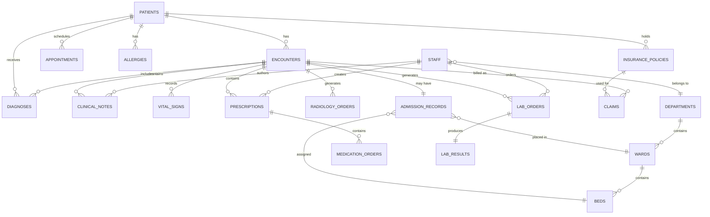

# Data Dictionary — Hospital Information System

| Field | Value |
|---|---|
| Version | 1.0.0 |
| Status | Approved |
| Date | 2025-07-14 |
| Owner | Health Informatics & Data Architecture Team |
| Classification | Internal — Confidential |

---

## Table of Contents

1. [Overview](#1-overview)
2. [Core Entities](#2-core-entities)
3. [Canonical Relationship Diagram](#3-canonical-relationship-diagram)
4. [Data Quality Controls](#4-data-quality-controls)
5. [Retention and Archival Policy](#5-retention-and-archival-policy)
6. [Terminology and Code Systems](#6-terminology-and-code-systems)

---

## Overview

This data dictionary is the authoritative reference for all persistent data structures within the Hospital Information System (HIS). It documents every canonical entity, attribute, constraint, index, and inter-table relationship used across clinical, administrative, and financial domains. The dictionary is aligned to **HL7 FHIR R4** resource definitions, ensuring that data models are interoperable with external health information exchanges (HIE), regional patient registries, and federal reporting programs such as CMS Quality Payment Program (QPP) and ONC Certified Health IT. Where FHIR resource profiles deviate from the internal relational model, mapping notes are maintained in the integration specification document.

All coded clinical data leverages internationally recognised terminologies. **SNOMED CT** (Systematized Nomenclature of Medicine Clinical Terms) is the primary vocabulary for clinical findings, procedures, body structures, and substances. **LOINC** (Logical Observation Identifiers Names and Codes) codes all laboratory and clinical observations. **ICD-10-CM** is used for diagnosis coding on all encounters and claims, while **ICD-10-PCS** captures inpatient procedure codes. Drug data references **RxNorm** concept unique identifiers (RxCUI) for clinical drugs and **NDC** (National Drug Code) for dispensed products. Billing and scheduling use **CPT-4** procedure codes. Units of measure follow the **UCUM** (Unified Code for Units of Measure) standard to enable machine-interpretable unit conversion and validation.

Data stewardship is governed by the Health Informatics & Data Architecture Team in partnership with the Chief Medical Informatics Officer (CMIO) and Privacy Officer. Each entity listed in this dictionary has a designated Data Steward responsible for approving schema changes, reviewing access requests, and ensuring compliance with HIPAA Privacy Rule, HIPAA Security Rule, HITECH Act, and applicable state health privacy statutes. All schema modifications must pass a change advisory board (CAB) review and be accompanied by an updated version of this dictionary before deployment to production environments. This document is reviewed no less than annually or whenever a structural schema change is introduced.

---

## Core Entities

### 1. Patient

Represents a unique individual who receives or is registered to receive healthcare services at the facility. This is the root entity from which all clinical, administrative, and financial records are anchored.

**Table:** `patients`

| Attribute | Type | Nullable | Constraints | Description |
|---|---|---|---|---|
| patient_id | UUID | NOT NULL | PRIMARY KEY, DEFAULT gen_random_uuid() | Surrogate primary key |
| mrn | VARCHAR(20) | NOT NULL | UNIQUE, NOT NULL | Medical Record Number, facility-scoped unique identifier |
| national_id | VARCHAR(30) | NULL | ENCRYPTED | Government-issued ID (SSN/NHS/Aadhaar); stored encrypted, validated by checksum algorithm |
| national_id_type | VARCHAR(20) | NULL | CHECK(IN('SSN','NHS','AADHAAR','PASSPORT','NONE')) | Type of national identifier |
| last_name | VARCHAR(100) | NOT NULL | NOT NULL | Patient surname / family name |
| first_name | VARCHAR(100) | NOT NULL | NOT NULL | Patient given name |
| middle_name | VARCHAR(100) | NULL | — | Middle name or initial |
| date_of_birth | DATE | NOT NULL | NOT NULL, CHECK(date_of_birth <= CURRENT_DATE) | ISO 8601 date; used for age-based clinical rules |
| gender | VARCHAR(20) | NOT NULL | CHECK(IN('male','female','other','unknown')) | Administrative gender per HL7 FHIR value set |
| blood_type | VARCHAR(5) | NULL | CHECK(IN('A+','A-','B+','B-','AB+','AB-','O+','O-','unknown')) | ABO/Rh blood group |
| marital_status | VARCHAR(20) | NULL | CHECK(IN('single','married','divorced','widowed','separated','unknown')) | Marital status per HL7 V3 MaritalStatus |
| address | JSONB | NULL | — | Structured address: {street, city, state, postal_code, country, address_type} |
| phone_primary | VARCHAR(20) | NULL | — | Primary contact phone in E.164 format |
| phone_secondary | VARCHAR(20) | NULL | — | Secondary contact phone |
| email | VARCHAR(255) | NULL | — | Patient email; used for portal notifications |
| preferred_language | VARCHAR(10) | NULL | DEFAULT 'en' | BCP 47 language tag for communication preference |
| emergency_contact | JSONB | NULL | — | {name, relationship, phone, email} |
| registration_date | TIMESTAMPTZ | NOT NULL | DEFAULT NOW() | Date and time of initial registration |
| status | VARCHAR(20) | NOT NULL | DEFAULT 'active', CHECK(IN('active','inactive','deceased','merged','unknown')) | Patient lifecycle status |
| photo_url | VARCHAR(500) | NULL | — | Secure URL to patient photo in object storage (access-controlled) |
| empi_score | DECIMAL(5,4) | NULL | — | EMPI probabilistic matching confidence score (0.0000–1.0000) |
| created_at | TIMESTAMPTZ | NOT NULL | DEFAULT NOW() | Record creation timestamp |
| updated_at | TIMESTAMPTZ | NOT NULL | DEFAULT NOW() | Last modification timestamp |
| deleted_at | TIMESTAMPTZ | NULL | — | Soft-delete timestamp; NULL = active record |
| metadata | JSONB | NULL | — | Extensible key-value store for facility-specific attributes |

**Indexes:** PRIMARY KEY (patient_id), UNIQUE (mrn), INDEX patients_dob_idx (date_of_birth), INDEX patients_name_idx (last_name, first_name), INDEX patients_status_idx (status) WHERE deleted_at IS NULL, GIN INDEX patients_metadata_gin (metadata)

---

### 2. Encounter

Represents a single clinical interaction between a patient and the healthcare facility. Encounters serve as the central aggregation point for all clinical documentation, orders, diagnoses, and billing records.

**Table:** `encounters`

| Attribute | Type | Nullable | Constraints | Description |
|---|---|---|---|---|
| encounter_id | UUID | NOT NULL | PRIMARY KEY | Surrogate key |
| patient_id | UUID | NOT NULL | FK → patients(patient_id) | Associated patient |
| encounter_type | VARCHAR(30) | NOT NULL | CHECK(IN('outpatient','inpatient','emergency','virtual','day_surgery','observation')) | Classification of encounter |
| encounter_date | TIMESTAMPTZ | NOT NULL | NOT NULL | Date and time encounter began |
| discharge_date | TIMESTAMPTZ | NULL | CHECK(discharge_date > encounter_date) | Date and time patient was discharged; NULL if active |
| attending_physician_id | UUID | NOT NULL | FK → staff(staff_id) | Primary responsible physician |
| department_id | UUID | NOT NULL | FK → departments(department_id) | Treating department |
| chief_complaint | TEXT | NULL | — | Patient's primary reason for visit in free text |
| visit_reason | VARCHAR(500) | NULL | — | Structured visit reason (coded) |
| status | VARCHAR(30) | NOT NULL | DEFAULT 'active', CHECK(IN('planned','active','on_hold','finished','cancelled','entered_in_error')) | Encounter lifecycle status |
| admission_source | VARCHAR(50) | NULL | — | How patient arrived (ER walk-in, ambulance, referral, transfer) |
| discharge_disposition | VARCHAR(50) | NULL | — | Where patient went on discharge (home, SNF, expired, AMA) |
| created_at | TIMESTAMPTZ | NOT NULL | DEFAULT NOW() | Record creation |
| updated_at | TIMESTAMPTZ | NOT NULL | DEFAULT NOW() | Last modification |

**Indexes:** PRIMARY KEY (encounter_id), INDEX encounters_patient_idx (patient_id), INDEX encounters_date_idx (encounter_date DESC), INDEX encounters_status_idx (status) WHERE status = 'active'

---

### 3. Appointment

Captures a scheduled clinical event between a patient and a clinician in a specific department. Appointments may or may not convert to encounters and support the full scheduling lifecycle including cancellations and no-shows.

**Table:** `appointments`

| Attribute | Type | Nullable | Constraints | Description |
|---|---|---|---|---|
| appointment_id | UUID | NOT NULL | PRIMARY KEY | Surrogate key |
| patient_id | UUID | NOT NULL | FK → patients | Associated patient |
| doctor_id | UUID | NOT NULL | FK → staff | Scheduled clinician |
| department_id | UUID | NOT NULL | FK → departments | Treatment department |
| scheduled_date | DATE | NOT NULL | NOT NULL | Date of appointment |
| scheduled_time | TIME | NOT NULL | NOT NULL | Start time |
| duration_minutes | SMALLINT | NOT NULL | DEFAULT 15, CHECK(duration_minutes > 0) | Appointment slot duration |
| appointment_type | VARCHAR(50) | NOT NULL | CHECK(IN('new_patient','follow_up','procedure','consultation','telehealth','wellness','urgent_care')) | Appointment classification |
| status | VARCHAR(30) | NOT NULL | DEFAULT 'scheduled', CHECK(IN('scheduled','confirmed','checked_in','in_progress','completed','cancelled','no_show','rescheduled')) | Scheduling lifecycle status |
| cancellation_reason | TEXT | NULL | — | Required when status = 'cancelled' or 'no_show' |
| notes | TEXT | NULL | — | Scheduling notes or special instructions |
| reminder_sent_at | TIMESTAMPTZ | NULL | — | Timestamp of last reminder notification sent |
| insurance_pre_auth_id | VARCHAR(50) | NULL | — | Pre-authorization reference number if required |
| created_by | UUID | NOT NULL | FK → staff | Staff member who booked |
| created_at | TIMESTAMPTZ | NOT NULL | DEFAULT NOW() | Record creation timestamp |
| updated_at | TIMESTAMPTZ | NOT NULL | DEFAULT NOW() | Last modification timestamp |

**Indexes:** PRIMARY KEY (appointment_id), INDEX appointments_patient_idx (patient_id), UNIQUE appointments_doctor_slot_idx (doctor_id, scheduled_date, scheduled_time) WHERE status NOT IN ('cancelled','no_show')

---

### 4. AdmissionRecord

Documents a formal inpatient admission event, linking a patient encounter to a specific ward and bed. Enforces one-active-admission-per-bed and one-admission-per-encounter constraints.

**Table:** `admission_records`

| Attribute | Type | Nullable | Constraints | Description |
|---|---|---|---|---|
| admission_id | UUID | NOT NULL | PRIMARY KEY | Surrogate key |
| patient_id | UUID | NOT NULL | FK → patients | Associated patient |
| encounter_id | UUID | NOT NULL | FK → encounters | UNIQUE — one admission per encounter |
| admission_date | TIMESTAMPTZ | NOT NULL | NOT NULL | Date/time of admission |
| discharge_date | TIMESTAMPTZ | NULL | — | NULL while patient is admitted |
| admission_type | VARCHAR(30) | NOT NULL | CHECK(IN('elective','emergency','maternity','transfer','day_case','observation')) | Admission classification |
| ward_id | UUID | NOT NULL | FK → wards | Admitting ward |
| bed_id | UUID | NOT NULL | FK → beds | Assigned bed; UNIQUE constraint enforces one patient per bed |
| admitting_physician_id | UUID | NOT NULL | FK → staff | Admitting physician |
| primary_diagnosis_code | VARCHAR(10) | NULL | REFERENCES icd10_codes | ICD-10-CM admitting diagnosis |
| admission_reason | TEXT | NULL | — | Free-text admission reason |
| status | VARCHAR(30) | NOT NULL | DEFAULT 'active', CHECK(IN('active','transferred','discharged','expired','administrative')) | Admission lifecycle status |
| created_at | TIMESTAMPTZ | NOT NULL | DEFAULT NOW() | Record creation timestamp |
| updated_at | TIMESTAMPTZ | NOT NULL | DEFAULT NOW() | Last modification timestamp |

**Indexes:** PRIMARY KEY (admission_id), UNIQUE (encounter_id), INDEX admissions_patient_idx (patient_id), UNIQUE admissions_active_bed_idx (bed_id) WHERE status = 'active'

---

### 5. ClinicalNote

Stores all structured and unstructured clinical documentation authored by clinical staff during or after an encounter. Supports SOAP-format notes, discharge summaries, operative notes, and nursing documentation with a full electronic signature and amendment audit chain.

**Table:** `clinical_notes`

| Attribute | Type | Nullable | Constraints | Description |
|---|---|---|---|---|
| note_id | UUID | NOT NULL | PRIMARY KEY | Surrogate key |
| encounter_id | UUID | NOT NULL | FK → encounters | Parent encounter |
| patient_id | UUID | NOT NULL | FK → patients | Denormalized for direct query performance |
| author_id | UUID | NOT NULL | FK → staff | Note author |
| note_type | VARCHAR(50) | NOT NULL | CHECK(IN('SOAP','progress','discharge_summary','admission_history','consultation','nursing','procedure','operative','radiology_prelim')) | Note classification |
| subjective | TEXT | NULL | — | Patient-reported symptoms and history (S in SOAP) |
| objective | TEXT | NULL | — | Examination findings and measurements (O in SOAP) |
| assessment | TEXT | NULL | — | Clinical assessment and differential diagnoses (A in SOAP) |
| plan | TEXT | NULL | — | Management and treatment plan (P in SOAP) |
| full_text | TEXT | NULL | — | Complete note body for non-SOAP note types |
| status | VARCHAR(30) | NOT NULL | DEFAULT 'draft', CHECK(IN('draft','signed','amended','addendum','cosigned','entered_in_error')) | Note lifecycle status |
| signed_at | TIMESTAMPTZ | NULL | — | Timestamp when author affixed electronic signature |
| electronic_signature | VARCHAR(500) | NULL | — | Cryptographic signature or badge/PIN verification token |
| cosigned_by | UUID | NULL | FK → staff | Required for resident notes; attending who co-signed |
| cosigned_at | TIMESTAMPTZ | NULL | — | Timestamp of co-signature |
| amended_from_note_id | UUID | NULL | FK → clinical_notes | For amendment chain, points to original note |
| created_at | TIMESTAMPTZ | NOT NULL | DEFAULT NOW() | Record creation timestamp |
| updated_at | TIMESTAMPTZ | NOT NULL | DEFAULT NOW() | Last modification timestamp |

**Indexes:** PRIMARY KEY (note_id), INDEX clinical_notes_encounter_idx (encounter_id), INDEX clinical_notes_patient_idx (patient_id), INDEX clinical_notes_author_idx (author_id), INDEX clinical_notes_status_idx (status) WHERE status = 'draft'

---

### 6. VitalSigns

Records quantitative physiological measurements taken during a patient encounter. Supports both manually entered and device-captured observations, with NEWS2 early warning scoring and pain/consciousness scale integration.

**Table:** `vital_signs`

| Attribute | Type | Nullable | Constraints | Description |
|---|---|---|---|---|
| vital_id | UUID | NOT NULL | PRIMARY KEY | Surrogate key |
| encounter_id | UUID | NOT NULL | FK → encounters | Parent encounter |
| patient_id | UUID | NOT NULL | FK → patients | Denormalized for direct query performance |
| recorded_by | UUID | NOT NULL | FK → staff | Clinician or device recording vitals |
| recorded_at | TIMESTAMPTZ | NOT NULL | DEFAULT NOW() | Observation timestamp (may differ from DB insert time) |
| systolic_bp | SMALLINT | NULL | CHECK(BETWEEN 50 AND 300) | Systolic blood pressure in mmHg |
| diastolic_bp | SMALLINT | NULL | CHECK(BETWEEN 20 AND 200) | Diastolic blood pressure in mmHg |
| heart_rate | SMALLINT | NULL | CHECK(BETWEEN 20 AND 300) | Heart rate in beats per minute |
| respiratory_rate | SMALLINT | NULL | CHECK(BETWEEN 4 AND 60) | Breaths per minute |
| temperature | DECIMAL(4,1) | NULL | CHECK(BETWEEN 30.0 AND 45.0 if C) | Body temperature; unit specified in temperature_unit |
| temperature_unit | CHAR(1) | NULL | DEFAULT 'C', CHECK(IN('C','F')) | Celsius or Fahrenheit |
| spo2 | DECIMAL(4,1) | NULL | CHECK(BETWEEN 50.0 AND 100.0) | Peripheral oxygen saturation percentage |
| weight_kg | DECIMAL(5,1) | NULL | CHECK(BETWEEN 0.3 AND 700.0) | Body weight in kilograms |
| height_cm | DECIMAL(5,1) | NULL | CHECK(BETWEEN 30.0 AND 280.0) | Height in centimetres |
| bmi | DECIMAL(4,1) | NULL | COMPUTED or stored | Body Mass Index (weight_kg / (height_m²)) |
| pain_score | SMALLINT | NULL | CHECK(BETWEEN 0 AND 10) | NRS pain scale 0–10 |
| gcs_score | SMALLINT | NULL | CHECK(BETWEEN 3 AND 15) | Glasgow Coma Scale total score |
| news2_score | SMALLINT | NULL | — | National Early Warning Score 2 (auto-calculated from vital parameters) |
| device_id | VARCHAR(100) | NULL | — | Medical device serial number if machine-captured |
| notes | TEXT | NULL | — | Clinical notes on vital signs observation context |
| created_at | TIMESTAMPTZ | NOT NULL | DEFAULT NOW() | Record creation timestamp |

**Indexes:** PRIMARY KEY (vital_id), INDEX vital_signs_encounter_idx (encounter_id), INDEX vital_signs_patient_time_idx (patient_id, recorded_at DESC)

---

### 7. Diagnosis

Stores coded clinical diagnoses linked to an encounter and patient. Supports primary, secondary, differential, and discharge diagnoses using ICD-10-CM, aligned with HL7 FHIR Condition resource semantics.

**Table:** `diagnoses`

| Attribute | Type | Nullable | Constraints | Description |
|---|---|---|---|---|
| diagnosis_id | UUID | NOT NULL | PRIMARY KEY | Surrogate key |
| encounter_id | UUID | NOT NULL | FK → encounters | Parent encounter |
| patient_id | UUID | NOT NULL | FK → patients | Denormalized for query performance |
| icd10_code | VARCHAR(10) | NOT NULL | FK → icd10_reference | ICD-10-CM diagnosis code (e.g., J18.9 for pneumonia) |
| icd10_description | TEXT | NOT NULL | — | Full ICD-10-CM description text |
| diagnosis_type | VARCHAR(30) | NOT NULL | CHECK(IN('primary','secondary','admission','discharge','differential','working','rule_out')) | Diagnosis role on this encounter |
| status | VARCHAR(20) | NOT NULL | DEFAULT 'active', CHECK(IN('active','resolved','chronic','inactive','refuted')) | Clinical status of the condition |
| onset_date | DATE | NULL | — | Clinical onset date of condition |
| resolved_date | DATE | NULL | — | Date condition resolved; required if status = 'resolved' |
| diagnosed_by | UUID | NOT NULL | FK → staff | Physician who recorded diagnosis |
| verification_status | VARCHAR(30) | NULL | CHECK(IN('confirmed','provisional','differential','refuted','entered_in_error')) | HL7 FHIR verification status |
| created_at | TIMESTAMPTZ | NOT NULL | DEFAULT NOW() | Record creation timestamp |
| updated_at | TIMESTAMPTZ | NOT NULL | DEFAULT NOW() | Last modification timestamp |

**Indexes:** PRIMARY KEY (diagnosis_id), INDEX diagnoses_encounter_idx (encounter_id), INDEX diagnoses_patient_idx (patient_id), INDEX diagnoses_icd10_idx (icd10_code)

---

### 8. Prescription

Represents a prescriber-authored medication order set for a patient encounter. Acts as the header record linking one or more MedicationOrder line items; captures prescriber intent, signature, and controlled substance classification.

**Table:** `prescriptions`

| Attribute | Type | Nullable | Constraints | Description |
|---|---|---|---|---|
| prescription_id | UUID | NOT NULL | PRIMARY KEY | Surrogate key |
| encounter_id | UUID | NOT NULL | FK → encounters | Parent encounter |
| patient_id | UUID | NOT NULL | FK → patients | Associated patient |
| prescriber_id | UUID | NOT NULL | FK → staff | Must have role = 'doctor' with valid license |
| prescription_date | TIMESTAMPTZ | NOT NULL | DEFAULT NOW() | Date/time prescription was written |
| status | VARCHAR(30) | NOT NULL | DEFAULT 'active', CHECK(IN('active','completed','cancelled','on_hold','expired')) | Prescription lifecycle status |
| total_items | SMALLINT | NOT NULL | DEFAULT 0 | Count of medication order line items |
| electronic_signature | VARCHAR(500) | NULL | — | Prescriber's digital signature token |
| controlled_substance_flag | BOOLEAN | NOT NULL | DEFAULT false | True if any item is Schedule II–V |
| notes | TEXT | NULL | — | General prescriber notes for pharmacist |
| created_at | TIMESTAMPTZ | NOT NULL | DEFAULT NOW() | Record creation timestamp |
| updated_at | TIMESTAMPTZ | NOT NULL | DEFAULT NOW() | Last modification timestamp |

**Indexes:** PRIMARY KEY (prescription_id), INDEX prescriptions_encounter_idx (encounter_id), INDEX prescriptions_patient_idx (patient_id), INDEX prescriptions_prescriber_idx (prescriber_id), INDEX prescriptions_controlled_idx (controlled_substance_flag) WHERE controlled_substance_flag = true

---

### 9. MedicationOrder

Captures individual drug order line items within a prescription. Records full prescribing details including dose, route, frequency, and dispense quantity; supports DEA-scheduled controlled substance witness requirements and pharmacist verification workflow.

**Table:** `medication_orders`

| Attribute | Type | Nullable | Constraints | Description |
|---|---|---|---|---|
| order_id | UUID | NOT NULL | PRIMARY KEY | Surrogate key |
| prescription_id | UUID | NOT NULL | FK → prescriptions | Parent prescription |
| patient_id | UUID | NOT NULL | FK → patients | Associated patient |
| encounter_id | UUID | NOT NULL | FK → encounters | Associated encounter |
| drug_id | VARCHAR(50) | NOT NULL | FK → drug_formulary | RxNorm or NDC drug identifier |
| drug_name | VARCHAR(200) | NOT NULL | — | Brand drug name |
| generic_name | VARCHAR(200) | NOT NULL | — | Generic (INN) drug name |
| dose | VARCHAR(50) | NOT NULL | — | Dose amount (e.g., "500") |
| dose_unit | VARCHAR(20) | NOT NULL | — | Dose unit (e.g., "mg", "mL", "units") |
| route | VARCHAR(30) | NOT NULL | CHECK(IN('oral','IV','IM','SC','topical','inhaled','sublingual','transdermal','rectal','ophthalmic','otic','nasal')) | Route of administration |
| frequency | VARCHAR(50) | NOT NULL | — | Dosing frequency (e.g., "twice daily", "q8h", "PRN") |
| start_date | TIMESTAMPTZ | NOT NULL | — | Medication start date/time |
| end_date | TIMESTAMPTZ | NULL | — | Scheduled end date; NULL for indefinite/PRN |
| quantity | SMALLINT | NULL | CHECK(quantity > 0) | Quantity to dispense |
| refills_allowed | SMALLINT | NOT NULL | DEFAULT 0 | Number of authorized refills |
| order_status | VARCHAR(30) | NOT NULL | DEFAULT 'pending', CHECK(IN('pending','verified','dispensed','administered','discontinued','on_hold','expired')) | Order lifecycle status |
| controlled_substance | BOOLEAN | NOT NULL | DEFAULT false | True if DEA scheduled substance |
| dea_schedule | VARCHAR(5) | NULL | CHECK(IN('CII','CIII','CIV','CV')) | DEA schedule for controlled substances |
| ordering_physician_id | UUID | NOT NULL | FK → staff | Ordering clinician |
| pharmacist_id | UUID | NULL | FK → staff | Pharmacist who verified and dispensed |
| pharmacist_verified_at | TIMESTAMPTZ | NULL | — | Timestamp of pharmacist verification |
| witness_id | UUID | NULL | FK → staff | Required witness for Schedule II drug administration |
| created_at | TIMESTAMPTZ | NOT NULL | DEFAULT NOW() | Record creation timestamp |
| updated_at | TIMESTAMPTZ | NOT NULL | DEFAULT NOW() | Last modification timestamp |

**Indexes:** PRIMARY KEY (order_id), INDEX medication_orders_patient_idx (patient_id), INDEX medication_orders_prescription_idx (prescription_id), INDEX medication_orders_status_idx (order_status) WHERE order_status NOT IN ('administered','discontinued')

---

### 10. LabOrder

Records a physician-ordered laboratory test request for a specific patient encounter. Tracks specimen collection, transit, and processing lifecycle using LOINC-coded test identifiers with priority-based turnaround time (TAT) enforcement.

**Table:** `lab_orders`

| Attribute | Type | Nullable | Constraints | Description |
|---|---|---|---|---|
| lab_order_id | UUID | NOT NULL | PRIMARY KEY | Surrogate key |
| encounter_id | UUID | NOT NULL | FK → encounters | Parent encounter |
| patient_id | UUID | NOT NULL | FK → patients | Associated patient |
| ordering_physician_id | UUID | NOT NULL | FK → staff | Physician ordering test; license validation required |
| loinc_code | VARCHAR(20) | NOT NULL | FK → loinc_reference | LOINC code for ordered test (e.g., 2951-2 for Sodium serum) |
| test_name | VARCHAR(200) | NOT NULL | — | Human-readable test name |
| test_category | VARCHAR(100) | NOT NULL | — | Test category (e.g., Hematology, Microbiology, Chemistry) |
| priority | VARCHAR(20) | NOT NULL | DEFAULT 'routine', CHECK(IN('routine','urgent','STAT','critical')) | STAT = 1h TAT; critical = immediate |
| order_date | TIMESTAMPTZ | NOT NULL | DEFAULT NOW() | Order creation timestamp |
| collection_date | TIMESTAMPTZ | NULL | — | Specimen collection timestamp |
| collection_method | VARCHAR(100) | NULL | — | How specimen collected (venipuncture, swab, etc.) |
| specimen_type | VARCHAR(50) | NULL | — | Specimen type (blood, urine, CSF, tissue, swab) |
| status | VARCHAR(30) | NOT NULL | DEFAULT 'ordered', CHECK(IN('ordered','collected','in_transit','in_progress','resulted','cancelled','on_hold')) | Order lifecycle status |
| clinical_indication | TEXT | NULL | — | Clinical reason for ordering the test |
| notes | TEXT | NULL | — | Additional instructions for laboratory |
| created_at | TIMESTAMPTZ | NOT NULL | DEFAULT NOW() | Record creation timestamp |
| updated_at | TIMESTAMPTZ | NOT NULL | DEFAULT NOW() | Last modification timestamp |

**Indexes:** PRIMARY KEY (lab_order_id), INDEX lab_orders_encounter_idx (encounter_id), INDEX lab_orders_patient_idx (patient_id), INDEX lab_orders_loinc_idx (loinc_code), INDEX lab_orders_status_priority_idx (status, priority) WHERE status NOT IN ('resulted','cancelled')

---

### 11. LabResult

Stores the finalised or preliminary result for a laboratory order. Supports both numeric and qualitative result types, reference range comparisons, abnormal flagging, and a complete critical value notification acknowledgment workflow.

**Table:** `lab_results`

| Attribute | Type | Nullable | Constraints | Description |
|---|---|---|---|---|
| result_id | UUID | NOT NULL | PRIMARY KEY | Surrogate key |
| lab_order_id | UUID | NOT NULL | FK → lab_orders | UNIQUE — one result record per order |
| patient_id | UUID | NOT NULL | FK → patients | Denormalized for query performance |
| result_date | TIMESTAMPTZ | NOT NULL | DEFAULT NOW() | Date/time result was finalized |
| result_value | TEXT | NOT NULL | — | Result value as text to accommodate numeric and qualitative results |
| result_numeric | DECIMAL(12,4) | NULL | — | Parsed numeric value for trending and alerting |
| result_unit | VARCHAR(50) | NULL | — | UCUM unit of measure (e.g., "mg/dL", "10*3/uL") |
| reference_range | VARCHAR(100) | NULL | — | Normal reference range string (e.g., "3.5–5.0 mEq/L") |
| reference_range_low | DECIMAL(12,4) | NULL | — | Numeric lower bound of reference range |
| reference_range_high | DECIMAL(12,4) | NULL | — | Numeric upper bound of reference range |
| abnormal_flag | VARCHAR(20) | NULL | CHECK(IN('normal','low','high','critical_low','critical_high','abnormal','indeterminate')) | LOINC LL2471-0 / HL7 observation interpretation value set |
| result_status | VARCHAR(20) | NOT NULL | DEFAULT 'preliminary', CHECK(IN('preliminary','final','corrected','cancelled','entered_in_error')) | HL7 FHIR observation status |
| verified_by | UUID | NULL | FK → staff | Laboratory technologist or pathologist who verified result |
| verified_at | TIMESTAMPTZ | NULL | — | Timestamp of result verification/sign-off |
| critical_value_notified | BOOLEAN | NOT NULL | DEFAULT false | True once ordering physician notified of critical value |
| critical_notification_at | TIMESTAMPTZ | NULL | — | Timestamp of critical value notification |
| critical_acknowledged_by | UUID | NULL | FK → staff | Physician who acknowledged critical alert |
| critical_acknowledged_at | TIMESTAMPTZ | NULL | — | Acknowledgment timestamp |
| notes | TEXT | NULL | — | Lab technologist interpretive comments |

**Indexes:** PRIMARY KEY (result_id), UNIQUE (lab_order_id), INDEX lab_results_patient_idx (patient_id), INDEX lab_results_abnormal_idx (abnormal_flag) WHERE abnormal_flag IN ('critical_low','critical_high'), INDEX lab_results_critical_notification_idx (critical_value_notified) WHERE critical_value_notified = false AND abnormal_flag IN ('critical_low','critical_high')

---

### 12. RadiologyOrder

Captures imaging study orders including CT, MRI, X-ray, ultrasound, and nuclear medicine. Enforces contrast allergy screening, pregnancy safety checks, and CPT-coded billing linkage from point of order.

**Table:** `radiology_orders`

| Attribute | Type | Nullable | Constraints | Description |
|---|---|---|---|---|
| radiology_order_id | UUID | NOT NULL | PRIMARY KEY | Surrogate key |
| encounter_id | UUID | NOT NULL | FK → encounters | Parent encounter |
| patient_id | UUID | NOT NULL | FK → patients | Associated patient |
| ordering_physician_id | UUID | NOT NULL | FK → staff | Ordering physician |
| radiologist_id | UUID | NULL | FK → staff | Assigned radiologist; populated on scheduling |
| modality | VARCHAR(30) | NOT NULL | CHECK(IN('CT','MRI','XR','US','PET','PET-CT','fluoroscopy','mammography','DEXA','nuclear_medicine','angiography')) | Imaging modality |
| body_part | VARCHAR(100) | NOT NULL | — | Anatomical region to be imaged (SNOMED-coded preferred) |
| laterality | VARCHAR(10) | NULL | CHECK(IN('left','right','bilateral','N/A')) | Laterality for paired organs |
| cpt_code | VARCHAR(10) | NOT NULL | FK → cpt_reference | CPT code for billing and scheduling |
| priority | VARCHAR(20) | NOT NULL | DEFAULT 'routine', CHECK(IN('routine','urgent','STAT','critical')) | Study priority |
| clinical_indication | TEXT | NOT NULL | — | Required: clinical reason for imaging |
| contrast_required | BOOLEAN | NOT NULL | DEFAULT false | IV or oral contrast administration required |
| contrast_allergy_checked | BOOLEAN | NULL | — | Documented allergy screening if contrast_required = true |
| pregnancy_screened | BOOLEAN | NULL | — | Required for radiation-involving studies in females of childbearing age |
| status | VARCHAR(30) | NOT NULL | DEFAULT 'ordered', CHECK(IN('ordered','scheduled','patient_arrived','in_progress','images_acquired','reported','verified','cancelled')) | Order lifecycle status |
| scheduled_datetime | TIMESTAMPTZ | NULL | — | Scheduled exam date/time |
| notes | TEXT | NULL | — | Additional clinical notes |
| created_at | TIMESTAMPTZ | NOT NULL | DEFAULT NOW() | Record creation timestamp |
| updated_at | TIMESTAMPTZ | NOT NULL | DEFAULT NOW() | Last modification timestamp |

**Indexes:** PRIMARY KEY (radiology_order_id), INDEX radiology_orders_encounter_idx (encounter_id), INDEX radiology_orders_patient_idx (patient_id), INDEX radiology_orders_status_idx (status) WHERE status NOT IN ('verified','cancelled')

---

### 13. Allergy

Records a patient's known or suspected adverse reactions to drugs, foods, environmental agents, and other substances. Drives clinical decision support drug-allergy interaction (DAI) checking at the point of prescribing.

**Table:** `allergies`

| Attribute | Type | Nullable | Constraints | Description |
|---|---|---|---|---|
| allergy_id | UUID | NOT NULL | PRIMARY KEY | Surrogate key |
| patient_id | UUID | NOT NULL | FK → patients | Associated patient |
| allergen_name | VARCHAR(200) | NOT NULL | — | Allergen name (drug, food, substance) |
| allergen_code | VARCHAR(50) | NULL | FK → rxnorm or SNOMED | RxNorm concept ID for drugs; SNOMED CT for others |
| allergen_type | VARCHAR(30) | NOT NULL | CHECK(IN('drug','food','environmental','contrast','latex','biological','other')) | Allergen category |
| reaction_description | TEXT | NULL | — | Free-text description of adverse reaction (e.g., "urticarial rash, throat swelling") |
| reaction_codes | VARCHAR[] | NULL | — | SNOMED CT reaction codes array |
| severity | VARCHAR(20) | NOT NULL | CHECK(IN('mild','moderate','severe','life_threatening','unknown')) | Determines override requirements in medication rules |
| onset_date | DATE | NULL | — | Approximate date allergy was first noted |
| status | VARCHAR(20) | NOT NULL | DEFAULT 'active', CHECK(IN('active','inactive','resolved','entered_in_error')) | Allergy record status |
| recorded_by | UUID | NOT NULL | FK → staff | Clinician who recorded allergy |
| verified | BOOLEAN | NOT NULL | DEFAULT false | True if allergy verified by clinician review (not just self-reported) |
| information_source | VARCHAR(50) | NULL | CHECK(IN('patient_reported','family_reported','medical_record','clinical_observation')) | Source of allergy information |
| created_at | TIMESTAMPTZ | NOT NULL | DEFAULT NOW() | Record creation timestamp |
| updated_at | TIMESTAMPTZ | NOT NULL | DEFAULT NOW() | Last modification timestamp |

**Indexes:** PRIMARY KEY (allergy_id), INDEX allergies_patient_status_idx (patient_id) WHERE status = 'active', INDEX allergies_allergen_code_idx (allergen_code), INDEX allergies_severity_idx (patient_id, severity) WHERE status = 'active'

---

### 14. InsurancePolicy

Stores insurance coverage details for a patient, supporting primary, secondary, and tertiary payer configurations. Tracks real-time eligibility verification status via 270/271 EDI transactions and captures deductible and out-of-pocket accumulator values.

**Table:** `insurance_policies`

| Attribute | Type | Nullable | Constraints | Description |
|---|---|---|---|---|
| policy_id | UUID | NOT NULL | PRIMARY KEY | Surrogate key |
| patient_id | UUID | NOT NULL | FK → patients | Policy holder (patient) |
| insurance_company_id | UUID | NOT NULL | FK → insurance_companies | Payer reference |
| policy_number | VARCHAR(50) | NOT NULL | NOT NULL | Insurance policy number |
| group_number | VARCHAR(50) | NULL | — | Employer group number |
| member_id | VARCHAR(50) | NOT NULL | NOT NULL | Insurance member/subscriber ID |
| policy_type | VARCHAR(20) | NOT NULL | CHECK(IN('primary','secondary','tertiary','self_pay','workers_comp','government')) | Coverage priority |
| plan_name | VARCHAR(100) | NOT NULL | — | Insurance plan name (e.g., "BlueShield PPO Gold 2025") |
| plan_type | VARCHAR(10) | NOT NULL | CHECK(IN('HMO','PPO','EPO','POS','HDHP','Medicare','Medicaid','CHIP','TRICARE')) | Plan type |
| subscriber_name | VARCHAR(200) | NOT NULL | — | Name of policyholder if different from patient |
| subscriber_relationship | VARCHAR(30) | NULL | CHECK(IN('self','spouse','child','other')) | Relationship to subscriber |
| effective_date | DATE | NOT NULL | NOT NULL | Policy coverage start date |
| termination_date | DATE | NULL | — | Policy coverage end date; NULL if currently active |
| deductible_amount | DECIMAL(10,2) | NOT NULL | DEFAULT 0.00 | Annual deductible in USD |
| deductible_met | DECIMAL(10,2) | NOT NULL | DEFAULT 0.00 | Deductible amount met year-to-date |
| out_of_pocket_max | DECIMAL(10,2) | NOT NULL | DEFAULT 0.00 | Annual out-of-pocket maximum in USD |
| copay_amount | DECIMAL(10,2) | NULL | — | Fixed copay per visit in USD |
| coinsurance_pct | DECIMAL(5,2) | NULL | CHECK(BETWEEN 0 AND 100) | Patient coinsurance percentage after deductible |
| status | VARCHAR(20) | NOT NULL | DEFAULT 'active', CHECK(IN('active','inactive','expired','pending_verification','terminated')) | Policy status |
| eligibility_verified | BOOLEAN | NOT NULL | DEFAULT false | Payer eligibility verified via 270/271 EDI transaction |
| verified_at | TIMESTAMPTZ | NULL | — | Last eligibility verification timestamp |
| created_at | TIMESTAMPTZ | NOT NULL | DEFAULT NOW() | Record creation timestamp |
| updated_at | TIMESTAMPTZ | NOT NULL | DEFAULT NOW() | Last modification timestamp |

**Indexes:** PRIMARY KEY (policy_id), INDEX insurance_policies_patient_idx (patient_id), UNIQUE insurance_policies_member_policy_idx (insurance_company_id, member_id, policy_number), INDEX insurance_policies_active_idx (patient_id) WHERE status = 'active'

---

### 15. Claim

Represents a billing claim submitted to a payer for reimbursement of services rendered. Supports CMS-1450 (UB-04) institutional and CMS-1500 professional claim formats, full adjudication lifecycle tracking, and EDI 837 electronic submission audit trails.

**Table:** `claims`

| Attribute | Type | Nullable | Constraints | Description |
|---|---|---|---|---|
| claim_id | UUID | NOT NULL | PRIMARY KEY | Surrogate key |
| encounter_id | UUID | NOT NULL | FK → encounters | Associated encounter |
| patient_id | UUID | NOT NULL | FK → patients | Associated patient |
| insurance_policy_id | UUID | NOT NULL | FK → insurance_policies | Payer policy against which claim is filed |
| claim_number | VARCHAR(50) | NULL | UNIQUE when assigned | Payer-assigned claim reference number |
| claim_type | VARCHAR(20) | NOT NULL | CHECK(IN('institutional','professional','dental','pharmacy')) | CMS-1450 (UB-04) = institutional; CMS-1500 = professional |
| claim_date | DATE | NOT NULL | NOT NULL | Date claim was prepared |
| service_from_date | DATE | NOT NULL | NOT NULL | First date of service on claim |
| service_to_date | DATE | NOT NULL | NOT NULL | Last date of service on claim |
| total_billed | DECIMAL(10,2) | NOT NULL | CHECK(total_billed >= 0) | Total gross charges billed to payer |
| total_allowed | DECIMAL(10,2) | NULL | — | Payer-contracted allowed amount |
| total_paid | DECIMAL(10,2) | NULL | DEFAULT 0.00 | Amount paid by payer |
| patient_responsibility | DECIMAL(10,2) | NULL | — | Patient-owed balance after payer adjudication |
| status | VARCHAR(30) | NOT NULL | DEFAULT 'draft', CHECK(IN('draft','validated','submitted','acknowledged','accepted','rejected','adjudicated','paid','appealed','written_off')) | Claim lifecycle status |
| denial_reason | TEXT | NULL | — | Payer-supplied denial reason code and description |
| eob_date | DATE | NULL | — | Explanation of Benefits date from payer |
| submission_method | VARCHAR(30) | NULL | CHECK(IN('electronic_837','paper','portal','clearinghouse')) | Submission channel |
| clearinghouse_id | VARCHAR(50) | NULL | — | EDI clearinghouse tracking ID |
| created_at | TIMESTAMPTZ | NOT NULL | DEFAULT NOW() | Record creation timestamp |
| updated_at | TIMESTAMPTZ | NOT NULL | DEFAULT NOW() | Last modification timestamp |

**Indexes:** PRIMARY KEY (claim_id), INDEX claims_encounter_idx (encounter_id), INDEX claims_patient_idx (patient_id), INDEX claims_status_idx (status) WHERE status NOT IN ('paid','written_off'), UNIQUE (claim_number) WHERE claim_number IS NOT NULL

---

### 16. Staff

Represents all employees of the healthcare facility with system access. Encompasses clinical roles (physicians, nurses, pharmacists, lab technicians, radiologists) and administrative roles. Governs RBAC permissions, DEA prescribing authority, and professional license lifecycle management.

**Table:** `staff`

| Attribute | Type | Nullable | Constraints | Description |
|---|---|---|---|---|
| staff_id | UUID | NOT NULL | PRIMARY KEY | Surrogate key |
| user_id | UUID | NOT NULL | FK → users(user_id) UNIQUE | Link to authentication/IAM record |
| employee_id | VARCHAR(20) | NOT NULL | UNIQUE | HR-assigned employee number |
| first_name | VARCHAR(100) | NOT NULL | — | Staff given name |
| last_name | VARCHAR(100) | NOT NULL | — | Staff family name |
| role | VARCHAR(30) | NOT NULL | CHECK(IN('doctor','nurse','pharmacist','lab_tech','radiologist','admin','billing','reception','social_worker','therapist','porter')) | Primary system role governing RBAC permissions |
| license_number | VARCHAR(50) | NULL | — | Medical/professional license number (required for clinical roles) |
| license_state | VARCHAR(50) | NULL | — | Licensing state/jurisdiction |
| license_expiry | DATE | NULL | — | License expiration date; alerts generated 90 days before expiry |
| dea_number | VARCHAR(20) | NULL | — | DEA registration number (required for prescribers of controlled substances) |
| npi_number | VARCHAR(10) | NULL | — | National Provider Identifier (10-digit) |
| specialty | VARCHAR(100) | NULL | — | Medical specialty (e.g., "Internal Medicine", "Emergency Medicine") |
| sub_specialty | VARCHAR(100) | NULL | — | Sub-specialty or fellowship (e.g., "Interventional Cardiology") |
| department_id | UUID | NULL | FK → departments | Primary department |
| hire_date | DATE | NOT NULL | — | Employment start date |
| employment_status | VARCHAR(20) | NOT NULL | DEFAULT 'active', CHECK(IN('active','inactive','terminated','on_leave','suspended','credentialing')) | Employment lifecycle status |
| emergency_contact | JSONB | NULL | — | {name, relationship, phone} |
| qualifications | JSONB | NULL | — | Array of {degree, institution, year} objects |
| created_at | TIMESTAMPTZ | NOT NULL | DEFAULT NOW() | Record creation timestamp |
| updated_at | TIMESTAMPTZ | NOT NULL | DEFAULT NOW() | Last modification timestamp |

**Indexes:** PRIMARY KEY (staff_id), UNIQUE (user_id), UNIQUE (employee_id), UNIQUE (npi_number) WHERE npi_number IS NOT NULL, INDEX staff_role_dept_idx (role, department_id), INDEX staff_license_expiry_idx (license_expiry) WHERE employment_status = 'active'

---

### 17. Department

Defines organisational units within the facility that provide clinical or administrative services. Departments are the top-level capacity and scheduling unit; wards and beds are nested below departments.

**Table:** `departments`

| Attribute | Type | Nullable | Constraints | Description |
|---|---|---|---|---|
| department_id | UUID | NOT NULL | PRIMARY KEY | Surrogate key |
| hospital_id | UUID | NOT NULL | FK → hospitals | Parent facility |
| name | VARCHAR(200) | NOT NULL | NOT NULL | Department full name (e.g., "Cardiovascular Intensive Care Unit") |
| code | VARCHAR(20) | NOT NULL | UNIQUE per hospital | Short code for system use and reporting (e.g., "CVICU") |
| department_type | VARCHAR(30) | NOT NULL | CHECK(IN('clinical','surgical','laboratory','radiology','pharmacy','administration','emergency','icu','hdu','maternity','psychiatric','outpatient','research')) | Functional classification |
| floor | VARCHAR(20) | NULL | — | Physical floor or building location |
| phone | VARCHAR(20) | NULL | — | Department direct telephone |
| fax | VARCHAR(20) | NULL | — | Department fax number |
| head_of_department_id | UUID | NULL | FK → staff | Departmental medical director or charge physician |
| status | VARCHAR(20) | NOT NULL | DEFAULT 'active', CHECK(IN('active','inactive','decommissioned','temporary')) | Operational status |
| capacity | SMALLINT | NULL | CHECK(capacity > 0) | Maximum patient capacity |
| cost_center_code | VARCHAR(30) | NULL | — | Accounting cost center for billing allocation |
| created_at | TIMESTAMPTZ | NOT NULL | DEFAULT NOW() | Record creation timestamp |
| updated_at | TIMESTAMPTZ | NOT NULL | DEFAULT NOW() | Last modification timestamp |

**Indexes:** PRIMARY KEY (department_id), UNIQUE (hospital_id, code), INDEX departments_type_idx (department_type), INDEX departments_status_idx (status) WHERE status = 'active'

---

### 18. Bed

Represents a single physical patient bed within a ward. Tracks real-time occupancy status, isolation capabilities, available equipment, and infection control hygiene timestamps to support bed management and clinical decision support.

**Table:** `beds`

| Attribute | Type | Nullable | Constraints | Description |
|---|---|---|---|---|
| bed_id | UUID | NOT NULL | PRIMARY KEY | Surrogate key |
| ward_id | UUID | NOT NULL | FK → wards | Parent ward |
| bed_number | VARCHAR(20) | NOT NULL | UNIQUE per ward | Bed identifier (e.g., "4B-12", "ICU-03") |
| bed_type | VARCHAR(30) | NOT NULL | CHECK(IN('general','ICU','HDU','private','semi_private','isolation','recovery','psychiatric','bariatric','maternity')) | Bed clinical classification |
| status | VARCHAR(30) | NOT NULL | DEFAULT 'available', CHECK(IN('available','occupied','reserved','maintenance','cleaning','decommissioned')) | Real-time occupancy status |
| is_isolation | BOOLEAN | NOT NULL | DEFAULT false | Indicates negative pressure or isolation capability |
| oxygen_available | BOOLEAN | NOT NULL | DEFAULT true | Piped oxygen supply at bedside |
| cardiac_monitor | BOOLEAN | NOT NULL | DEFAULT false | Continuous cardiac monitoring capability |
| ventilator_ready | BOOLEAN | NOT NULL | DEFAULT false | Mechanical ventilator hook-up available |
| features | JSONB | NULL | — | Additional equipment or features as key-value pairs |
| last_cleaned_at | TIMESTAMPTZ | NULL | — | Last terminal clean timestamp (for infection control) |
| created_at | TIMESTAMPTZ | NOT NULL | DEFAULT NOW() | Record creation timestamp |
| updated_at | TIMESTAMPTZ | NOT NULL | DEFAULT NOW() | Last modification timestamp |

**Indexes:** PRIMARY KEY (bed_id), UNIQUE (ward_id, bed_number), INDEX beds_status_idx (status) WHERE status = 'available', INDEX beds_ward_type_idx (ward_id, bed_type)

---

### 19. Ward

Defines a named nursing unit or clinical area within a department. Wards are the direct organisational parent of beds and the operational unit for nursing shift management, infection control reporting, and capacity planning.

**Table:** `wards`

| Attribute | Type | Nullable | Constraints | Description |
|---|---|---|---|---|
| ward_id | UUID | NOT NULL | PRIMARY KEY | Surrogate key |
| department_id | UUID | NOT NULL | FK → departments | Parent department |
| name | VARCHAR(100) | NOT NULL | NOT NULL | Ward name (e.g., "Nightingale Ward", "MICU") |
| code | VARCHAR(20) | NOT NULL | UNIQUE | Short ward code for system use |
| ward_type | VARCHAR(30) | NOT NULL | CHECK(IN('medical','surgical','pediatric','maternity','ICU','HDU','psychiatric','oncology','rehabilitation','burns','isolation','step_down')) | Ward clinical classification |
| floor | VARCHAR(20) | NULL | — | Physical location |
| total_beds | SMALLINT | NOT NULL | CHECK(total_beds > 0) | Total number of beds in ward |
| charge_nurse_id | UUID | NULL | FK → staff | Currently assigned charge nurse |
| status | VARCHAR(20) | NOT NULL | DEFAULT 'active', CHECK(IN('active','inactive','full','limited_capacity')) | Operational status |
| notes | TEXT | NULL | — | Operational notes (e.g., infection outbreak status) |
| created_at | TIMESTAMPTZ | NOT NULL | DEFAULT NOW() | Record creation timestamp |
| updated_at | TIMESTAMPTZ | NOT NULL | DEFAULT NOW() | Last modification timestamp |

**Indexes:** PRIMARY KEY (ward_id), UNIQUE (code), INDEX wards_department_idx (department_id), INDEX wards_status_idx (status)

---

## Canonical Relationship Diagram

The following Mermaid ER diagram illustrates the primary foreign-key relationships between all 19 core entities. Cardinality notation follows Mermaid ERD conventions: `||` = exactly one, `o{` = zero or more, `||--||` = one-to-one.

---

## Data Quality Controls

The following data quality rules are enforced at the database, application, and integration layers. Each rule specifies the enforcement mechanism and the responsible system component.

1. **MRN Uniqueness Enforcement**
   Medical Record Numbers are assigned by the Master Patient Index (MPI) service at the time of registration. The `UNIQUE` constraint on `patients.mrn` prevents duplicate MRN assignment at the database layer. The application layer additionally validates MRN format against the facility-configured regex pattern (default: `[A-Z]{2}[0-9]{8}`) before INSERT. Cross-facility MRN collisions in multi-site deployments are resolved by the Enterprise Master Patient Index (EMPI) via probabilistic matching stored in `patients.empi_score`.

2. **National ID Checksum Validation**
   Before persisting `patients.national_id`, the application layer applies a type-specific checksum algorithm: Luhn algorithm for SSN (last 4-digit verification), NHS number modulus-11 check, and Verhoeff algorithm for Aadhaar. Failed checksum validation raises a `VALIDATION_ERROR` and prevents record creation. The stored value is AES-256-GCM encrypted using a key managed by the facility's HSM (Hardware Security Module); the plaintext is never written to disk or logged.

3. **Date of Birth Logical Constraints**
   A database-level `CHECK(date_of_birth <= CURRENT_DATE)` constraint prevents future dates of birth. Application logic additionally enforces a minimum age floor of 0 days (newborns) and a maximum age ceiling of 150 years. Age-based clinical rule triggers (e.g., paediatric dosing, geriatric fall-risk screening) are derived from `date_of_birth` at runtime and never stored as a pre-computed age field to avoid stale data.

4. **ICD-10-CM Code Referential Integrity**
   All `icd10_code` values in `diagnoses` and `admission_records` are validated against the `icd10_reference` lookup table, which is updated annually per CMS ICD-10-CM tabular release (effective October 1 each year). Foreign key constraints enforce that only active, non-header ICD-10-CM codes (billable leaf codes) may be assigned. Retired codes are preserved in the reference table with a `valid_to` date to maintain historical integrity on existing records.

5. **LOINC Code Validation**
   `lab_orders.loinc_code` must resolve to a record in the `loinc_reference` table sourced from the LOINC database v2.77 or later. The application validates that the LOINC code's `CLASSTYPE` is appropriate for the order context (e.g., `1` = Lab, `2` = Clinical). Orders using LOINC panel codes (e.g., 24323-8 for CBC w/ differential) automatically expand to component LOINC codes when individual result rows are created in `lab_results`.

6. **CPT Code Validation**
   `radiology_orders.cpt_code` must resolve to a valid record in the `cpt_reference` table maintained per AMA CPT annual update. Procedure codes in the Radiology section (70000–79999) are validated for modality–CPT compatibility (e.g., CPT 71046 is valid for XR Chest 2-view; CPT 70553 is valid for MRI Brain with contrast). Modality–CPT mapping mismatches generate a hard stop validation error at order entry.

7. **Medication Dose Range Validation**
   At the time of MedicationOrder creation, the application-layer Clinical Decision Support (CDS) engine validates `dose` and `dose_unit` against age-weight-based therapeutic dose ranges sourced from the drug formulary (`drug_formulary.dose_range_min`, `drug_formulary.dose_range_max`). Doses below the minimum or above the maximum generate configurable alerts: sub-therapeutic doses produce a `WARNING`; doses exceeding 150% of maximum produce a mandatory override-with-reason `HARD_STOP`. Weight-based dosing (e.g., mg/kg) requires `vital_signs.weight_kg` to be recorded within the preceding 24 hours.

8. **Critical Lab Value Alerting**
   When `lab_results.abnormal_flag` is set to `critical_low` or `critical_high`, a database trigger fires immediately to set `critical_value_notified = false` and enqueue an alert via the notification service. The alert must be acknowledged (physician sets `critical_acknowledged_by` and `critical_acknowledged_at`) within the facility-defined TAT (default: 30 minutes for inpatients, 60 minutes for outpatients). Unacknowledged critical alerts escalate to the on-call physician and department supervisor. The escalation audit trail is stored in the `alert_escalations` table. Joint Commission standards require that the read-back verification be documented in the `notes` field of the `lab_results` record.

9. **Referential Integrity Cascade Rules**
   All foreign key relationships enforce `ON DELETE RESTRICT` to prevent orphaned clinical records. Cascade deletes are prohibited in all clinical tables. Soft-delete patterns are used instead: setting `deleted_at` on parent records triggers an application-layer cascade that updates child record `status` to `entered_in_error` and logs a `SOFT_CASCADE` audit event. `ON UPDATE CASCADE` is applied only to non-clinical lookup table foreign keys (e.g., `icd10_reference`, `loinc_reference`).

10. **PHI Field Encryption at Rest**
    Fields designated `ENCRYPTED` in this dictionary (`patients.national_id`, `staff.dea_number`, financial account fields in billing tables) are encrypted using AES-256-GCM with per-field envelope encryption. Field-level encryption keys are wrapped by a customer-managed master key (CMK) stored in a FIPS 140-2 Level 3 HSM. Key rotation is performed annually without re-encryption of existing data by maintaining a key version registry. Decryption is performed in-process within the application tier; the database layer never has access to plaintext values of encrypted fields.

11. **Audit Trail Completeness**
    All INSERT, UPDATE, and DELETE operations on tables containing PHI are captured by the `audit_log` table, populated via `AFTER` triggers. Each audit record captures: `table_name`, `record_id`, `operation` (INSERT/UPDATE/DELETE), `changed_by` (application user ID), `changed_at` (TIMESTAMPTZ), `old_values` (JSONB snapshot), and `new_values` (JSONB snapshot). The audit log is append-only; no UPDATE or DELETE is permitted on `audit_log` records. Audit log integrity is verified weekly by a hash-chain digest stored in `audit_log_integrity_checks`. Audit logs are retained for a minimum of 7 years per HIPAA requirements.

12. **Soft Delete Policy**
    No clinical, administrative, or financial record may be physically deleted via application code. All deletions must use the soft-delete pattern: set `deleted_at = NOW()` and optionally `status = 'entered_in_error'`. Partial indexes on all major entities exclude `deleted_at IS NOT NULL` records from default query paths. Physical data purge (hard delete) is only permitted by a DBA-executed, CAB-approved data purge script after the record has exceeded its legal hold period and the Privacy Officer has issued a written destruction authorisation.

13. **JSONB Schema Validation**
    Fields typed as `JSONB` (`patients.address`, `patients.emergency_contact`, `patients.metadata`, `staff.qualifications`, `beds.features`) are validated against registered JSON Schema documents at the application layer before persistence. Schema violations return field-level validation errors with JSON Pointer paths. The `patients.address` JSONB must contain at minimum `street`, `city`, and `country` keys. The `patients.emergency_contact` JSONB must contain `name` and `phone`. Schema versions are stored in `jsonb_schema_registry` for forward-compatibility tracking.

14. **Temporal Consistency Checks**
    The following temporal ordering constraints are enforced at both the application and database layers:
    - `encounters.discharge_date > encounters.encounter_date` (DB CHECK constraint)
    - `admission_records.discharge_date > admission_records.admission_date` (DB CHECK constraint)
    - `medication_orders.end_date > medication_orders.start_date` WHERE end_date IS NOT NULL (DB CHECK)
    - `insurance_policies.termination_date >= insurance_policies.effective_date` WHERE termination_date IS NOT NULL (DB CHECK)
    - `claims.service_to_date >= claims.service_from_date` (DB CHECK constraint)
    - `clinical_notes.cosigned_at >= clinical_notes.signed_at` WHERE cosigned_at IS NOT NULL (application CHECK)
    - `lab_results.result_date >= lab_orders.order_date` (cross-table validation at application layer on result entry)
    Any violation raises a `TEMPORAL_CONSTRAINT_VIOLATION` error code and is surfaced to the user as a field-level validation message.

---

## Retention and Archival Policy

All data retention periods comply with HIPAA minimum retention requirements (6 years from creation or last effective date), applicable state law (whichever is longer), and CMS Conditions of Participation. Records subject to an active legal hold are frozen in the `ONLINE` tier regardless of scheduled archival. Data archived to the `ARCHIVE` tier is stored in compressed, encrypted cold storage (S3 Glacier or equivalent) and remains queryable via the data warehouse read replica within 4 hours of retrieval request.

| Entity | Online Retention | Archive Retention | Legal Hold | Notes |
|---|---|---|---|---|
| Patient (patients) | 10 years post last encounter | 20 years from last encounter | Indefinite if litigation hold | State minimums may extend to 21 years for paediatric patients |
| Encounter (encounters) | 10 years | 20 years | Indefinite | Anchors all downstream clinical records |
| Appointment (appointments) | 3 years | 7 years | 10 years | Pre-visit data; lower clinical significance |
| AdmissionRecord (admission_records) | 10 years | 20 years | Indefinite | Linked to encounter retention |
| ClinicalNote (clinical_notes) | 10 years | 20 years | Indefinite | HIPAA minimum 6 years; clinical best practice is 10 years |
| VitalSigns (vital_signs) | 7 years | 15 years | Indefinite if referenced in litigation | High-volume table; partitioned by recorded_at for efficient archival |
| Diagnosis (diagnoses) | 10 years | 20 years | Indefinite | ICD-10 codes required for CMS quality reporting lookback |
| Prescription (prescriptions) | 7 years | 15 years | Indefinite | Controlled substance prescriptions: 7 years per DEA 21 CFR 1304 |
| MedicationOrder (medication_orders) | 7 years | 15 years | Indefinite | DEA Schedule II: minimum 7 years; all others: 3 years minimum |
| LabOrder (lab_orders) | 7 years | 15 years | Indefinite | CLIA requires lab records retention minimum 2 years; facility policy 7 years |
| LabResult (lab_results) | 7 years | 15 years | Indefinite | Critical value notifications retained for full period |
| RadiologyOrder (radiology_orders) | 7 years | 15 years | Indefinite | Radiology images (DICOM) governed by separate PACS retention policy |
| Allergy (allergies) | Patient lifetime | 10 years post death/departure | Indefinite | Safety-critical; never auto-purged while patient is active |
| InsurancePolicy (insurance_policies) | 7 years post termination | 10 years | Indefinite if claim dispute | CMS requires 10 years for Medicare/Medicaid |
| Claim (claims) | 7 years | 10 years | Indefinite if under audit | CMS Conditions of Participation: 10 years for Medicare claims |
| Staff (staff) | Duration of employment + 7 years | 15 years from separation | Indefinite if malpractice claim | License records retained per state medical board requirements |
| Department (departments) | Duration of operation + 5 years | 10 years | N/A | Soft-deleted; not physically purged |
| Bed (beds) | Duration of operation + 3 years | 7 years | N/A | Infection control records linked to last_cleaned_at |
| Ward (wards) | Duration of operation + 5 years | 10 years | N/A | Linked to department retention |

---

## Terminology and Code Systems

The HIS integrates the following external code systems and standards. All reference tables are refreshed on the schedules indicated. Version currency is validated by the nightly `reference_data_freshness_check` job; out-of-date reference data triggers a P2 alert to the Health Informatics team.

| Code System | Standard Body | Version | Used For | HIS Tables | External Reference |
|---|---|---|---|---|---|
| ICD-10-CM | CMS / NCHS | FY2025 (effective 2024-10-01) | Inpatient and outpatient diagnosis coding; claims processing | diagnoses, admission_records, claims | https://www.cms.gov/medicare/coding-billing/icd-10-codes |
| ICD-10-PCS | CMS | FY2025 (effective 2024-10-01) | Inpatient procedure coding on institutional claims (UB-04) | claim_procedure_lines, radiology_orders | https://www.cms.gov/medicare/coding-billing/icd-10-codes |
| CPT-4 | AMA | 2025 Edition | Outpatient procedure and service coding; radiology scheduling; professional billing | radiology_orders, claim_procedure_lines, appointments | https://www.ama-assn.org/practice-management/cpt |
| LOINC | Regenstrief Institute | v2.78 (released 2024-06) | Laboratory test orders and results; clinical observations; vital signs mapping | lab_orders, lab_results, vital_signs | https://loinc.org |
| SNOMED CT | SNOMED International | US Edition Jan 2025 | Clinical findings, body structures, procedures, allergens, organisms, substances | allergies, diagnoses (clinical terms), radiology_orders (body_part) | https://www.snomed.org |
| RxNorm | NLM / NIH | Daily release | Drug concept identification; drug-allergy interaction checking; medication reconciliation | medication_orders, allergies, drug_formulary | https://www.nlm.nih.gov/research/umls/rxnorm |
| NDC | FDA | Weekly release | Dispensed product identification; pharmacy billing; lot/expiry tracking | medication_orders (dispensed), pharmacy_dispensing | https://www.fda.gov/drugs/drug-approvals-and-databases/national-drug-code-directory |
| UCUM | Regenstrief Institute | v2.1 | Units of measure for lab results, vital signs, medication doses | lab_results (result_unit), vital_signs, medication_orders | https://ucum.org |
| HL7 FHIR R4 | HL7 International | R4 (v4.0.1) | API interoperability; external HIE data exchange; patient portal feeds; CDS Hooks | All entities exposed via FHIR API layer | https://hl7.org/fhir/R4 |
| HL7 v2.x | HL7 International | v2.5.1 / v2.8 | Legacy ADT (A01–A40), ORM/ORU lab messaging; interface engine integration | encounters (ADT), lab_orders/lab_results (ORM/ORU) | https://www.hl7.org/implement/standards/product_brief.cfm?product_id=185 |
| NPI | CMS / NPPES | Current NPPES file | National Provider Identifier for all clinical staff in claims and prescriptions | staff (npi_number), claims, prescriptions | https://npiregistry.cms.hhs.gov |
| DEA Schedule | DEA / DOJ | 21 CFR Part 1308 | Controlled substance scheduling for medication orders and prescribing authority | medication_orders (dea_schedule), staff (dea_number) | https://www.deadiversion.usdoj.gov/schedules |
| ICD-O-3 | WHO / SEER | 3rd Edition v2.0 | Oncology morphology and topography coding in tumour registry integration | (tumour_registry table, future integration) | https://www.who.int/classifications/icd/adaptations/oncology/en |
| DRG (MS-DRG) | CMS | v42 (FY2025) | Medicare Severity Diagnosis-Related Group assignment for inpatient reimbursement | claims (ms_drg_code), admission_records | https://www.cms.gov/medicare/payment/prospective-payment-systems/acute-inpatient-pps/ms-drg-classifications-and-software |

---

*End of Data Dictionary — Hospital Information System v1.0.0*
*Document Owner: Health Informatics & Data Architecture Team*
*Next Review Date: 2026-07-14*
*All schema changes must be approved via CAB before production deployment.*
