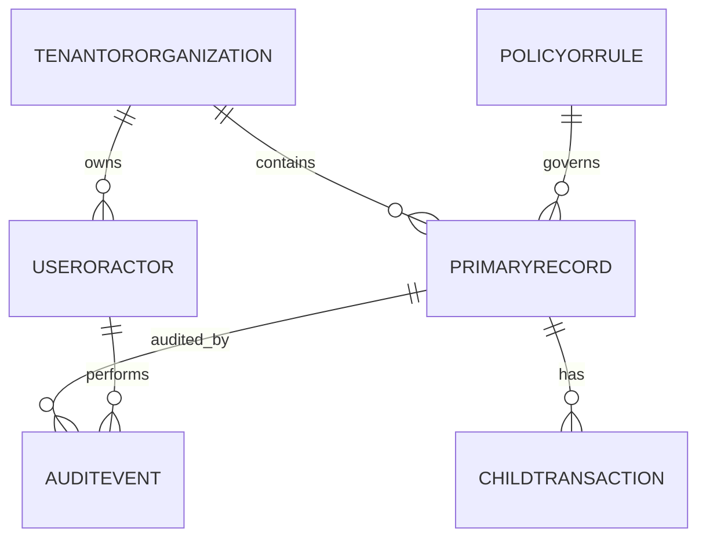

# Data Dictionary

This data dictionary is the canonical reference for **Hospital Information System**. It defines shared terminology, entity semantics, and governance controls required to keep hospital information workflows consistent across teams and services.

## Scope and Goals
- Establish a stable vocabulary for architecture, API, analytics, and operations teams.
- Define minimum required fields for core entities and expected relationship boundaries.
- Document data quality and retention controls needed for production readiness.

## Core Entities
| Entity | Description | Required Attributes |
|---|---|---|
| TenantOrOrganization | Top-level ownership boundary for data segregation | `org_id, name, status, region, created_at` |
| UserOrActor | Human/system principal that performs actions | `actor_id, org_id, role, status, last_active_at` |
| PrimaryRecord | Main lifecycle object handled by the platform | `record_id, org_id, state, owner_id, created_at, updated_at` |
| ChildTransaction | Operational transaction or sub-step linked to primary record | `txn_id, record_id, txn_type, amount_or_value, occurred_at` |
| PolicyOrRule | Versioned policy configuration that influences decisions | `policy_id, scope, version, effective_from, effective_to` |
| AuditEvent | Append-only evidence for state changes and controls | `audit_id, record_id, actor_id, action, reason_code, occurred_at` |

## Canonical Relationship Diagram

## Data Quality Controls
1. All write paths enforce required-field validation and referential integrity for mandatory foreign keys.
2. External imports must include provenance metadata (`source_system`, `source_ref`, `ingested_at`).
3. Status/state fields use controlled vocabularies and reject unknown values.
4. Duplicate detection runs on natural keys where business identity collisions are likely.
5. Sensitive fields carry classification tags to drive masking, encryption, and export behavior.

## Retention and Audit
- Operational records remain online for active workflow windows and support forensic queries.
- Historical records move to archive tiers by policy without breaking traceability.
- Audit events are immutable and linked through correlation ids for incident analysis.

---

## Implementation-Ready Data Contracts
### Clinical Identity and Referential Rules
- `patient_identifiers` must support multi-authority IDs (`MRN`, `national_id`, payer member id) with authority-scoped uniqueness.
- `encounters.patient_id` is immutable post-creation; chart merges are represented as linkage edges, not in-place key rewrites.
- `orders.encounter_id` is required for inpatient and emergency contexts; outpatient standing orders require explicit `care_plan_id`.

### Physical Design Notes
| Table | Key Indexes | Retention |
|---|---|---|
| `audit_events` | `(tenant_id, occurred_at DESC)`, `(correlation_id)` | 7 years |
| `results` | `(order_id, result_status)`, `(patient_id, observed_at DESC)` | Legal policy + clinical minima |
| `consents` | `(patient_id, consent_type, effective_from DESC)` | life-of-record + legal hold |

### Data Quality Gates
- Reject writes missing timezone-aware timestamps in UTC.
- Enforce coded values via terminology service (`SNOMED`, `LOINC`, `RxNorm`) before persistence.
- Reconciliation job computes orphan-rate and stale-reference-rate daily.

## File-Specific Implementation Boundaries
This artifact is implementation-focused on **entity semantics, key constraints, and retention/index governance**. The boundaries below are specific to `analysis/data-dictionary.md` and are intentionally not reused as generic filler text.

| Boundary Slice | In Scope for this File | Out of Scope for this File | Implementation Consequence |
|---|---|---|---|
| Intake & Identity Analysis | Entry validation checkpoints and mismatch heuristics | UI widget design details | Data-quality metrics and EMPI false-positive rate |
| Clinical Flow Analysis | Encounter/order sequence timing and critical path dependencies | Persistence implementation details | Throughput, wait-time, and bottleneck reporting |
| Governance Analysis | Rule conformance and audit evidence completeness | Runtime policy engine internals | Compliance scorecards and control effectiveness trends |

## Business Rules to API/Data/Operational Controls (File-Specific)
| Rule Focus | API Enforcement Touchpoint | Data Model/Contract Tie-In | Operational Control |
|---|---|---|---|
| Preconditions for `data-dictionary` workflows must be validated before state mutation. | `GET /v1/analytics/operational-checkpoints` with explicit error taxonomy and correlation IDs. | `workflow_checkpoints, rule_decisions, observability_snapshots` with strict timestamp, actor, and tenant context fields. | Alert on rule-violation rate and route to owner with SLA-backed response. |
| Mutations must be replay-safe and duplicate-proof. | Idempotency checks on mutation endpoints and async consumers. | Uniqueness keys + immutable evidence rows for side-effect tracking. | Replay runbook with pre/post reconciliation and sign-off checklist. |
| Access to sensitive operations must include least-privilege and evidence. | AuthN/AuthZ middleware + policy decision point reason codes. | Audit/event envelopes include policy version and decision outcome. | Quarterly control review and continuous SIEM correlation for anomalies. |

## Interoperability Assumptions for `data-dictionary.md`
- Contract versions are explicitly pinned; backward compatibility is managed per versioned API/event schema.
- External dependencies are treated as failure-prone; timeout/retry budgets and fallback states are documented in this file's scenarios.
- Observability correlation (`tenant_id`, `actor_id`, `correlation_id`) is required for all critical-path operations in this document scope.

## Compliance and Security Posture for this Artifact
- Evidence produced by this workflow/design artifact is audit-consumable (who/what/when/why) and linked to incident/postmortem records.
- Sensitive data exposure is minimized using role-scoped access and redaction guidance relevant to `data-dictionary.md`.
- Operational controls for this file include detection, containment, recovery, and verification steps with named ownership.
